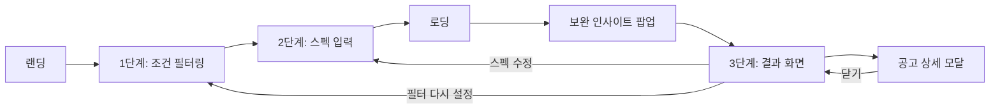

# 스펙핏(SpecFit) 기획서

## 문제 정의
재학생(3학년 기준)은 "지금 뭘 준비해야 졸업 전에 지원 가능한 공고가 늘어나는지" 판단할 기준이 없다. 기존 취업 플랫폼은 "지금 지원 가능한 공고 추천"에 집중돼 있어, 아직 시간이 남은 재학생에게 필요한 "무엇을 먼저 보완할지" 가이드가 없다.

## 사용자 시나리오

| 단계 | 화면 | 사용자 행동 | 결과 |
|---|---|---|---|
| 0 | 랜딩 | 시작하기 클릭 (이전 기록 있으면 이어하기 배너로 재진입 가능) | 1단계로 이동 |
| 1 | 조건 필터링 | 직종/지역/고용형태 선택 (비워두면 전체 공고 대상) | 분석 대상 공고 확정 |
| 2 | 스펙 입력 | 학력·경력·자격증·전공·외국어 입력 (컴퓨터활용능력은 참고용, 판정에 미반영) | "결과 보기" 클릭 시 분석 실행 |
| 3 | 로딩 | (자동, 약 0.5초) | 갭 분석 계산 |
| 4 | 보완 인사이트 팝업 | (자동 노출 — 아래 표 참고) | 확인 클릭 시 결과 화면 노출 |
| 5 | 결과 화면 | 공고 카드 클릭 / 탭·정렬 변경 / 스펙 수정 | 상세 체크리스트 확인 또는 재입력 |

### 4단계: 보완 인사이트 팝업 — 상황별 분기
| 상황 | 팝업 메시지(예시) | 유도하는 다음 행동 |
|---|---|---|
| 보완하면 늘어나는 공고 있음 | 😊 "자격증/면허만 채우면 +3건 늘어나요" | 결과 화면에서 자세히 보기 |
| 이미 모든 항목 충족 | 🎉 "이미 모든 항목을 채우고 있어요" | 결과 화면 확인 |
| 대상 공고 0건 | 💪 "조건에 맞는 공고가 없어요, 조금만 더 힘내봐요" | 필터 다시 설정 유도 |

## 핵심 기능
서비스 파이프라인은 아래 4개 기능으로 구성되지만 기존 취업 플랫폼과 스펙핏을 구분 짓는 **차별화 핵심은 ③④번**이다.

- ① 스펙 입력 — 학력, 경력, 자격증/면허, 전공, 외국어 성적, 컴퓨터활용능력 등
- ② 조건 필터링 — 직종, 근무지역, 고용형태 등
- **③ 갭 분석 엔진 (핵심★)** — 스펙-요구사항 5개 항목(학력·경력·자격증/면허·전공·외국어) AND 대조로 지원 가능 비율 계산, 항목별 보완 시 늘어나는 공고 수 시뮬레이션. 컴퓨터활용능력은 우대 항목이라 판정 제외.
- **④ 시각화 결과 화면 (핵심★)** — 도넛 차트, 보완 우선순위 막대그래프, 보완 인사이트 팝업/배너, 필터·정렬 가능한 공고 리스트, 공고별 충족/미충족 체크리스트 모달

> 기존 플랫폼은 "공고 추천"에 그치지만 스펙핏은 ③갭 분석 + ④시각화로 "자기 진단 + 재학 중 액션 플랜"을 제공한다.

## 화면 흐름

### 결과 화면 구성
| 영역 | 구성 요소 |
|---|---|
| 팝업(진입 즉시) | 위 "4단계" 표 참고 |
| 좌측 | 통계 카드 3개(전체/지원가능/비율) · 도넛 차트 · 보완 우선순위 막대그래프(5항목, 2개 이상 동시 미충족 공고는 제외) · 인사이트 배너 |
| 우측 | 상태 탭(전체/지원가능/미충족) · 정렬(기본/지원가능 우선/회사명) · 공고 카드 리스트 |
| 공고 상세 모달 | 카드 클릭 시 5개 항목 각각 "요구 vs 보유" 문장으로 표시 |
| 빈 상태 | 필터 결과 0건 / 탭 필터 결과 0건 — 각각 안내 문구 + 액션 버튼 |

## 확장 기능 (2차, 여유 시): 로그인 · 북마크

핵심 갭 분석 시나리오(①~④)는 로그인 없이도 지금과 동일하게 100% 이용 가능하다. 로그인은 아래 기능에만 필요한 **선택 사항**이며, 상세 작업 분해는 `checklist_3_login_bookmark.md` 참고.

- 로그인/회원가입(이메일+비밀번호): 계정 없이도 서비스 이용에는 지장 없음.
- 북마크: 결과 화면의 공고 카드/상세 모달에 북마크 토글 버튼 추가. 로그인 사용자만 사용 가능 — 비로그인 상태에서 클릭하면 로그인 유도.
- 마이페이지: 북마크한 공고 목록 화면.
- 화면 흐름 변화: 헤더에 로그인/회원가입 진입점 추가, 로그인 시 사용자 메뉴(로그아웃)로 전환. 기존 5단계 화면 흐름(랜딩→필터→스펙→로딩→팝업→결과)에는 변화 없음.

