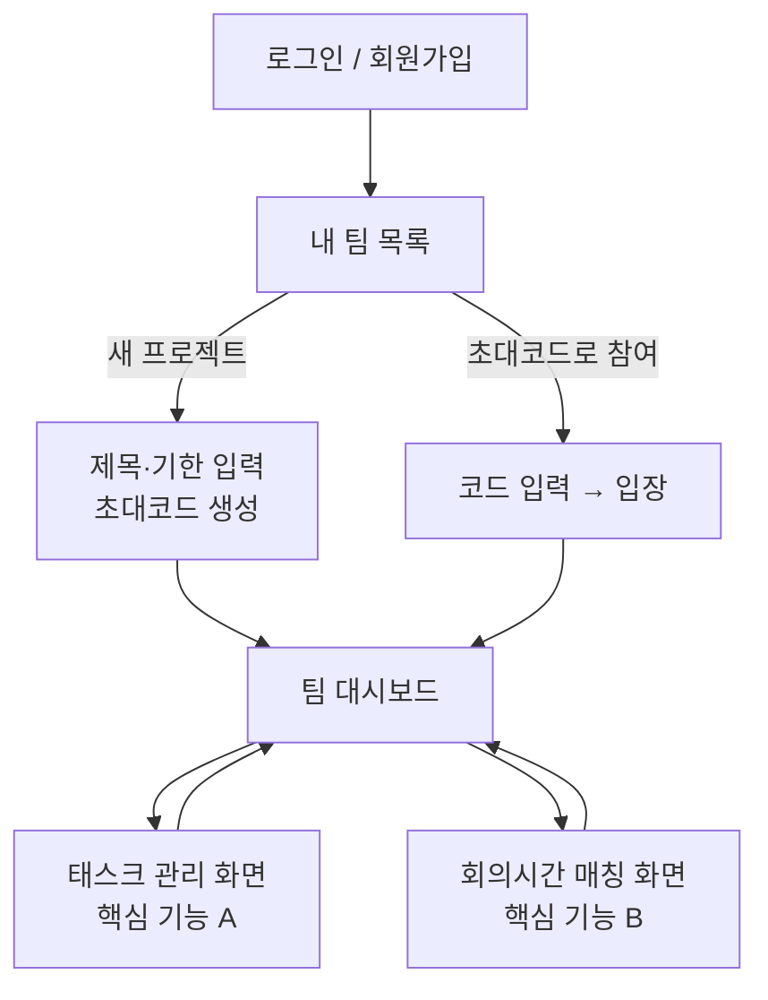

# 팀플 올인원 — 기획서

> 진행 트래커 + 회의시간 매칭
> "기능을 모은 게 아니라, 팀플의 실제 흐름을 따라 만든 도구."

---

## 문제 정의

대학생이 팀 프로젝트를 할 때, 언제 다 같이 모일지 시간을 맞추는 것부터 누가 무엇을 얼마나 했는지 파악하는 것까지 흩어진 도구(when2meet, 카톡, 각자 메모)를 오가며 관리해야 해서 번거롭고, 무임승차가 생겨도 잘 드러나지 않는다.

---

## 사용자 시나리오

1. 사용자는 이메일·비밀번호·닉네임으로 회원가입하고 로그인한다. 로그인하면 자신이 속한 팀들이 보이는 "내 팀 목록" 화면으로 이동한다.
2. 팀장이 될 사람은 "새 프로젝트"를 눌러 방 제목과 기한을 입력한다. 시스템이 고유한 초대코드를 자동 생성하고, 그 코드를 팀원에게 공유한다.
3. 팀원은 "초대코드로 참여"를 눌러 전달받은 코드를 입력하고 팀에 합류한다. 이후 그 팀이 "내 팀 목록"에 나타난다.
4. 팀에 들어가면 팀 대시보드에서 진행률과 팀원을 확인하고, 태스크 관리 화면에서 할 일을 추가·담당·완료 처리한다.
5. 회의시간 매칭 화면에서 각자 가능한 시간을 격자에 입력하면, 겹치는 시간이 색으로 진하게 표시되어 다 같이 가능한 회의 시간을 한눈에 찾는다.
6. 기한이 지난 팀은 삭제되지 않고 보관 상태로 전환되어 기록이 유지된다.

---

## 핵심 기능 (2개)

-- **기능 A — 태스크 관리**
  할 일 추가, 담당자 지정(1명), 마감일 설정, 상태(대기·진행·완료) 변경. 담당자만 완료 처리할 수 있으며, 모든 상태 변경은 활동 기록으로 남는다. 진행도는 두 가지로 표시한다: 팀 전체 진행도(전체 태스크 기준)와 내 진행도(로그인한 사용자가 담당인 태스크 기준). 각자 자기 화면에서 자기 몫의 진행 상황을 함께 확인할 수 있다. 서비스의 뼈대이자 기여도 계산의 토대.

- **기능 B — 회의시간 매칭**
  조원들이 각자 가능한 시간대를 요일×시간 격자에 입력하면, 겹치는 인원이 많을수록 진한 색으로 시각화하고 가장 잘 겹치는 시간을 추천한다. when2meet(시간만)과 Trello(태스크만)를 잇는 이 서비스의 차별점.

> 기여도 시각화(개수 기반)와 태스크 난이도 가중치는 시간이 남을 때 얹는 확장 기능으로 둔다.

---

## 화면 흐름

주요 화면: 로그인, 내 팀 목록(홈), 새 프로젝트 만들기, 초대코드 참여, 팀 대시보드, 태스크 관리, 회의시간 매칭 — 총 7개. 팀 대시보드가 중심 허브 역할을 하며, 두 핵심 기능 화면을 오간다.

### 내 팀 목록 (홈)
<!--  -->

### 태스크 관리 화면
<!--  -->

### 회의시간 매칭 화면
<!--  -->

---

## 부록 — 주요 설계 결정 (엣지케이스)

- 기한 만료 시 자동 삭제하지 않고 보관(archive) 처리, 실제 삭제는 방장이 직접 실행
- 초대코드는 재발급 가능하며 재발급 시 이전 코드는 즉시 무효화
- 팀원이 나가도 활동 기록·완료한 태스크는 유지("나간 멤버" 표시), 미완료 담당 태스크는 "담당자 없음"으로 전환
- 담당자는 태스크당 1명, 담당자 없는 태스크 허용, 완료 처리는 담당자만 가능
- 완료↔미완료 되돌리기는 허용하되 모든 변경을 활동 기록에 남김
- 공통 원칙: "진짜 삭제"보다 "보관·기록(soft delete)"을 기본으로
