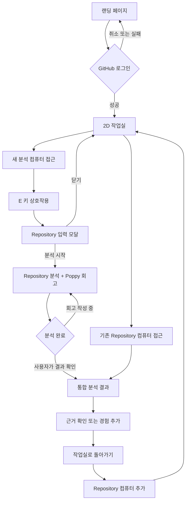

# PtoP 기획서

## 1. 문제 정의

프로젝트 경험을 쌓는 대학생 개발자는 프로젝트가 끝난 뒤 시간이 지나면 자신이 맡은 역할, 핵심 구현, 문제 해결 과정과 그때의 판단을 정확히 기억하고 포트폴리오 언어로 정리하기 어렵다.

## 2. 서비스 목표

PtoP(Project to Portfolio)는 GitHub Repository의 객관적인 작업 근거와 사용자의 짧은 회고를 결합해, 자신의 프로젝트 경험을 복기하고 포트폴리오에 활용할 단서를 찾도록 돕는 서비스다.

포트폴리오 문장을 대신 확정하는 것보다 다음 가치에 집중한다.

- Repository에서 확인한 사실과 AI의 해석을 구분한다.
- 팀 전체 작업을 사용자의 개인 경험처럼 단정하지 않는다.
- 사용자의 입력은 짧게 유지하되 Repository만으로 알 수 없는 의도와 판단을 보완한다.
- 포트폴리오 작성을 시작하는 부담을 게임형 작업실과 대화형 회고로 낮춘다.

## 3. 핵심 기능

### 3.1 근거 기반 Repository 분석

사용자가 Repository URL과 자신의 GitHub ID를 입력하면 프로젝트 구조와 활동 기록을 수집하고, 사용자와 관련된 작업 근거를 우선 분석한다.

주요 입력:

- GitHub Repository URL
- 사용자 GitHub ID

주요 분석 대상:

- Repository 기본 정보와 기술 스택
- 참여자와 commit 활동
- 사용자의 commit, PR, Issue 및 변경 파일
- 프로젝트 구조와 주요 디렉터리
- 기술적 도전 후보를 뒷받침하는 근거

주요 출력:

- 프로젝트 요약
- 참여자 활동 비중
- 사용자 주요 작업
- 기술적 도전 후보
- 각 해석의 근거와 확인 필요 상태

분석 원칙:

- commit 수는 활동 참고 지표이며 실제 기여도나 실력을 의미하지 않는다.
- 팀 전체의 작업은 사용자 개인의 경험으로 확정하지 않는다.
- 근거가 부족하면 추측하지 않고 `확인 필요`로 표시한다.
- API 실패 시 하드코딩된 분석 결과를 제공하지 않는다.

### 3.2 최소 입력 회고와 결과 보완

Repository 분석이 진행되는 동안 Poppy가 한 번에 하나의 짧은 질문을 제시한다. 사용자는 선택지나 한두 문장의 답변으로 Repository만으로 확인하기 어려운 배경, 문제, 판단, 결과를 보완한다.

회고 주제:

- 프로젝트를 시작한 배경과 목표
- 가장 어려웠던 문제
- 해결을 위해 선택한 접근
- 협업 과정에서 맡은 역할
- 결과와 다시 시도한다면 바꾸고 싶은 점

동작 원칙:

- 모든 질문에 답하지 않아도 진행할 수 있다.
- 분석이 먼저 끝나도 작성 중인 답변을 중단하거나 자동으로 화면을 전환하지 않는다.
- 사용자가 `결과 확인하기`를 선택했을 때 Repository 근거와 저장된 회고를 함께 반영한다.
- AI가 찾지 못한 경험은 `내 경험 추가`에서 짧게 보완할 수 있다.
- 최종 결과에서도 사실, 사용자 진술, AI 해석을 구분한다.

## 4. 게임형 작업실의 역할

게임형 작업실은 세 번째 핵심 기능이 아니라 두 핵심 기능으로 들어가는 경험 계층이다.

- 포트폴리오 작성에 대한 심리적 진입 장벽을 낮춘다.
- 분석한 Repository를 작업실의 컴퓨터로 시각화해 기록이 쌓이는 느낌을 제공한다.
- 새 분석 컴퓨터를 통해 Repository 분석을 시작한다.
- Poppy를 NPC 안내자로 사용해 분석과 회고 흐름을 연결한다.

게임 요소가 분석의 정확성이나 접근성을 방해해서는 안 된다. 키보드 조작이 어려운 사용자를 위해 Repository 목록과 버튼 기반 대체 경로를 제공한다.

## 5. 사용자 시나리오

1. 사용자는 랜딩 페이지에서 2D 작업실 미리보기와 서비스 목적을 확인한다.
2. 사용자는 GitHub 로그인을 완료하고 기본 캐릭터가 배정된 작업실에 입장한다.
3. 사용자는 방향키 또는 WASD로 이동하며 이전 분석 Repository가 표시된 컴퓨터를 확인한다.
4. 사용자는 새 분석 컴퓨터에 접근해 `E` 키를 누른다.
5. Repository 입력 모달에서 URL과 자신의 GitHub ID를 입력하고 분석을 시작한다.
6. 분석 중 Poppy가 제시하는 짧은 회고 질문에 선택지 또는 짧은 문장으로 답한다.
7. 분석이 완료되어도 회고 화면은 유지되며, 사용자가 준비되었을 때 `결과 확인하기`를 누른다.
8. PtoP는 Repository 근거와 저장된 회고를 합쳐 프로젝트 요약, 주요 작업, 기술적 도전 후보를 보여준다.
9. 사용자는 누락된 경험을 추가하거나 결과의 근거를 확인한다.
10. 작업실로 돌아오면 분석한 Repository가 컴퓨터 한 대로 추가되고, 이후 다시 열어볼 수 있다.

## 6. 사용자 흐름

상세 와이어프레임과 게임 이벤트 구조는 [게임형 작업실 설계](../design/game-workspace-design.md)에서 관리한다.

## 7. 화면 구조

| 화면 | 목적 | 핵심 UI | 주요 동작 |
| --- | --- | --- | --- |
| 랜딩 | 서비스 이해와 로그인 | 작업실 영상 또는 poster, GitHub 시작 버튼 | 로그인 후 작업실 진입 |
| 2D 작업실 | 분석 기록 탐색과 새 분석 진입 | 캐릭터, Repository PC, 새 분석 PC, 상호작용 안내 | 이동, `E` 상호작용 |
| Repository 입력 모달 | 분석 대상 지정 | URL, GitHub ID, 분석 시작 | 입력 검증 후 분석 요청 |
| Poppy 회고 | 분석 대기 시간을 의미 있는 입력 시간으로 전환 | Poppy, 질문 1개, 짧은 답변, 건너뛰기 | 답변 저장, 다음 질문 |
| 통합 분석 결과 | 근거와 개인 경험을 함께 전달 | 프로젝트 요약, 주요 작업, 기술적 도전, 근거, 확인 필요 상태 | 경험 추가, 작업실 복귀 |
| Repository 목록 | 게임 조작 대체 경로 | 분석 기록 목록, 새 분석 버튼 | 기존 결과 열기, 새 분석 |

## 8. MVP 범위

### 포함

- GitHub OAuth 로그인
- GitHub Repository URL과 사용자 GitHub ID 입력
- Repository 기본 정보, 참여자, commit 및 사용자 활동 분석
- AI 기반 기술적 도전 후보
- 분석 중 Poppy 대화형 회고
- 회고 답변 저장과 분석 결과 반영
- 근거, 사용자 진술, AI 해석을 구분한 결과
- 작은 2D 작업실에서 이동, 충돌, 컴퓨터 상호작용
- 키보드 조작이 어려운 환경을 위한 목록형 대체 UI

### 첫 게임 기술 스파이크

- 20×15 크기의 단일 작업실
- 기본 캐릭터 1종
- 새 분석 컴퓨터 1대
- 방향키/WASD 이동과 충돌
- `E` 키로 기존 Repository 입력 모달 열기

### 제외

- 멀티플레이와 실시간 위치 동기화
- 캐릭터 생성과 커스터마이징
- 사용자가 가구를 배치하는 맵 편집
- 여러 방과 포털 이동
- Repository 전체 소스 코드를 무제한으로 AI에 전송하는 분석
- 자동으로 완성본이라 단정하는 최종 포트폴리오 생성
- Notion 등 외부 서비스 내보내기

## 9. 데이터와 신뢰성 원칙

결과는 다음 세 종류를 시각적으로 구분한다.

| 구분 | 의미 | 예시 |
| --- | --- | --- |
| Repository 근거 | GitHub API와 파일 구조에서 확인한 사실 | commit, PR, 변경 파일 |
| 사용자 진술 | 사용자가 회고에서 직접 입력한 경험 | 선택 이유, 협업 배경 |
| AI 해석 | 근거와 진술을 바탕으로 만든 후보 | 기술적 도전, 포트폴리오 단서 |

AI 해석에는 근거 링크 또는 근거 요약을 함께 제공한다. 사용자는 결과를 수정하거나 제외할 수 있어야 하며, 확정적 표현보다 검토 가능한 후보로 제시한다.

## 10. 성공 기준

- 사용자가 로그인 후 새 Repository 분석을 시작할 수 있다.
- 분석 중 회고 입력이 분석 완료로 인해 중단되지 않는다.
- 사용자의 GitHub ID와 관련된 근거가 기술적 도전 후보에 우선 반영된다.
- 저장된 회고가 최종 결과에 실제로 반영된다.
- 사용자가 결과의 근거와 AI 해석을 구분할 수 있다.
- 분석을 마친 Repository를 작업실에서 다시 열 수 있다.
- 게임 조작 없이도 핵심 분석 기능을 사용할 수 있다.

## 11. 참고 문서

- [게임형 작업실 설계](../design/game-workspace-design.md)
- [디자인 시스템](../design/design-system.md)
- [PtoP 디자인 Skill](../design/ptop-design-skill.md)
- [게임 에셋 라이선스 기록](../research/game-asset-license.md)
- [회고 흐름 설계](./reflection-flow.md)
- [Repository 분석 학습](../research/repo-analysis-study.md)
- [테스트 케이스](../testing/test-cases.md)
