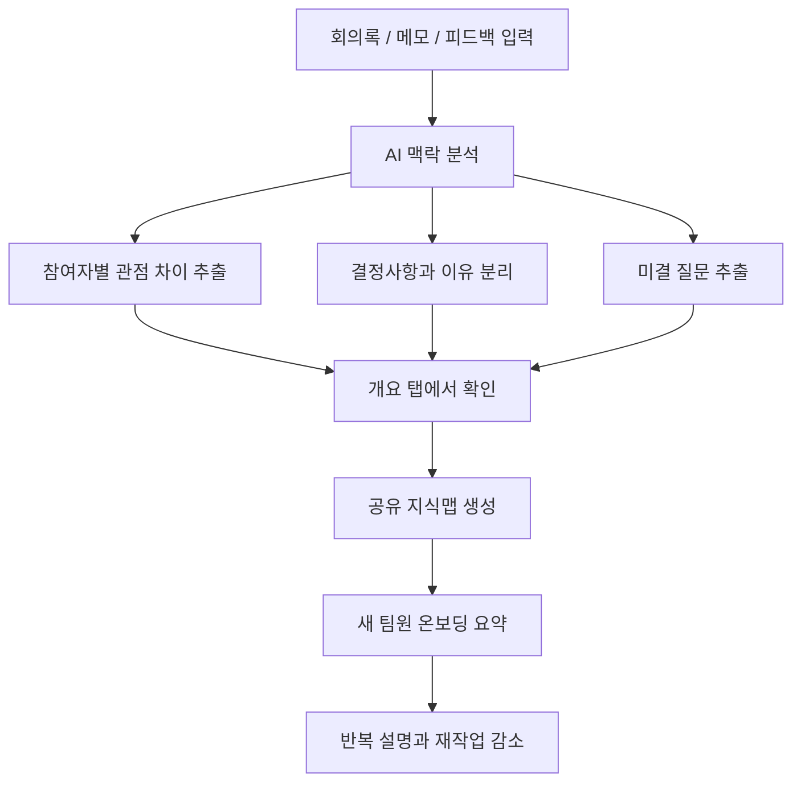

# 모두의 뇌 - 협업 맥락 공유 AI 에이전트 기획서 및 웹 프로토타입

기획서 단독 링크: https://gist.github.com/tjwnsdhfz/12289f2fbf66eb6e54f0edc5e0ac0dce

참고한 점: 프로젝트 주제, 해결하려는 문제, 유저 플로우, 화면 구상이 장표처럼 먼저 보여서 서비스를 빠르게 이해할 수 있었습니다. 이 PR도 같은 방식으로 **문제 → 사용자 흐름 → 화면 구조 → 핵심 기능 → 구현 결과** 순서로 정리했습니다.

## 1. 프로젝트 한눈에 보기

**모두의 뇌**는 회의록, 조사 메모, 피드백, 결정사항에 흩어진 프로젝트 맥락을 AI가 분석해 팀 전체가 함께 이해할 수 있는 공유 지식망으로 정리해주는 에이전트입니다.

기존 회의 요약 도구가 `무슨 이야기를 했는가`를 줄여주는 데 집중한다면, 모두의 뇌는 다음을 더 중요하게 봅니다.

- 왜 그렇게 결정했는가
- 누가 어떤 관점으로 보고 있는가
- 아직 무엇이 불확실한가
- 새 팀원이 무엇부터 이해해야 하는가


## 2. 해결하려는 문제

팀 프로젝트에서는 회의록과 문서가 남아 있어도 실제 협업 맥락은 쉽게 사라집니다.

예를 들어 공모전 팀에서 회의록은 노션에 있고, 멘토 피드백은 카카오톡에 있고, 조사 내용은 개인 메모에 있으면 다음 문제가 생깁니다.

- 이전 결정의 이유를 다시 설명해야 합니다.
- 팀원마다 같은 용어와 목표를 다르게 이해합니다.
- 새 팀원이 들어오면 프로젝트 흐름을 처음부터 설명해야 합니다.
- 이미 논의한 내용을 다시 논의하고 재작업이 발생합니다.

따라서 이 프로젝트가 해결하려는 문제는 단순한 기록 부족이 아니라 **흩어진 기록 사이의 맥락 단절**입니다.

## 3. 사용자 관점 동작 시나리오

1. 사용자는 프로젝트 이름을 입력합니다.
2. 회의록, 조사 메모, 멘토 피드백, 팀원 의견을 텍스트 입력창에 붙여넣습니다.
3. `맥락 분석하기` 버튼을 누릅니다.
4. AI 에이전트가 입력 기록에서 핵심 주제, 결정사항, 결정 이유, 참여자별 관점, 미결 질문을 분리합니다.
5. 사용자는 `개요` 탭에서 참여자별 관점 차이와 다음 회의 질문을 먼저 확인합니다.
6. 사용자는 `지식맵` 탭에서 사람, 주제, 결정사항, 질문의 연결 구조를 확인합니다.
7. 사용자는 `온보딩 요약` 탭에서 새 팀원에게 공유할 4~5줄 요약을 확인합니다.



## 4. 화면 구상

### 데스크톱 프로토타입


### 모바일 프로토타입


### 화면 단위 역할

| 화면 | 사용자 행동 | 시스템 반응 | 핵심 가치 |
| --- | --- | --- | --- |
| 홈 | 서비스 목적 확인 | 기록 입력, 분석, 지식화 흐름 제시 | 서비스 이해 |
| 입력 | 회의록과 메모 붙여넣기 | 글자 수 표시, 민감정보 안내, 분석 버튼 활성화 | 진입 장벽 감소 |
| 개요 | 분석 결과 확인 | 관점 차이, 질문, 결정사항, 용어 표시 | 차별점 증명 |
| 지식맵 | 관계 구조 확인 | 사람/주제/결정/질문 연결 표시 | 맥락 시각화 |
| 온보딩 | 새 팀원 요약 확인 | 4~5줄 공유용 요약 표시 | 반복 설명 감소 |

## 5. 핵심 기능

서브 기능을 늘리기보다 MVP에서는 아래 세 가지 핵심 기능에 집중했습니다.

| 핵심 기능 | 설명 | 에이전트가 필요한 이유 |
| --- | --- | --- |
| 프로젝트 기록 입력과 맥락 분석 | 회의록, 메모, 피드백에서 핵심 주제, 결정사항, 결정 배경, 미결 질문을 분리합니다. | 긴 자연어 기록 안에서 사실, 의견, 결정, 질문을 구분해야 하기 때문입니다. |
| 관점 차이와 미결 질문 구조화 | 참여자별 역할, 중점, 우려, 질문을 표로 보여줍니다. | 사람의 의도와 관점은 정해진 입력 칸보다 자연어 문장 속에 흩어져 있기 때문입니다. |
| 공유 지식맵과 온보딩 요약 생성 | 사람, 주제, 결정사항, 질문을 연결하고 새 팀원용 요약을 제공합니다. | 어떤 노드를 만들고 무엇을 먼저 설명해야 하는지 AI가 우선순위를 판단해야 하기 때문입니다. |

## 6. 기존 웹 서비스와의 차별점

| 기존 웹 / 도구 | 주로 해결하는 문제 | 한계 | 모두의 뇌 차별점 |
| --- | --- | --- | --- |
| Notion / Confluence | 문서 저장, 팀 위키, 검색 | 사용자가 문서 구조를 직접 잘 만들어야 함 | 문서 구조를 만들기 전 단계에서 AI가 맥락을 먼저 구조화 |
| Obsidian | 개인 지식 관리, 개인 그래프 | 팀원 간 관점 차이와 합의 상태를 다루기 어려움 | 개인의 두 번째 뇌가 아니라 팀 전체의 공유 두뇌를 목표로 함 |
| 회의 요약 에이전트 | 회의 내용 요약, 액션아이템 추출 | 왜 그런 결정이 나왔는지, 누가 어떤 관점인지 약함 | 결정 배경, 관점 차이, 미결 질문을 우선 표시 |
| 일반 프로젝트 관리 웹 | 할 일, 일정, 담당자 관리 | 할 일을 정하기 전의 맥락과 판단 근거가 사라짐 | 업무표 이전의 배경지식과 논의 흐름을 정리 |
| 메신저 / 채팅방 | 빠른 소통 | 시간이 지나면 중요한 결정이 대화 속에 묻힘 | 흩어진 대화를 프로젝트 맥락 단위로 재구성 |

## 7. 주요 작업 리스트

- `docs/plan.md`를 사용자 시나리오, 화면 동작, 핵심 기능, 차별점 중심으로 전면 정리했습니다.
- `docs/prd.md`에 제품 요구사항, MVP 범위, 성공 기준을 정리했습니다.
- `docs/trd.md`에 React/TypeScript 기반 구현 구조와 데이터 타입을 정리했습니다.
- `docs/prompt-design.md`에 LLM 프롬프트 구조와 JSON 출력 스키마를 정리했습니다.
- `docs/market-research.md`에 Notion AI, Confluence AI, Mem, Obsidian, 회의 요약 도구와의 차이를 정리했습니다.
- `docs/design-assets.md`에 Canva, Figma, 최신 웹 캡처 산출물을 정리했습니다.
- `docs/figma-design-system.md`에 Figma 제작용 컬러, 타이포그래피, 컴포넌트 기준을 정리했습니다.
- `docs/modu-brain-design-skill.md`에 앞으로 반복 적용할 나만의 Design Skill을 정리했습니다.
- `docs/figma-handoff.md`에 Figma 화면과 React 컴포넌트 연결 기준을 정리했습니다.
- `docs/figma-board-preview.html`에 Figma 페이지 구조를 HTML 보드 형태로 시각화했습니다.
- React + TypeScript 기반 웹 프로토타입을 구현했습니다.
- 입력, 분석 요약, 개요 탭, 지식맵 탭, 온보딩 탭을 구성했습니다.
- Apple 스타일 기준으로 흰색/연회색 배경, 파란색 포인트, 8px 카드 반경을 적용했습니다.
- `npm run build`로 TypeScript와 Vite 빌드를 검증했습니다.

## 8. 구현한 React 구조

| 영역 | 파일 |
| --- | --- |
| 입력 화면 | `src/components/ContextInput.tsx` |
| 분석 요약 | `src/components/SummaryPanel.tsx` |
| 참여자 관점 표 | `src/components/PerspectiveTable.tsx` |
| 미결 질문 | `src/components/QuestionList.tsx` |
| 결정사항 | `src/components/DecisionList.tsx` |
| 핵심 용어 | `src/components/KeyTerms.tsx` |
| 공유 지식맵 | `src/components/KnowledgeMap.tsx` |
| 온보딩 요약 | `src/components/OnboardingSummary.tsx` |
| 샘플 분석 데이터 | `src/data/sampleAnalysis.ts` |
| 분석 서비스 함수 | `src/services/analyzeContext.ts` |
| 타입 정의 | `src/types/context.ts` |

## 9. 내가 설명할 수 있는 부분

이 프로젝트에서 가장 설명할 수 있는 부분은 **왜 단순 회의 요약이 아니라 맥락 공유 에이전트가 필요한가**입니다.

회의 요약 도구는 회의 내용을 짧게 줄이는 데 강합니다. 하지만 팀 프로젝트에서 더 큰 문제는 회의 내용 자체가 아니라, 결정 배경과 참여자별 관점이 시간이 지나면서 사라지는 것입니다.

그래서 모두의 뇌는 요약을 먼저 보여주지 않고, 결과 화면의 개요 탭에서 다음 순서로 보여주도록 설계했습니다.

1. 참여자별 관점 차이
2. 다음 회의 질문
3. 결정사항
4. 핵심 용어

이 순서가 이 서비스의 차별점입니다. 사용자가 바로 `아, 이건 회의 내용을 줄이는 앱이 아니라 팀의 생각 차이를 정리하는 앱이구나`라고 이해하도록 만들고 싶었습니다.

## 10. 아직 이해 못 한 부분

- 실제 LLM API를 붙였을 때 결정사항, 의견, 미결 질문을 안정적으로 구분하는 방법은 더 실험이 필요합니다.
- 지식맵 노드가 많아질 경우 어떤 기준으로 줄여야 가장 이해하기 쉬운지 더 검증해야 합니다.
- 팀 문서를 실제로 입력받을 때 개인정보와 권한 관리를 어떻게 해야 하는지 더 공부가 필요합니다.
- Figma MCP는 Starter 플랜 호출 한도 때문에 최신 React 탭 화면을 자동 재캡처하는 과정이 제한되었습니다.

## 11. 로컬 확인 방법

```bash
npm install
npm run dev
npm run build
```

확인 시나리오:

1. 홈 화면에서 `팀의 흩어진 맥락을 하나의 뇌로.` 제목이 보이는지 확인합니다.
2. `예시 불러오기`를 누르면 입력창이 채워지고 `맥락 분석하기` 버튼이 활성화되는지 확인합니다.
3. 결과 화면의 `개요 / 지식맵 / 온보딩 요약` 탭이 전환되는지 확인합니다.
4. 개요 탭에서 `참여자별 관점 차이 → 다음 회의 질문 → 결정사항 → 핵심 용어` 순서로 보이는지 확인합니다.
5. 모바일 폭에서도 텍스트와 카드가 가로로 넘치지 않는지 확인합니다.

## 12. 새로 알게 된 것

- 회의 요약만으로는 협업 문제를 충분히 해결하기 어렵고, 결정 배경과 관점 차이를 구조화해야 차별화된 기획이 된다는 점을 알게 되었습니다.
- Notion AI, Confluence AI, Mem, Obsidian 같은 지식관리 도구와 비교하면서 모두의 뇌가 `문서 저장`이 아니라 `맥락 구조화`에 집중해야 한다는 점을 알게 되었습니다.
- React 컴포넌트를 화면 단위로 나누면 기획서의 화면 구조를 실제 구현 구조와 연결하기 쉽다는 점을 배웠습니다.
- Figma나 이미지 산출물은 PR 본문에서 먼저 보일 때 프로젝트를 훨씬 빠르게 이해시킨다는 점을 다른 기획서 사례를 통해 배웠습니다.

## 13. 디자인 산출물

- Canva 편집 디자인: https://www.canva.com/d/vv5pLSUhq50coma
- Figma FigJam 흐름도: https://www.figma.com/board/V5Jke4dsqaoMUOiTEg57tM
- Figma 웹 프로토타입 파일: https://www.figma.com/design/0XXQwlwMjFsVB8wreJpDkf?node-id=1-2
- Figma 디자인 시스템 문서: `docs/figma-design-system.md`
- Figma 보드 프리뷰: `docs/figma-board-preview.html`
- 모두의 뇌 Design Skill: `docs/modu-brain-design-skill.md`
- Figma 개발 핸드오프: `docs/figma-handoff.md`
- 최신 데스크톱 캡처: `docs/images/modu-brain-web-desktop.png`
- 최신 모바일 캡처: `docs/images/modu-brain-web-mobile.png`
