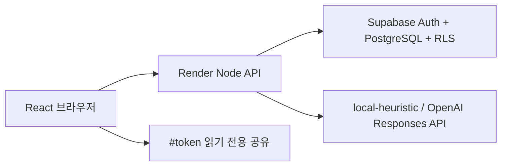

# Modu Brain — 저장·분석 이력·근거·공유가 이어지는 공개 웹 데모

기획서: https://gist.github.com/tjwnsdhfz/12289f2fbf66eb6e54f0edc5e0ac0dce

PR 벤치마크: https://github.com/tjwnsdhfz/hub/blob/N031_%EA%B9%80%EC%84%9C%EC%A4%80/docs/benchmark-prs.md

## 한눈에 보기

기존 PR #209의 React/Vite·Node·로컬/OpenAI 분석 프로토타입을 실제 데이터가 유지되는 공개 데모 구조로 확장했습니다.

사용자는 이메일 Magic Link로 로그인한 뒤 프로젝트별 회의록·리서치·피드백을 저장하고, 선택한 기록으로 분석을 실행합니다. 각 분석은 불변 이력으로 남고 결과의 결정·질문·참여자 관점에서 실제 원문 근거를 확인할 수 있습니다. 최근 두 성공 결과의 변화를 비교하고, 특정 결과만 만료 가능한 읽기 전용 링크로 공유할 수 있습니다.



## 해결하려는 문제

팀의 기록이 여러 문서와 대화에 흩어지면 내용 자체보다 다음 맥락이 먼저 사라집니다.

- 왜 그렇게 결정했는가
- 누가 어떤 프로젝트 관점과 우려를 제시했는가
- 무엇이 아직 결정되지 않았는가
- 새 팀원은 무엇부터 이해해야 하는가
- 이전 분석 이후 무엇이 바뀌었는가

Modu Brain은 단순 회의 요약이 아니라 **원문 기록 → 근거가 있는 맥락 분석 → 변화 이력 → 안전한 공유**를 하나의 흐름으로 연결합니다.

## 사용자 흐름

1. `/login`에서 이메일 Magic Link로 로그인합니다.
2. `/projects`에서 개인 소유 프로젝트를 만듭니다.
3. 회의록·리서치·피드백·메모를 여러 건 저장합니다.
4. 분석할 기록과 local/OpenAI 방식을 선택합니다.
5. 분석 이력에서 요약·관점·결정·질문의 정확한 원문 근거를 엽니다.
6. 두 번째 분석 후 최근 결과와 이전 결과의 추가·변경·해결 항목을 확인합니다.
7. 지식맵과 온보딩 요약을 확인합니다.
8. 1~30일 읽기 전용 링크를 만들고 필요하면 즉시 폐기합니다.
9. 새로고침 뒤에도 프로젝트·원문·분석 이력이 유지됩니다.

로그인하지 않은 사용자는 `/`에서 저장되지 않는 결정론적 샘플만 체험할 수 있습니다.

## 주요 구현

### 웹 워크스페이스

- `/`, `/login`, `/projects`, `/projects/:id`, `/share#token=…` SPA 라우트
- 프로젝트 상세 `개요 | 기록 | 분석 이력 | 지식맵 | 온보딩` 탭
- 분석 당시 스냅숏에 연결된 근거 drawer
- 최근 성공 분석과 바로 이전 성공 분석 비교
- 결과·오류·빈 상태·진행 상태를 숨김 없이 분리
- 모바일에서도 기록, 이력, 지식맵, 공유 흐름을 유지

### 인증·데이터베이스

- Supabase 이메일 Magic Link Auth
- `projects`, `source_records`, `analysis_runs`, `analysis_run_sources`, `share_links`, `rate_limit_buckets`
- SQL migration과 안전한 seed를 저장소에서 관리
- 모든 앱 테이블 RLS와 사용자 간 IDOR 차단
- 일반 삭제는 보관, 확인 헤더가 있는 프로젝트 영구 삭제는 하위 데이터 cascade
- DB 장애 시 메모리 fallback 없이 구조화 `503`

### 영속 분석

- 1~50개 기록, 합계 100,000자 제한
- `Idempotency-Key`와 요청 fingerprint로 중복 비용 방지
- `running → succeeded|failed|cancelled` 실행 상태 보존
- provider 호출을 DB 트랜잭션 밖에서 실행
- 실패한 실행이 최근 성공 결과를 덮어쓰지 않음
- 모든 `EvidenceRef.quote`가 실제 실행 스냅숏에 존재하는지 서버 검증

### OpenAI 경계

- 기본 데모는 외부 호출이 없는 `local-heuristic`
- `MODU_BRAIN_OPENAI_ENABLED=true`와 서버 API key가 함께 설정될 때만 OpenAI 선택 활성화
- 로그인 사용자가 고지에 동의하고 명시적으로 선택할 때만 OpenAI 실행
- `gpt-5.6-terra`, reasoning effort `low`; 환경변수 override 및 계정 preview 권한 확인
- Responses API 구조화 출력, `store: false`, 비식별 `safety_identifier`, 30초 제한
- 키·모델·provider 실패를 로컬 결과로 조용히 대체하지 않음

### 공유와 요청 제한

- 32바이트 무작위 token, DB에는 SHA-256만 저장
- 평문 token은 생성 직후 한 번만 반환
- query/access log를 피하는 `/share#token=…` fragment
- 기본 7일, 최대 30일, 즉시 폐기
- 공유 projection은 프로젝트 제목·정제된 결과·분석/만료 시각만 반환하고 원문·이메일·내부 ID·provider/token 정보 제외
- 사용자당 AI 동시 1건·시간 10건·일 30건, IP당 공유 조회 시간 60건

## API

```text
GET|POST         /api/v1/projects
GET              /api/v1/capabilities
GET|PATCH|DELETE /api/v1/projects/:projectId
GET|POST         /api/v1/projects/:projectId/sources
GET|PATCH|DELETE /api/v1/sources/:sourceId
GET|POST         /api/v1/projects/:projectId/analysis-runs
GET|DELETE       /api/v1/analysis-runs/:runId
GET|POST         /api/v1/analysis-runs/:runId/share-links
DELETE           /api/v1/share-links/:shareLinkId
POST             /api/v1/shared/resolve
GET              /api/health/live
GET              /api/health/ready
```

기존 `POST /api/context-analysis`는 한 릴리스 동안 비영속 호환 API로 유지합니다.

## 검증

로컬 최종 확인 명령:

```bash
npm ci
npm run lint
npm run typecheck
npm run test:coverage
npm run build
supabase start
supabase db reset
supabase test db
npm run test:e2e
```

추가된 품질 범위:

- 20개 한국어 회의·리서치·피드백 fixture의 결정·질문·참여자·근거·개인정보 회귀
- migration 적용·down rollback·재적용과 RLS 사용자 격리, FK cascade, idempotency, rate limit, share expiry/revoke pgTAP
- Magic Link부터 프로젝트·기록 2건·분석 2회·근거·변화·공유·새로고침·폐기까지 Playwright
- GitHub Actions의 lint/typecheck/coverage/build/audit/secret scan/public smoke
- 내부 PR·브랜치에서 로컬 Supabase reset/pgTAP/authenticated E2E

실제 OpenAI 유료 호출은 CI에서 수행하지 않습니다. 모델 출력 품질·비용·preview 권한은 별도 승인된 데모 계정에서 검증해야 합니다.

## 배포 상태

- `render.yaml`: Singapore 단일 Node Web Service, CI 성공 후 배포, `/api/health/ready`
- Supabase 데모 프로젝트: Seoul 리전에 migration 적용·rollback·재적용, 32개 RLS/권한 계약 통과
- 실제 브라우저: Magic Link → 데모 원문 3건/첫 분석 → 후속 피드백 → 두 번째 분석 → 근거/변화/지식맵 → 공유/새로고침/폐기까지 검증 후 테스트 계정 정리
- Render 공개 URL: 계정 hCaptcha 완료 전이므로 아직 생성되지 않음
- Render 연결 전 Supabase migration, Auth redirect allowlist, `sync: false` secrets 설정 필요

공개 URL이 생기기 전까지 배포 완료로 표시하지 않습니다.

## 리뷰 포인트

1. 사용자 JWT가 서비스 역할로 대체되지 않고 RLS까지 전달되는가
2. 다른 사용자 리소스가 일관된 `404`로 숨겨지는가
3. idempotency 충돌과 동시 실행 제한이 외부 모델 중복 비용을 막는가
4. 분석 근거가 실행 당시 스냅숏의 실제 문장인가
5. 공유 응답에 원문·이메일·token hash·내부 오류가 없는가
6. DB/OpenAI 실패가 최근 성공 결과나 샘플로 위장되지 않는가

## 제외 범위

팀 초대·역할 관리, 공동 편집, Slack/Notion 연동, 파일 파싱, 결제, 실시간 동기화, 백그라운드 작업 큐, 임의 두 분석 간 비교는 후속 버전으로 미룹니다.

## 디자인·기획 자료

- Canva: https://www.canva.com/d/vv5pLSUhq50coma
- Figma FigJam: https://www.figma.com/board/V5Jke4dsqaoMUOiTEg57tM
- Figma 웹 프로토타입: https://www.figma.com/design/0XXQwlwMjFsVB8wreJpDkf?node-id=1-2
- 데스크톱 캡처: `docs/images/modu-brain-web-desktop.png`
- 모바일 캡처: `docs/images/modu-brain-web-mobile.png`
