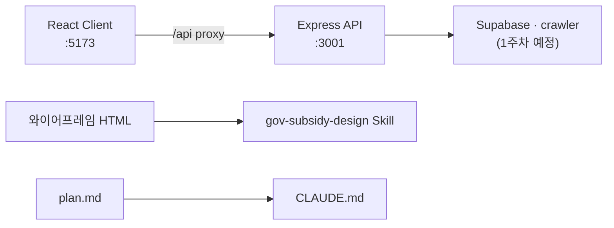

# [루카스ID_신수현] - React+Express 개발 환경 및 디자인 Skill 구축

> **Labels:** `documentation`, `chore`  
> **Branch:** `feature` → `main` (또는 팀 기본 브랜치)

---

## 주요 작업 리스트

- **gov-subsidy-design Skill** — 와이어프레임·plan.md 기반 UI 가이드 (`design-tokens.md`, `screens.md`)
- **CLAUDE.md** — 디렉토리 구조, React+Express 스택, 컨벤션, 커밋 규칙
- **Express API 스캐폴딩** — `server/` (`/api/health`, `/api/subsidies`), `shared/` 타입, Vite proxy
- **문서 모순 정리** — README(Next.js→React+Express), checklist(주차별로 교체), plan.md(구현 보충)
- **ProjectIntro** MVP 문구 plan.md와 일치

### 아키텍처




### 문서 정리 Before → After

| Before | After |
|--------|-------|
| README: Next.js + API Routes | React 19 + Vite + Express |
| checklist = README 복붙 | 주차별 개발 체크리스트 |
| plan ↔ 와이어프레임 불일치 | plan.md 구현 보충 + Skill 표 |
| ProjectIntro: 마감일순만 | 매칭도·마감·금액 정렬 |

### 디렉토리 구조

```
hub/
├── src/                 ← React 클라이언트
├── server/              ← Express API
├── shared/              ← 공유 TypeScript 타입
├── prototype/           ← HTML 와이어프레임
├── .cursor/skills/gov-subsidy-design/
├── CLAUDE.md
└── docs/
    ├── plan.md
    ├── checklist.md
    └── assets/dev-setup-architecture.svg
```

### API 확인

| Endpoint | 설명 |
|----------|------|
| `GET /api/health` | 서버 상태 확인 |
| `GET /api/subsidies` | 와이어프레임 샘플 지원금 JSON |

로컬 실행:

```bash
npm install
cp .env.example .env
npm run dev
```

---

## 내가 설명할 수 있는 부분

**Vite proxy (`vite.config.ts`)**

프론트(`localhost:5173`)와 API(`localhost:3001`) 포트가 다를 때 CORS 설정 없이, 개발 중에는 `fetch('/api/subsidies')`처럼 같은 origin으로 API를 호출할 수 있게 `/api` 요청을 Express로 프록시했다. 배포 시에는 프론트·API 호스트를 분리하고 CORS/env로 처리하면 된다.

---

## 아직 이해 못 한 부분

- **Supabase 스키마** — `subsidies` 테이블 컬럼 설계와 크롤러 적재 형식 (1주차 결정 예정)
- **매칭 점수 알고리즘** — 업종·지역·연매출 가중치 (3주차)
- **기업마당 수집** — 공식 API 존재 여부 vs Cheerio 크롤링 선택

---

## 새로 알게 된 것

- **Cursor Agent Skill** — `.cursor/skills/`에 `SKILL.md` + reference 파일로 UI 구현 규칙을 에이전트에 주입할 수 있다
- **plan vs 와이어프레임 차이** — 기획서(업력·신용도)와 프로토타입(연매출·4스텝)은 모순이 아니라 단계적 구현으로 문서화하면 된다
- **npm workspaces** — 루트는 Vite 클라이언트, `server/`·`shared/`만 workspace로 묶어 monorepo처럼 관리할 수 있다
