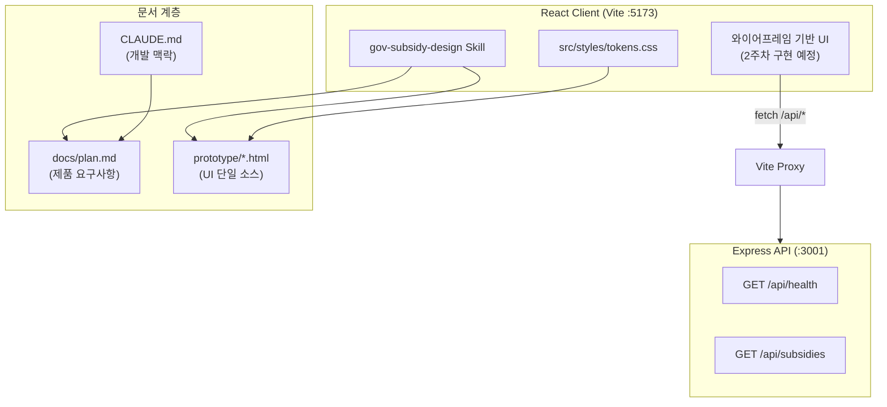
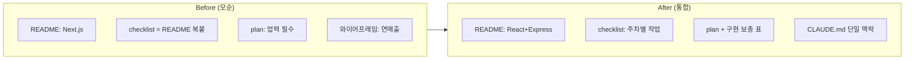

# PR: 개발 환경·디자인 Skill·문서 정리

**제목 (루카스 ID 교체 후 사용):**
```
[루카스ID_신수현] - React+Express 개발 환경 및 디자인 Skill 구축
```

**Labels 제안:** `documentation`, `chore` (또는 팀에서 사용하는 setup / infra 라벨)

---

## 주요 작업 리스트

- **gov-subsidy-design Skill** 추가 — 와이어프레임·plan.md 기반 UI 구현 가이드 (`design-tokens.md`, `screens.md` 포함)
- **CLAUDE.md** 작성 — 디렉토리 구조, React+Express 스택, 컨벤션, 커밋 규칙, 사전 결정 사항
- **Express API 스캐폴딩** — `server/` (`/api/health`, `/api/subsidies` 샘플), `shared/` 공유 타입, Vite proxy
- **문서 모순 정리** — README(Next.js → React+Express), checklist(README 복붙 → 주차별 체크리스트), plan.md(구현 보충 섹션)
- **ProjectIntro** MVP 문구를 plan.md와 일치 (매칭도순 정렬, 알림은 MVP 이후)

### 아키텍처 (시각화)



### 문서 정렬 Before → After



### 디렉토리 구조

```
hub/
├── src/                 ← React 클라이언트
├── server/              ← Express API
├── shared/              ← 공유 TypeScript 타입
├── prototype/           ← HTML 와이어프레임
├── .cursor/skills/gov-subsidy-design/
├── CLAUDE.md
└── docs/
    ├── plan.md
    ├── checklist.md
    └── pr/feature-dev-setup.md  ← 본 문서
```

### API 동작 확인

| Endpoint | 응답 |
|----------|------|
| `GET /api/health` | `{ "status": "ok", "service": "gov-subsidy-curator-api" }` |
| `GET /api/subsidies` | 와이어프레임 샘플 지원금 2건 JSON |

로컬 실행: `npm install && cp .env.example .env && npm run dev`

---

## 내가 설명할 수 있는 부분

**Vite proxy로 `/api`를 Express에 넘긴 이유**

프론트(`localhost:5173`)와 API(`localhost:3001`) 포트가 다르면 브라우저 CORS 이슈가 생길 수 있다. `vite.config.ts`에서 `/api` 요청을 Express로 프록시하면, 개발 중에는 `fetch('/api/subsidies')`처럼 **같은 origin**으로 호출할 수 있어 설정이 단순해진다. 배포 때는 프론트·API 호스트를 분리하고 CORS/env로 처리하면 된다.

---

## 아직 이해 못 한 부분

- **Supabase 스키마** — `subsidies` 테이블 컬럼 설계와 크롤러 적재 형식 (1주차 결정 예정)
- **매칭 점수 알고리즘** — 업종·지역·연매출 가중치 (3주차)
- **기업마당 수집** — 공식 API 존재 여부 vs Cheerio 크롤링 선택

---

## 새로 알게 된 것

- **Cursor Agent Skill** — `.cursor/skills/`에 `SKILL.md` + reference 파일로 UI 구현 규칙을 에이전트에 주입할 수 있다
- **plan vs 와이어프레임 차이** — 기획서(업력·신용도)와 프로토타입(연매출·4스텝)은 모순이 아니라 **단계적 구현**으로 문서화하면 된다
- **npm workspaces** — 루트는 Vite 클라이언트, `server/`·`shared/`만 workspace로 묶어 monorepo처럼 관리할 수 있다

---

## 스크린샷 / 시각화

PR 본문에 아래 이미지·캔버스를 첨부하세요.

1. **아키텍처 다이어그램** — `docs/assets/dev-setup-architecture.svg`
2. **인터랙티브 캔버스** — Cursor에서 [dev-setup-overview.canvas.tsx](/Users/sadie/.cursor/projects/Users-sadie-Documents-Naver-aiaigent-hub/canvases/dev-setup-overview.canvas.tsx) 열기
3. **와이어프레임** — `prototype/gov_subsidy_home_wireframe.html` 브라우저 미리보기 캡처 (선택)

GitHub PR 본문에 SVG 삽입 예:
```markdown

```