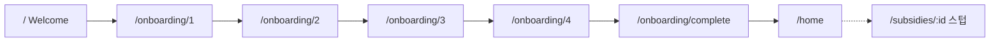

# [루카스ID_신수현] - 와이어프레임 기반 FE 온보딩·홈 mock 구현

> **Labels:** `week-2`, `area:client`, `documentation`  
> **이슈:** [#11 FE 기본 골격/온보딩/홈 mock 통합](https://github.com/syd348/hub/issues/11)  
> **Branch:** `feat/issue-11-fe-mock` → `main`

---

## 주요 작업 리스트

- **라우팅·골격** — React Router v7, `AppShell`(390×844), Pretendard·디자인 토큰
- **온보딩 1~4** — Context + sessionStorage, 전국 시·군·구 데이터, 선택 완료 전 "다음" 비활성
- **Welcome → 완료 → 홈** — 와이어프레임 UI mock (정렬칩·카드 8건·탭바)
- **문서** — `docs/week2/day1-mon.md` (1일차 계획·TODO)

### 데모 흐름

### 스크린샷

| 화면 | 캡처 |
|------|------|
| Welcome | _(첨부)_ |
| 온보딩 step1~4 | _(첨부)_ |
| 완료 요약 | _(첨부)_ |
| 홈 mock 리스트 | _(첨부)_ |

> `npm run dev` → `http://localhost:5173` 에서 Welcome → 온보딩 → 완료 → 홈 흐름 확인

---

## 내가 설명할 수 있는 부분

**온보딩 상태를 Context + sessionStorage로 둔 이유**

온보딩은 4개 스텝에 걸쳐 `industry`, `region`, `district`, `employees`, `revenue`를 모읍니다. 각 스텝이 별도 라우트(`/onboarding/1`~`4`)라서, 페이지 이동 시에도 값이 유지돼야 합니다. React Context로 스텝 간 공유하고, `sessionStorage`에 같이 저장해 새로고침해도 입력이 날아가지 않게 했습니다. 완료 화면 요약과 홈 헤더 프로필(`마포구 · 음식점 · 1~4명`)도 같은 `profile`을 읽습니다.

**AppShell 높이를 `min(844px, 100dvh)`로 둔 이유**

와이어프레임은 모바일 844px 프레임 기준인데, 노트북 브라우저 높이가 더 짧으면 바깥 페이지 전체가 스크롤됩니다. PC에서는 프레임 높이를 뷰포트보다 크지 않게 제한하고, 내용이 넘치면 프레임 안에서 스크롤되게 했습니다.

---

## 아직 이해 못 한 부분

- **정렬칩 실제 정렬 로직** — UI만 구현, `전체/마감임박순/지원금액순/신규` 클릭 시 mock 배열 정렬은 미연동 (수 #6 API 연동 후)
- **매칭도 점수 계산** — 카드의 `match %`는 와이어프레임 하드코딩 값, 알고리즘은 3주차 범위
- **TanStack Query 도입 시점** — 2주차 후반 API 연결 때 패턴 확정 예정

---

## 새로 알게 된 것

- **plan.md vs 와이어프레임 차이**는 모순이 아니라 단계적 구현(예: plan은 업력 필수, UI는 연매출) — `CLAUDE.md` 표로 문서화
- **와이어프레임 `districts`는 프로토타입 축약본** — 실제 서비스에는 행정구역 전체 데이터가 필요 (군위군 2023 대구 편입 등)
- **모바일 퍼스트 프레임 높이** — `100vh`보다 `100dvh`가 주소창 변화에 안정적
- **온보딩 step 컴포넌트 분리** — `OnboardingStep` 공통 레이아웃 + `Step1~4` 개별 컴포넌트로 disabled 규칙을 스텝별로 관리하기 쉬움
---

## 범위 외 (이번 PR 아님)

| 항목 | 담당 이슈 |
|------|-----------|
| 상세화면 실제 구현 | 수 #5 |
| Express API 연결 | 수 #6 |
| Supabase 스키마·조회 | 화 #3/#4 |

## 테스트

- [x] `npm run dev` — Welcome → 온보딩 1~4 → 완료 → 홈 이동
- [x] 각 스텝 선택 전 "다음" 비활성
- [x] `npm run lint` 통과
