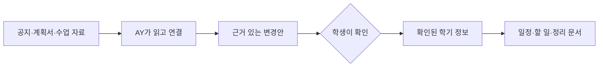

# AY-PLE는 어떤 앱인가

작성일: 2026-07-10

상태: 소개 문서

> **AY-PLE(에이플)는 Codex로 웹앱을 만드는 프로젝트가 아니다. AI Agent가 앱 안에서 학생을 위해 일하도록 만드는 제품이다.**

AY-PLE는 대학생이 한 학기 동안 받는 공지, 강의계획서, 수업 자료를 읽고 정리하는 일을 AY(에이)와 함께 처리하는 학업 앱이다. 학생이 자료를 고르면 AY가 필요한 정보를 찾아 서로 연결하고, 어디에서 찾았는지 보여준다. 학생이 확인한 내용만 과제, 일정, 할 일로 반영된다.

과제를 대신 풀거나 자동으로 제출하는 앱은 아니다. 학생이 자료를 다시 뒤지고 여러 앱에 옮겨 적는 일을 줄이되, 무엇을 믿고 반영할지는 학생이 결정하게 만드는 것이 목표다.

> 이 문서는 AY-PLE가 완성되었을 때의 제품 경험을 설명한다. 지금은 학생용 화면 흐름을 동적 prototype으로 만들었고, 앱 안에서 Agent를 실행하는 기반은 실제 코드로 구현했다. 실제 자료가 화면과 Agent를 거쳐 확인된 학기 정보로 이어지는 연결은 다음 개발 대상이다.

## 학생이 지금 겪는 문제

한 과제에 필요한 정보가 한곳에 모여 있지 않은 경우가 많다. LMS 공지에는 과제명과 마감이 있고, 강의계획서에는 제출 방식과 평가 기준이 있다. 교수님이 수업 중에 덧붙인 주의사항은 별도 메모나 녹음에 남아 있을 수도 있다.

학생은 이 자료를 하나씩 열어 서로 대조한 다음, 마감은 캘린더에, 해야 할 일은 할 일 앱에, 세부 조건은 메모에 다시 적는다. 자료가 바뀌거나 새 공지가 올라오면 같은 일을 반복한다. 파일을 저장하는 일보다, 흩어진 내용을 읽고 연결해 지금 무엇을 해야 하는지 판단하는 일이 더 어렵다.

AY-PLE는 이 과정을 하나의 학기 작업공간에서 이어준다.

## 완성된 제품에서는 이렇게 작동한다

`문제해결글쓰기` 과목에 새로운 과제 공지가 올라왔다고 가정해보자. 학생은 LMS 공지를 저장하고, 이미 가지고 있던 강의계획서와 함께 AY-PLE에 넣는다. 파일을 미리 깔끔하게 분류하거나 AI에게 긴 명령을 작성할 필요는 없다.

학생이 이번에 정리할 두 자료를 고르고 **선택한 자료 정리하기**를 누르면 AY가 일을 시작한다. AY는 공지의 본문을 읽고, PDF 강의계획서를 읽는 데 필요한 도구를 사용한다. 한 문서에서 `개요 작성하기`라는 과제와 `7월 12일 23:59`라는 마감을 찾고, 다른 문서에서 LMS 제출 방식과 평가 기준을 찾는다. 서로 떨어져 있던 내용을 하나의 과제 정보로 연결한다. 완성된 제품에서는 자료 형식이나 상황에 따라 읽는 방법을 바꾸고, 혼자 결정하기 어려운 내용이 있으면 학생에게 물을 수 있다.

AY는 찾은 내용을 바로 저장하지 않는다. 대신 다음과 같이 학생이 검토할 수 있는 변경안을 만든다.

- `개요 작성하기` 과제를 추가할까요?
- 마감은 `7월 12일 23:59`로 저장할까요?
- 제출 방식은 `LMS 과제함`으로 기록할까요?

각 값 옆에는 그 내용을 찾은 파일과 원문 위치가 함께 보인다. 학생은 공지와 강의계획서를 바로 열어 AY의 해석을 확인한다. 맞으면 수락하고, 일부가 다르면 고치고, 필요 없는 내용이면 거절한다.

수락한 내용은 그때부터 AY-PLE가 믿고 사용할 수 있는 학기 정보가 된다. 확인된 과제 마감은 일정에 나타나고, `개요 초안 작성하기` 같은 할 일의 기준이 되며, 과목별 정리 문서에도 반영된다. 이후에는 학생이 “이번 주에 무엇부터 해야 해?”라고 물었을 때 AY가 앞서 확인된 정보와 원본 자료를 함께 보고 답할 수 있게 된다.

이 흐름에서 중요한 것은 AI가 그럴듯한 답을 한 번 만들어내는 일이 아니다. **원본 자료를 읽고, 정보를 연결하고, 근거 있는 변경안을 제시하고, 학생의 결정 이후에도 계속 사용할 수 있는 학기 정보로 남기는 것**이 AY-PLE가 하려는 일이다.

## AI 채팅과 무엇이 다른가

일반적인 AI 채팅에서는 사용자가 자료를 첨부하고 질문하면 답변을 받는다. 좋은 답변을 받아도 실제 일정이나 할 일에 반영하려면 사용자가 다시 옮겨야 하고, 다음 대화에서 어떤 내용이 확정됐는지도 따로 관리해야 한다.

| AI 채팅 | AY-PLE |
| --- | --- |
| 질문에 대한 답변을 만든다. | 학생이 맡긴 일을 앱 안에서 수행한다. |
| 사용자가 파일과 지시를 매번 준비한다. | 현재 과목과 선택한 자료를 바탕으로 필요한 읽기 방법과 도구를 고른다. |
| 결과가 대화에 남는다. | 학생이 확인한 결과가 과제, 일정, 할 일, 정리 문서로 이어진다. |
| 답변을 쓸지 사용자가 알아서 판단한다. | 원본 근거와 수락·수정·거절 과정을 제품 경험으로 제공한다. |

여기서 **Agent**란 단순히 문장을 생성하는 채팅창이 아니라, 목표를 받고 파일과 도구를 사용해 여러 단계를 진행하는 실행 주체를 뜻한다. AY는 학생에게 보이는 Agent의 이름이다. 학생은 터미널에서 Agent를 직접 조작하는 대신, 익숙한 자료 목록과 버튼, 검토 화면, 대화를 통해 AY와 함께 일한다.

## “Codex가 앱 안에 들어간다”는 뜻

많은 프로젝트는 Codex나 Claude Code 같은 도구를 개발 과정에 사용해 웹앱을 만든다. AY-PLE는 한 단계가 다르다. 개발이 끝난 뒤에도 Agent 실행 능력이 제품 안에 남아, 학생이 자료를 정리할 때 실제로 작동한다.

AY-PLE는 Codex app-server를 AY의 실행 엔진으로 사용하려 한다. 쉽게 말하면 학생이 별도의 터미널을 열고 Codex를 직접 설치하거나 명령하는 대신, AY-PLE가 자체 실행환경에서 Agent를 시작하고 작업 진행을 지켜보며 필요하면 중단한다는 뜻이다. 파일 읽기와 도구 사용의 결과는 개발자용 로그로 끝나지 않고, 학생이 이해할 수 있는 변경안과 근거로 바뀌어 화면에 나타난다.

따라서 Codex 자체가 제품은 아니다. Codex는 AY가 일할 수 있게 하는 엔진이고, AY-PLE는 그 능력을 학기 자료, 학생의 결정, 일정과 할 일에 연결하는 제품이다.

## 왜 학생의 확인을 거치는가

학업 정보에는 틀리면 곤란한 내용이 많다. 마감 시간을 잘못 읽거나, 예시 일정을 실제 일정으로 착각하거나, 서로 다른 분반의 공지를 섞으면 안 된다. 그래서 AY-PLE는 AI가 찾은 내용을 조용히 확정하지 않는다.

학생에게 모든 정리를 다시 시키지도 않는다. AY가 가장 가능성 높은 변경안을 먼저 준비하고 근거를 붙이면, 학생은 원본과 비교해 수락하거나 필요한 부분만 고친다. Agent의 작업 속도와 사람의 판단을 이어 붙이는 방식이다.

## 지금 어디까지 만들어졌나

현재 학생용 화면은 핵심 검토 경험을 확인하기 위한 **HTML/CSS prototype**이다. 자료 목록, 원본 미리보기, 근거가 연결된 변경안, 수락 전후의 화면을 볼 수 있지만, 실제 파일과 Agent가 이 화면을 통해 끝까지 연결되어 작동하는 완성 제품은 아니다.

그 아래에서 앱 안의 Agent를 실행하는 부분은 실제 코드로 구현되어 있다. AY-PLE가 자체 Codex 실행환경을 시작하고, 작업의 진행·완료·실패·취소를 관찰하며, 실행 기록을 다시 불러올 수 있는 기반을 만들었다. 이 개발자용 실행 화면은 학생이 사용할 최종 AY-PLE 화면과는 다르다.

다음 개발 대상은 두 층을 잇는 첫 제품 흐름이다. 학생이 자료를 고르는 순간부터 AY가 변경안을 만들고, 학생의 수락·수정·거절을 거쳐 확인된 학기 정보에 반영되는 과정은 아직 구현해야 한다. 이후 그 정보를 일정, 할 일, 읽기용 정리 문서로 이어갈 예정이다.

작동 흐름을 먼저 보고 싶다면 [동적 제품 prototype](../../spikes/ay-ple-ui-prototype/guided-demo.html)을 열어볼 수 있다. 기존 화면 결정을 확인하려면 [Review Workspace prototype](../../spikes/ay-ple-ui-prototype/index.html), 더 자세한 제품 결정은 [Product Brief](ay-ple-product-brief.md), 구현된 실행 기반은 [Runtime Harness 구현 지도](../architecture/runtime-harness-implementation-map.md)에서 확인할 수 있다.
