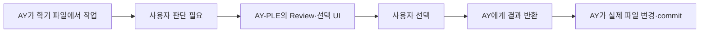

# AY-PLE는 어떤 앱인가

작성일: 2026-07-10

최종 업데이트: 2026-07-28

분류: 활성

> **AY-PLE(에이플)는 AY가 내 학기 Git workspace에서 직접 일하고, 내 판단이 필요한 순간에는 앱의 알맞은 화면으로 물어보는 local-first 학업 Agent 앱이다.**

## 왜 필요한가

한 과제의 정보는 한곳에만 있지 않다. LMS 공지에는 과제명과 마감이 있고, 강의계획서에는 제출 방식과 평가 기준이 있으며, 수업 중 주의사항은 메모나 녹음에 남을 수 있다. 학생은 파일을 하나씩 열어 연결하고 다른 문서나 앱에 다시 옮겨 적는다.

Codex 같은 Agent는 이 파일을 읽고 정리하거나 직접 수정할 수 있다. 하지만 일반적인 채팅만으로는 “어떤 원문을 근거로 무엇이 바뀌는지”, “이 세 가지 선택지 중 무엇을 원하는지”를 한눈에 판단하기 어렵다.

AY-PLE은 이 빈틈을 채운다.



핵심은 App이 AY의 일을 대신하는 것이 아니다. AY가 사용자에게 물어보고 싶은 내용을 MCP로 보내면 App이 그 작업에 맞는 UI로 보여주고, 사용자의 선택을 같은 작업으로 돌려준다.

사용자는 같은 desktop workbench에서 active SemesterWorkspace의 실제 파일을 folder-relative explorer로 찾고 text·PDF 원문을 preview하면서 AY와 대화하거나 Review할 수 있다. 이 화면은 current file을 읽어 보여주는 read-only projection이며 App이 자료를 별도 등록·복사·저장하거나 수정한다는 뜻이 아니다.

## 예: 새 과제 정리하기

학생은 `문제해결글쓰기` 공지와 강의계획서가 있는 SemesterWorkspace에서 AY에게 새 과제를 정리해 달라고 한다.

AY는 실제 파일을 읽고 다음 정보를 찾는다.

- 과제명: `개요 작성하기`
- 마감: `7월 12일 23:59`
- 제출 방식: `LMS 과제함`

바로 파일을 바꾸기 전에 AY는 `propose_state_patch`라는 InteractionCapability를 호출한다. AY-PLE은 원문 위치와 변경 내용을 함께 보여주고 학생에게 수락·수정 요청·거절을 묻는다.

- 수락하면 AY가 실제 학기 파일에 반영하고 의미 있는 checkpoint에서 commit한다.
- 수정 요청하면 feedback이 AY에게 돌아가고, AY가 다시 검토해 새 제안을 보여줄 수 있다.
- 거절하면 AY는 제안을 적용하지 않는다.

App은 이 결정을 별도 학업 history로 복제하거나 직접 파일에 적용하지 않는다. 실제 결과와 history는 SemesterWorkspace의 파일과 Git이 소유한다.

## 일반적인 Codex와 무엇이 같은가

AY-PLE은 Codex 위에 별도 Agent 운영체제를 만들지 않는다.

| Codex 기능 | AY-PLE에서의 사용 |
| --- | --- |
| Workspace `cwd` | 사용자가 선택한 한 학기 Git repository를 그대로 사용한다. |
| `AGENTS.md` | AY의 학기 작업 원칙과 자연스러운 checkpoint commit 지침을 둔다. |
| Skills | 반복 가능한 학업 작업과 init 전략을 안내한다. |
| File·Git tools | AY가 실제 학기 파일을 읽고 수정하며 commit한다. |
| `Thread`·`Turn` | 대화와 작업의 native 실행 단위로 그대로 사용한다. |
| Native approval | Command·file·network 실행 권한을 처리한다. |

학기나 과목마다 Codex Thread를 고정하지 않고, native Turn을 별도 `ModelingRun`으로 복제하지 않는다.

## 일반적인 AI 채팅과 무엇이 다른가

| 일반적인 AI 채팅 | AY-PLE |
| --- | --- |
| 대화와 범용 질문 UI가 중심이다. | 작업에 맞는 Review·선택 UI를 제공한다. |
| 사용자가 원문과 답변을 따로 비교한다. | AY가 보낸 변경·근거를 한 화면에 배치한다. |
| GUI 선택과 Agent 작업이 분리되기 쉽다. | 선택 결과를 structured MCP result로 같은 Turn에 돌려준다. |
| 결과가 주로 대화에 남는다. | AY가 실제 workspace file을 바꾸고 Git checkpoint를 남긴다. |
| 사용자가 매번 긴 prompt를 설계한다. | Skill이 반복 작업 전략을 안내하되 AY가 상황에 맞게 판단한다. |

## App과 AY의 경계

| AY-PLE App | AY·Skill |
| --- | --- |
| Known·active SemesterWorkspace를 관리한다. | 학업 workflow와 작업 순서를 판단한다. |
| Codex Runtime과 Browser를 연결하고 active root의 안전한 file을 bounded read-only explorer·preview로 투영한다. | Workspace의 실제 파일을 읽고 수정한다. |
| MCP 요청을 capability-specific UI로 보여준다. | 언제 어떤 InteractionCapability를 요청할지 정한다. |
| 사용자 입력을 검증해 같은 MCP call에 반환한다. | Result를 해석하고 다음 행동을 정한다. |
| Pending interaction의 cancel·disconnect를 정산한다. | 의미 있는 checkpoint에서 Git commit을 만든다. |

이 선 덕분에 App은 일반 coding Agent보다 나은 UX를 제공하면서도, RawMaterial registry·source copy·watcher·durable selection·학업 workflow engine·duplicate execution history를 소유하지 않는다. Explorer 선택은 Browser-local presentation state일 뿐 AY의 Chat request나 file authority를 암묵적으로 바꾸지 않는다.

## SemesterWorkspace는 무엇인가

SemesterWorkspace는 사용자가 명시적으로 선택한 한 학기 전용 Git working tree다.

```text
year-2-semester-2/
  AGENTS.md
  workspace-state.json
  <실제 학기 자료와 결과 파일>
  .git/
```

App은 별도 복사본이나 normalized child workspace를 만들지 않는다. 새 workspace의 Git과 최소 파일 준비는 App을 시작하기 전에 사용자가 native Codex client에서 요청한 init Skill과 AY가 일반 도구로 수행한다. `workspace-state.json`은 학기 identity와 필요한 구조화 snapshot을 둘 수 있지만, pending interaction이나 native execution event log는 담지 않는다.

여러 workspace의 경로와 현재 선택은 sibling `../.ay-ple/`의 `WorkspaceRegistry`가 소유한다. Runtime payload·cache도 그곳에 두고, Codex account·config·session은 사용자의 기존 `~/.codex/`를 사용한다.

## 두 가지 확인은 다르다

| Codex native approval | AY-PLE InteractionCapability |
| --- | --- |
| “이 command·file·network 행동을 실행해도 되는가?” | “이 변경 방향을 실제 학기 자료에 적용할까?” |
| Runtime 권한을 보호한다. | 사용자의 학업 판단을 돕는다. |
| Codex와 client가 처리한다. | AY가 MCP로 요청하고 AY-PLE UI가 result를 반환한다. |

한쪽의 승인이 다른 쪽을 자동으로 승인하지 않는다.

## 지금 어디까지 만들어졌나

현재 제품은 active SemesterWorkspace의 actual file을 folder-relative explorer, text·PDF preview와 명시적인 unsupported·read error 상태로 보여주고, AY Chat·inline Review와 한 3-pane desktop workbench에 배치한다. 이 SourceProjection은 exact active root만 bounded read하며 registry·copy·snapshot·watcher·durable selection이나 file mutation을 만들지 않는다.

First Assignment vertical은 native project config로 발견한 required Interaction MCP, authenticated App Broker, AY Chat의 inline Review card와 같은 MCP call의 structured result 반환을 end-to-end로 연결한다. App은 active Runtime generation의 pending interaction만 process memory에서 정산하고, AY가 result를 해석해 실제 workspace file을 변경한다.

초기 vertical이 사용했던 app-owned `RawMaterial`, `ModelingRun`, durable `StatePatch`·`UserConfirmation`과 Server-owned apply transaction은 이 round trip의 historical 동기이며 current product graph에는 없다. 정확한 현재 topology는 [Codex Chat 구현 지도](../architecture/codex-chat-implementation-map.md), long-lived seam은 [AY–App Interaction Capability 아키텍처](../architecture/ay-app-interaction-capabilities.md), 후속 작업 순서는 [개발 백로그](ay-ple-development-backlog.md)가 소유한다.

`local-first`는 `offline`을 뜻하지 않는다. Workspace와 App state는 로컬에 있지만 Codex가 읽은 content는 실행 중 provider로 전송될 수 있다. 과제 정답 생성, 시험 답안 대행, 자동 제출과 학교 정책을 우회하는 자동화는 제품 범위 밖이다.
