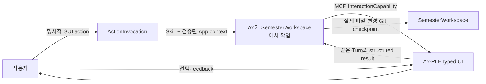

# AY-PLE Product Brief

작성일: 2026-07-07

최종 업데이트: 2026-07-28

분류: 활성

성숙도: 채택

관련 문서: [CONTEXT.md](../../CONTEXT.md), [Protocol-driven AY–App Interaction Layer ADR](../adr/0021-adopt-a-protocol-driven-ay-app-interaction-layer.md), [AY–App Interaction Layer 아키텍처](../architecture/ay-app-interaction-layer.md), [InteractionCapability ADR](../adr/0019-use-mcp-interaction-capabilities-as-the-ay-app-seam.md), [InteractionCapability 상세 아키텍처](../architecture/ay-app-interaction-capabilities.md), [User-owned Git SemesterWorkspace ADR](../adr/0018-adopt-user-owned-git-semester-workspaces.md), [pre-App native Bootstrap ADR](../adr/0020-bootstrap-semester-workspaces-before-app-startup.md), [Codex Runtime 격리](../architecture/codex-runtime-isolation.md), [Codex Chat 구현 지도](../architecture/codex-chat-implementation-map.md), [개발 백로그](ay-ple-development-backlog.md)

## 한 줄 요약

**AY-PLE(에이플)는 App GUI에서 명시한 학기 작업을 AY가 그대로 이해해 실제 Git workspace에서 수행하고, 판단이 필요한 순간에는 App의 typed UI로 다시 물어보며 함께 작업하는 local-first 학업 Agent 앱이다.**

## 제품 테제

일반적인 coding Agent는 파일을 읽고 고치고 도구를 사용할 수 있지만, 사용자에게는 주로 대화와 범용 approval UI만 제공한다. 학기 자료를 다룰 때는 원문 비교, 변경 전후, 근거 위치, 여러 선택지처럼 작업에 맞춘 시각적 판단 도구가 필요하다.

AY-PLE의 차별점은 Agent의 file capability를 App으로 다시 구현하는 것이 아니다. 사용자가 App에서 이미 고른 자료와 입력을 prompt로 다시 설명하지 않아도 AY 작업으로 전달하고, AY가 필요한 판단도 App-native UI로 요청할 수 있는 다음 feedback loop를 제품 경험으로 제공하는 것이다.



App은 ActionInvocation의 GUI 의미·request-scoped context와 InteractionCapability의 UI round trip을 소유하고, Skill과 AY는 workflow와 결과 적용을 소유한다. 이 seam 덕분에 AY-PLE은 generic Codex보다 풍부한 UX를 제공하면서도 학업 workflow engine이나 duplicate file manager가 되지 않는다.

## 해결하려는 문제

대학생의 한 학기 자료는 공지, 강의계획서, PDF, PPTX, HWP/HWPX, 이미지, 메모와 녹음처럼 여러 파일과 형식에 흩어진다. 학생은 내용을 다시 읽고 연결해 과제, 시험, 일정과 정리 문서를 직접 유지한다.

| 문제 | 일반적인 방식 | AY-PLE의 역할 |
| --- | --- | --- |
| 자료가 흩어져 있음 | 파일을 하나씩 열고 긴 prompt와 경로를 반복한다. | App에서 actual file을 탐색·preview하고 AY가 같은 SemesterWorkspace의 실제 파일에서 직접 작업한다. |
| Agent 판단을 검토하기 어려움 | 채팅 답변과 원문을 사용자가 따로 비교한다. | AY가 MCP로 Review를 요청하면 App이 변경·근거·선택지를 함께 보여준다. |
| GUI 선택과 Agent 작업이 분리됨 | UI에서 고른 자료·입력을 prompt에 다시 설명하고, Agent 질문은 일반 대화로만 받는다. | 명시적 ActionInvocation이 App context를 native Turn에 전달하고, InteractionCapability가 사용자 판단을 같은 Turn에 반환한다. |
| 별도 복사본이 실제 자료와 갈라짐 | 앱 전용 저장소와 원본을 둘 다 관리한다. | 사용자 소유 Git working tree 하나를 학기 workspace로 사용한다. |
| Agent 작업을 복구하기 어려움 | 대화 기록이나 앱 내부 history에 의존한다. | 실제 파일과 의미 있는 checkpoint를 Git history에 남긴다. |

## 대표 경험

`문제해결글쓰기` 공지와 강의계획서에서 새 과제를 정리한다고 가정한다.

| 순서 | 사용자 경험 | 소유자 |
| --- | --- | --- |
| 1 | 사용자가 App 실행 전 Codex CLI에서 Init Skill을 실행해 한 학기 Git repository를 준비한다. | AY·Skill이 일반 file·Git 도구를 사용하고 최소 `AGENTS.md`, `workspace-state.json`, workspace Skill copy와 설치 결과를 workspace history에 남긴다. |
| 2 | 사용자가 prepared root로 AY-PLE을 시작한다. | App은 exact Git root, complete effective Interaction declaration과 Broker-owned held Adapter lifecycle을 검증한 뒤 active path를 기록하고 startup thread를 정상 Product Turn에 재사용한다. |
| 3 | 사용자가 source explorer에서 공지와 계획서를 선택하고 `선택한 자료 정리하기`를 실행한다. | App이 selection을 request-scoped ActionInvocation으로 동결하고 workspace-local Skill과 file reference가 포함된 native Turn을 시작한다. |
| 4 | AY가 `propose_state_patch`를 호출한다. | Interaction MCP Module이 도메인 중립적인 semantic before/after change와 선택적인 `EvidenceRef`를 AY Chat의 inline Review card로 투영한다. |
| 5 | 사용자가 수락·수정 요청·거절한다. | Pending 동안 composer·steer는 닫고 전체 Turn interrupt만 별도 control로 유지한다. App은 `accept | revise | reject`와 feedback을 같은 MCP call에 반환하고 해당 card를 read-only outcome으로 남긴다. |
| 6 | AY가 선택을 해석한다. | 수락이면 실제 workspace file을 변경하고, 수정 요청이면 다시 검토해 필요할 때 fresh call·새 card로 제안하며, 거절이면 적용하지 않는다. |
| 7 | AY가 자연스러운 checkpoint에서 commit한다. | Git이 실제 파일 변경의 장기 history와 rollback을 소유한다. |

학생이 보는 핵심 문장은 다음과 같다.

> AY가 내 학기 폴더에서 직접 일하고, 내 판단이 필요한 순간에는 AY-PLE 화면으로 정확히 물어본다.

## 역할 경계

| 주체 | 소유하는 것 | 소유하지 않는 것 |
| --- | --- | --- |
| 사용자 | SemesterWorkspace 선택, App UI에서의 최종 판단, 학기 자료의 의미 | Native protocol과 correlation |
| AY·Skill | ActionInvocation의 목적·입력 해석, 작업 계획, 파일 읽기·수정, InteractionCapability 요청 시점, 결과 해석과 Git checkpoint | Browser UI lifecycle |
| AY-PLE App | Prepared-root resolution·registry, Runtime host, active root의 bounded read-only source explorer·preview, ActionInvocation의 GUI 의미·request-scoped context validation, capability-specific UI와 interaction round trip | Bootstrap·학업 workflow, source ownership·registry·copy·mutation, accepted result의 대리 적용 |
| Interaction MCP Module | Typed request/result, Turn binding, pending·failure·disconnect lifecycle | SemesterWorkspace file mutation |
| Codex Runtime | Thread·Turn, Skills, MCP와 native permission | 학기 SSOT와 AY-PLE UI 의미 |
| SemesterWorkspace | 실제 학기 파일, 선택적인 구조화 snapshot, Git history | Runtime secret과 pending interaction |

AY-PLE은 App을 최소화하는 제품이 아니다. App이 잘할 수 있는 시각적 상호작용을 명확히 소유하되, AY가 잘할 수 있는 유연한 workflow와 file operation을 되가져오지 않는 제품이다.

## AY–App Interaction 원칙

`AY–App Interaction`은 App이 시작하는 `ActionInvocation`과 AY가 시작하는 `InteractionCapability`의 두 방향으로 구성한다. ActionInvocation은 Product Turn을 시작하고 InteractionCapability는 실행 중인 Turn 안에서 사용자 판단을 왕복시킨다. 둘을 하나의 generic event envelope로 합치지 않는다.

### ActionInvocation

- Preview, tab 이동과 selection 변화는 AY 입력을 암묵적으로 바꾸지 않는다. 학생이 목적이 분명한 GUI action을 명시적으로 실행할 때만 invocation을 만든다.
- App은 action 시점의 입력을 active SemesterWorkspace에 결합된 request-scoped context로 검증해 AY 작업에 전달한다.
- 각 action은 `organize_sources`처럼 사용자에게 목적이 분명한 closed contract를 가진다. 모든 GUI event를 보내는 범용 action bus나 dynamic UI schema를 만들지 않는다.
- 실행 관측은 native 작업과 process-local 상태를 사용하고 App-owned durable `ModelingRun`을 만들지 않는다.

Action을 workspace-local Skill과 file/text input으로 compose하는 exact contract와 native protocol 격리는 [AY–App Interaction Layer 아키텍처](../architecture/ay-app-interaction-layer.md)가 소유한다.

### InteractionCapability

`InteractionCapability`는 AY가 MCP로 요청하고 App이 typed UI로 보여준 뒤 structured result를 같은 Turn에 반환하는 기능이다.

- Capability는 `propose_state_patch`처럼 사용자 결정 하나를 표현한다.
- App 내부 binding을 위한 `workspaceId`, `requestKey`, revision과 native ID를 AY에게 요구하지 않는다.
- 사용자 result는 closed union으로 반환해 Skill이 다음 행동을 명확히 결정할 수 있게 한다.
- Pending Review는 AY Chat의 inline card 하나로 표시하고 composer·steer를 잠근다. Modal·별도 approval page와 입력 queue는 만들지 않는다.
- Card에는 capability action만 두며 전체 Turn interrupt는 Review result와 분리된 native conversation control로 유지한다.
- Settled card는 read-only로 남기고 fresh call은 새 card로 append한다. 기존 card를 교체·재개하지 않으며 별도 App Review ledger를 만들지 않는다.
- Optional `EvidenceRef`는 active SemesterWorkspace에서 on-demand로 bounded read하고 path·digest·locator를 모두 검증한 뒤 card에 투영한다. 하나라도 invalid면 partial Review 없이 call 전체를 실패시키며 file registry·copy·cache를 만들지 않는다.
- Pending request와 response를 장기 학업 event로 저장하지 않는다.
- 일반 clarification은 built-in `request_user_input`을 사용할 수 있다.
- 하나의 Review 결정을 custom MCP와 built-in `request_user_input`에 이중으로 걸치지 않는다.
- Native command·file·network approval과 학업 Review는 서로 다른 권한 경계다.

첫 capability인 `propose_state_patch`의 의미는 변경을 App이 적용하라는 명령이 아니다. AY가 사용자에게 변경안을 보여주고 다음 행동을 결정하기 위한 transient Review request다.

공개 request는 Assignment·Course schema나 raw Git diff에 결합하지 않는다. 사람이 이해할 설명과 순서가 있는 semantic change를 사용하고, 각 change는 label·설명, before/after와 선택적인 evidence를 가진다.

## SemesterWorkspace와 상태 소유권

하나의 SemesterWorkspace는 하나의 학기 전용 Git repository다. App은 별도 normalized copy를 만들거나 기존 자료를 `RawMaterial`로 등록해야만 AY가 읽을 수 있게 하지 않는다.

| 정보 | Source of truth |
| --- | --- |
| 실제 학기 자료와 결과 파일 | SemesterWorkspace의 일반 file |
| 학기 identity와 선택적인 구조화 snapshot | Root `workspace-state.json` |
| 변경 history와 rollback | Git commit history |
| Known·active SemesterWorkspace | Sibling `../.ay-ple/`의 `WorkspaceRegistry` |
| Runtime payload, cross-workspace 운영 metadata·config, cache·temp | Sibling `../.ay-ple/` |
| Initial Bootstrap Skill과 repository 개발 harness | `hub/.agents/skills/` |
| AY-PLE built-in Skill source catalog | `hub/skills/` |
| 해당 학기에서 실행하는 Skill byte | SemesterWorkspace의 Git-tracked `.agents/skills/` |
| Interaction MCP의 정적 project declaration | SemesterWorkspace의 Git-tracked `.codex/config.toml` |
| Interaction MCP endpoint·token·Runtime binding | App이 공급하는 process environment |
| Codex account·config·session | 사용자의 기존 `~/.codex/` |
| Pending InteractionCapability | 현재 Turn에 결합된 Interaction MCP Module memory |
| Pending ActionInvocation·Chat product operation과 Broker-owned Adapter lifecycle status | 현재 App process의 Runtime generation memory |
| Source explorer 목록·preview와 선택 | Durable owner 없음. Exact active root의 on-demand read-only projection과 Browser-local presentation state |

`workspace-state.json`의 exact academic schema는 아직 이 Product Brief가 고정하지 않는다. 중요한 불변 조건은 학기 정보가 App database가 아니라 사용자 소유 workspace에 있고, interaction request/result나 native Turn history를 학기 SSOT에 누적하지 않는다는 점이다. Process-local interaction·operation과 Broker-owned Adapter lifecycle status는 terminal event에서 정산하며 App restart 뒤 durable record가 없는 결과를 성공이나 복구 대상으로 추정하지 않는다.

## 제공 형태와 lifecycle

현재 제공 형태는 개발 checkout에서 `npm run dev`로 local companion과 Browser UI를 여는 macOS-first local web app이다. Public `npx`, packaged Desktop, Landing과 AY-PLE 자체 cloud account는 현재 범위가 아니다.

현재 구현한 lifecycle은 다음과 같다.

1. 사용자가 `hub/`를 연 Codex CLI 같은 native client에서 `semester-workspace-init`을 직접 실행한다.
2. Skill이 existing bytes와 dirty tree를 존중하면서 Git root, 최소 workspace file, 선택한 `.agents/skills/` copy와 정적인 `.codex/config.toml`을 준비하고 checkpoint를 남긴다.
3. Bootstrap 성공 뒤 사용자가 첫 open·학기 변경에는 `--workspace <absolute-prepared-git-root>`로 App을 시작한다. 이후 일반 실행은 `WorkspaceRegistry`의 active pointer를 사용한다.
4. App은 exact Git root와 v4 identity를 fresh 검증하고 shared listener·Interaction Broker binding을 먼저 준비한다.
5. App이 exact root를 project root와 고정 `cwd`로 쓰는 fresh Workspace Runtime·thread를 `workspace-write`로 연다. Native App Server가 trust 미지정 exact Git root를 기록하고 project config를 reload한다.
6. Complete effective MCP declaration과 authenticated held Adapter lifecycle이 모두 확인되면 canonical root를 `WorkspaceRegistry`의 known·active workspace로 기록한다. Registry acceptance를 통과한 startup thread를 정상 Product Turn에도 사용한다. 명시적 `untrusted`는 덮어쓰지 않고, 하위 directory와 다른 학기 thread를 이 root의 별도 identity로 사용하지 않는다.

App은 prepared root validation, Workspace Runtime, effective Interaction declaration·Adapter lifecycle과 active pointer만 소유한다. Git repository 생성·cleanliness·commit 정책, Bootstrap Runtime·candidate·init Turn을 별도 subsystem으로 구현하지 않으며, native Bootstrap과 AY가 일반 file·Git 도구 및 `AGENTS.md`의 간단한 지침에 따라 작업한다.

## 현재 구현

First Assignment의 **양방향 AY–App Interaction vertical**은 explicit `organize_sources` ActionInvocation, Browser inline Review와 사용자 결과를 해석한 AY의 actual-file 작업을 한 경험으로 연결한다. 기술 mapping은 [AY–App Interaction Layer 아키텍처](../architecture/ay-app-interaction-layer.md), 현재 검증 표면은 [Codex Chat 구현 지도](../architecture/codex-chat-implementation-map.md)가 소유한다.

현재 canonical graph는 다음과 같다.

```text
SemesterWorkspace actual file
├→ App bounded read-only projection → source explorer / text·PDF preview
│  └→ explicit selection + organize_sources → ActionInvocation
│     └→ workspace Skill + selected file refs → AY / native Codex Turn
└→ normal Chat → AY / native Codex Turn
   → InteractionCapability request
   → App typed UI
   → same-call user result
   → AY-owned file mutation / Git checkpoint
```

두 경로는 같은 actual file을 가리키지만 authority는 다르다. Source explorer·preview는 current filesystem을 읽어 보여주는 transient UI이고, AY만 일반 file·Git 도구로 내용을 변경한다. Explorer의 선택은 Chat request나 Review evidence를 암묵적으로 바꾸지 않는다. 선택 자체는 inert하며 명시적인 ActionInvocation만 request-scoped input을 만든다.

초기 구현이 사용했던 app-owned `RawMaterial → ModelingRun → durable StatePatch → UserConfirmation → Server-owned apply` 흐름은 interaction round trip을 확인한 historical 동기다. 이 객체와 apply transaction은 current product contract와 persistence에서 제거됐다. Exact package·endpoint topology는 [Codex Chat 구현 지도](../architecture/codex-chat-implementation-map.md), 후속 순서는 [개발 백로그](ay-ple-development-backlog.md)가 소유한다.

## 현재 구현된 양방향 First Assignment vertical

하나의 Review capability가 다음 경계로 end-to-end 동작한다.

| 포함 | 구현 결과 |
| --- | --- |
| User-owned SemesterWorkspace | 선택한 Git root가 exact Codex project·thread `cwd`이고, descendant cwd나 App-owned source copy가 없다. |
| Source-grounded workbench | Active root의 안전한 일반 file을 folder-relative explorer에서 보고 UTF-8 text·PDF를 preview하며, unsupported·stale·read failure는 명시적 상태로 표시한다. 이 read-only projection은 AY Chat·Review와 한 3-pane desktop surface에 공존하되 registry·copy·watcher·durable selection을 만들지 않는다. |
| `organize_sources` ActionInvocation | Preview와 독립적인 ordered text selection을 explicit action에서만 동결하고, fresh 검증한 자료와 workspace Skill을 한 Product Turn에 전달한다. |
| `propose_state_patch` MCP | Prepared workspace의 required interaction 연결을 사용해 typed 변경 제안과 `accept | revise | reject` 결과가 한 요청으로 왕복한다. |
| Capability-specific Review UI | Semantic before/after change, active workspace에서 atomic preflight한 선택적 evidence와 세 action을 AY Chat inline card에서 이해할 수 있다. |
| AY-owned apply | App이 학기 state를 대신 mutate하지 않고 AY가 result 뒤 실제 파일을 변경한다. |
| Git checkpoint | 의미 있는 accepted 변경을 AY가 commit하고 dirty tree를 강제로 막지 않는다. |
| Failure settlement | Turn interrupt·disconnect·Runtime terminal과 invalid evidence가 partial Review나 허위 apply 없이 끝난다. |
| End-to-end confidence | Browser action과 prepared workspace가 같은 ActionInvocation·InteractionCapability 사용자 경험을 통과한다. 세부 검증 표면은 [Codex Chat 구현 지도](../architecture/codex-chat-implementation-map.md)가 소유한다. |

## 의도적으로 만들지 않는 것

- AY-PLE 전용 학업 workflow engine
- App-owned source archive, reusable file registry·preview cache나 durable source selection. Exact active root의 bounded read-only explorer·preview는 제공한다.
- Duplicate `ModelingRun`·academic event ledger
- 모든 GUI event를 Agent에게 보내는 generic event bus
- Arbitrary JSON schema를 자동으로 UI로 만드는 renderer
- Codex Chat과 동일한 Git UI·background terminal·plugin 관리 화면
- 과제 정답 생성, 시험 답안 대행과 자동 제출
- LMS 우회 자동화, cloud sync와 외부 calendar 자동 업로드
- 모바일·소형 화면 최적화
- 두 번째 실행 엔진 요구 전의 multi-engine abstraction

## 성공 기준

| 기준 | 확인할 질문 |
| --- | --- |
| 실제 자료 사용 | AY가 복사본이 아니라 선택한 학기 Git workspace의 파일을 직접 다루는가? |
| 원문 가시성 | 사용자가 actual file의 folder-relative 목록과 text·PDF preview를 AY Chat·Review와 같은 workbench에서 보되 App-owned copy·registry 없이 current content와 오류를 정직하게 확인할 수 있는가? |
| App의 차별화 | 일반 채팅보다 나은 capability-specific 판단 UI를 제공하는가? |
| GUI intent 전달 | 명시적 App action과 그 시점의 검증된 맥락이 사용자의 prompt 재작성 없이 native AY 작업으로 전달되는가? |
| 왕복 완결성 | 한 MCP call 안에서 요청·UI·사용자 선택·structured result 반환이 끝나는가? |
| 근거 정직성 | Evidence가 active workspace의 exact content version과 일치할 때만 card 전체가 표시되는가? |
| Runtime 정직성 | Effective Interaction declaration이 정확하지 않거나 actual Adapter의 held Broker lifecycle이 연결되지 않으면 prepared-workspace startup이 성공하지 않는가? |
| 경계의 깊이 | Skill이 correlation·Browser lifecycle·revision을 알지 않아도 되는가? |
| AY의 자율성 | Skill과 AY가 workflow와 실제 file apply를 소유하는가? |
| 사용자 통제 | Review 전에는 제안된 file mutation이 적용되지 않는가? |
| 복구 가능성 | 실제 변경이 Git checkpoint로 이해하고 되돌릴 수 있게 남는가? |
| 상태 단순성 | App이 academic run·patch·confirmation history를 중복 저장하지 않는가? |

## 열린 질문

| 질문 | 소유할 후속 결정 |
| --- | --- |
| `workspace-state.json`에 반드시 필요한 최소 학기 metadata는 무엇인가? | SemesterWorkspace init spec |
| Text 이외 evidence preview가 실제로 필요할 때 어떤 file codec과 locator를 추가할 것인가? | 관찰된 사용 사례에 따른 capability spec |
| 첫 Review 뒤 추가할 두 번째 MCP capability는 무엇인가? | 실제 dogfood에서 반복되는 사용자 판단을 관찰한 뒤 결정 |
