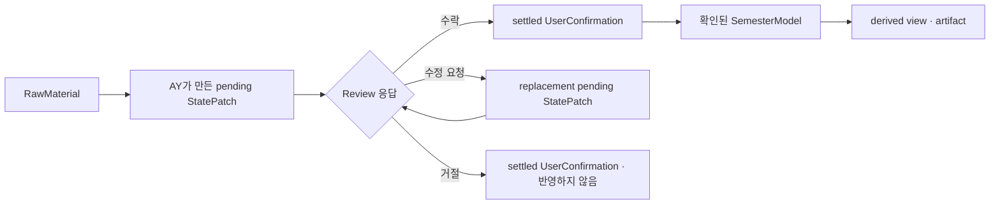

# AY-PLE Product Brief

작성일: 2026-07-07

최종 업데이트: 2026-07-24

분류: 활성

성숙도: 초안

관련 문서: [CONTEXT.md](../../CONTEXT.md), [Review Workspace Scenario](ay-ple-review-workspace-scenario.md), [Native Codex composition ADR](../adr/0007-use-native-codex-composition-for-product-actions.md), [Official Codex Python SDK Chat Shell ADR](../adr/0011-reuse-official-codex-python-sdk-for-chat-shell.md), [Codex Chat-only cutover ADR](../adr/0012-adopt-codex-chat-only-and-remove-legacy-runtime-surfaces.md), [macOS-first 제품 경로 ADR](../adr/0009-use-a-macos-first-local-web-app-product-path.md), [app-owned SemesterWorkspace ADR](../adr/0014-create-app-owned-normalized-semester-workspaces.md), [public repository authority ADR](../adr/0015-bootstrap-public-repository-from-reviewed-clean-snapshot.md), [public npx distribution ADR](../adr/0016-distribute-public-preview-with-an-exact-npx-launcher-and-verified-runtime-release.md), [Codex-managed product account ADR](../adr/0017-use-codex-managed-browser-oauth-for-product-account-lifecycle.md), [Codex-native 제품 작업 조합](../architecture/codex-native-product-composition.md), [Codex Runtime 격리](../architecture/codex-runtime-isolation.md), [개발 백로그](ay-ple-development-backlog.md)

## 한 줄 요약

**AY-PLE(에이플)는 대학생이 한 학기 자료를 AY(에이)와 함께 정리하고, 원본 근거를 확인한 뒤 믿을 수 있는 학기 정보로 반영하는 local-first 학업 앱이다.**

## 현재 범위 정정

AY-PLE은 당분간 소유자 한 명이 repository checkout에서 실행하는 personal/local 앱으로 다룬다. 공식 Landing과 public `npx` 배포는 현재 제품 목표가 아니며 Landing 구현은 tracked workspace에서 제거했다. 이 문서에 남아 있는 첫 public preview·release 서술은 2026-07-23까지 검토한 historical design context이고 현재 backlog나 구현 순서를 정하지 않는다.

Personal/local 앱의 다음 목표와 기존 release-only 구현의 존치 범위는 아직 확정하지 않았다. 현재 구현을 먼저 감사하고 불필요한 surface를 줄인 뒤 별도 대화와 문서 정리로 결정한다.

AY-PLE는 새로운 범용 Agent framework를 만드는 제품이 아니다. 일반적인 Codex 사용 방식 위에 학기 작업공간, 반복 가능한 학업 작업, 자료 선택, 구조화된 변경 제안, 사용자 검토를 얇게 더한다. 실행 엔진은 Codex이고, AY는 그 실행 능력을 학생이 이해할 수 있는 언어와 화면으로 제공하는 제품 속 상호작용 주체다.

학생에게 보이는 UI는 `자료`, `선택한 자료`, `변경 제안`, `반영됨`처럼 친숙한 말을 사용한다. `RawMaterial`, `StatePatch`, `UserConfirmation`, `SemesterModel` 같은 용어는 제품 내부의 정확한 경계를 설명할 때만 사용한다.

## 제품이 해결하는 문제

대학생의 학기 자료는 LMS 공지, 강의계획서, PDF, PPTX, HWP/HWPX, 이미지, 메모, 녹음처럼 서로 다른 형식으로 흩어진다. 학생은 자료를 저장한 뒤에도 과제명, 마감, 제출 방식, 시험 일정 같은 내용을 다시 읽고 연결해 캘린더·메모·할 일 앱으로 옮겨야 한다.

**AY-PLE가 해결하는 핵심 문제는 흩어진 자료를 검토해 `RawMaterial`로 반입하고 근거가 연결된 `StatePatch`로 바꾼 뒤, 학생이 확인한 결과만 `SemesterModel`에 반영하는 것이다.**

| 문제 | 현재 행동 | AY-PLE의 역할 |
| --- | --- | --- |
| 자료가 여러 형식과 위치에 흩어짐 | 파일을 하나씩 열고 사람이 다시 읽는다. | Codex의 파일 접근과 Skills를 학업 작업에 맞게 구성한다. |
| AI 결과를 그대로 믿기 어려움 | 답변을 다시 원문과 대조한다. | 각 변경 제안에 `EvidenceRef`를 연결한다. |
| 대화 결과가 학기 운영 정보로 남지 않음 | 답변을 다른 앱에 다시 옮긴다. | 확인된 변경만 `SemesterModel`에 반영한다. |
| 반복 작업마다 긴 지시를 다시 작성함 | 파일과 프롬프트를 매번 준비한다. | `ModelingRecipe`로 반복 가능한 작업 구성을 제공한다. |
| Agent와 앱이 서로 다른 맥락을 봄 | GUI 조작과 대화가 따로 움직인다. | 앱의 선택과 상태를 필요한 Codex 입력으로 번역한다. |

## 대표 사용자 시나리오

| 순서 | 학생이 하는 일 | AY-PLE가 하는 일 | 결과 |
| --- | --- | --- | --- |
| 1 | 공식 Landing의 exact-version public `npx` 명령으로 AY-PLE을 시작하고, Codex에 연결한 뒤 학년·학기, 생성 위치와 제안된 folder name을 확인·승인한다. | 새 `SemesterWorkspace`를 scaffold하고 workspace instruction/Skill bundle 설치·validation을 끝낸다. | `학기 공간 준비 완료` 상태에서 이후 자료 반입을 시작할 수 있다. |
| 2 | 기존 자료 폴더나 자료 묶음을 `ImportSource`로 고른다. | AY가 분석을 돕고 App이 mapping·반입 제안을 검증 가능한 형태로 준비한다. | 학생이 검토한 자료만 workspace 안의 `RawMaterial`과 Course 맥락으로 들어온다. |
| 3 | 이번에 정리할 두 자료를 고른다. | 이번 요청에 사용할 `SourceSelection`을 준비한다. | 이번 작업의 우선 입력이 명확해진다. |
| 4 | `선택한 자료 정리하기`를 누른다. | Recipe와 이번 입력을 `ModelingInvocation`으로 실행한다. | AY가 과제 후보와 근거를 찾는다. |
| 5 | 원본과 변경 제안을 함께 본다. | `Assignment` 변경을 `StatePatch`로 보여주고 값마다 `EvidenceRef`를 연결한다. | 학생이 제안이 어디에서 왔는지 확인한다. |
| 6 | 수락·수정 요청·거절한다. | 수락과 거절은 `UserConfirmation`을 확정하고, 수락만 반영한다. 수정 요청은 product decision을 확정하지 않고 feedback을 반영한 replacement `StatePatch`를 다시 검토하게 한다. | 확정된 결정과 학기 정보가 남는다. |
| 7 | 이후 학기 정보를 조회한다. | 확인된 모델에서 일정, 요약 문서 같은 화면을 파생한다. | 원본을 다시 뒤지지 않고 학기를 운영한다. |

첫 public preview의 release claim은 1단계와 같은 명령으로 다시 여는 `ready-relaunch`까지다. 자료 archive/import와 실제 학업 action은 `Semester Ready` 이후의 별도 제품 여정이며, 현재 구현된 First Assignment kernel을 새 scaffold에서 바로 사용할 수 있는 public capability로 과장하지 않는다. 이 setup·relaunch의 제품 범위는 이 Product Brief가 소유한다. macOS-first 제품·OS 경계는 [ADR 0009](../adr/0009-use-a-macos-first-local-web-app-product-path.md), exact public 명령과 application↔Runtime distribution 경계는 [ADR 0016](../adr/0016-distribute-public-preview-with-an-exact-npx-launcher-and-verified-runtime-release.md)을 따른다.

## 제품 경계

AY-PLE의 역할은 Codex를 대체하는 것이 아니라 Codex의 일반적인 사용 경험에 학업 제품 경계를 더하는 것이다.

| 층 | 책임 | 책임이 아닌 것 |
| --- | --- | --- |
| 사용자 | 학년·학기, workspace 생성 위치와 folder name을 최종 확인하고, 자료 반입·학업 작업·변경 제안을 검토한다. | Codex protocol, workspace schema나 프롬프트 조합을 직접 관리할 필요가 없다. |
| AY-PLE App | Codex 연결 UX와 transient Browser-safe account projection, Browser setup journey, `SemesterWorkspace` scaffold·`WorkspaceManifest`·validation, workspace instruction/Skill bundle, 자료 반입 경계, action UI, 자료 선택, 실행 조합, `StatePatch`, 검토와 저장을 소유한다. | OAuth·token lifecycle을 직접 구현하거나 setup을 live Codex Turn에 맡기고, 외부 `ImportSource`를 임의로 workspace로 채택하거나 모든 학업 작업을 별도 workflow engine으로 소유하지 않는다. |
| AY | 학생과 소통하고 Codex의 작업을 학업 맥락에서 설명하며 변경을 제안한다. | 사용자 대신 학업 사실을 확정하지 않는다. |
| Codex | Managed ChatGPT login·credential과 대화·작업 실행, Skills, 파일·도구 사용과 선택적인 native context를 제공하는 실행 엔진이다. | `SemesterModel`이나 학업 검토 정책의 source of truth가 아니다. |

다음 항목은 의도적으로 만들지 않는다.

- 학기·과목·`ModelingRun`마다 고정된 `Thread`를 배정하는 별도 세션 topology
- Codex 위에 다시 만드는 범용 Agent orchestration framework
- 모든 GUI 이벤트를 한 규칙으로 Agent에게 보내는 generic event bus
- built-in Memories를 대체하는 외부 장기 기억 시스템
- 두 번째 실행 엔진 요구가 생기기 전의 다중 엔진 공통 추상화

## 제품 제공 형태

첫 public 제품 진입점은 공식 product homepage인 Landing에서 exact-version public `npx` 명령을 복사해 실행하고, local companion과 browser UI를 여는 **macOS-first local web app**이다. Landing은 AY-PLE의 장기 제품 가치와 현재 preview capability를 구분해 보여주며 Docs, public repository와 license·trust 정보로 이어진다. Public source는 [ADR 0015](../adr/0015-bootstrap-public-repository-from-reviewed-clean-snapshot.md)의 clean snapshot·Apache-2.0·trust authority를 따르며, Packaged Desktop App은 이 경로를 검증한 뒤의 후속 로드맵이다.

[Official SDK 기반 Codex Chat Shell](../adr/0011-reuse-official-codex-python-sdk-for-chat-shell.md)과 First Assignment vertical은 native 실행과 학업 product boundary를 검증한 현재 kernel이다. Public `npx` 배포, Browser OAuth와 first-run setup은 이 kernel 앞에 추가하는 채택 목표이며 구현 완료로 서술하지 않는다. macOS-first local web app의 제품 형태·OS 경계는 [ADR 0009](../adr/0009-use-a-macos-first-local-web-app-product-path.md), exact public command·application host·Runtime delivery·offline과 rollback 경계는 [ADR 0016](../adr/0016-distribute-public-preview-with-an-exact-npx-launcher-and-verified-runtime-release.md)이 소유한다.

첫 preview의 `Codex 연결`은 AY-PLE이 중재하는 official Codex-managed ChatGPT Browser login이다. 학생은 official OpenAI/Codex tab에서 인증을 마친 뒤 AY-PLE tab으로 돌아오고, 앱이 fresh managed account state를 확인해 setup을 이어간다. Credential bytes는 AY-PLE product surface·API에 전달되지 않고 제품 코드가 parse하지 않으며 별도 인증 완료 receipt도 만들지 않는다. 연결 만료·logout·reauth에도 `SemesterWorkspace`와 학업 상태를 보존한다. 정확한 account·credential authority는 [ADR 0017](../adr/0017-use-codex-managed-browser-oauth-for-product-account-lifecycle.md)이 소유한다.

## 학기 작업공간과 Codex 사용 모델

`SemesterWorkspace`는 학생이 학년·학기, 위치와 editable folder name을 최종 확인하면 AY-PLE이 생성하는 app-owned normalized 학기 공간이다. `WorkspaceManifest`가 학기와 Course의 정체성·관계를 소유하며 폴더명은 사람이 읽기 위한 표현이다. Mandatory setup은 Browser wizard와 App code가 소유하고 Codex `Thread`·live Turn·setup Skill을 사용하지 않는다. Fresh workspace에는 학생에게 built-in instructions·Skills로 보이는 package-owned **workspace instruction/Skill bundle**을 설치하며, App은 이를 `Semester Ready`와 같은 exact application version의 relaunch에서 검증한다. Workspace-local native context가 이 bundle을 가리거나 확장하면 첫 preview는 사용자 byte를 바꾸지 않고 Codex action을 막는다.

첫 preview의 기본 설정은 학생이 선택한 학년·학기 metadata와 workspace instruction/Skill bundle뿐이다. Default Course, timezone, locale, model, reasoning effort와 service tier는 setup 완료 조건에 넣지 않는다.

기존 폴더나 자료 묶음은 `SemesterWorkspace`가 아니라 외부 `ImportSource`다. 후속 반입 여정에서 분석·mapping 제안과 사용자 검토를 거쳐 workspace 안으로 들어온 뒤에만 `RawMaterial`이 된다. AY-PLE의 runtime 상태는 workspace와 분리하고, app data가 없어져도 workspace identity와 확인된 학기 상태를 다시 열 수 있어야 한다. 정확한 admission·identity 결정은 [ADR 0014](../adr/0014-create-app-owned-normalized-semester-workspaces.md), root 소유권은 [ADR 0006](../adr/0006-separate-package-app-data-and-semester-workspace-roots.md), 현재·목표 실행 경로는 [Codex Runtime 격리](../architecture/codex-runtime-isolation.md)가 소유한다.

Codex의 실행과 보조 맥락은 Course, ModelingRun 또는 확인된 학업 사실의 source of truth가 아니다.

## 학업 작업의 실행 경계

학생에게 보이는 action은 versioned `ModelingRecipe`를 선택하고 이번 작업의 입력을 모아 일회성 `ModelingInvocation`으로 실행한다. 각 실행 시도와 결과는 `ModelingRun` receipt가 추적한다. `StatePatch`는 이 receipt와 독립된 제안 lifecycle이며, 출처가 있을 때만 optional origin provenance로 실행과 연결한다. `SourceSelection`은 이번 요청의 명시적인 입력이며 진행 중 작업에 자동 전달되지 않는다.

정확한 용어는 [CONTEXT.md](../../CONTEXT.md), 채택한 결정은 [ADR 0007](../adr/0007-use-native-codex-composition-for-product-actions.md), native Codex mapping은 [Codex-native 제품 작업 조합](../architecture/codex-native-product-composition.md)을 따른다.

## 제품이 소유하는 상태

정확한 용어 정의는 [CONTEXT.md](../../CONTEXT.md)가 소유한다. Product Brief에서는 제품 책임만 구분한다.

| 범주 | 개념 | 제품 책임 |
| --- | --- | --- |
| setup과 작업 범위 | `SemesterWorkspace`, `WorkspaceManifest`, `Semester Ready` | 학기 공간을 생성·검증하고 이후 다시 열 수 있는 identity와 readiness를 보존한다. |
| 자료 반입 | `ImportSource`, `Course`, `RawMaterial` | 외부 후보와 workspace 안의 검토된 자료를 구분하고 과목 맥락을 보존한다. |
| canonical 학업 상태 | `Assignment`, `Exam`, `SemesterModel` | 확인된 학업 사실의 owner를 하나로 유지한다. |
| 제안과 신뢰 | `EvidenceRef`, `StatePatch`, `Review`, `UserConfirmation` | 원본 근거를 보여주고 학생의 결정 뒤에만 상태를 바꾼다. |
| 실행 지원 | `ModelingRecipe`, `ModelingInvocation`, `ModelingRun`, `SourceSelection` | 반복 작업의 정의, 일회성 요청과 한 시도의 receipt를 학업 상태와 분리한다. |

`TrustedState`는 별도 저장 container가 아니라 UserConfirmation을 거쳐 SemesterModel에 반영된 정보의 권한 상태다.

Codex account와 credential은 이 제품 상태 표의 durable 학업 authority가 아니다. Official Runtime이 app-managed `CODEX_HOME`의 credential을 소유하고, AY-PLE App은 transient login attempt와 Browser-safe projection만 중재한다. 둘 다 workspace·Course·`ModelingRun` identity와 분리한다.

## 상태와 검토 경계

AY-PLE의 상태 흐름은 다섯 개의 저장 container가 아니라 다음 한 방향 경계로 설명한다.

- AY의 초안은 별도 `DraftState` aggregate가 아니라 pending `StatePatch`다.
- 검토 대기 목록은 별도 `ReviewState` source of truth가 아니라 pending patch를 보여주는 projection이다.
- 일정, 타임라인, 읽기용 문서는 별도 `ArtifactState`가 아니라 확인된 모델에서 파생되는 view 또는 artifact다.
- AY의 메시지, 도구 호출, 진행 event는 실행 관측 정보이며 자동으로 학기 상태가 되지 않는다.
- `StatePatch` proposal은 하나의 product proposal contract에서 검증하며 AY의 설명을 별도 canonical payload로 취급하지 않는다.
- 수정 요청은 feedback으로 같은 작업을 이어 replacement `StatePatch`를 만들며, 직접 반영하거나 `UserConfirmation`을 settle하지 않는다. 이전 제안은 superseded 기록으로 남고 새 제안 하나만 active Review 대상이 된다.
- 검토 응답 전에 진행 중 작업의 continuity를 잃으면 중단 처리하고 아무것도 반영하지 않는다. 자동 retry하지 않으며 사용자가 명시적으로 retry할 때 새 action을 시작한다.
- settled `UserConfirmation`과 apply outcome은 앱이 소유하며, 이후 실행 응답이 유실돼도 확인된 `SemesterModel`을 다시 적용하지 않는다.
- `UserConfirmation` 없이 `SemesterModel`의 확인된 학업 사실을 바꾸지 않는다.

`StatePatch`의 MVP 최소 계약은 다음과 같다. 세부 DB 필드와 위험도·추천안·대안 표현은 구현과 UX 검증에서 확정한다.

| 필드 | 의미 |
| --- | --- |
| `id` | 변경 제안 식별자 |
| source references | 연결된 `RawMaterial`과 `EvidenceRef` |
| changes | 추가·수정·삭제할 canonical academic facts |
| summary | 학생이 이해할 변경 설명 |
| origin provenance (optional) | 제안을 만든 대화나 실행의 출처가 있을 때만 연결하며 `ModelingRun`을 필수로 요구하지 않는다. |

하나의 학업 사실은 하나의 canonical owner만 가진다. 예를 들어 과제 마감은 `Assignment.dueAt`, 시험 시간은 `Exam.startsAt`과 `Exam.endsAt`이 소유한다. 후속 타임라인이나 할 일 화면은 값을 복제하지 않고 그 owner를 읽는다.

## App Interaction Surface와 AY Interaction Surface

하나의 사용자 행동이 앱과 AY에 서로 다른 효과를 낼 수 있다. 모든 행동을 Agent에게 즉시 보내거나, 반대로 앱 안에만 가두는 기본 규칙은 두지 않는다. 기능별 의도와 Codex capability를 함께 보고 case by case로 정한다.

| 사용자 행동 | App 효과 | AY/Codex 효과 |
| --- | --- | --- |
| 자료를 선택하고 action 시작 | ModelingInvocation을 준비한다. | 선택 자료를 읽는 작업을 시작한다. |
| 진행 중 작업에 명시적으로 정정 전달 | UI와 대상 실행의 상관관계를 기록한다. | 해당 작업에 정정을 전달한다. |
| 진행 중 작업 중단 | 중단 요청과 완료 상태를 표시한다. | 진행 중 작업을 중단한다. |
| AY가 표시한 일반 질문에 답변 | pending 질문을 해소하되 학기 상태는 바꾸지 않는다. | 같은 진행 중 작업에 답변을 전달한다. |
| 외부 자료를 가져오도록 요청 | `ImportSource`와 반입 대상을 식별하고 검토 가능한 admission을 준비한다. | 분석과 mapping을 도울 수 있지만, 진행 중 작업이나 workspace 상태에 자동 반영하지 않는다. |
| 변경 제안 수락·수정 요청·거절 | exact active patch 결합을 확인한다. 수락과 거절은 `UserConfirmation`을 확정하고 수락만 반영한다. 수정 요청은 unsettled feedback으로 replacement patch Review를 이어간다. | 같은 진행 중 작업에 답변을 전달하고 replacement 제안 또는 확정 결과 설명을 이어간다. |

각 행동의 native 전달 방식은 [Codex-native 제품 작업 조합](../architecture/codex-native-product-composition.md)이 소유하며, 실제 기능이 요구할 때 case by case로 채택한다.

## Source of Truth

| 정보 | Source of truth | 비고 |
| --- | --- | --- |
| 외부 반입 후보 | workspace 밖의 `ImportSource` | 그 자체는 workspace나 `RawMaterial`이 아니며 앱이 임의로 이동·삭제하지 않는다. |
| 반입된 원본 자료 | app-owned `SemesterWorkspace` 안의 `RawMaterial` | 사용자 검토를 거쳐 반입하고 내용은 명시적 결정 없이 바꾸지 않는다. |
| 확인된 학업 사실 | 앱이 관리하는 `SemesterModel` | 정확한 저장 기술과 경로는 구현 PRD에서 정한다. |
| 변경 제안 | `StatePatch` | 반영하려는 내용과 원본 근거를 소유하며 available origin provenance만 선택적으로 참조한다. |
| 사용자 결정 | `UserConfirmation` | first vertical에서는 수락·거절의 settled product decision을 기록한다. 수정 요청은 replacement patch Review를 계속하는 feedback이며 settled `UserConfirmation`이 아니다. |
| Agent 보조 맥락 | Codex `Thread`, built-in Memories, `AGENTS.md`와 Skills | 학업 사실의 SSOT가 아니다. |
| Assignment/Exam 기반 일정·마감 view와 정리 문서 | `SemesterModel`에서 파생 | 필요하면 다시 생성할 수 있어야 한다. 별도 학생 행동·할 일 모델의 owner는 아직 정하지 않는다. |

## MVP 범위

First Assignment vertical은 다음 kernel을 이미 증명했다.

> 학생이 준비된 workspace에서 과제 자료를 선택하고 action을 시작하면, AY가 자료를 읽어 근거 있는 `Assignment` 변경 제안을 만들고, 학생이 확인한 결과만 `SemesterModel`에 반영한다.

첫 public preview는 이 kernel 전체를 새 사용자에게 공개한다고 주장하는 release가 아니다. 공식 Landing에서 public `npx`로 시작해 Codex에 연결하고 app-owned `SemesterWorkspace`를 만들어 `Semester Ready`에 도달한 뒤, 같은 명령으로 안전하게 다시 여는 setup·distribution slice다.

| 분류 | 항목 |
| --- | --- |
| 구현된 kernel | TXT `RawMaterial`, Course와 `Assignment`, `ModelingRecipe → ModelingInvocation → ModelingRun` 실행 receipt, 독립된 `StatePatch → Review → UserConfirmation → 확인된 SemesterModel`, `EvidenceRef` |
| 첫 public preview | 공식 Landing, public `npx`, verified Runtime과 official Codex-managed ChatGPT Browser login, app-owned `SemesterWorkspace` scaffold·validation, `Semester Ready`, `ready-relaunch` |
| release claim 밖 | 자료 archive/import, Course 구성과 자료 기반 학업 action. 구현된 kernel이 있어도 새 scaffold와 잇는 public journey가 없으면 현재 capability로 광고하지 않는다. |
| 제공 형태 | macOS에서 local companion과 browser UI를 함께 사용하는 local web app. Packaged Desktop App은 후속 |
| runtime 전제 | First Assignment vertical에서 검증한 observable execution contract, 격리된 제품 layout과 native Codex mapping. 일반 Chat completeness를 전제로 하지 않는다. |
| 다음 vertical 후보 | `ImportSource` admission, PDF, `Exam`, 여러 과목 공지에서 시험·과제 표 만들기, derived timeline, 읽기용 정리 문서, 학기 상태 질의 |
| 후속 아키텍처 | 학기 rollover와 memory 관리 UX, history·rollback, first vertical의 proposal 경계 밖에 있는 추가 Codex extension surface, 안정화된 source locator, 첫 normalized format 이후 workspace schema evolution·migration |
| 제외 | 과제 정답 대행, 시험 답안 대행, 자동 제출, LMS 우회 자동화, 클라우드 동기화, 다중 실행 엔진 추상화 |

`ScheduleEvent`는 Assignment나 Exam이 소유하지 않는 독립 시간 사실이라는 경계만 정했으며 첫 vertical 범위 밖이다. `MarkdownProjection`과 `WorkspaceHistory`도 정의된 후속 개념이지만 이번 범위에는 포함하지 않는다. 학생의 할 일, timeline, 공지 해석, 불확실성 표현처럼 아직 이름과 owner가 정해지지 않은 모델은 실제 다음 vertical에서 의미를 확인한 뒤 도입한다.

Multi-conversation catalog, generic transcript persistence, two-client synchronization, 응답하지 않은 Review의 reload·restart 복원과 full approval center도 첫 vertical의 기본 선행조건이 아니다. Representative action과 failure trace에서 실제 필요가 확인되면 native·official owner를 먼저 재사용하고, 남은 차이만 후속 capability로 admission한다.

## Skills와 script 확장 원칙

Skills는 앱 lifecycle을 흉내 내는 단계명이 아니라 사용자가 반복해서 수행할 **학업 action의 처리 전략**을 담는다.

First-run setup과 `SemesterWorkspace`의 canonical schema·validation은 App code가 소유한다. Setup Skill이나 별도의 “학기 시작 Skill”은 만들지 않는다. Workspace에 설치되는 built-in Skills는 setup orchestration이 아니라 `Semester Ready` 이후 반복 가능한 학업 action의 처리 전략이다. 후속 import에서 Agent 분석을 사용하더라도 App의 검토 가능한 operation과 사용자 승인을 우회하지 않는다.

| Recipe 예시 | Skill이 안내할 전략 | 예상 결과 |
| --- | --- | --- |
| 선택한 공지에서 과제 정리 | 과제명, 마감, 제출 방식과 근거 찾기 | `Assignment` `StatePatch` |
| 선택한 자료에서 시험 정보 정리 | 시험 일시, 범위, 근거 찾기 | 후속 `Exam` `StatePatch` |
| 모든 과목 공지에서 마감표 만들기 | 여러 과목 자료 탐색과 확인된 상태 비교 | 여러 patch 또는 derived view |

PDF text extraction, OCR, HWP/HWPX parsing처럼 결정적으로 처리할 수 있는 작업은 local script로 제공할 수 있다. Skill은 언제 무엇을 사용하고 어떤 결과를 만들어야 하는지 안내하고, script는 특정 변환을 재현 가능하게 수행한다.

## 보안과 학업 윤리

- `RawMaterial`과 `SemesterModel`은 사용자의 로컬 환경에 둔다.
- `local-first`는 `offline`을 뜻하지 않는다. Codex 실행 중 대화·Agent가 읽은 workspace content·tool result는 provider로 전송될 수 있으며, 정확한 공개 privacy 경계는 [ADR 0015](../adr/0015-bootstrap-public-repository-from-reviewed-clean-snapshot.md)가 소유한다.
- app-managed runtime 상태와 secret은 Git에 포함하지 않는다.
- OAuth credential bytes는 AY-PLE product API·Browser storage·`SemesterWorkspace`·product receipt와 public log에 넣지 않고 official Codex Runtime이 소유한다.
- 브라우저가 Codex App Server나 파일시스템에 직접 접근하지 않고 local companion server가 중재한다.
- RawMaterial 원본은 자동 수정하거나 삭제하지 않는다.
- Codex command/file approval과 학업 정보에 대한 `UserConfirmation`은 별개의 권한 경계다.
- 과제 정답 생성, 시험 답안 대행, 자동 제출, 학교 정책을 우회하는 자동화는 제품 범위 밖이다.

## 성공 기준

| 기준 | 확인할 질문 |
| --- | --- |
| public 진입 가능성 | 학생이 공식 Landing의 명령으로 local AY-PLE을 시작하고 현재 prerequisite와 preview 범위를 이해할 수 있는가? |
| Codex 연결 lifecycle | Fresh login·취소·재시도·relaunch·만료 뒤 reauth·logout이 Browser-safe 상태로 수렴하고 workspace나 학업 상태를 손상하지 않는가? |
| setup 완료성 | 학생의 생성 승인 뒤 App이 새 `SemesterWorkspace`와 workspace instruction/Skill bundle을 생성·검증하고, Course나 자료가 없어도 정확한 `Semester Ready`를 표시하는가? |
| 재실행 지속성 | 같은 exact application version의 public 명령으로 다시 실행했을 때 중복 scaffold 없이 workspace·bundle·effective native context·account를 다시 확인하고 준비된 workspace를 여는가? |
| release claim의 진실성 | post-Ready import와 학업 action을 현재 public capability로 과장하지 않는가? |
| 학업 작업 시작 가능성 | 준비된 workspace에서 학생이 자료를 선택하고 action을 시작할 수 있는가? |
| 실행 경계의 명확성 | Recipe, Invocation과 Run을 구분하고 한 실행 시도를 추적할 수 있는가? |
| 근거 연결 | 제안한 과제 값이 원본 위치와 연결되는가? |
| 검토 경계 | 확인하지 않은 값이 `SemesterModel`에 들어가지 않는가? |
| 정정 가능성 | 학생이 제안에 쉽게 수정을 요청하거나 거절할 수 있는가? |
| 재사용 가치 | 확인된 학기 정보를 이후 조회와 derived view에 사용할 수 있는가? |
| 한 학기 지속성 | app-managed Codex 환경과 학기 상태를 학기 동안 계속 사용할 수 있는가? |

## 주요 리스크

| 리스크 | 대응 |
| --- | --- |
| 단순 AI 파일 분류기로 보임 | 반복 가능한 학업 action, 근거, 검토 후 지속되는 `SemesterModel`을 함께 보여준다. |
| Codex wrapper로만 보임 | Codex가 소유하지 않는 학업 상태와 사용자 확인 경계를 분명히 한다. |
| 제품 추상화가 Codex를 다시 구현함 | Codex native 기능을 사용하고 AY-PLE 고유 상태와 검토 경계만 소유한다. |
| Agent context를 학업 사실로 오해함 | Source of Truth 표와 Review 경계로 `SemesterModel`과 분리한다. |
| 사실 중복 저장 | `Assignment`, `Exam` 같은 canonical owner에서 derived view를 만든다. |
| 기능마다 전달 방식이 제각각이라 혼란 | 사용자 의도, 즉시성, 대상 작업과 correlation 필요성을 capability matrix로 기록한다. |
| 초기에 미래 모델을 과도하게 확정함 | 다음 vertical에서 증명되기 전까지 deferred candidate로 유지한다. |
| 기존 자료 폴더를 workspace로 오인함 | 외부 자료는 `ImportSource`, app-owned scaffold만 `SemesterWorkspace`로 구분한다. |
| Landing이 kernel과 public capability를 혼동함 | 구현된 내부 vertical과 새 사용자가 끝까지 도달할 수 있는 release claim을 분리한다. |

## 결정된 경계와 열린 질문

첫 normalized workspace의 single aggregate authority, exclusive new-leaf scaffold와 current v2 no-auto-migration은 [ADR 0014](../adr/0014-create-app-owned-normalized-semester-workspaces.md)가 채택했다. Exact field roster·encoding·filesystem recovery는 resulting implementation spec이 고정하고, 이후 실제 schema evolution·migration은 supported source→target pair가 생길 때 별도로 결정한다. EvidenceRef locator, thread UX, Memory rollover와 후속 derived view의 작업 순서는 [개발 백로그](ay-ple-development-backlog.md)에서 관리한다.
