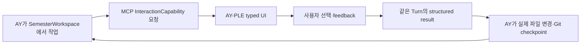

# AY-PLE Product Brief

작성일: 2026-07-07

최종 업데이트: 2026-07-27

분류: 활성

성숙도: 채택

관련 문서: [CONTEXT.md](../../CONTEXT.md), [InteractionCapability ADR](../adr/0019-use-mcp-interaction-capabilities-as-the-ay-app-seam.md), [User-owned Git SemesterWorkspace ADR](../adr/0018-adopt-user-owned-git-semester-workspaces.md), [AY–App Interaction Capability 아키텍처](../architecture/ay-app-interaction-capabilities.md), [Codex Runtime 격리](../architecture/codex-runtime-isolation.md), [Codex Chat 구현 지도](../architecture/codex-chat-implementation-map.md), [개발 백로그](ay-ple-development-backlog.md)

## 한 줄 요약

**AY-PLE(에이플)는 AY가 사용자의 한 학기 Git workspace에서 직접 일하고, 판단이 필요한 순간에는 App의 typed UI로 물어본 뒤 그 선택을 받아 계속 행동하는 local-first 학업 Agent 앱이다.**

## 제품 테제

일반적인 coding Agent는 파일을 읽고 고치고 도구를 사용할 수 있지만, 사용자에게는 주로 대화와 범용 approval UI만 제공한다. 학기 자료를 다룰 때는 원문 비교, 변경 전후, 근거 위치, 여러 선택지처럼 작업에 맞춘 시각적 판단 도구가 필요하다.

AY-PLE의 차별점은 Agent의 file capability를 App으로 다시 구현하는 것이 아니다. 다음 feedback loop를 제품 경험으로 제공하는 것이다.



App은 interaction round trip을 소유하고, Skill과 AY는 workflow와 결과 적용을 소유한다. 이 경계 덕분에 AY-PLE은 generic Codex보다 풍부한 UX를 제공하면서도 학업 workflow engine이나 duplicate file manager가 되지 않는다.

## 해결하려는 문제

대학생의 한 학기 자료는 공지, 강의계획서, PDF, PPTX, HWP/HWPX, 이미지, 메모와 녹음처럼 여러 파일과 형식에 흩어진다. 학생은 내용을 다시 읽고 연결해 과제, 시험, 일정과 정리 문서를 직접 유지한다.

| 문제 | 일반적인 방식 | AY-PLE의 역할 |
| --- | --- | --- |
| 자료가 흩어져 있음 | 파일을 하나씩 열고 긴 prompt와 경로를 반복한다. | AY가 선택한 SemesterWorkspace의 실제 파일에서 직접 작업한다. |
| Agent 판단을 검토하기 어려움 | 채팅 답변과 원문을 사용자가 따로 비교한다. | AY가 MCP로 Review를 요청하면 App이 변경·근거·선택지를 함께 보여준다. |
| GUI 선택과 Agent 작업이 분리됨 | UI에서 고른 내용이 대화 맥락과 따로 움직인다. | 사용자 선택을 structured result로 같은 Codex Turn에 반환한다. |
| 별도 복사본이 실제 자료와 갈라짐 | 앱 전용 저장소와 원본을 둘 다 관리한다. | 사용자 소유 Git working tree 하나를 학기 workspace로 사용한다. |
| Agent 작업을 복구하기 어려움 | 대화 기록이나 앱 내부 history에 의존한다. | 실제 파일과 의미 있는 checkpoint를 Git history에 남긴다. |

## 대표 경험

`문제해결글쓰기` 공지와 강의계획서에서 새 과제를 정리한다고 가정한다.

| 순서 | 사용자 경험 | 소유자 |
| --- | --- | --- |
| 1 | 사용자가 한 학기 Git repository를 SemesterWorkspace로 선택한다. | App은 active path를 기록하고 Codex의 exact `cwd`로 연결한다. |
| 2 | Init Skill이 필요한 최소 `AGENTS.md`, `workspace-state.json`, workspace Skill copy와 Git 준비를 돕는다. | AY·Skill이 일반 file·Git 도구를 사용하고 설치 결과를 workspace history에 남긴다. |
| 3 | 사용자가 AY에게 새 과제를 찾아 정리해 달라고 요청한다. | AY가 실제 공지와 계획서를 읽고 작업을 계획한다. |
| 4 | AY가 `propose_state_patch`를 호출한다. | Interaction MCP Module이 도메인 중립적인 semantic before/after change와 선택적인 `EvidenceRef`를 Review UI로 투영한다. |
| 5 | 사용자가 수락·수정 요청·거절한다. | App이 `accept | revise | reject`와 feedback을 같은 MCP call에 반환한다. |
| 6 | AY가 선택을 해석한다. | 수락이면 실제 workspace file을 변경하고, 수정 요청이면 다시 검토하며, 거절이면 적용하지 않는다. |
| 7 | AY가 자연스러운 checkpoint에서 commit한다. | Git이 실제 파일 변경의 장기 history와 rollback을 소유한다. |

학생이 보는 핵심 문장은 다음과 같다.

> AY가 내 학기 폴더에서 직접 일하고, 내 판단이 필요한 순간에는 AY-PLE 화면으로 정확히 물어본다.

## 역할 경계

| 주체 | 소유하는 것 | 소유하지 않는 것 |
| --- | --- | --- |
| 사용자 | SemesterWorkspace 선택, App UI에서의 최종 판단, 학기 자료의 의미 | Native protocol과 correlation |
| AY·Skill | 작업 계획, 파일 읽기·수정, interaction 요청 시점, 결과 해석과 Git checkpoint | Browser UI lifecycle |
| AY-PLE App | Workspace 선택·registry, Runtime host, capability-specific UI와 interaction round trip | 학업 workflow, app-owned file copy, accepted result의 대리 적용 |
| Interaction MCP Module | Typed request/result, Turn binding, pending·cancel·disconnect lifecycle | SemesterWorkspace file mutation |
| Codex Runtime | Thread·Turn, Skills, MCP와 native permission | 학기 SSOT와 AY-PLE UI 의미 |
| SemesterWorkspace | 실제 학기 파일, 선택적인 구조화 snapshot, Git history | Runtime secret과 pending interaction |

AY-PLE은 App을 최소화하는 제품이 아니다. App이 잘할 수 있는 시각적 상호작용을 명확히 소유하되, AY가 잘할 수 있는 유연한 workflow와 file operation을 되가져오지 않는 제품이다.

## InteractionCapability 원칙

`InteractionCapability`는 AY가 MCP로 요청하고 App이 typed UI로 보여준 뒤 structured result를 같은 Turn에 반환하는 기능이다.

- Capability는 `propose_state_patch`처럼 사용자 결정 하나를 표현한다.
- App 내부 binding을 위한 `workspaceId`, `requestKey`, revision과 native ID를 AY에게 요구하지 않는다.
- 사용자 result는 closed union으로 반환해 Skill이 다음 행동을 명확히 결정할 수 있게 한다.
- Pending request와 response를 장기 학업 event로 저장하지 않는다.
- 일반 clarification은 built-in `request_user_input`을 사용할 수 있다.
- 하나의 Review 결정을 custom MCP와 built-in `request_user_input`에 이중으로 걸치지 않는다.
- Native command·file·network approval과 학업 Review는 서로 다른 권한 경계다.

첫 capability인 `propose_state_patch`의 의미는 변경을 App이 적용하라는 명령이 아니다. AY가 사용자에게 변경안을 보여주고 다음 행동을 결정하기 위한 transient Review request다.

공개 request는 Assignment·Course schema나 raw Git diff에 결합하지 않는다. 사람이 이해할 설명과 순서가 있는 semantic change를 사용하고, 각 change는 label·설명, before/after와 선택적인 evidence를 가진다.

## SemesterWorkspace와 상태 소유권

하나의 SemesterWorkspace는 하나의 학기 전용 Git repository다. App은 별도 normalized copy를 만들거나 기존 자료를 `RawMaterial`로 등록해야만 AY가 읽을 수 있게 하지 않는다.

| 정보 | Source of truth |
| --- | --- |
| 실제 학기 자료와 결과 파일 | SemesterWorkspace의 일반 file |
| 학기 identity와 선택적인 구조화 snapshot | Root `workspace-state.json` |
| 변경 history와 rollback | Git commit history |
| Known·active SemesterWorkspace | Sibling `../.ay-ple/`의 `WorkspaceRegistry` |
| Runtime payload·cache·transient operation state | Sibling `../.ay-ple/` |
| Initial Bootstrap Skill과 repository 개발 harness | `hub/.agents/skills/` |
| AY-PLE built-in Skill source catalog | `hub/skills/` |
| 해당 학기에서 실행하는 Skill byte | SemesterWorkspace의 Git-tracked `.agents/skills/` |
| Codex account·config·session | 사용자의 기존 `~/.codex/` |
| Pending InteractionCapability | 현재 Turn에 결합된 Interaction MCP Module memory |

`workspace-state.json`의 exact academic schema는 아직 이 Product Brief가 고정하지 않는다. 중요한 불변 조건은 학기 정보가 App database가 아니라 사용자 소유 workspace에 있고, interaction request/result나 native Turn history를 학기 SSOT에 누적하지 않는다는 점이다.

## 제공 형태와 lifecycle

현재 제공 형태는 개발 checkout에서 `npm run dev`로 local companion과 Browser UI를 여는 macOS-first local web app이다. Public `npx`, packaged Desktop, Landing과 AY-PLE 자체 cloud account는 현재 범위가 아니다.

채택한 목표 lifecycle은 다음과 같다.

1. 사용자의 기존 `~/.codex/` account readiness를 확인한다.
2. 사용자가 기존 또는 새 학기 directory를 명시적으로 선택한다.
3. App이 canonical path를 `WorkspaceRegistry`의 known·active workspace로 기록한다.
4. 새 directory라면 사용자가 init Skill을 실행해 그 자리에서 Git·최소 workspace file과 선택한 `.agents/skills/` copy를 준비한다.
5. 준비된 Git root를 Codex project root와 정상 thread의 고정 `cwd`로 연결한다. 하위 directory는 작업 대상일 뿐 별도 cwd가 아니다.

App은 Git repository 생성·cleanliness·commit 정책을 별도 subsystem으로 구현하지 않는다. AY는 `AGENTS.md`의 간단한 지침에 따라 작업의 자연스러운 checkpoint를 자율적으로 판단한다.

## 현재 구현과 채택한 목표

First Assignment vertical은 custom MCP 요청을 Browser Review로 보여주고 사용자의 선택을 같은 Turn으로 돌려줄 수 있음을 이미 증명했다. Exact local-provider와 live-provider trace도 이 round trip을 검증했다.

다만 현재 코드는 다음 app-owned workflow를 구현한다.

```text
RawMaterial registry
→ ModelingInvocation / durable ModelingRun
→ durable StatePatch
→ built-in request_user_input
→ durable UserConfirmation
→ Server-owned SemesterModel apply
```

이 흐름은 구현 증거이지 채택한 target architecture가 아니다. Target은 `workspace file → AY → InteractionCapability → user result → AY file mutation`으로 줄인다. Current topology와 exact endpoint는 [Codex Chat 구현 지도](../architecture/codex-chat-implementation-map.md), 전환 순서는 [개발 백로그](ay-ple-development-backlog.md)가 소유한다.

## 현재 MVP 목표

다음 target vertical은 하나의 Review capability가 새 경계로 end-to-end 동작함을 증명한다.

| 포함 | 완료 의미 |
| --- | --- |
| User-owned SemesterWorkspace | 선택한 Git root가 exact Codex project·thread `cwd`이고, descendant cwd나 App-owned source copy가 없다. |
| `propose_state_patch` MCP | Host binding 없는 typed request와 `accept | revise | reject` result가 한 호출로 왕복한다. |
| Capability-specific Review UI | Semantic before/after change, 선택적인 evidence와 세 action을 데스크톱 화면에서 이해할 수 있다. |
| AY-owned apply | App이 학기 state를 대신 mutate하지 않고 AY가 result 뒤 실제 파일을 변경한다. |
| Git checkpoint | 의미 있는 accepted 변경을 AY가 commit하고 dirty tree를 강제로 막지 않는다. |
| Failure settlement | cancel·disconnect·Runtime terminal이 허위 apply 없이 끝난다. |
| Deep-module test seam | In-memory Adapter와 Browser Adapter가 같은 InteractionCapability contract를 통과한다. |

## 의도적으로 만들지 않는 것

- AY-PLE 전용 학업 workflow engine
- App-owned source archive나 모든 file의 registry
- Duplicate `ModelingRun`·academic event ledger
- 모든 GUI event를 Agent에게 보내는 generic event bus
- Arbitrary JSON schema를 자동으로 UI로 만드는 renderer
- Codex Chat과 동일한 Git UI·background terminal·plugin 관리 화면
- 과제 정답 생성, 시험 답안 대행과 자동 제출
- LMS 우회 자동화, cloud sync와 외부 calendar 자동 업로드
- 모바일·소형 화면 최적화
- 두 번째 실행 엔진 요구 전의 multi-engine abstraction

## 성공 기준

| 기준 | 확인할 질문 |
| --- | --- |
| 실제 자료 사용 | AY가 복사본이 아니라 선택한 학기 Git workspace의 파일을 직접 다루는가? |
| App의 차별화 | 일반 채팅보다 나은 capability-specific 판단 UI를 제공하는가? |
| 왕복 완결성 | 한 MCP call 안에서 요청·UI·사용자 선택·structured result 반환이 끝나는가? |
| 경계의 깊이 | Skill이 correlation·Browser lifecycle·revision을 알지 않아도 되는가? |
| AY의 자율성 | Skill과 AY가 workflow와 실제 file apply를 소유하는가? |
| 사용자 통제 | Review 전에는 제안된 file mutation이 적용되지 않는가? |
| 복구 가능성 | 실제 변경이 Git checkpoint로 이해하고 되돌릴 수 있게 남는가? |
| 상태 단순성 | App이 academic run·patch·confirmation history를 중복 저장하지 않는가? |

## 열린 질문

| 질문 | 소유할 후속 결정 |
| --- | --- |
| `workspace-state.json`에 반드시 필요한 최소 학기 metadata는 무엇인가? | SemesterWorkspace init spec |
| `propose_state_patch` semantic Review model의 exact field name, cardinality와 길이 제한은 무엇인가? | InteractionCapability implementation spec |
| Semantic change와 evidence preview를 어떤 화면 구성으로 보여주는가? | Product scenario/prototype |
| User cancel과 Browser disconnect를 Skill에 어떤 error/result로 반환하는가? | Interaction MCP lifecycle spec |
| 첫 Review 뒤 추가할 두 번째 capability는 무엇인가? | 실제 dogfood에서 반복되는 사용자 판단을 관찰한 뒤 결정 |
