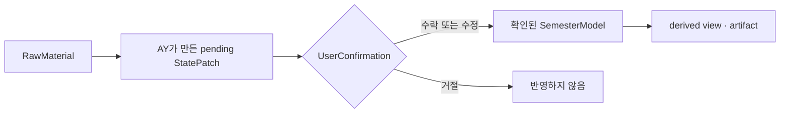

# AY-PLE Product Brief

작성일: 2026-07-07

최종 업데이트: 2026-07-11

상태: 내부 아키텍처 재정렬

## 한 줄 요약

**AY-PLE(에이플)는 대학생이 한 학기 자료를 AY(에이)와 함께 정리하고, 원본 근거를 확인한 뒤 믿을 수 있는 학기 정보로 반영하는 local-first 학업 앱이다.**

AY-PLE는 새로운 범용 Agent framework를 만드는 제품이 아니다. 일반적인 Codex 사용 방식 위에 학기 작업공간, 반복 가능한 학업 작업, 자료 선택, 구조화된 변경 제안, 사용자 검토를 얇게 더한다. 실행 엔진은 Codex이고, AY는 그 실행 능력을 학생이 이해할 수 있는 언어와 화면으로 제공하는 제품 속 상호작용 주체다.

학생에게 보이는 UI는 `자료`, `선택한 자료`, `변경 제안`, `반영됨`처럼 친숙한 말을 사용한다. `RawMaterial`, `StatePatch`, `UserConfirmation`, `SemesterModel` 같은 용어는 제품 내부의 정확한 경계를 설명할 때만 사용한다.

## 제품이 해결하는 문제

대학생의 학기 자료는 LMS 공지, 강의계획서, PDF, PPTX, HWP/HWPX, 이미지, 메모, 녹음처럼 서로 다른 형식으로 흩어진다. 학생은 자료를 저장한 뒤에도 과제명, 마감, 제출 방식, 시험 일정 같은 내용을 다시 읽고 연결해 캘린더·메모·할 일 앱으로 옮겨야 한다.

**AY-PLE가 해결하는 핵심 문제는 흩어진 `RawMaterial`을 근거가 연결된 `StatePatch`로 바꾸고, 학생이 확인한 결과만 `SemesterModel`에 반영하는 것이다.**

| 문제 | 현재 행동 | AY-PLE의 역할 |
| --- | --- | --- |
| 자료가 여러 형식과 위치에 흩어짐 | 파일을 하나씩 열고 사람이 다시 읽는다. | Codex의 파일 접근과 Skills를 학업 작업에 맞게 구성한다. |
| AI 결과를 그대로 믿기 어려움 | 답변을 다시 원문과 대조한다. | 각 변경 제안에 `EvidenceRef`를 연결한다. |
| 대화 결과가 학기 운영 정보로 남지 않음 | 답변을 다른 앱에 다시 옮긴다. | 확인된 변경만 `SemesterModel`에 반영한다. |
| 반복 작업마다 긴 지시를 다시 작성함 | 파일과 프롬프트를 매번 준비한다. | `ModelingRecipe`로 반복 가능한 작업 구성을 제공한다. |
| Agent와 앱이 서로 다른 맥락을 봄 | GUI 조작과 대화가 따로 움직인다. | 앱의 선택과 상태를 필요한 Codex 입력으로 번역한다. |

## 대표 사용자 시나리오

| 순서 | 학생이 하는 일 | AY-PLE가 하는 일 | 결과 |
| --- | --- | --- | --- |
| 1 | `문제해결글쓰기` 과목의 LMS 공지와 강의계획서를 학기 폴더에 둔다. | 기존 파일을 `RawMaterial`로 인식하고 원본을 그대로 보존한다. | 사용자의 학기 폴더가 작업 기준이 된다. |
| 2 | 이번에 정리할 두 자료를 고른다. | 선택을 현재 실행에만 유효한 source mention으로 준비한다. | 이번 작업의 우선 입력이 명확해진다. |
| 3 | `선택한 자료 정리하기`를 누른다. | 작업에 맞는 Skill, prompt template, arguments, output schema를 조합해 Codex `turn`을 시작한다. | AY가 과제 후보와 근거를 찾는다. |
| 4 | 원본과 변경 제안을 함께 본다. | `Assignment` 변경을 `StatePatch`로 보여주고 값마다 `EvidenceRef`를 연결한다. | 학생이 제안이 어디에서 왔는지 확인한다. |
| 5 | 수락·수정·거절한다. | `UserConfirmation`을 기록하고 수락하거나 수정한 내용만 `SemesterModel`에 반영한다. | 확인된 학기 정보가 남는다. |
| 6 | 이후 학기 정보를 조회한다. | 확인된 모델에서 일정, 요약 문서 같은 화면을 파생한다. | 원본을 다시 뒤지지 않고 학기를 운영한다. |

## 제품 경계

AY-PLE의 역할은 Codex를 대체하는 것이 아니라 Codex의 일반적인 사용 경험에 학업 제품 경계를 더하는 것이다.

| 층 | 책임 | 책임이 아닌 것 |
| --- | --- | --- |
| 사용자 | 학기 폴더를 사용하고, 작업을 요청하며, 자료와 변경 제안을 확인한다. | Codex protocol이나 프롬프트 조합을 직접 관리할 필요가 없다. |
| AY-PLE App | 학기 작업공간 activation, RawMaterial 참조·metadata, action UI, 자료 선택, 실행 조합, `StatePatch`, 검토와 저장을 소유한다. | 사용자 원본 bytes나 모든 학업 작업을 별도 workflow engine으로 소유하지 않는다. |
| AY | 학생과 소통하고 Codex의 작업을 학업 맥락에서 설명하며 변경을 제안한다. | 사용자 대신 학업 사실을 확정하지 않는다. |
| Codex | `Thread`, `Turn`, `Item`, Skills, 파일·도구 사용, built-in Memories를 제공하는 실행 엔진이다. | `SemesterModel`이나 학업 검토 정책의 source of truth가 아니다. |

다음 항목은 의도적으로 만들지 않는다.

- 학기·과목·`ModelingRun`마다 고정된 `Thread`를 배정하는 별도 세션 topology
- Codex 위에 다시 만드는 범용 Agent orchestration framework
- 모든 GUI 이벤트를 한 규칙으로 Agent에게 보내는 generic event bus
- built-in Memories를 대체하는 외부 장기 기억 시스템
- 두 번째 실행 엔진 요구가 생기기 전의 다중 엔진 공통 추상화

## 학기 작업공간과 Codex 사용 모델

### 작업공간

- 학생이 선택한 **N학년 N학기 폴더**를 Codex의 `cwd`로 사용한다.
- 전공·교양·과목 하위 폴더처럼 사용자가 이미 가진 구조를 존중한다.
- MVP는 `sources/`, `courses/`, `.ay-ple/runs/` 같은 고정 디렉터리 구조를 사용자에게 요구하지 않는다.
- 앱이 관리해야 하는 인덱스와 구조화 상태는 사용자 자료와 구분해 저장하되, 실제 경로와 DB schema는 구현 PRD에서 정한다.

### Codex 환경

- app-managed `CODEX_HOME`과 `CODEX_SQLITE_HOME`을 사용해 config, 인증, session과 memory 상태를 일반 Codex 환경과 분리한다. inherited host Skill·plugin discovery까지 자동으로 격리된다고 가정하지 않는다.
- Codex의 `AGENTS.md` 로딩 규칙, Skills protocol, built-in Memories를 그대로 사용한다.
- MVP에서는 `[features] memories = true`와 `[memories]`의 생성·사용 설정을 명시적으로 켜고 실제 eligibility·auth smoke를 통과한 뒤 Memories를 보조 맥락으로 사용한다. 모든 작업이 memory를 생성한다고 보장하지 않는다.
- Memories, `Thread` history, compaction 결과는 편의를 위한 Agent context다. 확인된 학기 정보의 source of truth가 아니다.
- 학기 전환 시 memory 초기화·보관·장기 기억 분류 UX는 후속 과제로 남긴다.

### `Thread`, `Turn`, `Item`

`Thread`, `Turn`, `Item`은 Codex의 실행 단위이며 학업 도메인 개체가 아니다. `Course = Thread`, `Semester = Thread`, `ModelingRun = Thread` 같은 고정 대응을 두지 않는다. 사용자는 일반적인 Codex 사용처럼 필요할 때 새 작업을 시작하거나 기존 대화를 이어갈 수 있고, 제품은 실행 결과를 `ModelingRun` receipt를 통해 학업 상태 변경과 연결한다.

## 학업 작업의 실행 조합

### `ModelingRecipe`

반복 가능한 학업 작업은 다음 조합으로 표현한다.

```text
ModelingRecipe
  = Skill
  + PromptTemplate
  + ArgumentSchema
  + OutputSchema
```

예를 들어 “선택한 공지에서 과제 정보를 찾아라”라는 작업은 자료 intake나 Agent lifecycle 자체를 Skill로 만드는 것이 아니다. 과제 공지 정리라는 학업 목적에 맞는 Skill과 `{{course}}`, `{{semester}}` 같은 placeholder를 가진 `PromptTemplate`, 필요한 arguments, 예상 `StatePatch` 구조를 하나의 recipe로 묶는다.

실제 호출은 recipe에 실행 시점의 맥락을 더한다.

```text
native thread 선택 단계
  = thread/start 또는 thread/resume
  -> selected threadId

invocation input
  = ModelingRecipe
  + arguments
  + selected-source mentions
  + verified semester cwd
  + selected threadId
  + optional confirmed-state reference

invocation input
  -> turn/start(threadId)
  -> ModelingRun receipt
  -> structured result
```

| 제품 개념 | Codex 입력으로의 번역 |
| --- | --- |
| 학생이 선택한 action | 해당 `ModelingRecipe` 선택 |
| prompt arguments | `PromptTemplate`의 placeholder를 채운 text |
| `SourceSelection` | 실행 시점의 `UserInput` mention 목록 |
| 작업 Skill | `UserInput` skill reference |
| 학기 범위 | 새 thread의 `thread/start.cwd`; 재사용 thread는 sticky `cwd`가 현재 SemesterWorkspace와 같을 때만 사용 |
| 구조화 결과 계약 | `turn/start`의 `outputSchema` |

`SourceSelection`은 장기 저장되는 학업 개체가 아니다. GUI에서 선택한 자료가 특정 invocation에 들어갈 때 만들어지는 일시적인 입력이다. 자료를 선택했다는 사실만으로 진행 중 Agent에게 자동 전달하지 않는다. `turn/start.cwd`는 이후 turn에도 유지되므로 기존 thread의 workspace가 다르면 override하지 않고 새 thread를 시작한다.

### `ModelingRun`

`ModelingRun`은 AY-PLE의 workflow orchestrator가 아니라 **한 invocation의 실행 receipt**다. 최소한 다음 사실을 연결한다.

| 정보 | 목적 |
| --- | --- |
| recipe와 version | 어떤 작업 구성을 실행했는지 식별 |
| arguments와 source references | 어떤 입력으로 실행했는지 식별 |
| opaque execution reference | Codex 통합 내부의 native 실행과 연결하되 raw identifier를 제품 계약으로 노출하지 않음 |
| 시작·완료 상태와 오류 | 실행 결과 추적 |
| structured output reference | 생성된 `StatePatch` 후보와 연결 |

raw protocol event나 전체 prompt를 제품 감사 기록에 복제하는 것은 `ModelingRun`의 목적이 아니다. 개발자용 Runtime Diagnostic History와 제품 실행 receipt는 분리한다.

## 핵심 도메인 모델

### 학업 도메인

| 개체 | 의미 |
| --- | --- |
| `SemesterWorkspace` | 현재 학생과 AY가 마주하는 N학년 N학기 폴더와 앱의 학기 범위 |
| `Course` | 현재 학기의 과목 |
| `RawMaterial` | 원본 공지, 계획서, 문서, 이미지, 메모 등 AY가 읽을 수 있는 자료 |
| `EvidenceRef` | 제안한 값이 나온 `RawMaterial`의 위치 또는 인용 범위 |
| `Assignment` | 과목이 요구하는 과제, 제출물, 활동 |
| `Exam` | 시험, 퀴즈, 중간고사, 기말고사 |
| `SemesterModel` | 사용자가 확인한 학업 사실의 구조화된 기준 상태 |
| `StatePatch` | `SemesterModel`에 반영하기 전에 검토하는 구조화 변경 제안 |
| `UserConfirmation` | `StatePatch`를 수락·수정·거절한 사용자의 결정 기록 |

`TrustedState`는 별도의 다섯 단계 state container가 아니다. `UserConfirmation`을 거쳐 `SemesterModel`에 반영된 정보가 갖는 권한 상태를 가리킨다.

### 실행과 제품 지원 개념

| 개념 | 의미 |
| --- | --- |
| `ModelingRecipe` | 학업 action을 Codex 입력으로 구성하는 재사용 가능한 정의 |
| `SourceSelection` | 한 invocation에 source mention으로 넣을 자료의 일시적인 선택 |
| `ModelingRun` | invocation과 native Codex 실행, 구조화 결과를 연결하는 얇은 receipt |
| `Review` | pending `StatePatch`와 근거를 보고 결정하는 제품 경험 |

이 실행 개념들은 `Assignment`나 `Course` 같은 학업 도메인 개체와 같은 층에 두지 않는다.

## 상태와 검토 경계

AY-PLE의 상태 흐름은 다섯 개의 저장 container가 아니라 다음 한 방향 경계로 설명한다.



- AY의 초안은 별도 `DraftState` aggregate가 아니라 pending `StatePatch`다.
- 검토 대기 목록은 별도 `ReviewState` source of truth가 아니라 pending patch를 보여주는 projection이다.
- 일정, 타임라인, 읽기용 문서는 별도 `ArtifactState`가 아니라 확인된 모델에서 파생되는 view 또는 artifact다.
- AY의 메시지, 도구 호출, 진행 event는 실행 관측 정보이며 자동으로 학기 상태가 되지 않는다.
- `UserConfirmation` 없이 `SemesterModel`의 확인된 학업 사실을 바꾸지 않는다.

`StatePatch`의 MVP 최소 계약은 다음과 같다. 세부 DB 필드와 위험도·추천안·대안 표현은 구현과 UX 검증에서 확정한다.

| 필드 | 의미 |
| --- | --- |
| `id` | 변경 제안 식별자 |
| source references | 연결된 `RawMaterial`과 `EvidenceRef` |
| changes | 추가·수정·삭제할 canonical academic facts |
| summary | 학생이 이해할 변경 설명 |
| run reference | 제안을 만든 `ModelingRun`과의 상관관계 |

하나의 학업 사실은 하나의 canonical owner만 가진다. 예를 들어 과제 마감은 `Assignment.dueAt`, 시험 시간은 `Exam.startsAt`과 `Exam.endsAt`이 소유한다. 후속 타임라인이나 할 일 화면은 값을 복제하지 않고 그 owner를 읽는다.

## App Interaction Surface와 AY Interaction Surface

하나의 사용자 행동이 앱과 AY에 서로 다른 효과를 낼 수 있다. 모든 행동을 Agent에게 즉시 보내거나, 반대로 앱 안에만 가두는 기본 규칙은 두지 않는다. 기능별 의도와 Codex capability를 함께 보고 case by case로 정한다.

| 사용자 행동 | App 효과 | AY/Codex 효과 |
| --- | --- | --- |
| 자료를 선택하고 action 시작 | 선택과 recipe arguments를 준비 | mention과 Skill을 포함해 새 `turn` 시작 |
| 진행 중 작업에 명시적으로 정정 전달 | UI와 대상 실행의 상관관계를 기록 | 해당 `turn`에 `turn/steer` 전달 |
| 진행 중 작업 중단 | 중단 요청과 완료 상태 표시 | `turn/interrupt` 사용 |
| AY가 표시한 질문에 답변 | pending 질문을 해소 | 해당 protocol request에 응답하거나 대상 `turn`에 전달 |
| drag-and-drop으로 새 자료 추가 | 파일 metadata와 앱 인덱스 갱신 | 진행 중 작업을 방해하지 않으며, 후속 invocation에서 mention 가능 |
| 변경 제안 수락·수정·거절 | `UserConfirmation`과 `SemesterModel` 갱신 | 필요할 때 다음 `turn`의 맥락으로 사용하며 자동 steer하지 않음 |

이 표는 출발점이다. hook, MCP, experimental API를 포함한 추가 전달 방식은 제거하지 않고 capability roadmap에 남기되, 실제 사용자 기능이 필요할 때 native Codex 구현을 확인한 뒤 선택한다.

## Source of Truth

| 정보 | Source of truth | 비고 |
| --- | --- | --- |
| 원본 자료 | 사용자의 학기 폴더에 있는 `RawMaterial` | 앱이 임의로 이동·삭제하지 않는다. |
| 확인된 학업 사실 | 앱이 관리하는 `SemesterModel` | 정확한 저장 기술과 경로는 구현 PRD에서 정한다. |
| 변경 제안 | `StatePatch` | 반영하려는 내용과 원본 근거, 실행 receipt를 참조한다. |
| 사용자 결정 | `UserConfirmation` | 수락·수정·거절을 기록하며 제안의 해소 상태는 이 기록에서 파생한다. |
| Agent 보조 맥락 | Codex `Thread`, built-in Memories, `AGENTS.md` | 학업 사실의 SSOT가 아니다. |
| Assignment/Exam 기반 일정·마감 view와 정리 문서 | `SemesterModel`에서 파생 | 필요하면 다시 생성할 수 있어야 한다. 별도 학생 행동·할 일 모델의 owner는 아직 정하지 않는다. |
| Runtime 진단 | developer-only Runtime Diagnostic History | 제품 감사 기록과 분리하고 제품 재사용 전 redaction/allowlist가 필요하다. |

## MVP 범위

4주 캠프 범위는 전체 학기 관리 제품을 완성하는 것이 아니라 Assignment 하나로 첫 수직 흐름을 증명한다.

> 학생이 학기 폴더에서 과제 자료를 선택하고 action을 시작하면, AY가 Codex-native 입력 조합으로 자료를 읽어 근거 있는 `Assignment` 변경 제안을 만들고, 학생이 확인한 결과만 `SemesterModel`에 반영한다.

| 분류 | 항목 |
| --- | --- |
| 핵심 | 학기 폴더 `cwd`, app-managed `CODEX_HOME`·`CODEX_SQLITE_HOME` pair, TXT `RawMaterial`, 과목과 `Assignment`, source mentions, `ModelingRecipe`, thread 선택과 Codex `turn/start(threadId)`, `ModelingRun` receipt, `EvidenceRef`, `StatePatch`, `Review`, `UserConfirmation`, 확인된 `SemesterModel` |
| 지원 capability | 실행 진행 표시, 필요한 범위의 `turn/steer`·`turn/interrupt`, Codex approval과 제품 Review의 구분 |
| 다음 vertical 후보 | PDF, `Exam`, 여러 과목 공지에서 시험·과제 표 만들기, derived timeline, 읽기용 정리 문서, 학기 상태 질의 |
| 후속 아키텍처 | 학기 rollover와 memory 관리 UX, history·rollback, hook/MCP/experimental API 활용, 안정화된 source locator, 앱 저장 schema |
| 제외 | 과제 정답 대행, 시험 답안 대행, 자동 제출, LMS 우회 자동화, 클라우드 동기화, 다중 실행 엔진 추상화 |

`ScheduleEvent`는 Assignment나 Exam이 소유하지 않는 독립 시간 사실이라는 경계만 정했으며 첫 vertical 범위 밖이다. `MarkdownProjection`과 `WorkspaceHistory`도 정의된 후속 개념이지만 이번 범위에는 포함하지 않는다. 학생의 할 일, timeline, 공지 해석, 불확실성 표현처럼 아직 이름과 owner가 정해지지 않은 모델은 실제 다음 vertical에서 의미를 확인한 뒤 도입한다.

## Skills와 script 확장 원칙

Skills는 앱 lifecycle을 흉내 내는 단계명이 아니라 사용자가 반복해서 수행할 **학업 action의 처리 전략**을 담는다.

| Recipe 예시 | Skill이 안내할 전략 | 예상 결과 |
| --- | --- | --- |
| 선택한 공지에서 과제 정리 | 과제명, 마감, 제출 방식과 근거 찾기 | `Assignment` `StatePatch` |
| 선택한 자료에서 시험 정보 정리 | 시험 일시, 범위, 근거 찾기 | 후속 `Exam` `StatePatch` |
| 모든 과목 공지에서 마감표 만들기 | 여러 과목 자료 탐색과 확인된 상태 비교 | 여러 patch 또는 derived view |

PDF text extraction, OCR, HWP/HWPX parsing처럼 결정적으로 처리할 수 있는 작업은 local script로 제공할 수 있다. Skill은 언제 무엇을 사용하고 어떤 결과를 만들어야 하는지 안내하고, script는 특정 변환을 재현 가능하게 수행한다.

## 보안과 학업 윤리

- `RawMaterial`과 `SemesterModel`은 사용자의 로컬 환경에 둔다.
- app-managed `CODEX_HOME`과 앱 관리 상태는 Git에 포함하지 않는다.
- 브라우저가 Codex App Server나 파일시스템에 직접 접근하지 않고 local companion server가 중재한다.
- RawMaterial 원본은 자동 수정하거나 삭제하지 않는다.
- Codex command/file approval과 학업 정보에 대한 `UserConfirmation`은 별개의 권한 경계다.
- Runtime Diagnostic History에는 prompt, 경로, 도구 인자, raw protocol처럼 민감한 값이 포함될 수 있다. 제품 기록으로 복사하지 않고, 재사용 전 allowlist·redaction·retention 정책을 적용한다.
- 과제 정답 생성, 시험 답안 대행, 자동 제출, 학교 정책을 우회하는 자동화는 제품 범위 밖이다.

## 성공 기준

| 기준 | 확인할 질문 |
| --- | --- |
| 작업 시작 가능성 | 학생이 학기 폴더와 자료를 선택하고 action을 시작할 수 있는가? |
| 실행 조합의 명확성 | recipe, arguments, mentions, `cwd`, output contract가 한 실행으로 재현 가능한가? |
| 근거 연결 | 제안한 과제 값이 원본 위치와 연결되는가? |
| 검토 경계 | 확인하지 않은 값이 `SemesterModel`에 들어가지 않는가? |
| 정정 가능성 | 학생이 제안을 쉽게 수정하거나 거절할 수 있는가? |
| 재사용 가치 | 확인된 학기 정보를 이후 조회와 derived view에 사용할 수 있는가? |
| 한 학기 지속성 | app-managed Codex 환경과 학기 상태를 학기 동안 계속 사용할 수 있는가? |

## 주요 리스크

| 리스크 | 대응 |
| --- | --- |
| 단순 AI 파일 분류기로 보임 | 반복 가능한 학업 action, 근거, 검토 후 지속되는 `SemesterModel`을 함께 보여준다. |
| Codex wrapper로만 보임 | Codex가 소유하지 않는 학업 상태와 사용자 확인 경계를 분명히 한다. |
| 제품 추상화가 Codex를 다시 구현함 | native AGENTS.md, Skills, Memories, `Thread`·`Turn`을 그대로 사용하고 필요한 부분만 번역한다. |
| Agent context를 학업 사실로 오해함 | Memories와 thread history를 편의 맥락으로 한정하고 `SemesterModel`과 분리한다. |
| 사실 중복 저장 | `Assignment`, `Exam` 같은 canonical owner에서 derived view를 만든다. |
| 기능마다 전달 방식이 제각각이라 혼란 | 사용자 의도, 즉시성, 대상 `turn`, correlation 필요성을 capability matrix로 기록한다. |
| 초기에 미래 모델을 과도하게 확정함 | 다음 vertical에서 증명되기 전까지 deferred candidate로 유지한다. |

## 열린 질문

| 질문 | 결정 시점 |
| --- | --- |
| `SemesterModel`, `StatePatch`, `ModelingRun`의 실제 저장 schema와 위치는 무엇인가? | 첫 제품 vertical 구현 PRD |
| `EvidenceRef` locator는 quote부터 시작할지 page/range까지 포함할지? | TXT/PDF parser 범위 결정 |
| 첫 `Thread` UX는 새 작업과 기존 작업 이어가기를 어떻게 보여줄지? | native Codex task UI 연결 시점 |
| built-in Memories의 학기 rollover를 어떻게 안내할지? | 한 학기 MVP 이후 |
| 첫 후속 derived view는 일정, 과제표, 읽기용 문서 중 무엇인지? | Assignment vertical 검증 이후 |
| hook, MCP, experimental API는 어떤 실제 상호작용에서 필요한지? | capability별 구현 triage |
