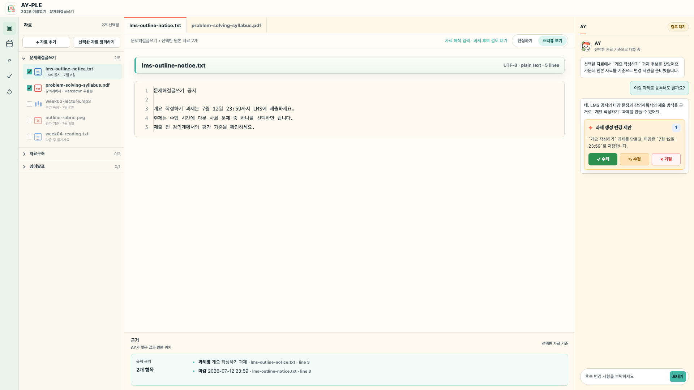
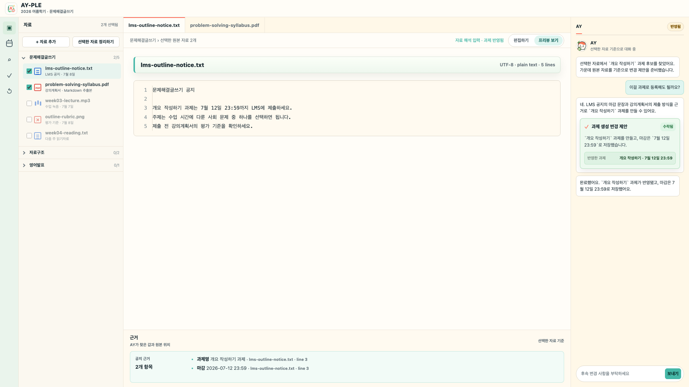

# AY-PLE Review Workspace Scenario

작성일: 2026-07-08

최종 업데이트: 2026-07-22

분류: 활성

성숙도: 초안

관련 문서: [CONTEXT.md](../../CONTEXT.md), [AY-PLE Product Brief](ay-ple-product-brief.md), [AY-PLE Design System Direction](ay-ple-design-system.md), [ADR 0002](../adr/0002-use-first-class-academic-objects-with-derived-operational-views.md), [ADR 0007](../adr/0007-use-native-codex-composition-for-product-actions.md), [Codex-native 제품 작업 조합](../architecture/codex-native-product-composition.md)

## 목적

이 문서는 existing current-v2 workspace에서 실행하는 첫 학업 action의 사용자 시나리오와 검토 화면 구조를 정리한다. 핵심 방향은 **원본 자료와 변경 제안을 함께 보고, 학생이 확인한 내용만 학기 정보에 반영하는 작업공간**이다.

이 시나리오는 학생용 화면을 검증한다. Runtime과 native Codex mapping을 다시 정의하지 않으며, 화면의 action과 자료 선택은 ModelingInvocation의 제품 입력으로 사용되고 결과는 `StatePatch`로 검토된다.

Landing·public command·Browser OAuth·새 workspace setup 여정은 제거됐다. 이 문서는 현재 개인 dogfood에서 유지하는 자료 선택·Course·Assignment Review 경험만 다룬다.

학생이 이해해야 할 한 문장은 다음과 같다.

> AY가 학생이 선택한 원본 자료에서 과제 정보를 찾고, 학생이 근거를 확인하면 그 내용이 학기 정보에 반영된다.

## 시작 전 조건

| 조건 | 의미 |
| --- | --- |
| current workspace ready | chooser가 넘긴 existing current-v2 workspace를 읽고 mutation 가능한 상태다. Adopted `Semester Ready`와 같은 뜻이 아니다. |
| 검토된 자료 반입 | 외부 폴더나 자료 묶음을 `ImportSource`로 검토한 뒤 이 action에서 사용할 자료가 workspace 안의 `RawMaterial`로 반입됐다. |
| Course 맥락 | current-v2 aggregate가 이 scenario의 Course identity와 자료 관계를 소유한다. |

ImportSource 분석·mapping·migration 자체는 이 Review scenario가 아니라 별도 import journey가 소유한다.

## 대표 시나리오

| 항목 | 내용 |
| --- | --- |
| 학기 작업공간 | chooser로 연 existing current-v2 workspace |
| 과목 | 문제해결글쓰기 |
| 자료 | TXT로 저장한 LMS 공지와 강의계획서 발췌문 |
| action | 선택한 자료에서 과제 정보 정리 |
| 발견한 학업 객체 | 과제: 개요 작성하기 |
| 발견한 마감 | 2026-07-12 23:59 KST |
| 추가 확인이 필요한 정보 | 제출 방식, 상세 요구사항, 평가 반영 여부 |
| AY 제안 | 과제 생성, 마감 저장, 원본 근거 연결 |
| 학생 응답 | 변경 제안을 수락·수정 요청·거절 |
| 수락 후 결과 | 확인된 과제 정보가 `SemesterModel`에 반영되고 AY가 결과를 설명 |

## 사용자 흐름

| 단계 | 학생이 보는 경험 | App이 맡는 일 | AY/Codex가 맡는 일 |
| --- | --- | --- | --- |
| 1. 자료 선택 | 이번 action에 사용할 자료를 고른다. | 일시적인 `SourceSelection`을 준비한다. | 아직 진행 중 작업에는 전달하지 않는다. |
| 2. action 시작 | `선택한 자료 정리하기`를 누른다. | Recipe version, arguments, `SourceSelection`과 활성 SemesterWorkspace 맥락으로 `ModelingInvocation`을 만든다. | 선택 자료를 읽는 작업을 시작한다. |
| 3. 변경 제안 준비 | AY의 진행을 보고 같은 작업 안에서 Review 질문이 나타날 때까지 기다린다. | 하나의 product proposal contract를 검증하고 stable identity의 pending `StatePatch`를 준비한다. | 과제 후보와 field-level `EvidenceRef`를 찾아 변경을 제안하고 학생 확인을 기다린다. |
| 4. Review | 원본과 변경 제안을 비교한다. | 제안과 근거를 같은 검토 맥락에 보여준다. | 제안의 이유를 학생 언어로 설명한다. |
| 5. Review 응답 | 수락·수정 요청·거절한다. | exact active patch 결합을 확인한다. 수락과 거절은 `UserConfirmation`을 확정하고 수락만 반영한다. 수정 요청은 unsettled feedback으로 남긴다. | 같은 진행 중 작업에 답변을 받아 수정 요청이면 replacement patch를 제안하고, 결정이 확정되면 결과를 설명한다. |
| 6. 결과 확인 | 저장된 과제명과 마감을 확인한다. | `반영됨` UI와 확인된 값을 보여준다. | 반영된 결과를 짧게 브리핑한다. |

`ModelingInvocation`과 `ModelingRun`은 이 화면의 독립적인 학업 단계가 아니다. Run은 2단계 요청의 한 실행 시도와 결과를 연결하는 내부 receipt이며 `StatePatch`·Review lifecycle을 소유하지 않는다. 이 시나리오의 patch는 available origin provenance만 선택적으로 연결한다.

수정 요청은 확인된 `SemesterModel`을 직접 편집하거나 `UserConfirmation`을 settle하지 않는다. feedback을 반영한 replacement `StatePatch`가 준비되면 이전 제안은 superseded 기록으로 남고 학생은 새 active 제안 하나와 근거를 다시 검토한다.

`검토 대기`는 reload·restart를 넘는 durable inbox를 뜻하지 않는다. 학생이 답하기 전에 진행 중 작업의 continuity를 잃으면 아무것도 반영하지 않은 `중단됨`으로 정산하고 사용자의 explicit retry로 새 action을 시작한다. 반대로 settled `UserConfirmation`과 apply outcome은 앱이 소유하며, `반영됨` 상태와 확인된 `SemesterModel`은 이후 다시 열 수 있다.

## 화면 구조

검토 화면은 **하나의 선택 자료 검토 화면 + 두 UI 상태 + 선택 자료 탭**으로 잡는다. `검토 대기`와 `반영됨`은 사용자에게 현재 상황을 설명하는 UI 상태이지, 별도 `ReviewState`·`TrustedState` 저장 container가 아니다.

Visual tone은 다크 IDE가 아니라 밝은 학업 작업공간을 따른다. 자료를 읽는 중심 영역은 종이 같은 밝은 surface로 두고, AY 대화 패널은 warm surface와 말풍선으로 보여준다.

| UI 상태 | 목적 | 표시 |
| --- | --- | --- |
| 검토 대기 | pending `StatePatch`를 학생이 확인하기 전 | 원본 자료 preview, 변경 제안, 근거, 수락·수정 요청·거절 |
| 반영됨 | 수락 `UserConfirmation`과 apply 이후 결과를 확인 | 반영된 과제명과 마감, 근거, AY의 결과 브리핑 |

| 탭 | 목적 | 표시 |
| --- | --- | --- |
| 선택 자료 탭 | 현재 ModelingInvocation의 입력으로 선택한 원본 자료를 확인 | `lms-outline-notice.txt`, `problem-solving-syllabus.txt` |

### Layout

```text
┌────────────────────────────────────────────────────────────────────────────┐
│ header: AY-PLE · 2026 여름학기 · 문제해결글쓰기                       │
├────────────────────────────────────────────────────────────────────────────┤
│ 왼쪽 메뉴    │ 자료 목록        │ 선택 자료 탭 + 원본 미리보기    │ 대화 패널    │
│              │ 과목별 자료      │ txt 원문 / syllabus preview      │ 변경 제안    │
│              │                  │ 편집하기 / 프리뷰 보기           │              │
│              │ 선택 상태        │ 하단 근거 패널                  │ 반영 안내    │
│              │ 정리 action      │ 원본 자료 중심                  │ 입력창       │
└────────────────────────────────────────────────────────────────────────────┘
```

## Panel Contract

| 영역 | 역할 | 핵심 문구 |
| --- | --- | --- |
| 상단 상태 | 화면의 사용자-facing 상태를 보여준다. 내부 실행 상태는 그대로 노출하지 않는다. | `AY-PLE`, `검토 대기`, `반영됨` |
| 자료 목록 | 활성 workspace에 반입된 `RawMaterial`을 Course 맥락에서 보고 이번 action에 사용할 파일을 고른다. | `문제해결글쓰기`, `lms-outline-notice.txt`, `2개 선택됨` |
| 선택 자료 탭 | 선택한 원본 자료를 미리보기로 전환한다. | `lms-outline-notice.txt`, `problem-solving-syllabus.txt` |
| 원본 미리보기 | 선택 자료 원문 또는 추출본을 확인한다. | `편집하기`, `프리뷰 보기` |
| 하단 근거 패널 | AY가 제안한 값과 원본 위치를 preview와 분리해 보여준다. | `마감`, `제출 방식`, `line 3`, `TXT 원문` |
| 대화 패널 | 같은 검토 맥락에서 변경 제안과 수락 후 안내를 보여준다. | `개요 작성하기 과제를 만들까요?`, `마감은 7월 12일 23:59로 저장했어요.` |

## 실행 경계와 화면의 대응

| 화면 요소 | 제품 의미 | App 내부 대응 |
| --- | --- | --- |
| `선택한 자료 정리하기` | 학생에게 보이는 action | Recipe version 선택 |
| 과목·학기와 체크된 파일 | 이번 요청의 입력과 작업 범위 | `ModelingInvocation` 구성 |
| action에 약속된 처리법과 결과 구조 | 재사용 작업 계약 | `ModelingRecipe` |
| 실행 상태 | 한 실행 시도 추적 | 내부 `ModelingRun` receipt |

자료를 체크했다는 이유만으로 진행 중 작업에 자동 전달하지 않는다. 외부 파일이나 폴더의 drag-and-drop은 `ImportSource`를 제시하는 별도 반입 여정이며, 검토 없이 현재 workspace의 `RawMaterial`이나 action 입력이 되지 않는다. 이미 반입된 자료를 새 action의 입력으로 사용하거나 사용자가 현재 작업에 명시적으로 정정을 보낼 때만 전달 여부를 판단한다. Native mapping은 [Codex-native 제품 작업 조합](../architecture/codex-native-product-composition.md)을 따른다.

## Canonical과 Derived

첫 scenario에서 canonical로 확정하는 학업 정보는 `Assignment`와 그 근거다. 후속 운영 화면의 타입과 저장 방식은 아직 고정하지 않는다.

| UI 요소 | 분류 | 학생이 수정할 때 |
| --- | --- | --- |
| 과제 | canonical academic object | `Assignment` field를 바꾸는 `StatePatch` 생성 |
| 과제 마감 | canonical academic fact | `Assignment.dueAt` 수정 제안 생성 |
| 근거 연결 | field-level evidence | `EvidenceRef` 수정 또는 source 재확인 |
| 검토 대기 카드 | pending patch projection | `StatePatch`를 수락·수정 요청·거절 |
| 타임라인 표시 | deferred derived view | source object인 `Assignment`를 고친 뒤 다시 파생 |
| 읽기용 정리 문서 | deferred artifact | `SemesterModel`을 고친 뒤 다시 생성 |

과제 마감은 `Assignment.dueAt` 한 곳이 소유한다. 타임라인이나 후속 할 일 화면을 만들더라도 마감을 별도로 복제해 서로 다른 값이 생기게 하지 않는다.

## Prototype Copy

학생용 UI는 개발자 용어를 그대로 번역하지 않고 비개발자 대학생에게 익숙한 말을 쓴다. 브랜드명, 파일명, 확장자 같은 고유 문자열은 유지한다.

| 내부 개념 | UI alias | 학생용 문구 |
| --- | --- | --- |
| `Assignment` | 과제 | `개요 작성하기 과제` |
| `StatePatch` | 변경 제안 | `변경 제안 1개 준비됨` |
| `EvidenceRef` | 근거 | `"2026년 7월 12일 23:59 KST(Asia/Seoul)" → 마감` |
| `SourceSelection` | 선택한 자료 | `2개 선택됨` |
| `ModelingInvocation` | 자료 정리 action | `선택한 자료 정리하기` |
| pending patch | 검토 대기 | `검토 대기` |
| confirmed `SemesterModel` 반영 | 반영됨 | `반영됨` |
| `Assignment.dueAt` | 과제 마감 | `마감은 과제 정보에서 관리돼요` |

`ModelingRecipe`, `ModelingInvocation`, `ModelingRun`과 raw Codex 용어는 일반 학생에게 보여줄 제품 copy가 아니다.

## Prototype Scope

| 포함 | 이유 |
| --- | --- |
| 선택 자료 검토 화면 | 자료, 원본, 변경 제안을 한 맥락에서 보여준다. |
| 자료 목록과 체크 상태 | 이번 action의 입력 자료를 학생이 명시적으로 고른다. |
| 선택 자료 탭 | AY가 어떤 원본을 읽었는지 바로 확인한다. |
| 원본 미리보기와 보기 모드 | AY의 해석과 원본을 분리해 비교한다. |
| 하단 근거 패널 | field-level evidence를 원본 위치와 연결한다. |
| 과제 생성 변경 제안 | `StatePatch`와 사용자 확인 경계를 보여준다. |
| 반영 결과 브리핑 | 수락 후 저장된 과제명과 마감을 학생 언어로 설명한다. |
| 오른쪽 대화 패널 | 현재 action과 Review 맥락에서 AY와 대화한다. |

| 제외 | 이유 |
| --- | --- |
| 전체 월·주 calendar view | 첫 prototype은 source-grounded 과제 생성과 Review에 집중한다. |
| 전체 task manager | task domain은 다음 vertical에서 필요성을 검증한다. |
| 시험 detail screen | 첫 prototype은 Assignment flow를 선명하게 보여준다. |
| 읽기용 문서 editor | derived artifact의 위치와 형식을 아직 고정하지 않는다. |
| 긴 전체 대화 기록 | 현재 검토 항목에 묶인 side panel이면 화면 가설을 검증할 수 있다. |
| 고정 thread/session 관리 UI | 학기·과목·실행과 `Thread`를 고정 대응하지 않는다. |
| WorkspaceHistory UI | history와 rollback은 후속 capability다. |
| LMS login과 `ImportSource` 반입 flow | 이 문서는 반입이 끝난 뒤의 Review를 다루며 intake·migration은 별도 post-Ready journey가 소유한다. |
| 외부 calendar sync | MVP 제외 범위다. |
| 자동 제출 또는 과제 정답 생성 | 제품 방향과 Academic Integrity에 맞지 않는다. |

## 아직 구체화하지 않은 표면

아래 항목은 제거하지 않지만 현재 핵심 domain model로 고정하지 않는다. 첫 Assignment vertical 이후 실제 사용자 가치와 canonical owner를 확인해 도입한다.

| 표면 | 현재 결정 | 다음 단계 |
| --- | --- | --- |
| 타임라인 | 확인된 과제 마감에서 파생할 수 있다. | 과제 상세 또는 운영 화면 중 위치 검증 |
| 학생의 할 일 | 과제와 별도의 학생 행동이 필요한지 아직 미확정이다. | 실제 task use case부터 정의 |
| 읽기용 정리 문서 | 확인된 학기 정보에서 생성하는 artifact 후보 | 파일 형식과 화면 위치 검증 |
| 학기 상태 질의 | Codex의 대화 능력과 확인된 정보를 함께 사용할 수 있다. | 첫 대표 질문과 context 구성 검증 |

## 검증 산출물

Browser-native prototype은 검토 중심 학업 작업공간의 화면 구조와 자료 선택부터 반영까지의 전환을 확인한 역사적 산출물이다. 현재 First Assignment vertical은 실제 파일·Codex 실행·Review·durable confirmed state까지 구현했지만, prototype을 제품 구현의 컴포넌트 구조나 최종 화면 범위로 간주하지 않는다. 현재 구현 사실은 [Codex Chat 구현 지도](../architecture/codex-chat-implementation-map.md)가 소유한다.

| 상태 | 실행 링크 | 캡처 asset |
| --- | --- | --- |
| 검토 대기 | [product-flow step 6](../../artifacts/camp-demo/product-flow/index.html?step=6&present=1) | [ay-ple-prototype-review.png](assets/ay-ple-prototype-review.png) |
| 반영됨 | [product-flow step 7](../../artifacts/camp-demo/product-flow/index.html?step=7&present=1) | [ay-ple-prototype-accepted.png](assets/ay-ple-prototype-accepted.png) |





## 제출 산출물 매핑

| 제출 기준 | 확인할 위치 |
| --- | --- |
| 사용자 관점의 동작 시나리오 | [대표 시나리오](#대표-시나리오), [사용자 흐름](#사용자-흐름) |
| 화면 구조와 화면 단위 동작 | [화면 구조](#화면-구조), [Panel Contract](#panel-contract) |
| 핵심 기능 우선 정리 | [AY-PLE Product Brief](ay-ple-product-brief.md#mvp-범위) |
| Browser-native prototype | [검증 산출물](#검증-산출물), [검토 대기](../../artifacts/camp-demo/product-flow/index.html?step=6&present=1), [반영됨](../../artifacts/camp-demo/product-flow/index.html?step=7&present=1) |
| 피드백 반영 | [Prototype Notes](../../artifacts/camp-demo/product-flow/design-notes.md#피드백-반영-기록) |

## Prototype Artifact

실제 위치:

```text
artifacts/camp-demo/product-flow/index.html
artifacts/camp-demo/product-flow/demo.css
artifacts/camp-demo/product-flow/demo.js
```

[통합 prototype 열기](../../artifacts/camp-demo/product-flow/index.html?step=1&present=1) · [검토 대기 상태 열기](../../artifacts/camp-demo/product-flow/index.html?step=6&present=1) · [반영됨 상태 열기](../../artifacts/camp-demo/product-flow/index.html?step=7&present=1)

이 prototype은 throwaway artifact다. Product Brief에는 제품 원칙만 남기고 실제 제품 구현의 컴포넌트 구조로 간주하지 않는다. Prototype의 질문, 탭별 의도, 피드백 후 판정은 [prototype notes](../../artifacts/camp-demo/product-flow/design-notes.md)에 둔다.

1주차 static prototype에는 PDF 파일명이 시각 예시로 남아 있지만, 첫 실제 제품 vertical의 입력 범위는 TXT다. 이 시각 예시는 PDF parsing 지원을 뜻하지 않는다.

## 남은 질문

| 질문 | 다음 단계 |
| --- | --- |
| `EvidenceRef` locator를 quote 중심으로 시작할지 page/range까지 포함할지? | TXT/PDF parser scope와 함께 결정 |
| 직접 field 단위 editor가 필요한가? | First vertical은 Plan-style free-form 수정 요청만 제공하고 실제 필요가 확인되면 후속 prototype으로 검증 |
| 첫 후속 derived view를 타임라인, 과제표, 읽기용 문서 중 무엇으로 둘지? | Assignment vertical 사용자 검증 이후 결정 |
| 새 action과 기존 Codex 대화를 이어가는 선택을 UI에 어떻게 표현할지? | native thread UX 연결 시 검증 |
| 진행 중 명시적 정정을 side panel에서 어떤 작업에 연결할지? | 해당 상호작용을 구현하는 제품 vertical에서 검증 |
