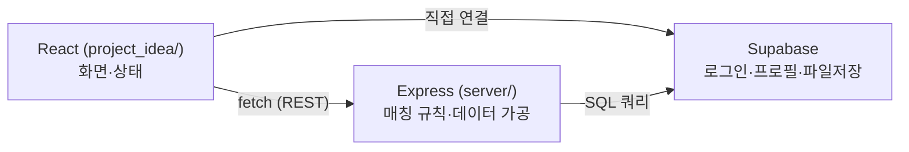
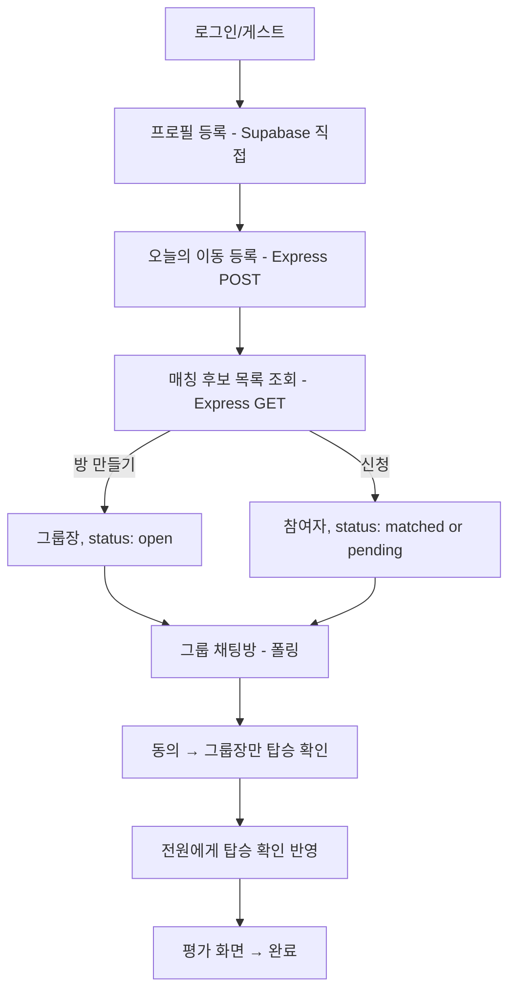
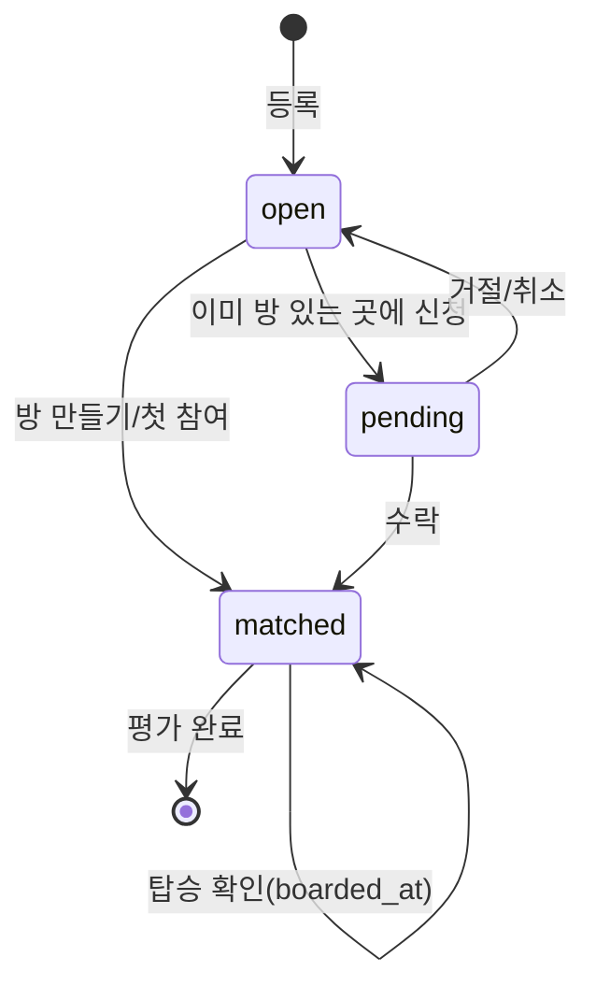

# RideSplit 프로젝트 총정리

AI Agent Challenge 4주 프로젝트(RideSplit) 전체를 한 파일로 정리한 문서. 프로젝트가 무엇인지, 어떻게 흘러가는지, 그 과정에서 어떤 개념들을 실제로 만졌는지, 그리고 시간 관계상 대충 넘어간 부분까지 담았다. 세부 자료는 하단 "다른 문서" 링크 참고.

---

## 1. 이 프로젝트는 무엇인가

**문제**: 대학생은 이동이 필요한 순간 주변에 방향이 겹치는 동행자가 있어도 이를 알 방법이 없어서, 택시 동승으로 비용을 아낄 기회를 놓친다.

**핵심 기능 2개**
- **매칭 알고리즘** — 같은 거점 조합 + 희망 시간 ±10분 이내인 학생을 자동으로 묶어 후보로 보여줌.
- **동행 신청/수락 플로우** — 후보 확인 → 신청 → 수락 → 그룹 확정까지.

나머지(닉네임, 사진, 평점, 노쇼 페널티, 성별 필터, 그룹 채팅, 탑승 확인)는 전부 이 2개를 보조하는 기능. 헷갈리면 "이게 매칭에 도움 되나, 확정 절차에 도움 되나"로 분류하면 됨.

---

## 2. 아키텍처

- **React** = 화면. props/state로 UI를 그림.
- **Express** = 서버. 클라이언트를 못 믿으니(누구나 요청을 조작할 수 있음), "이게 허용되는 행동인지" 같은 중요한 판단은 여기서 함.
- **Supabase** = DB + Auth. 특이하게 **로그인/프로필 저장은 Express를 안 거치고 브라우저가 Supabase에 직접 연결**하고, 매칭 관련 데이터(등록/방/채팅)는 Express를 거침 — Auth SDK는 원래 클라이언트 직접 사용을 전제로 설계됐고, 매칭 로직은 서버 판단이 필요해서 나뉜 것.

---

## 3. 전체 사용자 흐름

---

## 4. 도메인 상태 흐름 — 이 프로젝트를 가장 압축해서 보여주는 그림

거의 모든 화면·라우트는 `matching_requests` 테이블 행 하나가 아래 상태를 거쳐가는 걸 다룬다:

RegisterScreen은 `[*]→open`, CandidateListScreen은 `open→matched/pending`, GroupChatScreen은 `matched` 상태를 들여다보고 `boarded_at`을 찍음, RatingScreen은 `matched→[*]`. 오늘 고친 버그들도 전부 "이 상태도의 화살표 하나(방장 혼자인 경계 케이스)를 놓쳤다"로 설명됨.

---

## 5. 요청 하나의 전체 여정 (예: "등록하기" 클릭)

버튼 클릭 → `handleSubmit()` 실행 → `fetch()` → 네트워크(HTTPS) → Express 라우트 도착 → Supabase 쿼리 → DB 응답 → Express가 JSON으로 응답 → React가 콜백 호출 → `setState` → 화면 다시 그려짐.

이 흐름을 손으로 그려보면, 버그가 어느 지점에서 났는지 감이 빨리 잡힘. 이번 세션의 버그 수정도 전부 "이 여정 어디서 끊겼는지" 찾는 과정이었음.

---

## 6. 이번 프로젝트에서 실제로 만진 개념들

아래는 전부 이 저장소 코드에 실제로 있거나, 오늘 직접 겪은(재현/디버깅한) 것만 남긴 목록이다. "알아두면 좋은 일반 개념"이었지 실제로 쓰지 않은 것들(GraphQL, WebSocket, TypeScript 등)은 7번 "대충 넘어간 부분"으로 옮겼다.

### 큰 틀 (Scope-level frameworks)
- **SDLC(소프트웨어 개발 생명주기)** — 기획→설계→구현→테스트→배포→운영. `docs/checklist.md`의 주차별 구성이 이 순서.
- **계층형 아키텍처(Layered Architecture)** — 위 2번 그림. React/Express/Supabase가 각자 자기 책임만 짐.
- **도메인 객체의 상태 흐름** — 위 4번. `matching_requests`의 `status`/`is_leader`/`group_id`가 실제 구현.
- **요청 생명주기(Request Lifecycle)** — 위 5번. 실제 디버깅할 때 이 흐름을 따라가며 원인을 찾음.
- **책임 소유권 지도(Ownership Map)** — App.jsx의 `joinedCandidate.groupCount`를 누가 최신으로 유지할지 헷갈려서 오늘 버그가 났던 것 자체가 이 개념의 실제 사례.

### 프론트엔드 (React) — `project_idea/src/`
- 컴포넌트, props, state(`useState`), 파생 상태(derived state — `GroupChatScreen.jsx`의 `count`/`canBoard`), state 끌어올리기(`App.jsx`가 `registration`/`joinedCandidate`를 들고 있는 것)
- `useEffect` + 폴링(polling, `setInterval`) + cleanup(`clearInterval`) — `GroupChatScreen.jsx`, `CandidateListScreen.jsx`
- `useRef`로 "한 번만 실행" 가드 — `App.jsx`의 `hasResumedRef`
- 제어 컴포넌트(controlled input), 네이티브 HTML5 폼 검증(`required`, `pattern`, `minLength`) — `LoginScreen.jsx`
- 접근성(ARIA: `role="switch"`, `role="radio"`, `aria-pressed`, `aria-checked`, `aria-labelledby`)
- 낙관적 UI 업데이트(optimistic update) — `handleConsent`, `handleBoard`
- localStorage를 이용한 임시 데이터 전달 — 회원가입 후 이메일 인증 전 프로필 임시 저장, 마지막 등록 정보 기억
- 리스트의 `key` prop — `candidates.map((c) => 
)`
- 콜백 props로 자식→부모 통신 — `onUpdateCandidate`, `onJoin`, `onSubmit`

### 백엔드 (Express/Node) — `server/`
- REST 라우트, 라우트 등록 순서(`/mine/:userId`를 `/:id`보다 먼저 등록해야 하는 이유)
- 미들웨어 등록 순서(`cors` → `express.json` → 라우터)
- 여러 라우트가 공유하는 헬퍼 함수(`applyRatingSubmission`, `sweepAutoRatings`)
- `async`/`await`로 DB 호출 기다리기
- 인가(authorization)를 서버에서도 재확인 — `/board`의 `is_leader` 403 체크(프론트에서 버튼만 숨기는 걸로 안 끝냄)

### 데이터베이스/Supabase
- 관계형 테이블, 외래키 제약(foreign key constraint), 참조 무결성 — 오늘 테스트 계정 정리하다 `ratings`가 `matching_requests`를 참조 중이라 삭제가 막혔던 것으로 실제로 겪음
- Row Level Security(RLS) — `USING` vs `WITH CHECK`, public 버킷도 SELECT 정책이 필요했던 것
- service-role key vs anon key(최소 권한 원칙)
- N+1 쿼리 패턴 — `matching_requests`를 먼저 가져오고 관련 `users`를 따로 가져와 JS에서 병합
- upsert(`ProfileScreen.jsx`), Map으로 그룹핑(`roomsByKey`), PostgREST의 `.or()` 필터 문법

### 인증/보안
- 인가(authorization) vs 인증(authentication) — 로그인 여부와 "그룹장만 가능" 여부는 다른 문제
- 매직 링크, 익명 인증(anonymous auth, `signInAnonymously`) — 실제 구현된 로그인 방식
- CORS, 프리플라이트 요청 — 오늘 배포 장애의 실제 원인, `curl -X OPTIONS`로 직접 확인함

### API 설계
- REST, JSON
- 웹훅(webhook) — Render의 Deploy Hook을 실제로 마주침

### 배포/인프라
- 빌드타임 vs 런타임 설정 — Vite의 `VITE_` 접두사(빌드에 박힘) vs Render의 `process.env`(실행 시 읽음)
- 프로덕션 브랜치 vs 프리뷰 배포 vs 브랜치 별칭 — 오늘 제일 크게 부딪힌 개념(`ridesplit.vercel.app`이 `main` 기준이라 안 갱신되고, `work` 브랜치 별칭만 최신이었던 것)
- 헬스체크(`/api/health`), 콜드 스타트(Render 무료 플랜에서 실제로 겪음)
- CI/CD의 가장 단순한 형태 — `git push`하면 Render/Vercel이 자동으로 재배포

### 테스트/설계 원칙
- TDD(Red-Green) — `matching.test.js`, `describeCost.test.js`
- 순수 함수(pure function) — `matching.js`, `describeCost.js`를 DB/네트워크 없이 테스트 가능하게 분리
- 단위 테스트만 있고 통합/E2E는 없음 — 라우트·화면은 전부 수동/스크립트로 검증
- 관심사의 분리(separation of concerns) — FE/BE/DB 분리, 가격 로직을 `describeCost.js`로 뽑은 것
- DRY 원칙의 의도적 예외 — `classifyBoarding`을 서버·프론트에 일부러 중복 구현(그룹장 아닌 멤버는 서버 응답을 못 받아서)
- 레이스 컨디션 — 동시 신청 시 정원 초과 가능성, "저장 후 재검증" 임시방편으로 대응
- 유한 상태 기계(FSM)와 상태 조합 누락 — `status` + `is_leader`를 따로 둬서 "방장 혼자인 방" 조합을 세 번이나 놓친 것

---

## 7. 대충 넘어간 부분 / 안 쓴 것 (알고는 있어야 할 것)

**실제로 안 쓴 기술(오늘 얘기는 나눴지만 이 프로젝트엔 없음)**
- **웹소켓/SSE/Supabase Realtime** — 전부 폴링(`setInterval`)으로 대체함. 진짜 실시간은 아니고, 3~5초 텀 동안은 최신 상태가 아닐 수 있음.
- **TypeScript** — 순수 JS만 씀. 이번에 났던 필드명 오타/구조 불일치 버그 중 일부는 TS였으면 컴파일 단계에서 잡혔을 것.
- **Context API, useMemo/useCallback** — props로만 데이터를 내려줬고(prop drilling), 메모이제이션도 안 함. 지금 규모에선 필요 없었음.
- **클라이언트 사이드 라우팅(React Router)** — URL이 안 바뀌고 `step` 숫자로만 화면 전환. 그래서 뒤로가기 버튼을 직접 구현해야 했음.
- **OAuth/SSO, GraphQL** — Supabase Auth는 썼지만 구글 로그인 같은 OAuth 연동은 없음. API도 REST만 쓰고 GraphQL은 안 씀.
- **DB 트랜잭션/락, CASCADE 삭제** — 동시 신청 정원 초과는 "저장 후 재검증"이라는 임시방편으로만 막음. 삭제 순서를 잘못 지키면 외래키 에러가 나는 것도 CASCADE가 없어서(오늘 테스트 계정 정리하다 직접 겪음).
- **입력 검증 라이브러리(zod/joi), 중앙화된 에러 처리, 구조화된 로깅** — 라우트마다 그때그때 `if (error) return res.status(500)...`로 처리함.
- **Docker** — 4주차에 "시간 남으면" 학습용으로 미뤄뒀고 결국 안 함.

**설계상 아쉬웠던 지점**
- **상태 설계가 꼬여있었음** — `status` + `is_leader` + `group_id`를 따로 두다 보니 "방장 혼자인 방" 경계 케이스에서 버그가 세 번 반복됨.
- **자동 테스트는 순수 로직만** — Express 라우트나 React 컴포넌트는 자동 테스트 없이 손으로 검증함.
- **인증 내부 동작은 블랙박스** — Supabase가 다 해줘서 JWT/세션이 실제로 어떻게 도는지는 깊게 안 봄.

**의도적으로 미룬 기능(README에 기록됨)**
- **평가 점수 차등 차감 미구현** — 노쇼는 큰 차감 있지만, 지각 소폭 차감/임박 취소 대폭 차감은 없음.
- **마이페이지 이용 이력 화면 없음** — 평가 기록은 쌓이지만 조회 화면이 없음.

---

## 8. 다른 문서

- [docs/workflow.md](workflow.md) — 4주간 반복한 두 작업 순서(신규 기능 개발 / 버그 수정)와, 문제 생겼을 때 재확인할 단계
- [docs/agent-collaboration.md](agent-collaboration.md) — 기획~배포 단계별로 쓴 도구, 사람 결정 vs AI 수행 구분
- [docs/concepts-by-file.md](concepts-by-file.md) — 파일별로 코드 줄과 함께 짚은 개념 (이 문서보다 더 세밀한 버전)
- [README.md](../README.md) — 아키텍처 다이어그램, 알려진 운영 제약
- [docs/plan.md](plan.md) — 최초 기획서(문제정의, 화면 흐름, 리스크 대응)
- [docs/checklist.md](checklist.md) — 4주간 백로그(P0/P1/P2)
