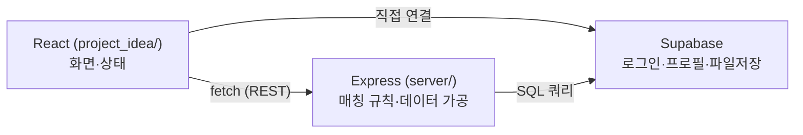
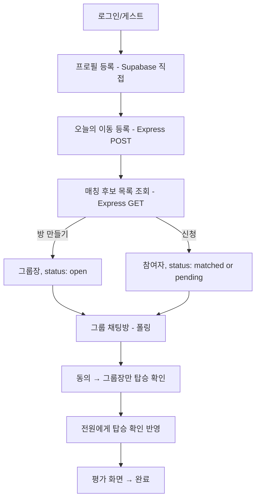
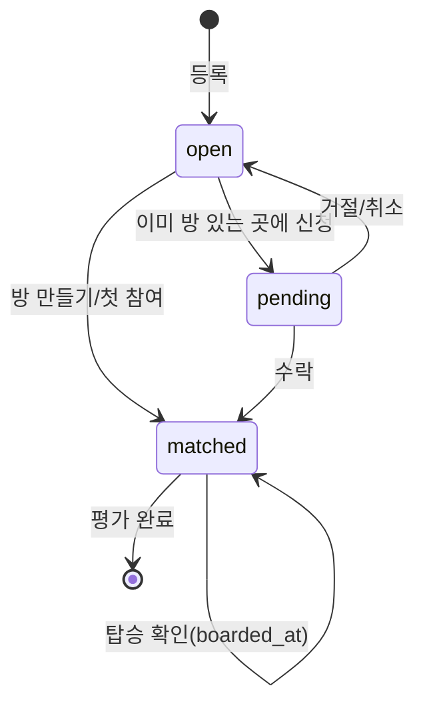

# RideSplit 프로젝트 총정리

AI Agent Challenge 4주 프로젝트(RideSplit) 전체를 한 파일로 정리한 문서. 프로젝트가 무엇인지, 어떻게 흘러가는지, 그 과정에서 어떤 개념들을 실제로 만졌는지, 그리고 시간 관계상 대충 넘어간 부분까지 담았다. 세부 자료는 하단 "다른 문서" 링크 참고.

---

## 1. 이 프로젝트는 무엇인가

**문제**: 대학생은 이동이 필요한 순간 주변에 방향이 겹치는 동행자가 있어도 이를 알 방법이 없어서, 택시 동승으로 비용을 아낄 기회를 놓친다.

**핵심 기능 2개**
- **매칭 알고리즘** — 같은 거점 조합 + 희망 시간 ±10분 이내인 학생을 자동으로 묶어 후보로 보여줌.
- **동행 신청/수락 플로우** — 후보 확인 → 신청 → 수락 → 그룹 확정까지.

나머지(닉네임, 사진, 평점, 노쇼 페널티, 성별 필터, 그룹 채팅, 탑승 확인)는 전부 이 2개를 보조하는 기능. 헷갈리면 "이게 매칭에 도움 되나, 확정 절차에 도움 되나"로 분류하면 됨.

---

## 2. 아키텍처

- **React** = 화면. props/state로 UI를 그림.
- **Express** = 서버. 클라이언트를 못 믿으니(누구나 요청을 조작할 수 있음), "이게 허용되는 행동인지" 같은 중요한 판단은 여기서 함.
- **Supabase** = DB + Auth. 특이하게 **로그인/프로필 저장은 Express를 안 거치고 브라우저가 Supabase에 직접 연결**하고, 매칭 관련 데이터(등록/방/채팅)는 Express를 거침 — Auth SDK는 원래 클라이언트 직접 사용을 전제로 설계됐고, 매칭 로직은 서버 판단이 필요해서 나뉜 것.

---

## 3. 전체 사용자 흐름

---

## 4. 도메인 상태 흐름 — 이 프로젝트를 가장 압축해서 보여주는 그림

거의 모든 화면·라우트는 `matching_requests` 테이블 행 하나가 아래 상태를 거쳐가는 걸 다룬다:

RegisterScreen은 `[*]→open`, CandidateListScreen은 `open→matched/pending`, GroupChatScreen은 `matched` 상태를 들여다보고 `boarded_at`을 찍음, RatingScreen은 `matched→[*]`. 오늘 고친 버그들도 전부 "이 상태도의 화살표 하나(방장 혼자인 경계 케이스)를 놓쳤다"로 설명됨.

---

## 5. 요청 하나의 전체 여정 (예: "등록하기" 클릭)

버튼 클릭 → `handleSubmit()` 실행 → `fetch()` → 네트워크(HTTPS) → Express 라우트 도착 → Supabase 쿼리 → DB 응답 → Express가 JSON으로 응답 → React가 콜백 호출 → `setState` → 화면 다시 그려짐.

이 흐름을 손으로 그려보면, 버그가 어느 지점에서 났는지 감이 빨리 잡힘. 이번 세션의 버그 수정도 전부 "이 여정 어디서 끊겼는지" 찾는 과정이었음.

---

## 6. 이번 프로젝트에서 실제로 만진 개념들

### 큰 틀 (Scope-level frameworks)
- **SDLC(소프트웨어 개발 생명주기)** — 기획→설계→구현→테스트→배포→운영. `docs/checklist.md`의 주차별 구성이 이 순서.
- **계층형 아키텍처(Layered Architecture)** — 위 2번 그림. 각 층은 자기 책임만 짐.
- **도메인 객체의 상태 흐름** — 위 4번. 이 프로젝트를 한 장으로 압축하는 방법.
- **요청 생명주기(Request Lifecycle)** — 위 5번. 층을 수직으로 관통하는 시선.
- **책임 소유권 지도(Ownership Map)** — FE는 입력/화면 상태, BE는 규칙/인가, DB는 영속성/무결성, Auth는 신원. 오늘 버그들은 대부분 "누가 최신값의 주인인지"가 헷갈려서 남.

### 프론트엔드 (React)
- 컴포넌트, props, state(`useState`), 파생 상태(derived state), state 끌어올리기(lifting state up)
- `useEffect` + 폴링(polling) + cleanup(뒷정리)
- `useRef`로 "한 번만 실행" 가드
- 제어 컴포넌트(controlled input), 네이티브 HTML5 폼 검증
- 접근성(ARIA: `role="switch"`, `role="radio"`, `aria-pressed`, `aria-checked`)
- 낙관적 UI 업데이트(optimistic update)
- localStorage를 이용한 임시 데이터 전달
- 가상 DOM/재조정(reconciliation), 리스트의 `key` prop
- 재렌더링 트리거(자기 state / props / 부모 재렌더링)
- 컴포넌트 생명주기(mount/update/unmount)
- Context API(지금은 안 씀, prop drilling 대안), 메모이제이션(useMemo/useCallback)
- 클라이언트 사이드 라우팅(안 씀 — step 숫자로 화면 전환), HMR(Hot Module Replacement)
- 타입스크립트(안 씀 — 썼으면 잡혔을 버그들이 있었음)

### 백엔드 (Express/Node)
- REST 라우트, 라우트 등록 순서(`/mine/:userId`를 `/:id`보다 먼저)
- 미들웨어 체인(`cors`, `express.json`)과 `next()`
- 여러 라우트가 공유하는 헬퍼 함수(`applyRatingSubmission`, `sweepAutoRatings`)
- 이벤트 루프/논블로킹 I/O, `async`/`await`
- 무상태(stateless) 서버 — 수평 확장이 쉬운 이유
- 중앙화된 에러 처리(지금은 라우트마다 반복 — 개선 여지)
- 입력 검증 라이브러리(zod/joi — 지금은 안 씀)
- 로깅(지금은 구조화 안 됨)
- 인가(authorization)를 서버에서도 재확인(403 체크)

### 데이터베이스/Supabase
- 관계형 테이블, 외래키 제약(foreign key constraint), 참조 무결성, CASCADE 삭제(지금 없음)
- Row Level Security(RLS) — `USING` vs `WITH CHECK`
- service-role key vs anon key(최소 권한 원칙)
- N+1 쿼리 문제, 관계형 데이터를 JS에서 직접 병합
- upsert, Map으로 그룹핑, PostgREST의 `.or()` 필터 문법

### 인증/보안
- 인가(authorization) vs 인증(authentication)
- OAuth/OAuth2, SSO, 액세스 토큰 vs 리프레시 토큰, JWT
- 매직 링크, 익명 인증(anonymous auth), API 키
- CORS, 동일 출처 정책(Same-Origin Policy), 프리플라이트 요청
- XSS, CSRF

### 네트워킹
- IP 주소, 도메인 네임, DNS, 포트, 소켓
- TCP vs UDP
- HTTP, HTTPS, TLS/SSL, 인증서
- HTTP 메서드, 상태 코드, 헤더, 바디, 쿼리 스트링, 쿠키/세션
- 폴링, 롱 폴링, 웹소켓(WebSocket), SSE(Server-Sent Events)
- 지연시간(latency), RTT, 캐시, CDN, 압축(gzip/brotli), HTTP/1.1 vs 2 vs 3, 커넥션 풀링

### API 설계
- REST, GraphQL, RPC, JSON
- 웹훅(webhook) — Render의 Deploy Hook이 실제 예
- 페이지네이션, 레이트 리밋, 콘텐츠 협상

### 배포/인프라
- 빌드타임 vs 런타임 설정(Vite `VITE_` 접두사 vs Render `process.env`)
- 프로덕션 브랜치 vs 프리뷰 배포 vs 브랜치 별칭 — 오늘 제일 크게 부딪힌 개념
- 리버스 프록시, 로드 밸런서, 헬스체크, 콜드 스타트, 서버리스
- 컨테이너/Docker(4주차에 "시간 남으면"으로 미룸)
- 블루-그린/카나리 배포, CI/CD

### 테스트/설계 원칙
- TDD(Red-Green), 순수 함수(pure function)/참조 투명성
- 단위 테스트 vs 통합 테스트 vs E2E(이 프로젝트는 단위 테스트만 있고 나머지는 수동 검증)
- 관심사의 분리(separation of concerns), DRY 원칙과 그 예외(의도적 중복)
- 레이스 컨디션, 원자성(atomicity)/트랜잭션, 멱등성(idempotency)
- 유한 상태 기계(FSM) — 상태를 여러 변수로 쪼갤 때의 함정

---

## 7. 대충 넘어간 부분 (알고는 있어야 할 것)

- **폴링은 진짜 실시간이 아님** — 3~5초 텀 동안은 최신 상태가 아닐 수 있음. Supabase Realtime(웹소켓 기반)을 썼으면 대체 가능했음.
- **동시성 제어가 정교하지 않음** — "저장 후 재검증해서 초과하면 되돌리기"라는 임시방편. 진짜 DB 트랜잭션/락은 아님.
- **상태 설계가 꼬여있었음** — `status` + `is_leader` + `group_id`를 따로 두다 보니 "방장 혼자인 방" 경계 케이스에서 버그가 세 번 반복됨.
- **자동 테스트는 순수 로직만** — Express 라우트나 React 컴포넌트는 자동 테스트 없이 손으로 검증함.
- **인증 내부 동작은 블랙박스** — Supabase가 다 해줘서 실제로 어떻게 도는지는 깊게 안 봄.
- **평가 점수 차등 차감 미구현** — 노쇼는 큰 차감 있지만, 지각 소폭 차감/임박 취소 대폭 차감은 없음(README에 기록).
- **마이페이지 이용 이력 화면 없음** — 평가 기록은 쌓이지만 조회 화면이 없음(README에 기록).

---

## 8. 다른 문서

- [docs/workflow.md](workflow.md) — 4주간 반복한 두 작업 순서(신규 기능 개발 / 버그 수정)와, 문제 생겼을 때 재확인할 단계
- [docs/agent-collaboration.md](agent-collaboration.md) — 기획~배포 단계별로 쓴 도구, 사람 결정 vs AI 수행 구분
- [docs/concepts-by-file.md](concepts-by-file.md) — 파일별로 코드 줄과 함께 짚은 개념 (이 문서보다 더 세밀한 버전)
- [README.md](../README.md) — 아키텍처 다이어그램, 알려진 운영 제약
- [docs/plan.md](plan.md) — 최초 기획서(문제정의, 화면 흐름, 리스크 대응)
- [docs/checklist.md](checklist.md) — 4주간 백로그(P0/P1/P2)
