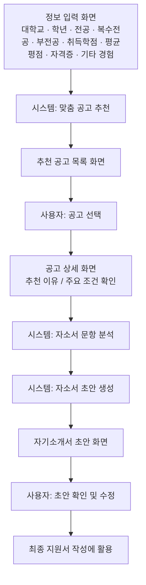
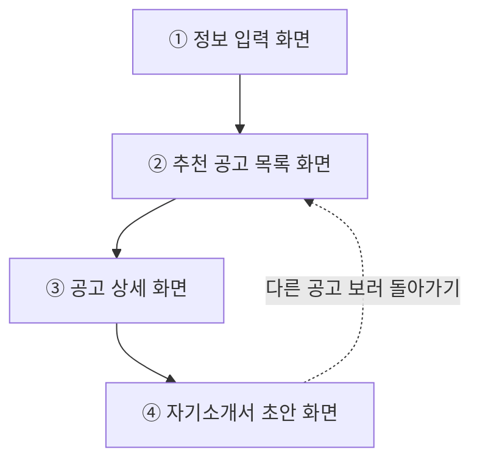

# 화면 흐름 / 화면 목록(IA) / 와이어프레임

> 기획서 원문: [plan.md](./plan.md)
> 브라우저에서 바로 그림으로 보려면: [wireframe.html](../wireframe.html) (인터넷 연결 필요)

## 1. User Flow (사용자 흐름)

`plan.md`의 사용자 시나리오 6단계를 흐름으로 표현.

## 2. IA (화면 목록, Information Architecture)

사용자 흐름을 4개의 화면 단위로 묶었다.

| 화면 | 주요 목적 |
|---|---|
| 정보 입력 화면 | 대학교, 학년, 전공, 복수전공(선택), 부전공(선택), 취득학점, 평균평점, 자격증, 그 외 경험(현장실습, 인턴, 교육) 입력 |
| 추천 공고 목록 화면 | 추천된 공고 리스트 확인 |
| 공고 상세 화면 | 추천 이유, 주요 조건 확인 후 자소서 생성 요청 |
| 자기소개서 초안 화면 | 문항별 분석 결과와 생성된 초안 확인/수정 |

## 3. 와이어프레임 (화면별 주요 UI 요소)

각 화면을 박스로, 화면 안의 주요 UI 요소를 노드로 표현한 대략적인 레이아웃.

```mermaid
flowchart TB
    subgraph S1["① 정보 입력 화면"]
        direction TB
        s1u[["대학교 입력창"]]
        s1g[["학년 선택창"]]
        s1a[["전공 입력창"]]
        s1m[["복수전공 입력창 (선택)"]]
        s1b[["부전공 입력창 (선택)"]]
        s1c1[["취득학점 입력창"]]
        s1c2[["평균평점 입력창"]]
        s1e[["자격증 입력창 (복수 추가 가능, 선택)"]]
        s1f[["그 외 경험 입력창 (현장실습 / 인턴 / 교육 등, 선택)"]]
        s1d(("추천받기 버튼"))
        s1u --> s1g --> s1a --> s1m --> s1b --> s1c1 --> s1c2 --> s1e --> s1f --> s1d
    end

    subgraph S2["② 추천 공고 목록 화면"]
        direction TB
        s2a[["공고 카드: 제목 / 기관 / 마감일"]]
        s2b[["공고 카드: 추천 이유 요약"]]
        s2c[["... 추가 공고 카드"]]
        s2a --> s2b --> s2c
    end

    subgraph S3["③ 공고 상세 화면"]
        direction TB
        s3a[["공고 기본 정보"]]
        s3b[["추천 이유"]]
        s3c[["주요 조건 (자격, 마감일 등)"]]
        s3d(("자소서 초안 생성 버튼"))
        s3a --> s3b --> s3c --> s3d
    end

    subgraph S4["④ 자기소개서 초안 화면"]
        direction TB
        s4a[["문항별 분석 결과"]]
        s4b[["생성된 초안 텍스트"]]
        s4c[["편집 영역"]]
        s4d(("저장 / 완료 버튼"))
        s4a --> s4b --> s4c --> s4d
    end

    S1 --> S2 --> S3 --> S4
```

### 화면별 동작 설명

**① 정보 입력 화면**
- 대학교·학년·전공·취득학점·평균평점은 필수 입력, 복수전공·부전공은 선택 입력이다.
- 자격증은 "추가" 조작으로 여러 개 입력할 수 있다.
- 필수 항목을 입력하지 않고 "추천받기"를 누르면 에러 메시지를 표시하고 화면 이동을 막는다.
- 필수 항목을 모두 입력하고 "추천받기"를 누르면 ② 추천 공고 목록 화면으로 이동한다.

**② 추천 공고 목록 화면**
- 진입 시 ①에서 입력한 정보를 기반으로 추천된 공고 카드 목록을 보여준다.
- 조건에 맞는 공고가 없으면 빈 상태 안내("조건에 맞는 공고가 없습니다")를 보여준다.
- 공고 카드를 클릭하면 ③ 공고 상세 화면으로 이동한다.

**③ 공고 상세 화면**
- 선택한 공고의 기본 정보, 추천 이유, 주요 조건을 보여준다.
- "자소서 초안 생성" 버튼을 누르면 생성이 끝날 때까지 로딩 상태를 표시한 뒤 ④ 자기소개서 초안 화면으로 이동한다.
- 목록으로 돌아가는 링크를 통해 ② 화면으로 돌아갈 수 있다.

**④ 자기소개서 초안 화면**
- 진입 시 문항별 분석 결과와 생성된 초안 텍스트를 함께 보여준다.
- 편집 영역에서 초안 텍스트를 사용자가 직접 수정할 수 있다.
- "저장/완료" 버튼을 누르면 수정한 내용을 저장한다.
- "다른 공고 보러 돌아가기" 링크로 ② 추천 공고 목록 화면으로 돌아갈 수 있다.

---
작성일: 2026-07-07
