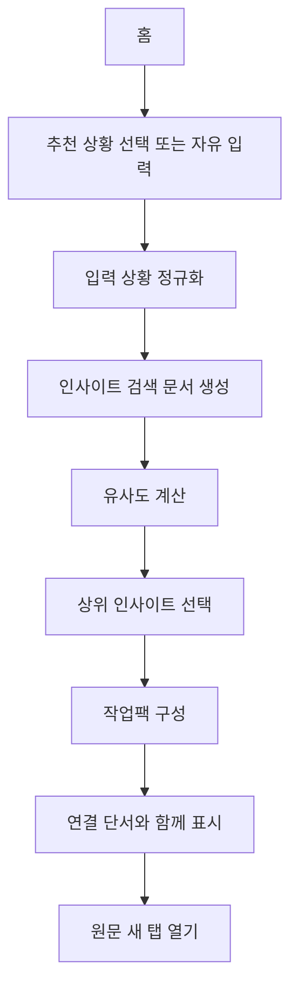

# 꺼내보기 기획

이 문서는 아맞다의 핵심 기능인 `꺼내보기`를 정의한다. 구현 전 기준 문서로 사용하며, 보관함 검색이나 저장 시 카테고리 추천과 혼동하지 않는다.

## 한 줄 정의

`꺼내보기`는 사용자가 입력한 현재 상황과 저장된 인사이트의 유사도를 계산해, 지금 다시 쓸 만한 자료를 작업팩 형태로 재구성하는 기능이다.

## 문제 인식

사용자는 저장한 자료의 제목, 위치, 정확한 키워드를 잊는다. 하지만 다시 찾는 순간에는 "팀 프로젝트 앱 온보딩", "포트폴리오 정리", "React 폼 구현"처럼 현재 하려는 일은 떠올릴 수 있다.

따라서 `꺼내보기`는 저장물을 많이 보여주는 피드가 아니라, 사용자가 지금 입력한 상황에 가까운 저장물을 다시 연결하는 경험이어야 한다.

## 보관함 검색과의 차이

| 구분        | 보관함 검색                           | 꺼내보기                                       |
| ----------- | ------------------------------------- | ---------------------------------------------- |
| 사용자 의도 | 이미 찾고 싶은 단서가 있다.           | 지금 하는 일에 맞는 자료를 다시 발견하고 싶다. |
| 입력        | 제목, URL, 메모, 카테고리 같은 키워드 | 현재 상황, 목적, 작업 맥락                     |
| 출력        | 조건에 맞는 검색 결과 목록            | 유사도 기반 작업팩                             |
| UX 기준     | 직접 탐색과 관리                      | 다시 활용할 자료 묶음                          |
| 성공 기준   | 원하는 항목을 찾는다.                 | 잊고 있던 자료를 현재 작업에 다시 연결한다.    |

내부 검색 엔진은 일부 공유할 수 있지만, 두 화면의 사용자 경험은 분리한다.

## 저장 분류와의 차이

저장 시 카테고리 추천은 "이 인사이트를 어디에 정리할까"를 돕는다. `꺼내보기`는 "이 인사이트가 지금 하는 일에 도움이 되는가"를 판단한다.

자동 카테고리 분류는 보조 신호로 사용할 수 있지만, `꺼내보기`의 핵심 차별점은 아니다. 카테고리는 유사도 계산의 한 필드일 뿐이며, 사용자가 직접 붙이지 않아도 `꺼내보기`는 동작해야 한다.

## MVP 범위

포함한다:

- 추천 상황 버튼과 자유 입력
- 입력 상황과 인사이트 간 유사도 계산
- 제목, 메모, 카테고리, 도메인, URL, 메타데이터 설명 기반 검색 문서 생성
- 필드별 가중치 기반 랭킹
- 최대 6개 인사이트 반환
- 관련도가 높은 인사이트를 작업팩 형태로 표시
- 각 인사이트에 짧은 연결 단서 표시
- 원문 새 탭 열기
- 결과 없음 상태

포함하지 않는다:

- AI/LLM 추천
- embedding 기반 의미 검색
- 자동 상황 감지
- 캘린더, 행동 추적, 쿠키 기반 추천
- 이메일/푸시 리마인드
- 고정된 `기획 참고`, `디자인 참고`, `구현 참고` 라벨 노출
- 저장 시 자동 카테고리 확정

## 유사도 계산 기준

MVP에서는 `MiniSearch`를 우선 후보로 둔다. 이유는 `꺼내보기`가 오타 보정 중심의 fuzzy search보다 여러 필드의 full-text relevance와 field boosting에 더 가깝기 때문이다. `Fuse.js`는 보관함 검색이나 간단한 fuzzy fallback 후보로 둔다.

검색 문서 필드:

- `title`: 가장 강한 신호
- `memo`: 사용자가 남긴 저장 이유와 맥락
- `categoryNames`: 사용자가 직접 붙인 정리 기준
- `domain`: 출처 단서
- `originalUrl`: URL 단서
- `description`: 메타데이터 설명이 있을 때 보조 신호
- `createdAt`: 동점일 때 최신순 보정

권장 가중치:

| 필드            | 권장 weight | 이유                                      |
| --------------- | ----------: | ----------------------------------------- |
| `title`         |         3.0 | 저장물의 주제를 가장 직접적으로 설명한다. |
| `memo`          |         2.5 | 사용자가 직접 남긴 활용 맥락이다.         |
| `categoryNames` |         1.5 | 수동 정리 기준이지만 핵심 신호는 아니다.  |
| `description`   |         1.2 | 원문 설명을 보조 신호로 쓴다.             |
| `domain`        |         0.8 | 출처를 기억하는 사용자를 돕는다.          |
| `originalUrl`   |         0.5 | URL 일부를 기억하는 경우를 보조한다.      |

랭킹은 검색 점수를 기본으로 하고, 다음 신호를 작은 보정값으로 더할 수 있다.

- 최근 저장된 인사이트
- 이전 `꺼내보기`에서 열린 인사이트
- 같은 상황 입력에서 다시 선택된 인사이트

위 보정 신호는 MVP 이후에 추가한다. MVP에서는 검색 점수와 최신순 보정만 사용해도 된다.

## 작업팩 UX

작업팩은 고정 분류가 아니라 유사도 결과를 현재 상황에 맞게 읽기 쉽게 묶은 표현이다.

권장 섹션:

- `이 상황과 가장 가까운 자료`
- `함께 보면 좋은 자료`
- `예전에 저장해둔 관련 단서`

섹션은 결과 수에 따라 생략할 수 있다. 유저에게 내부 분류 기준을 설명하지 않는다. 예를 들어 `기획 참고`, `디자인 참고`, `구현 참고` 같은 라벨은 내부 판단 기준으로도 강제하지 않고, UI에도 노출하지 않는다.

## 연결 단서

연결 단서는 "왜 이 자료가 현재 상황과 가까운지"를 짧게 보여주는 문장이다. 과장된 추천 이유나 AI처럼 보이는 설명은 피한다.

좋은 연결 단서:

- `제목과 현재 상황이 많이 겹쳐요.`
- `메모에 "온보딩"이 포함되어 있어요.`
- `디자인 카테고리에 저장한 자료예요.`

피해야 할 표현:

- `이 자료가 가장 완벽한 답입니다.`
- `기획 참고로 분류했습니다.`
- `AI가 추천한 최적의 자료입니다.`

## 화면 흐름

## 성공 기준

- 사용자는 정확한 제목을 몰라도 현재 상황을 입력해 관련 인사이트를 다시 찾을 수 있다.
- 결과 화면은 보관함 검색 결과처럼 보이지 않고, 현재 작업에 다시 쓸 자료 묶음처럼 보여야 한다.
- 결과가 적거나 없을 때도 사용자는 다음 행동을 알 수 있어야 한다.
- 저장 시 카테고리 입력이 없어도 제목, 메모, 도메인, 메타데이터만으로 동작해야 한다.
