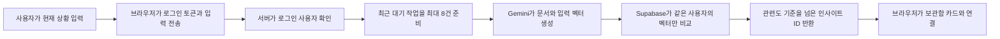

# 검색과 꺼내보기 구현 계약

이 문서는 보관함 검색과 `꺼내보기`의 역할, 데이터 경계와 운영 절차를 설명한다. 제품 범위는 [현재 MVP](https://github.com/ppre1ude/hub/wiki/%ED%98%84%EC%9E%AC-MVP), 기능 판단 기준은 [제품 원칙과 결정](https://github.com/ppre1ude/hub/wiki/%EC%A0%9C%ED%92%88-%EC%9B%90%EC%B9%99%EA%B3%BC-%EA%B2%B0%EC%A0%95)을 따른다.

## 한 줄 정의

`꺼내보기`는 사용자가 지금 하는 일을 짧게 적으면, 같은 단어가 없어도 제목과 메모의 의미가 가까운 인사이트를 찾아주는 기능이다.

## 보관함 검색과의 차이

| 구분        | 보관함 검색                            | 꺼내보기                          |
| ----------- | -------------------------------------- | --------------------------------- |
| 사용자 목적 | 기억나는 단서로 특정 자료 찾기         | 현재 작업에 다시 쓸 자료 발견하기 |
| 입력        | 제목이나 출처처럼 기억나는 단어        | 현재 상황, 목적, 작업 맥락        |
| 검색 대상   | 제목, 메모, 카테고리 이름, 도메인, URL | 제목과 메모                       |
| 실행 위치   | 브라우저                               | 인증된 서버와 Supabase            |
| 검색 방식   | 단어 포함 여부와 필드별 가중치         | Gemini 벡터의 코사인 유사도       |
| 결과 수     | 일치하는 전체 목록                     | 관련도 기준을 넘은 전체 목록      |

보관함 검색은 `react.dev`, `개발`, 제목 일부처럼 사용자가 기억하는 정확한 단서를 찾는다. `꺼내보기`는 `프로젝트 발표 자료를 준비할 때`처럼 저장 당시와 표현이 달라질 수 있는 상황을 해석한다. 두 기능은 목적이 다르므로 결과를 임의로 합치거나, 의미 검색이 실패했을 때 보관함 검색으로 자동 전환하지 않는다.

## 검색에 사용하는 정보

인사이트 하나당 검색 벡터 하나를 만든다. 제목과 메모만 Gemini로 보내며 카테고리, 도메인, URL과 원문 페이지 내용은 제외한다.

메모가 있으면 다음 형식을 사용한다.

```text
title: 폼 오류 처리 방법 | text: 회원가입 화면의 오류 안내를 구현할 때
```

메모가 없으면 제목을 본문에도 사용한다.

```text
title: 폼 오류 처리 방법 | text: 폼 오류 처리 방법
```

사용자 입력은 다음 형식으로 변환한다.

```text
task: search result | query: 회원가입 오류 메시지를 어떻게 보여줄지 고민 중
```

모델은 `gemini-embedding-2`, 벡터는 768차원을 사용한다. 입력 형식과 차원은 `projection_version`으로 관리하며 모델이나 형식이 바뀌면 기존 인사이트를 다시 변환한다.

## 저장과 갱신

검색 벡터와 변환 대기 작업은 원본 인사이트와 분리한다.

```text
insights
  ├─ insight_embedding_jobs
  └─ insight_embeddings
```

- 인사이트를 새로 저장하면 먼저 사용자 데이터 저장을 완료하고 변환 작업을 등록한다.
- 제목이나 메모를 바꾸면 새 변환 작업을 등록한다.
- 카테고리만 바꾸면 벡터를 다시 만들지 않는다.
- 인사이트를 삭제하면 연결된 벡터와 대기 작업도 함께 삭제한다.
- 벡터 테이블에는 검색 원문을 중복 저장하지 않는다.
- `user_id`, 모델, 입력 버전과 원문 해시가 모두 일치할 때만 변환 결과를 저장한다.

Gemini 장애가 링크 저장을 막아서는 안 된다. 검색 준비가 실패한 인사이트는 대기 작업으로 남아 다음 요청이나 기존 데이터 변환에서 다시 처리한다.

## 꺼내보기 요청 흐름



브라우저는 `POST /api/insights/retrieve`에 1~500자의 입력을 보낸다. 서버는 Bearer 토큰으로 사용자를 확인하고, 아직 준비되지 않은 인사이트가 있으면 한 요청에서 최대 8건을 네 개씩 병렬 처리한다. 그다음 입력 벡터를 만들고 같은 사용자의 벡터만 검색한다.

브라우저는 서버가 반환한 인사이트 ID를 이미 불러온 보관함 데이터와 연결한다. 늦게 끝난 이전 요청이 최신 결과를 덮지 않으며, 요청이 실패해도 입력과 직전 결과를 유지한다.

## 결과 기준

- 코사인 유사도 `0.59` 이상인 결과만 반환한다.
- 유사도가 높은 결과를 먼저 반환한다.
- 유사도가 같으면 최근 수정된 인사이트를 먼저 반환한다.
- 관련도 기준을 통과한 결과 수를 별도로 제한하지 않는다.
- 점수와 검색 이유는 화면에 표시하지 않는다.

`0.59`는 합성 실험에서 고른 첫 운영 기준이다. 실제 사용 결과를 확인한 뒤 전체 사용자에게 적용할 값을 사람이 검토해 버전으로 바꾼다. 클릭 기록만으로 검색 기준을 자동 변경하지 않는다.

## 화면 상태

- 추천 상황 예시는 입력 여부와 관계없이 유지한다.
- 결과가 없으면 입력을 유지하고 다른 표현을 시도하도록 안내한다.
- Gemini나 서버 요청이 실패하면 입력을 유지하고 다시 시도할 수 있게 한다.
- 아직 검색 준비가 끝나지 않은 인사이트가 있으면 결과와 함께 짧은 안내를 보여준다.
- 별도의 모델 다운로드나 검색 준비 진행률 화면은 만들지 않는다.
- 검색 실패가 보관함 조회, 저장과 보관함 검색을 막지 않는다.

## 비용과 개인정보

- Gemini API 키와 Supabase service role key는 서버 환경에만 둔다.
- 입력 문장, 제목과 메모를 애플리케이션 로그에 남기지 않는다.
- 보관함 전체를 매 요청마다 보내지 않는다.
- 서비스 내부 월 사용량 한도는 25,000,000 입력 토큰이다.
- 요청 전에 최대 토큰을 예약하고, Gemini 응답의 실제 사용량을 확인할 수 있으면 실제 값으로 정산한다.
- 사용량을 확인할 수 없으면 예약한 최대값으로 정산해 비용 한도를 보수적으로 지킨다.
- 브라우저에 모델, API 키, service role key나 저장된 벡터를 전달하지 않는다.

## 기존 인사이트 변환

배포 전에 기존 보관함의 변환 대상을 먼저 확인한다.

```powershell
npm run retrieve:backfill:submit -- --dry-run
```

이 명령은 미처리 건수만 출력하며 Gemini 작업을 만들지 않는다. 실제 제출은 담당자가 건수와 비용을 확인하고 승인한 뒤에만 실행한다.

```powershell
npm run retrieve:backfill:submit -- --confirm
```

제출 도구는 Gemini 응답 순서와 인사이트를 연결하기 위해 `scripts/retrieve_backfill/state/`에 로컬 제출 기록을 남긴다. 이 기록에는 인사이트 ID, 사용자 ID, 원문 해시와 모델 버전만 있으며 제목, 메모와 API 키는 저장하지 않는다. 디렉터리는 Git에서 제외한다. 결과 반영은 같은 제출 기록이 있는 환경에서 실행한다.

배치 상태와 성공·실패 건수를 먼저 확인한다.

```powershell
npm run retrieve:backfill:apply -- --batch batches/배치-ID --dry-run
```

완료 결과를 저장할 때만 별도 확인값을 사용한다.

```powershell
npm run retrieve:backfill:apply -- --batch batches/배치-ID --confirm
```

768차원 벡터와 제출 당시 원문 해시가 일치하는 결과만 저장한다. 제출 뒤 제목이나 메모가 바뀐 인사이트와 실패 응답은 대기 작업에 남는다. Batch 작업은 최대 48시간 동안 처리될 수 있으므로 비용 예약은 최대 7일 동안 유지한다.

## 검증 범위

구현 검증은 검색 경계와 사용자 격리에 필요한 항목만 다룬다.

- 제목과 메모만 문서 벡터 입력에 포함되는지
- 다른 사용자의 벡터가 검색되지 않는지
- 관련도 기준과 정렬이 적용되고 결과 수를 임의로 자르지 않는지
- 제목이나 메모 변경만 재변환 작업을 만드는지
- Gemini 실패가 저장된 인사이트를 손상시키지 않는지
- 늦게 끝난 이전 요청이 최신 검색 결과를 덮지 않는지
- 배치 제출과 결과 반영이 각각 명시적 확인값 없이는 실행되지 않는지

기존 브라우저 임베딩 모델과 키워드·의미 검색 결합 실험은 반복하지 않는다.

## 이번 범위에서 제외한 것

- 카테고리 이름의 의미 확장
- 보관함 키워드 검색과 의미 검색의 결과 결합
- 생성형 LLM 답변이나 검색 이유 생성
- 브라우저 임베딩 모델
- 원문 페이지 수집과 AI 요약
- 사용자별 검색 가중치와 자동 학습
- 근사 벡터 검색 인덱스
