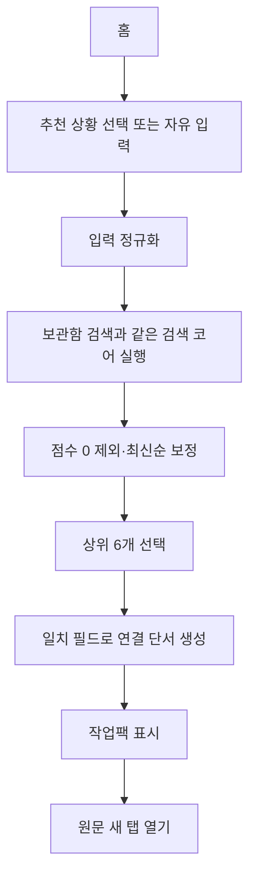

# 검색 구현 계약

이 문서는 보관함 검색과 `꺼내보기`가 공유하는 결정적 검색 코어의 MVP 계약을 정의한다. 제품 범위는 [현재 MVP](https://github.com/ppre1ude/hub/wiki/%ED%98%84%EC%9E%AC-MVP), 자동화 판단 기준은 [제품 원칙과 결정](https://github.com/ppre1ude/hub/wiki/%EC%A0%9C%ED%92%88-%EC%9B%90%EC%B9%99%EA%B3%BC-%EA%B2%B0%EC%A0%95)을 따른다.

## 한 줄 정의

`꺼내보기`는 사용자가 입력한 현재 상황과 로컬에 저장한 인사이트의 최소 텍스트 신호를 비교해, 지금 다시 쓸 만한 자료를 최대 6개로 보여주는 기능이다.

## 이번 MVP에서 검증할 것

- 사용자는 정확한 제목을 몰라도 현재 하려는 일을 표현할 수 있다.
- 사용자가 저장 후 남긴 한 줄 메모는 일반 메타데이터보다 개인적인 활용 맥락을 잘 담는다.
- 서버 메타데이터와 AI가 없어도 제목·메모·단일 카테고리·도메인·URL만으로 의미 있는 재발견이 가능한지 측정한다.
- 검색 품질이 부족할 경우 원인이 정보 부족인지, 랭킹인지, 입력 UX인지 구분한다.

## 보관함 검색과의 관계

| 구분        | 보관함 검색                            | 꺼내보기                             |
| ----------- | -------------------------------------- | ------------------------------------ |
| 사용자 의도 | 기억나는 단서로 특정 자료를 찾는다.    | 현재 작업에 다시 쓸 자료를 발견한다. |
| 입력        | 제목, 메모, 카테고리, 도메인, URL 단서 | 현재 상황, 목적, 작업 맥락           |
| 출력        | 일치하는 전체 결과 목록                | 점수가 높은 최대 6개 작업팩          |
| 연결 설명   | 필요 없음                              | 실제 일치 필드 기반 짧은 연결 단서   |
| 검색 코어   | 공유                                   | 공유                                 |

두 화면은 같은 순수 함수를 사용한다. 사용자 의도와 결과 표현은 각 화면의 목적에 맞게 구분한다.

## 저장 경험과 검색 품질의 균형

URL 저장은 즉시 끝나야 한다. 검색을 위해 사용자가 많은 메타데이터를 입력하게 만들지 않는다.

저장 후 다음 질문 하나만 선택적으로 보여준다.

> 언제 다시 쓰고 싶은 자료인가요?

- 답하지 않아도 저장은 완료된다.
- 답변은 `memo`에 저장한다.
- `memo`는 가장 높은 검색 가중치를 받는다.
- 카테고리는 하나의 짧은 값만 허용하고 별도 CRUD 화면을 만들지 않는다.
- 제목이 없으면 도메인 또는 URL을 fallback으로 사용한다.

## MVP 검색 문서

```ts
type InsightSearchDocument = {
  id: string;
  title: string;
  memo: string;
  category: string;
  domain: string;
  originalUrl: string;
  createdAt: string;
};
```

서버 메타데이터 설명, 썸네일, AI 요약, embedding 값은 MVP 검색 문서에 넣지 않는다.

## 결정적 랭킹 기준

현재 프로토타입의 토큰 정규화와 필드 점수 방식을 작은 순수 함수로 분리한다. 새 검색 라이브러리나 서버 인프라는 기준 검색이 부족하다는 증거가 생기기 전에는 도입하지 않는다.

| 필드          | 권장 weight | 이유                                 |
| ------------- | ----------: | ------------------------------------ |
| `memo`        |         4.0 | 저장 이유와 활용 상황을 직접 담는다. |
| `title`       |         3.0 | 자료의 주제를 직접 설명한다.         |
| `category`    |         2.0 | 사용자가 붙인 단일 카테고리다.       |
| `domain`      |         1.0 | 출처를 기억하는 사용자를 돕는다.     |
| `originalUrl` |         0.5 | URL 일부를 기억하는 경우를 보조한다. |

규칙:

- 검색어와 필드 값은 Unicode `NFKC` 정규화, 소문자 변환, trim 후 문자·숫자가 아닌 경계(`/[^\p{L}\p{N}]+/u`)로 토큰화한다.
- 중복 query token은 하나로 합친다.
- query token과 field token의 완전 일치는 `field weight × 3`, field token의 prefix 일치는 `field weight × 2`, 정규화된 전체 field의 부분 포함은 `field weight × 1`이다.
- 한 query token은 한 필드에서 가장 높은 일치 배수 한 번만 받는다. 서로 다른 query token과 서로 다른 필드의 점수는 합산한다.
- 점수가 같으면 `createdAt` 내림차순, 다시 같으면 `id` 오름차순으로 정렬한다.
- 점수가 0인 인사이트는 `꺼내보기` 결과에서 제외한다.
- 상위 6개만 반환한다.

### 골든 검색 fixture

다음 고정 데이터와 기대 순서는 검색 코어의 계약 테스트로 사용한다. 날짜는 `D > B > A > C` 순으로 최신이다.

| ID  | 제목                 | 메모                      | 카테고리 | 도메인         | originalUrl                          | createdAt              |
| --- | -------------------- | ------------------------- | -------- | -------------- | ------------------------------------ | ---------------------- |
| A   | React 폼 검증        | 팀 프로젝트 로그인 구현   | 개발     | react.dev      | `https://react.dev/learn/forms`      | `2026-07-10T09:00:00Z` |
| B   | 로그인 UX 체크리스트 | 앱 온보딩 디자인 참고     | 디자인   | medium.com     | `https://medium.com/login-ux`        | `2026-07-11T09:00:00Z` |
| C   | 여행 준비            | 제주 숙소                 | 여행     | blog.naver.com | `https://blog.naver.com/travel/jeju` | `2026-07-09T09:00:00Z` |
| D   | WDS 버튼             | 팀 프로젝트 디자인 시스템 | 개발     | wanted.co.kr   | `https://wanted.co.kr/wds/button`    | `2026-07-12T09:00:00Z` |

| query                | 기대 순서 | 검증 의도                           |
| -------------------- | --------- | ----------------------------------- |
| `팀 프로젝트 로그인` | A > D > B | 여러 query token과 필드 가중치 합산 |
| `온보딩 디자인`      | B > D     | 메모의 다중 일치 우선               |
| `react`              | A         | 제목·도메인·URL 단서 합산           |
| `개발`               | D > A     | 동점일 때 최신 저장순               |

실사용 Top-5 평가에서는 검색 결과를 보기 전에 각 query의 목표 인사이트 ID를 한 개 이상 기록한다. 기대 ID 중 하나라도 Top-5에 있으면 성공으로 판정하고, 사후에 목표 ID를 바꾸지 않는다.

## 연결 단서

연결 단서는 실제 일치 정보를 짧게 표현한다. AI가 생성한 추천처럼 보이는 문구는 사용하지 않는다.

예시:

- `메모의 “온보딩”과 현재 상황이 겹쳐요.`
- `제목에서 “React 폼” 단서를 찾았어요.`
- `디자인 카테고리에 저장한 자료예요.`
- `react.dev에서 저장한 자료예요.`

피해야 할 표현:

- `이 자료가 가장 완벽한 답입니다.`
- `AI가 추천한 최적의 자료입니다.`
- `기획 참고로 자동 분류했습니다.`

## 화면 흐름



## 오류와 빈 상태

- 입력이 비어 있으면 추천 상황 예시를 보여준다.
- 결과가 없으면 입력값을 유지하고 단어를 줄이거나 다른 상황을 시도하도록 안내한다.
- 손상된 로컬 데이터는 해당 항목만 제외하고 나머지 인사이트 검색을 유지한다.
- 원문 URL이 유효하지 않으면 새 탭을 열지 않고 카드에서 문제를 안내한다.

## 테스트 기준

자동 테스트:

- 필드별 가중치
- 여러 토큰과 여러 필드 합산
- 대소문자와 공백 정규화
- 동점 최신순
- 점수 0 제외
- 최대 6개 제한
- 연결 단서의 일치 필드
- 결과 없음 상태

사용자 검증:

- 인사이트 20~30개와 상황 쿼리 10개 이상을 준비한다.
- 각 쿼리에서 목표 인사이트가 Top-5에 있는지 기록한다.
- 목표 Top-5 적중률은 70% 이상이다.
- 사용자의 80% 이상이 30초 안에 목표 원문을 연다.

## 자동화 재검토 기준

메타데이터 수집을 바로 구현하지 않는다. 사용자 검증 후 다음 조건을 모두 만족할 때만 별도 실험을 연다.

1. 기준 검색의 Top-5 적중률이 목표인 70%에 미달한다.
2. Top-5 실패 사례의 절반 이상이 원문 정보 부족 때문이다.
3. 제목·설명 메타데이터를 수동 보강한 비교군이 적중률을 최소 15%p 높인다.
4. 요청 시 한 번 수집하고 캐시하는 방식으로도 가치를 낼 수 있다.
5. 개발·보안·운영 비용을 다음 실험의 결과와 함께 기록할 수 있다.

AI 요약이나 임베딩은 일반 메타데이터 실험으로도 Top-5 70%를 달성하지 못하고, 다시 최소 15%p의 개선을 증명할 때만 검토한다.

## MVP에서 제외

- MiniSearch 도입을 선행 조건으로 삼는 것
- 서버 메타데이터 설명 기반 랭킹
- AI/LLM 추천과 embedding 의미 검색
- 자동 상황 감지, 캘린더, 행동 추적
- 추천 결과별 피드백과 개인화 랭킹
- 이메일·푸시 리마인드
- 고정 카테고리 라벨 노출
