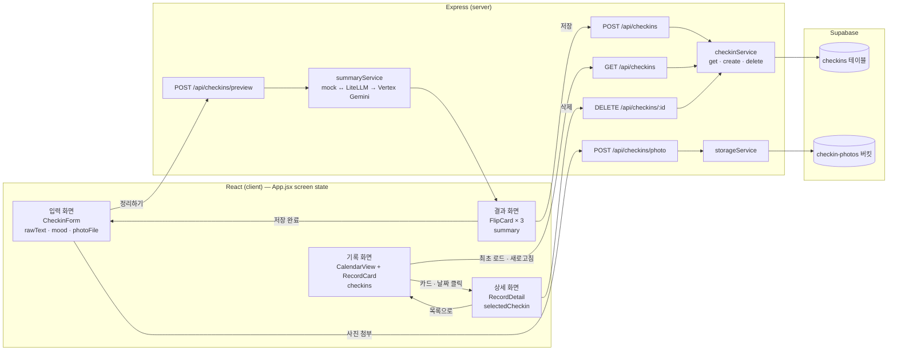

# 화면·서버·DB 아키텍처

3주차 기준(2026-07-22) 하루 체크아웃의 전체 구조 — 화면, Express, Supabase가 어떻게 연결되고 데이터가 어디로 흐르는지 한 장으로 정리한 문서. (2주차엔 화면흐름도/데이터흐름도로 나뉘어 있었는데 이번에 하나로 합침 + 3주차에 추가된 무드·사진·캘린더·삭제 반영)

## 화면 전환

- 라우터(react-router) 없이 `App.jsx`의 `screen` state(`input`/`result`/`calendar`/`detail`)로 조건부 렌더링한다. 상단 탭은 두 개뿐(`오늘` = input/result, `기록` = calendar/detail)이고 실제 화면은 4개다.
- `정리하기`를 누르면 input → result. 결과를 저장하면 다시 input으로 돌아온다(`다시 정리하기`도 동일).
- `기록` 탭(캘린더)에서 카드나 날짜를 클릭하면 `selectedCheckin`에 담아 detail로, `목록으로`를 누르면 비우고 캘린더로 되돌아간다.

## 데이터 흐름

React는 DB·Storage에 직접 접근하지 않고 항상 Express를 거친다(CLAUDE.md 규칙).

- **정리하기(미리보기)**: `rawText` → `POST /preview` → summaryService가 AI(또는 실패 시 mock)로 감정/원인/행동 3개 생성. DB 저장 없음.
- **사진 첨부**: 저장 전에 `POST /photo`로 먼저 올리고, storageService가 Supabase Storage(`checkin-photos` 버킷)에 넣은 뒤 public URL만 돌려받는다. 이 URL을 저장 요청에 실어 보낸다.
- **저장**: `POST /`로 원문+요약+mood+imageUrl을 보내면 checkinService가 `checkins` 테이블에 insert.
- **목록**: `GET /`으로 한 번에 받아온 배열을 `checkins` state에 둔다. 캘린더·상세 화면 모두 이 배열을 재사용하고 별도 API 요청은 안 한다.
- **삭제**: `DELETE /:id` → checkinService가 실제 행을 지운다(hard delete). 성공하면 `checkins` state에서 필터링해 화면에서도 바로 사라진다.
