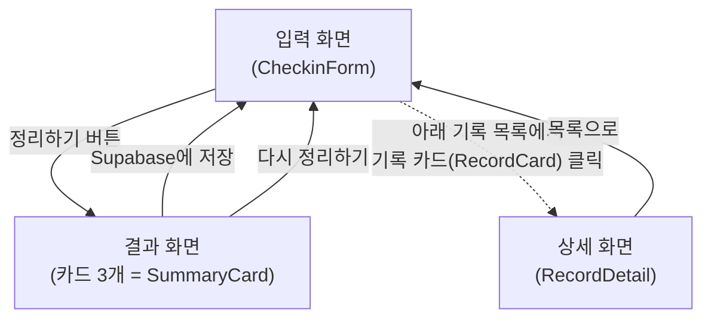
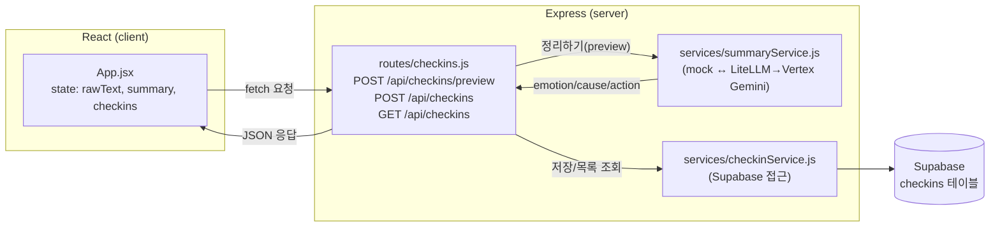

# 화면 흐름과 데이터 흐름

2주차 기준(2026-07-15) 하루 체크아웃의 화면 전환과 데이터 왕복을 그림으로 정리한 문서.

## 1. 화면 흐름도

App.jsx의 `screen` state('input' / 'result' / 'detail') 하나로 어떤 화면을 보여줄지 정한다.

- 라우터(react-router) 없이 `screen` state 값에 따라 조건부 렌더링(`screen === 'input' && ...`)으로 화면을 바꾼다.
- 기록 목록은 화면 아래에 항상 떠 있고, 카드를 클릭하면 `selectedCheckin`에 그 기록을 담고 `screen`을 'detail'로 바꾼다.
- "목록으로"를 누르면 `selectedCheckin`을 비우고(null) 다시 'input'으로 돌아온다.

## 2. 데이터 흐름도

React는 DB에 직접 접근하지 않고 항상 Express 서버를 거친다 (CLAUDE.md 규칙).

- **정리하기**: App이 `rawText`를 `POST /api/checkins/preview`로 보내면, summaryService가 AI(또는 mock)로 감정/원인/행동 3개를 만들어 돌려준다. 이때는 DB에 저장하지 않는다.
- **저장**: 결과 화면에서 저장을 누르면 `POST /api/checkins`로 원문+3개 항목을 보내고, checkinService가 Supabase에 insert한 뒤 저장된 기록을 돌려준다.
- **목록/상세**: 목록은 `GET /api/checkins`로 한 번 받아온 배열을 state(`checkins`)에 두고, 상세 화면은 그 배열에 이미 있는 기록 하나를 props로 넘겨서 보여준다 — 별도 API 요청이 없다.
