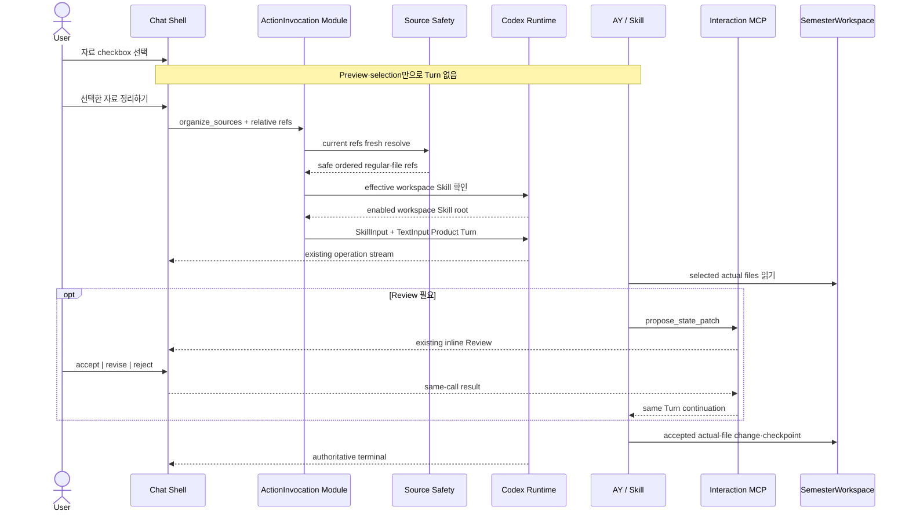

# `organize_sources` ActionInvocation

## Agent triage

- State: completed
- Surface: local-spec
- Next actor: none

## 완료 후 정정

초기 구현 뒤 official Codex Desktop·terminal source와 실제 Browser 동작을 다시 확인해 file selection과 native carrier 경계를 다음처럼 정정했다. 아래 본문의 구현·검증 기준도 이 최종 상태를 반영한다.

| 초기 제약 | 최종 구현 |
| --- | --- |
| `text` preview kind만 action 선택 가능 | Source list에 노출된 safe regular file은 `text | pdf | unsupported` preview kind와 무관하게 선택 가능 |
| Relative path를 JSON string line으로 렌더링 | Codex Desktop의 local-file link와 같은 basename label·workspace-relative destination의 Markdown reference를 `TextInput`에 렌더링 |
| Local file carrier가 부족하면 `MentionInput` 검토 | `MentionInput`은 app·plugin·Skill resource identity이며 generic local file carrier가 아니다. 실제 current-path failure가 생기면 필요한 보장을 먼저 정의 |

이 정정은 PDF extraction, OCR 또는 page/range evidence를 추가하지 않는다. Preview capability와 action file-reference eligibility만 분리한다. 현재 구현 정본은 [AY–App Interaction Layer](../architecture/ay-app-interaction-layer.md)와 [Codex Chat 구현 지도](../architecture/codex-chat-implementation-map.md)가 소유한다.

## Problem Statement

현재 AY-PLE은 prepared SemesterWorkspace의 actual file을 source explorer에서 보고 normal Chat을 시작할 수 있으며, AY가 `propose_state_patch`를 호출하면 App의 inline Review에서 `accept | revise | reject`를 받아 같은 Product Turn을 이어 갈 수 있다. 그러나 source explorer에서 이미 고른 자료를 목적이 분명한 AY 작업으로 전달하는 App-originated 방향은 없다. Preview focus와 selection은 AY 입력에 영향을 주지 않고, 사용자는 같은 file path를 Chat prompt에 다시 적어야 한다.

초기 First Assignment vertical에는 `SkillInput`과 selected file path를 담은 `TextInput`으로 native Turn을 시작하는 구현이 있었다. Native composition 자체는 작았지만 다음 App-owned 상태와 결합돼 있었다.

- `RawMaterial` ID·digest와 source registry
- versioned `ModelingRecipe`와 argument validation
- durable `ModelingRun` receipt
- Server-owned patch·confirmation·apply와 retry/recovery state

이 상태 기계는 [ADR 0018](../adr/0018-adopt-user-owned-git-semester-workspaces.md), [ADR 0019](../adr/0019-use-mcp-interaction-capabilities-as-the-ay-app-seam.md), [ADR 0021](../adr/0021-adopt-a-protocol-driven-ay-app-interaction-layer.md)에서 제거됐다. 첫 ActionInvocation은 old workflow를 복원하지 않고, 다음 mapping만 current Product Turn lifecycle에 다시 연결해야 한다.

```text
명시적 GUI action
→ closed action request와 workspace-relative file refs
→ fresh active-root·Skill validation
→ SkillInput + bounded TextInput
→ existing Product Turn stream
→ optional existing InteractionCapability round trip
→ AY-owned actual-file mutation·Git checkpoint
```

## Solution

Source explorer에 preview focus와 독립적인 multi-file selection을 추가하고 `선택한 자료 정리하기` action을 제공한다. 사용자가 action을 실행한 순간 선택한 path 목록을 request-scoped input으로 동결해 `POST /api/product/actions`로 보낸다. Browser request는 `organize_sources`, workspace-relative file refs와 기존 Codex Turn 설정만 포함한다.

Server의 typed `organize_sources` action definition은 하나의 Product operation lease 안에서 다음 preflight를 수행한다.

1. 현재 workspace lifecycle과 Codex account·Turn 설정을 확인한다.
2. 선택 path가 exact active SemesterWorkspace 안의 현재 안전한 regular file인지 preview kind와 무관하게 fresh 검증한다.
3. native effective Skill catalog에서 enabled workspace-local `ay-ple-first-assignment`를 확인하고 host-only `SKILL.md` path를 resolve한다.
4. action identity와 ordered relative refs만 담은 bounded text를 렌더링한다.
5. startup-approved thread에 `[SkillInput, TextInput]` 순서로 fresh Product Turn 하나를 시작한다.

그 뒤에는 normal Chat과 같은 activity projection, general clarification, interrupt, disconnect와 authoritative terminal lifecycle을 사용한다. Action-started Turn이 `propose_state_patch`를 호출하면 현재 Interaction Broker와 inline Review가 같은 Turn에 그대로 nested된다. App은 selected file의 content snapshot, action result, Review ledger, file apply나 Git checkpoint를 저장하지 않는다.

## User Stories

1. As a student, I want source explorer에서 여러 자료를 preview 지원 여부와 무관하게 선택해 `선택한 자료 정리하기`를 실행하기를 원한다, so that 이미 표현한 맥락을 Chat prompt로 다시 적지 않아도 된다.
2. As a student, I want file preview와 action selection이 서로 독립적이기를 원한다, so that 자료를 열어 보는 행동만으로 AY 작업이 시작되거나 입력이 바뀌지 않는다.
3. As a student, I want action을 실행한 시점의 선택 목록을 확인하기를 원한다, so that AY가 어떤 actual file을 대상으로 작업하는지 알 수 있다.
4. As a student, I want action 진행과 Review를 기존 AY Chat transcript에서 보기를 원한다, so that 별도 run 화면이나 workflow UI를 배울 필요가 없다.
5. As a student, I want 선택 file이 사라지거나 안전하지 않게 바뀌면 Turn 시작 전에 안내받기를 원한다, so that AY가 잘못된 root나 stale path를 작업하지 않는다.
6. As a student, I want Review를 수락한 뒤 실제 file 변경과 checkpoint를 AY가 수행하기를 원한다, so that App이 내 학기 자료의 별도 apply authority가 되지 않는다.
7. As a maintainer, I want normal Chat과 action이 같은 Product Turn admission·stream·interrupt·terminal mechanics를 사용하기를 원한다, so that 두 번째 workflow state machine을 유지하지 않아도 된다.
8. As a maintainer, I want action의 native Skill·file mapping이 Browser contract 밖에 있기를 원한다, so that native protocol이나 Skill path 변경이 product request에 누출되지 않는다.
9. As a maintainer, I want action preflight 실패가 native Turn을 시작하지 않기를 원한다, so that invalid request를 durable run·partial execution·automatic retry로 보정하지 않아도 된다.

## Current State and Constraints

### Current implementation

| 영역 | Current | 이 Spec의 target |
| --- | --- | --- |
| Browser source state | 하나의 `selectedSource`가 preview focus만 소유한다. | Preview focus와 별도인 transient action selection `0..16`개 |
| Browser operation | `/api/product/chat/messages`의 normal Chat만 Product Turn을 시작한다. | 별도 `/api/product/actions` request가 같은 operation stream을 시작한다. |
| Public contract | Chat text·settings와 source list·preview codec만 있다. Chat은 material input을 거절한다. | Closed `organize_sources` request를 추가하되 Chat request는 그대로 유지한다. |
| Server operation | `PreparedProductOperationCoordinator.sendChat()`이 account·settings·Turn·stream lifecycle을 조합한다. | `invokeAction()`이 action preflight 뒤 같은 lifecycle을 사용하고 공통 mechanics만 내부 추출한다. |
| Runtime input | `StartProductTurnInput`은 bounded `text` 하나와 permission/settings를 받는다. | Optional host-only Skill input과 text를 capability-neutral하게 운반한다. |
| Native bridge | Product Turn은 `[TextInput]`으로 시작한다. | Action은 `[SkillInput, TextInput]`, Chat은 계속 `[TextInput]`이다. |
| Skill discovery | Runtime이 exact workspace의 bounded effective Skill catalog를 fresh projection할 수 있다. | Action이 expected workspace-local Skill을 invocation마다 fresh resolve한다. |
| InteractionCapability | Project-discovered Interaction MCP, Broker와 inline Review가 구현돼 있다. | Action-started Turn에서 변경 없이 재사용한다. |
| Durable state | Actual workspace files·Git, `WorkspaceRegistry`와 native conversation이 authority다. | 유지한다. `ModelingRun`, source registry와 App apply를 추가하지 않는다. |

### Governing constraints

- [AY–App Interaction Layer 아키텍처](../architecture/ay-app-interaction-layer.md)가 ActionInvocation의 장기 Interface와 operation 공유 경계를 소유한다.
- [InteractionCapability 아키텍처](../architecture/ay-app-interaction-capabilities.md)가 same-Turn MCP round trip, Browser Review와 failure lifecycle을 소유한다. 이 Spec은 해당 transport나 result를 바꾸지 않는다.
- [User-owned Git SemesterWorkspace ADR](../adr/0018-adopt-user-owned-git-semester-workspaces.md)에 따라 action은 App-owned copy가 아니라 exact active Git root의 actual file을 가리킨다.
- [Pre-App Bootstrap ADR](../adr/0020-bootstrap-semester-workspaces-before-app-startup.md)에 따라 App은 Skill을 설치·업데이트하지 않고 prepared workspace의 current copy만 사용한다.
- `@ay-ple/product-contract`의 public JSON envelope는 최대 `16 KiB`, workspace-relative path는 최대 `4 KiB`다.
- Current source projection은 hidden·managed·secret-like path, scaffold file, symlink와 root escape를 제외하고 `text | pdf | unsupported`를 분류한다.
- 첫 action의 verified donor는 TXT/Markdown file이다. PDF text extraction과 page/range evidence는 canonical backlog의 후속 항목이므로 이 Spec에서 action input으로 승격하지 않는다.
- Mobile·small-screen 대응은 범위 밖이다. `1440px`와 `1920px` desktop Chromium을 UI 검증 target으로 사용한다.

### Prototype evidence

격리 evidence `prototype/action-invocation-native-mapping@b7c1fcd45`은 current pinned Runtime과 prepared temporary Git workspace에서 다음을 확인했다.

| 질문 | 관찰 |
| --- | --- |
| Project Skill discovery | Installed `ay-ple-first-assignment`가 native `skills/list`에서 enabled workspace Skill로 발견됐다. |
| Native input order | `SkillInput` 다음 `TextInput` 순서가 exact provider input에 나타났다. |
| File carrier | POSIX workspace-relative path를 렌더링한 text만으로 AY가 actual selected file을 읽었다. |
| Nested interaction | 같은 Turn에서 project-discovered `ay_ple_interaction` MCP와 `propose_state_patch` result 왕복이 유지됐다. |
| 추가 native carrier | `MentionInput`은 사용하지 않았다. |
| SDK adaptation | Existing SDK patch stack을 늘리지 않았다. |
| App mutation | Prototype App은 workspace file을 바꾸지 않았다. |

따라서 remaining implementation risk는 native carrier 탐색이 아니라 product contract, fresh validation과 existing Product Turn lifecycle 합류에 있다.

## Implementation Contract

### Module Responsibilities and Seams

| Module | 소유하는 책임 | 소유하지 않는 책임 |
| --- | --- | --- |
| `@ay-ple/product-contract` | Closed ActionInvocation request type·strict decoder와 file-ref cardinality·path·JSON bound | Absolute root, Skill path, native input, HTTP·NDJSON framing |
| `apps/chat-shell` source workbench | Preview와 독립적인 safe regular-file selection, selected count, explicit action control | File validity authority, Skill resolution, durable selection |
| `apps/chat-shell` product operation controller | Action request freeze, action transcript entry, existing stream reducer·Review·interrupt 사용 | Native thread identity, App workflow engine, result apply |
| `apps/server` ActionInvocation Module | Closed action dispatch, active-root file resolver, expected Skill resolver, bounded text renderer와 permission policy | Skill workflow, selected file contents, actual file mutation·Git |
| `apps/server` Product operation infrastructure | Chat·ActionInvocation의 one-at-a-time admission, account/settings, activity stream, disconnect·interrupt·terminal settlement | Action payload의 학업 의미, durable run |
| `@ay-ple/codex-chat-runtime` | Optional host-only Skill input의 strict validation·private bridge 전달과 native input order | `organize_sources` 의미, Browser contract, Skill discovery policy |
| Workspace-installed `ay-ple-first-assignment` | Actual files 읽기, ambiguity 처리, pre-mutation Review, result 해석, file mutation·checkpoint | Action button·selection, Browser transport와 operation correlation |
| Existing Interaction MCP Module | Action-started Turn 안의 Review request/result round trip | Action admission과 Skill invocation |

`apps/server`는 product contract, Runtime과 source safety Module을 조합한다. Runtime package는 `organize_sources`, source kind나 Interaction MCP schema를 import하지 않는다. Chat Shell은 계속 `@ay-ple/product-contract`만 shared production package로 사용한다.

### 1. Public ActionInvocation request

`@ay-ple/product-contract`에 다음 closed union과 decoder를 추가한다.

```ts
type ProductWorkspaceFileRef = {
  readonly relativePath: string
}

type TargetProductActionInvocationRequest = {
  readonly action: 'organize_sources'
  readonly files: readonly ProductWorkspaceFileRef[]
  readonly codexSettings?: ProductCodexTurnSettings
}

function decodeTargetProductActionInvocationRequest(
  value: unknown,
): TargetProductActionInvocationRequest
```

| 항목 | 계약 |
| --- | --- |
| Whole request | Existing `PRODUCT_JSON_ENVELOPE_MAX_BYTES`, 즉 compact JSON 최대 `16 KiB` |
| Object shape | `action`, `files`, optional `codexSettings`만 허용하고 additional field를 거절한다. |
| `action` | Exact literal `organize_sources`; unknown action을 거절한다. |
| `files` | `1..16`, request order 보존, duplicate `relativePath` 거절 |
| `relativePath` | Existing source contract와 같은 POSIX workspace-relative syntax와 최대 `4 KiB`; absolute path, backslash, control character, empty·`.`·`..` segment 거절 |
| `codexSettings` | Existing `ProductCodexTurnSettings` decoder를 그대로 사용한다. |

Request에는 다음 field가 없다.

- workspace ID·root와 absolute path
- source size·preview kind·content·digest
- Skill name·path·version
- prompt·native input type
- permission profile
- operation·thread·turn identity
- retry key와 `ModelingRun` identity

Browser adapter는 `POST /api/product/actions`에 이 body를 보내고 `application/x-ndjson` response를 기존 `TargetProductOperationFrame | ProductReviewFrame` decoder로 소비한다. Action-specific native frame, 별도 run status union과 결과 조회 endpoint를 만들지 않는다.

`POST /api/product/chat/messages`의 contract는 바꾸지 않는다. Chat request에 optional action, file 또는 material field를 추가하지 않으며 selection을 암묵적으로 붙이지 않는다.

### 2. `organize_sources` action definition

첫 action은 Server source가 소유하는 하나의 static typed definition이다.

| 속성 | 값 |
| --- | --- |
| Action ID | `organize_sources` |
| 사용자 label | `선택한 자료 정리하기` |
| Required Skill name | `ay-ple-first-assignment` |
| Required Skill root | `<SemesterWorkspace>/.agents/skills/ay-ple-first-assignment` |
| Native permission | `workspace_write` |
| File cardinality | `1..16` |
| Supported source kind | Current source list의 safe regular file |
| Native input | One `SkillInput`, then one bounded `TextInput` |

`text | pdf | unsupported`는 App의 preview capability만 나타낸다. PDF나 unsupported file도 safe source list에 남아 있는 regular file이면 action checkbox를 사용할 수 있다. 이는 PDF text extraction·page/range evidence를 보장한다는 뜻이 아니라 AY에게 current file reference를 전달할 수 있다는 뜻이다.

이 definition은 arbitrary workspace action manifest, dynamic UI schema나 generic native-input builder가 아니다. Public decoder는 closed union으로 남고 Server dispatch도 exhaustive `switch` 또는 동등한 static mapping으로 unknown action을 fail closed한다. 두 번째 실제 action에서 variation이 확인될 때만 공통 definition primitive를 넓힌다.

### 3. Request-scoped file resolution

Action은 Browser source list나 preview cache를 authority로 사용하지 않는다. Product operation lease를 claim한 뒤, native Turn을 시작하기 직전에 active root의 current filesystem에서 request refs를 모두 다시 확인한다.

Server-private `WorkspaceFileAccess` safe-open boundary는 selected ref마다 다음을 수행한다.

1. Existing source path syntax와 excluded path policy를 다시 적용한다.
2. Exact active root를 기준으로 resolve하고 root identity가 startup 때 고정한 identity와 같은지 확인한다.
3. Candidate를 `lstat`하고 symlink가 아닌 regular file인지 확인한다.
4. `realpath`가 lexical candidate와 같고 exact root 안에 남는지 확인한다.
5. `O_RDONLY | O_NOFOLLOW`로 열어 `fstat` device·inode가 pre-open identity와 같은지 확인한다.
6. Open 전후 directory chain과 file identity·size가 그대로인지 다시 확인한다.
7. Handle을 닫고 Browser 입력 순서의 relative ref만 반환한다.

모든 ref가 통과한 뒤에만 initial action preflight가 성공한다. 일부만 남겨 Turn을 시작하거나 missing ref를 자동으로 목록에서 제거하지 않는다. `operation.preparing` 전달 뒤 dispatch gate는 effective Skill과 모든 ref를 다시 관찰하고 rendered input이 initial 결과와 같은지 확인한다. Resolver는 file bytes를 읽거나 digest·snapshot·open handle을 Turn 수명까지 보존하지 않는다.

이 action의 `WorkspaceFileRef`는 **current-path lookup을 위한 request-scoped reference**이지 `EvidenceRef`가 아니다.

- Browser preview digest를 request에 포함하지 않는다.
- 같은 safe relative path의 bytes가 list/preview 뒤 바뀌어도 action은 현재 file을 읽는 요청으로 해석한다.
- File content가 preflight 뒤 바뀌는 것은 App-owned stale snapshot failure가 아니다. AY와 Skill이 actual file을 읽고 Review 직전·apply 직전 drift를 다시 확인한다.
- Initial 또는 dispatch gate가 관찰한 missing, symlink, root escape, hidden·secret-like·scaffold path 또는 non-regular file은 Turn 전 failure다.
- Dispatch gate도 검증 handle을 닫고 relative path text만 전달하므로 그 뒤 AY의 actual read 전 pathname 교체를 같은 inode에 원자적으로 bind하지 않는다. 이는 current path-reference semantics에서 채택한 boundary이며 App이 보장하지 않는다. Exact-version 처리가 구체적인 제품 요구가 될 때만 별도 native same-open identity 또는 immutable carrier 결정을 다시 연다.

이 구분은 old source snapshot/rebaseline state machine을 복원하지 않으면서 actual-file authority를 유지한다.

### 4. Workspace-local Skill resolution

Action은 hub authoring source나 global/user Skill을 직접 가리키지 않는다. Current Workspace Runtime의 `listEffectiveSkills({ signal })`를 invocation마다 fresh 호출하고 다음 조건을 모두 만족하는 entry를 찾는다.

- `name === "ay-ple-first-assignment"`
- `enabled === true`
- canonical `sourceRoot`가 exact `<SemesterWorkspace>/.agents/skills/ay-ple-first-assignment`와 같다.

그 root와 `SKILL.md`는 real non-symlink directory·regular file이어야 하고 canonical path가 exact SemesterWorkspace 안에 남아야 한다. App은 workspace Skill byte를 hub source와 digest 비교하거나 자동 복사·수정하지 않는다. Workspace Git history에 있는 current copy가 실행 authority다.

Expected workspace entry가 없거나 disabled·moved·symlinked 상태면 다른 scope의 같은 이름 Skill로 fallback하지 않고 Turn 전에 `action_unavailable`로 실패한다. Browser가 Skill name·path를 선택하거나 override할 수 없다.

Skill observation은 operation-local bounded `AbortSignal`을 사용한다. Shutdown은 이를 abort하고, client disconnect가 preflight 중 발생하면 bounded observation이 끝난 뒤 native Turn을 시작하지 않는다. Native-context cleanup ambiguity가 Runtime terminal로 latch되면 existing recovery lifecycle을 따른다.

### 5. Bounded action text

Action definition은 selected path를 Codex Desktop local-file link와 같은 Markdown reference로 렌더링하되 link destination에는 Browser-safe POSIX workspace-relative path를 사용한다. Exact line order는 다음과 같다.

```text
ActionInvocation: organize_sources
Selected SemesterWorkspace file references:
- [assignment-notice.md](materials/assignment-notice.md)
- [syllabus.md](materials/syllabus.md)
```

- 첫 두 line은 exact fixed text다.
- 각 ref는 request order대로 `- [escaped basename](escaped relativePath)` 한 line으로 렌더링한다.
- Line ending은 `\n`이고 trailing newline은 없다.
- Whole rendered text는 최대 `32 KiB` UTF-8다. Public `16 KiB` request bound를 통과해도 escaping·fixed overhead 뒤 이 bound를 넘으면 Turn 전에 거절한다.
- File content, digest, absolute root, Skill path와 hidden workflow instruction을 넣지 않는다.

Review 시점, actual-file mutation 순서, ambiguity handling과 Git checkpoint는 Skill이 소유한다. Action text에 First Assignment prompt sequence를 복사하지 않는다.

### 6. Capability-neutral Runtime input

Runtime의 Node-only internal contract를 다음과 같이 확장한다.

```ts
type CodexProductSkillInput = {
  readonly name: string
  readonly path: string
}

type StartProductTurnInput = {
  readonly threadId: CodexThreadId
  readonly permissionProfile: CodexProductPermissionProfile
  readonly settings?: CodexProductTurnSettings
  readonly skill?: CodexProductSkillInput
  readonly text: string
}
```

- Normal Chat은 `skill`을 생략하고 current `[TextInput]` behavior를 유지한다.
- ActionInvocation만 Server에서 resolve한 host-only `skill`을 전달한다.
- Runtime은 `name`을 bounded non-empty string으로, `path`를 configured exact workspace 안의 normalized absolute `SKILL.md` regular non-symlink file로 검증한다.
- Runtime은 Skill name을 action catalog와 대조하거나 discovery policy를 소유하지 않는다.
- Private Node↔Python command는 `skillName`과 `skillPath`를 둘 다 포함하거나 둘 다 생략한다. 한쪽만 있거나 extra field가 있으면 native mutation 전에 strict protocol failure다.
- Python bridge는 action input을 정확히 `[SkillInput(name, path), TextInput(text)]`로 구성한다. Chat input은 정확히 `[TextInput(text)]`다.
- `MentionInput`, file content upload, thread-start Skill extra root와 private MCP override를 추가하지 않는다.
- Official SDK source patch를 추가하지 않는다.

Deterministic Runtime은 optional Skill input을 관찰 가능한 test journal에 보존하되 Browser-safe activity로 projection하지 않는다. Native `SkillInput` 자체를 `skill.requested` 같은 새 product activity로 합성하지 않는다.

### 7. Product operation lifecycle

`PreparedProductOperationCoordinator`는 public `sendChat()`과 별도 `invokeAction()`을 제공하되 다음 mechanics를 private shared executor로 한 번만 구현한다.

- one-at-a-time Product operation admission
- account readiness와 optional Codex settings validation
- `operation.preparing`·native acceptance·activity projection
- general `request_user_input` answer/cancel
- Interaction Broker의 active Turn binding과 Review frame publish
- disconnect drain, Turn interrupt와 authoritative terminal
- unknown outcome 시 Runtime recycle
- start failure, native terminal 또는 completed Runtime close에 의한 lease release

Action payload validation·Skill resolution·text rendering은 shared executor 안의 generic callback이나 action definition이 소유하고 Chat text semantics와 섞지 않는다.

Action의 순서는 다음과 같다.

```text
strict HTTP decode
→ Product operation reserve
→ account/settings validation
→ current file refs + expected Skill + rendered input initial validation
→ client continuity recheck
→ operation.preparing
→ current file refs + effective Skill + prepared input dispatch revalidation
→ client continuity recheck
→ native Product Turn start
→ existing stream / nested interaction / terminal
→ lease release
```

- Initial File·Skill·render preflight failure는 `operation.preparing`이나 native Turn을 만들지 않고 JSON error로 끝낸다.
- `operation.preparing` 뒤 dispatch revalidation failure는 native Turn 없이 existing NDJSON `failed` terminal로 끝낸다. Stale source 또는 prepared-input mismatch는 `action_context_stale`, current-invalid source는 `action_context_invalid`, missing·unsafe·disabled expected Skill은 `action_unavailable`, effective catalog observation·shutdown failure는 `product_unavailable`다.
- `operation.preparing` 뒤 start failure는 existing stream failure/terminal 규칙을 따른다.
- 한 invocation은 fresh Turn 하나다. Automatic retry, operation replay와 idempotency ledger를 만들지 않는다.
- InteractionCapability는 action이 시작한 active Turn을 Broker binding으로 관찰할 뿐 별도 Product operation lease를 claim하지 않는다.
- Action Turn은 existing startup-approved thread를 재사용한다. 별도 action thread나 file별 Turn을 만들지 않는다.
- Native acceptance 뒤 process loss나 delivery ambiguity는 existing `unknown` terminal이고 App이 성공·mutation을 추정하지 않는다.

### 8. Browser interaction and presentation

Source workbench controller는 다음 transient state를 구분한다.

| State | 의미 |
| --- | --- |
| `selectedSource` | 하나의 preview focus |
| `selectedActionPaths` | `organize_sources`에 사용할 ordered unique safe regular-file path 목록 |
| Product operation state | 실행 중인 Chat 또는 ActionInvocation 하나 |

UI behavior는 다음과 같다.

- Initial action selection은 empty다. 첫 preview file을 자동으로 action 선택하지 않는다.
- 모든 safe source row는 preview control과 별도 checkbox를 가진다. Row preview click은 checkbox를 바꾸지 않고 checkbox click은 Turn을 시작하지 않는다.
- `text | pdf | unsupported`는 App preview capability만 나타낸다. PDF와 unsupported row도 action checkbox를 사용할 수 있다.
- Selection은 source list order를 사용하고 최대 `16`개다. Limit에 도달하면 미선택 checkbox를 disable하고 이유를 표시한다.
- Explicit reload는 fresh safe source list에 남아 있는 selected path만 교집합으로 보존한다.
- `선택한 자료 정리하기` button은 selected count를 표시하며 selection이 empty이거나 workspace/account/settings가 unavailable, 다른 Product operation이 active, Review/clarification response가 pending이면 disabled다.
- Button click은 current path array를 immutable request value와 Browser-local action transcript entry로 freeze한다. 그 뒤 source state가 바뀌어도 in-flight request를 변경하지 않는다.
- Action entry는 `kind: "action"`, label과 frozen relative path 목록을 표시한다. Typed Chat message로 가장하지 않고 public wire에 별도 durable action record를 요구하지 않는다.
- Action을 시작하면 mounted Chat dock을 열어 progress·Review·terminal을 보여준다. Dock hide/show는 current controller와 stream을 unmount하지 않는다.
- Product operation이 active한 동안 checkbox mutation과 새 action·Chat submit은 닫되 source preview와 Review evidence navigation은 유지한다.
- Terminal 또는 preflight failure 뒤 selection은 자동으로 지우지 않는다. 사용자가 file을 수정·reload한 뒤 explicit action을 다시 실행하면 fresh invocation·Turn이다.
- Browser reload는 selection, action transcript와 pending response를 복원하지 않는다. Existing disconnect·interrupt semantics를 따른다.

Chat operation hook은 Chat과 action의 request 시작 전 transcript entry만 다르게 만들고, NDJSON frame reducer·Review settlement·interrupt를 공유한다. 두 별도 stream state machine을 만들지 않는다.

### 9. Failure and security behavior

| 조건 | HTTP / stream 결과 | Native Turn |
| --- | --- | --- |
| Unknown action, missing/extra field, empty·duplicate·`>16` refs, absolute/invalid path, oversized request | `400 invalid_request` JSON | 시작하지 않음 |
| Current ref가 missing, symlink, out-of-root, hidden/excluded, non-regular 또는 replaced identity | `409 action_context_stale` JSON | 시작하지 않음 |
| Rendered action text가 action bound 초과 | `409 action_context_invalid` JSON | 시작하지 않음 |
| Expected workspace Skill missing·disabled·wrong root·unsafe file | `409 action_unavailable` JSON | 시작하지 않음 |
| Effective Skill observation 자체가 unavailable 또는 Runtime cleanup failure | `503 product_unavailable` 또는 existing recovery projection | 시작하지 않음 |
| 다른 Chat/Action Turn active | `409 action_busy` JSON | 시작하지 않음 |
| Account not ready | `409 account_not_ready` JSON | 시작하지 않음 |
| Codex settings가 current catalog와 불일치 | `400 action_invalid` JSON | 시작하지 않음 |
| `operation.preparing` 대기 중 source 또는 prepared input drift | `operation.terminal`의 `failed/action_context_stale` 또는 `failed/action_context_invalid` | 시작하지 않음 |
| `operation.preparing` 대기 중 expected Skill drift 또는 catalog/shutdown failure | `operation.terminal`의 `failed/action_unavailable` 또는 `failed/product_unavailable` | 시작하지 않음 |
| `operation.preparing` 뒤 native start failure | Existing `operation.terminal` failure/unknown | 성공으로 추정하지 않음 |
| Accepted Turn interrupt·Runtime/Adapter loss | Existing interrupt/unknown terminal과 pending MCP failure | retry하지 않음 |

Safe public errors에는 absolute path, selected file content, Skill path/body, native identity, Broker credential, traceback과 raw protocol payload가 없다.

Mutation route의 current loopback socket·Origin admission과 `16 KiB` JSON body limit을 그대로 적용한다. Source GET security policy를 Action POST의 trust 근거로 재사용하지 않으며, Browser가 보낸 relative path는 항상 Server에서 다시 검증한다.

### 10. Data flow



### 11. Compatibility and documentation closeout

- Existing normal Chat, model settings, source list/text/PDF preview, general clarification와 Semantic Review wire는 backward-compatible하게 유지한다.
- Removed Course/material/First Assignment/retry routes와 `/api/product-mcp`, `/api/runtime/*`, `/api/codex-chat/*`를 alias로 복원하지 않는다.
- Existing v2/v3 workspace bytes를 읽거나 migration하지 않는다.
- `@ay-ple/codex-chat-runtime` README의 `TextInput`-only Product Turn 설명은 implementation과 함께 optional Skill+text mapping으로 갱신한다.
- `@ay-ple/product-contract`, Server와 Chat Shell README는 current action route·UI·지원 kind를 자신의 범위에서 갱신한다.
- 구현이 green일 때 [Codex Chat 구현 지도](../architecture/codex-chat-implementation-map.md)의 current gap과 [개발 백로그](../product/ay-ple-development-backlog.md)의 ActionInvocation 완료 상태를 owning docs에서 먼저 갱신한다.
- Prototype branch code는 implementation branch에 merge하지 않는다. 관찰한 input order와 test oracle만 production code/tests에 다시 구현한다.

## Implementation Decisions

| 결정 | 선택 | 이유 |
| --- | --- | --- |
| Native file carrier | Relative refs를 렌더링한 bounded `TextInput` | Current pin에서 actual file read와 same-Turn MCP를 증명했고 별도 native carrier가 필요하지 않다. |
| Skill carrier | `SkillInput` 하나를 `TextInput` 앞에 둠 | Official SDK가 Skill body를 native하게 주입하고 action prompt에 workflow를 복사하지 않게 한다. |
| `MentionInput` | 사용하지 않음 | Verified need가 없고 rendered path로 first action이 성립한다. |
| SDK patch | 추가하지 않음 | Public official SDK input으로 mapping이 완결된다. |
| File reference integrity | Relative path only, digest 없음 | Action은 current actual file을 읽는 요청이며 version-bound Review evidence나 snapshot이 아니다. |
| Supported kind | Source list의 safe regular file | Action은 path reference를 전달하므로 preview kind나 extraction capability와 결합하지 않는다. PDF extraction·page evidence는 별도 backlog다. |
| Cardinality | `1..16` | Single notice부터 작은 course bundle까지 수용하면서 첫 action을 human-scale·bounded하게 유지한다. |
| Public endpoint | Closed `POST /api/product/actions` | Chat과 intent를 분리하고 future closed union을 허용하되 dynamic action bus를 만들지 않는다. |
| Operation lifecycle | Existing Product Turn admission·stream 재사용 | Native Turn의 실제 concurrency·interrupt·terminal owner가 이미 있다. |
| Selection persistence | Browser-session transient | Request-scoped context만 필요하며 source registry·durable selection은 금지돼 있다. |
| Action outcome storage | Native conversation·actual file·Git만 | Duplicate `ModelingRun`과 App apply ledger를 복원하지 않는다. |
| Retry | Explicit fresh invocation | File·Skill과 workspace state를 다시 검증하고 ambiguous native outcome을 재실행하지 않는다. |

## Testing Decisions

### Contract and source-safety tests

- `@ay-ple/product-contract`
  - Valid one-file and sixteen-file `organize_sources` request
  - Optional valid Codex settings
  - Unknown action, extra/native field, empty·duplicate·seventeen refs
  - Absolute path, traversal, backslash, control character와 overlong path
  - Whole JSON envelope overflow
  - Chat decoder가 action·files field를 계속 거절함
- Server source safety
  - Current safe regular file success, preview kind 독립성과 request order preservation
  - Missing, renamed, symlink, root escape, hidden/managed/secret/scaffold path
  - Directory, device와 open 전후 inode mismatch
  - PDF, unsupported와 preview limit 초과 file도 action preflight 성공
  - Root identity replacement과 all-or-nothing preflight
  - Resolver가 file content·digest·snapshot을 반환하지 않음

### Action Module and operation tests

- Expected enabled Skill의 exact workspace root를 resolve하고 `SKILL.md` path만 Runtime에 전달한다.
- Missing, disabled, global-only, wrong-root와 symlink Skill은 Turn 전에 실패한다.
- Hub authoring Skill과 digest equality를 요구하거나 workspace copy를 rewrite하지 않는다.
- Renderer가 fixed header, escaped ordered Markdown file refs와 `32 KiB` bound를 지킨다.
- Action이 `workspace_write`, current optional settings, one Skill과 one text를 service에 전달한다.
- Initial File/Skill/settings/account failure는 Runtime `startProductTurn` 호출과 `operation.preparing` frame이 0회다.
- Preparing 대기 중 File/Skill/render drift는 dispatch revalidation 뒤 Runtime start 없이 exact safe `failed` terminal로 끝난다.
- Chat과 action이 같은 busy lease를 경쟁하고 loser는 `409`다.
- Action accepted 뒤 기존 activity, clarification, interrupt, disconnect와 terminal projection이 Chat과 같다.
- Action-started Turn의 Review가 같은 `operationId`에 publish되고 Broker는 별도 operation을 claim하지 않는다.
- Unknown outcome은 automatic retry·synthetic success·App mutation을 만들지 않는다.

### Runtime and bridge tests

- Node contract는 모든 Product Turn에서 startup workspace root identity를 다시 확인하고 valid `skill` all-or-none와 workspace-contained `SKILL.md`만 허용한다.
- Private protocol은 no-skill/skill command field roster를 strict decode한다.
- Python bridge journal은 Chat의 `["TextInput"]`, action의 `["SkillInput", "TextInput"]` exact order를 확인한다.
- Official SDK input test에서 Skill body, name·path와 relative-ref text가 provider input에 나타난다.
- `MentionInput`이 없고 existing ordered patch digest가 바뀌지 않는다.
- Deterministic Runtime fake가 optional Skill을 기록하되 public activity를 추가하지 않는다.
- Malformed/oversized skill input, bridge process loss와 cleanup은 existing bounded failure semantics로 수렴한다.

### Browser unit and E2E tests

- Preview click, checkbox toggle와 action click을 각각 분리해 preview·selection만으로 network action/Turn이 0회임을 확인한다.
- Initial selection empty, 모든 preview kind의 checkbox, max 16, reload intersection과 active-operation lock을 확인한다.
- Action click이 exact path 목록을 freeze하고 이후 UI selection 변화가 request body를 바꾸지 않는다.
- Action transcript entry는 label·frozen refs를 표시하고 user Chat message로 렌더링하지 않는다.
- Action 시작 시 Chat dock이 열리고 hide/show 뒤에도 stream이 유지된다.
- Preflight JSON failure, NDJSON operation failure, interrupt와 terminal 뒤 selection·retry behavior를 확인한다.
- Existing Review accept·revise·reject, general clarification와 evidence navigation을 action-started stream에서도 확인한다.
- `1440px`와 `1920px`에서 left source pane의 multi-select/action control, central preview와 right Chat dock이 겹치지 않는다.

### Actual prepared-workspace trace

Fresh temporary Git workspace를 repository-owned Bootstrap으로 준비하고 installed `ay-ple-first-assignment`, tracked project Interaction MCP와 exact Runtime bundle을 사용한다.

1. 두 selected Markdown/TXT source와 unselected control file을 준비한다.
2. Public ActionInvocation request를 Server graph에 보내 exact workspace Skill을 resolve한다.
3. Provider trace에서 `[SkillInput, TextInput]`, relative refs와 selected-only actual-file read를 확인한다.
4. 같은 native Turn에서 `propose_state_patch`가 Browser-safe Review로 나타나고 `accept`가 같은 MCP call로 돌아가는지 확인한다.
5. Review 전 target bytes·Git index가 불변인지 확인한다.
6. Accept 뒤 AY 역할의 explicit actual-file mutation과 intended-path checkpoint가 남고 unrelated dirty·untracked file은 보존되는지 확인한다.
7. Reject 또는 interaction failure trace에서는 mutation·checkpoint가 없는지 확인한다.
8. Teardown 뒤 Node·Python·native child와 held Adapter response가 남지 않고 temporary workspace 밖 byte가 바뀌지 않았는지 확인한다.

이 trace는 provider-free exact local-provider gate로 자동화한다. Ambient dogfood workspace와 credential을 사용하지 않는다. Disposable live-provider gate는 별도 safe auth가 명시될 때만 보조 evidence로 실행하며 이 Spec의 필수 green을 막지 않는다.

### Repository gates

Implementation closeout은 최소 다음을 통과한다.

```bash
npm test
npm run typecheck
npm run build
npm run lint -w @ay-ple/chat-shell
npm run test:e2e -w @ay-ple/chat-shell
npm run test:prepared-workspace-product-actual
npm run check:docs-links
```

Runtime bridge나 exact bundle source를 변경한 ticket은 해당 package README가 요구하는 focused bridge·actual-child·post-run non-mutation gate도 실행한다. No-patch 결정 때문에 exact SDK patch roster·manifest를 의도적으로 regenerate하지 않는다.

## Out of Scope

- `ModelingRecipe`, `ModelingInvocation`, durable `ModelingRun`과 duplicate Turn ledger
- `Course`·`RawMaterial` registry, source copy·snapshot·watcher와 durable selection
- Browser preview digest를 ActionInvocation version lock으로 사용하는 rebaseline flow
- App-owned Assignment schema, patch apply, file mutation과 Git command
- PDF text extraction, page/range evidence, OCR와 HWP/HWPX
- `MentionInput`, local file upload와 file content를 Turn input에 복사하는 carrier
- Dynamic action manifest, arbitrary action payload와 generic workflow/event bus
- Action별 thread, file별 Turn, automatic retry·resume와 durable action history
- 새로운 InteractionCapability나 `propose_state_patch` schema 변경
- Native permission·Semantic Review를 하나의 approval로 합치는 UI
- Multi-thread sidebar, thread read/resume와 Browser reload hydration
- Mobile·small-screen layout

## Open Questions

Blocking open question은 없다.

다음 항목은 첫 구현의 acceptance를 막지 않는 future observation point다.

| 관찰 항목 | 후속 조건 |
| --- | --- |
| PDF extraction·page evidence | 실제 학업 use case와 deterministic extraction strategy가 생기면 file-reference selection과 별도 capability로 확장한다. |
| 두 번째 App-originated action | 실제 composition variation을 확인한 뒤 static definition의 공통 primitive를 추출한다. |
| Rendered relative path가 부족한 file case | 구체적 failure와 필요한 보장을 먼저 정의한 뒤 그 보장에 맞는 official carrier만 probe한다. |
| Action transcript 재표시 | Native thread read/resume UX가 채택될 때 conversation projection으로 다루고 App action ledger는 만들지 않는다. |

## Completion

네 implementation ticket이 모두 완료됐다.

- [001 — Capability-neutral Skill product Turn](../tickets/2026-07-28-organize-sources-action-invocation/001-capability-neutral-skill-product-turn.md)
- [002 — Validated `organize_sources` product operation](../tickets/2026-07-28-organize-sources-action-invocation/002-validated-organize-sources-product-operation.md)
- [003 — Source workbench `organize_sources` action](../tickets/2026-07-28-organize-sources-action-invocation/003-source-workbench-organize-sources-action.md)
- [004 — Prepared SemesterWorkspace ActionInvocation conformance closeout](../tickets/2026-07-28-organize-sources-action-invocation/004-prepared-workspace-action-invocation-conformance-closeout.md)

## Further Notes

- Historical First Assignment code는 native Skill+text composition과 Browser flow의 donor일 뿐 current domain model의 source of truth가 아니다.
- Prototype branch는 throwaway evidence boundary다. Production implementation은 `prototype/action-invocation-native-mapping@b7c1fcd45`를 merge하지 않고 current package interfaces와 tests에 필요한 behavior만 다시 작성한다.
- 이 Spec의 핵심은 action을 위한 새 workflow를 만드는 것이 아니라, closed GUI intent를 existing native Product Turn에 안전하게 연결하는 것이다.
