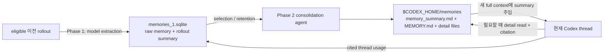

# Codex local Memories 아키텍처 조사

분류: 기술 참고

> **현재 판정 (2026-07-12):** 현재 Runtime Harness는 built-in Memories를 활성화하지 않는다. 제품에서도 Memory는 명시적인 opt-in과 실제 eligibility 검증 뒤에만 비권위적 보조 맥락으로 사용할 수 있으며, SemesterModel이나 학업 사실의 source of truth가 아니다. Runtime-home pair와 후속 수명 정책은 [Codex Runtime 격리](../../architecture/codex-runtime-isolation.md), 구현 순서는 [개발 백로그](../../product/ay-ple-development-backlog.md)가 소유한다. 아래 본문은 pinned Codex 버전의 write/read·격리·privacy 근거를 보존한 조사 기록이다.

조사일: 2026-07-11

## 조사 목적과 근거 범위

이 문서는 AY-PLE이 독자 `CODEX_HOME`을 사용할 때 Codex local Memories와 `AGENTS.md`, skills, plugins 같은 personalization surface를 어떻게 이해해야 하는지 고정한다. Memory가 제품 학업 상태나 실행 receipt를 대신하지 않는 근거를 다루며, 현재 제품 실행 경계는 [Codex-native 제품 작업 조합](../../architecture/codex-native-product-composition.md)을 따른다.

AY-PLE은 `@openai/codex@0.144.0`을 고정하므로 실행 contract는 `rust-v0.144.0` tag와 commit `767822446c7a594caa19609ca435281a9ec67e0d`를 기준으로 판정한다. 현재 공식 문서는 최신 사용자 설정과 공개 surface를 확인하는 별도 근거로 사용한다. 두 층이 다르면 dependency를 올리기 전에는 pinned source가 우선한다. [AY-PLE pinned dependency](../../../packages/runtime-codex/package.json), [Codex `rust-v0.144.0` source](https://github.com/openai/codex/tree/rust-v0.144.0), [현재 Memories 공식 문서](https://learn.chatgpt.com/docs/customization/memories)

| 근거 층 | 이 문서에서의 역할 | 안정성 |
| --- | --- | --- |
| AY-PLE pinned `0.144.0` source | 실제 write/read pipeline, 저장 위치, eligibility, experimental API | dependency upgrade 전까지 고정 |
| 현재 OpenAI 공식 문서 | 최신 설정 기본값, `/memories` UX, 공개 지원 범위 | Codex release와 함께 바뀔 수 있음 |
| AY-PLE runtime launcher | custom `CODEX_HOME`/`CODEX_SQLITE_HOME`과 process 환경 격리의 실제 수준 | 현재 코드 contract |

## 조사 결론 요약

1. Codex local Memories는 **thread transcript 자체도, authoritative application database도 아니다.** 오래된 eligible rollout을 model로 추출한 뒤 다시 model로 통합해 만든, 다음 task에서 참고하는 generated recall layer다. 공식 문서도 필수 team guidance는 `AGENTS.md`나 checked-in docs에 두고 memory를 유일한 source of truth로 쓰지 말라고 구분한다. [Memories 공식 문서](https://learn.chatgpt.com/docs/customization/memories)
2. pinned `0.144.0`에서는 `[features] memories = true`가 먼저 필요하다. `[memories] generate_memories`와 `use_memories`는 각각 기여와 사용을 제어하지만 feature를 켜지는 않는다. feature 기본값은 off이고 두 boolean의 effective 기본값은 true다. [feature definition](https://github.com/openai/codex/blob/rust-v0.144.0/codex-rs/features/src/lib.rs#L926-L934), [pinned memory config](https://github.com/openai/codex/blob/rust-v0.144.0/codex-rs/config/src/types.rs#L280-L392)
3. write path는 이전 task rollout을 background에서 읽어 Phase 1 extraction 결과를 SQLite에 저장하고, Phase 2 consolidation agent가 `$CODEX_HOME/memories`의 Markdown workspace를 갱신하는 2단계 구조다. extraction과 consolidation은 model/provider request를 사용하므로 “local”은 **저장과 orchestration의 위치**를 뜻하며 inference가 반드시 장치 안에서 수행된다는 뜻이 아니다. [pipeline entrypoint](https://github.com/openai/codex/blob/rust-v0.144.0/codex-rs/memories/write/src/start.rs#L18-L78), [Phase 1 model runtime](https://github.com/openai/codex/blob/rust-v0.144.0/codex-rs/memories/write/src/runtime.rs#L241-L317), [Phase 2 agent](https://github.com/openai/codex/blob/rust-v0.144.0/codex-rs/memories/write/src/phase2.rs#L297-L348)
4. read path는 새 full context를 만들 때 `memory_summary.md`를 최대 약 2,500 token으로 developer context에 주입한다. model은 필요할 때 `MEMORY.md`, rollout summary, memory-generated skill을 단계적으로 읽고 특별 citation block으로 근거 thread를 표시하도록 안내받는다. 매 turn마다 memory DB를 live query하는 구조가 아니다. [memory extension](https://github.com/openai/codex/blob/rust-v0.144.0/codex-rs/ext/memories/src/extension.rs#L33-L115), [summary injection](https://github.com/openai/codex/blob/rust-v0.144.0/codex-rs/ext/memories/src/prompts.rs#L23-L51), [progressive retrieval prompt](https://github.com/openai/codex/blob/rust-v0.144.0/codex-rs/ext/memories/templates/memories/read_path.md#L1-L130)
5. 하나의 `CODEX_HOME`에는 하나의 shared memory root가 있고, global consolidation lock과 Phase 1 state는 짝이 되는 `CODEX_SQLITE_HOME` DB에 있다. 정상적인 1:1 root pair에는 semester/course partition이 자동으로 생기지 않는다. 따라서 AY 전용 root pair는 **AY 전체에 공유되는 memory boundary**이지 course boundary가 아니다. 두 root 중 하나를 여러 runtime과 공유하거나 서로 다르게 조합하면 scope도 그 pair를 따라 어긋날 수 있다. 이는 storage root와 global lock에서 도출되는 아키텍처적 추론이다. [memory paths](https://github.com/openai/codex/blob/rust-v0.144.0/codex-rs/memories/write/src/lib.rs#L35-L44), [global lock](https://github.com/openai/codex/blob/rust-v0.144.0/codex-rs/state/src/runtime/memories.rs#L1021-L1175)
6. 독자 `CODEX_HOME`만으로 personalization이 완전히 격리되지는 않는다. AY-PLE 런처는 host 환경을 복사한 뒤 `CODEX_HOME`과 `CODEX_SQLITE_HOME`만 덮어쓰므로 `HOME`이 남는다. pinned Codex는 별도로 `$HOME/.agents/skills`와 `$HOME/.agents/plugins/marketplace.json`을 찾는다. skills는 자동 skill root가 되지만 personal marketplace는 discovery surface일 뿐, 그 자체로 plugin을 설치·활성화하지는 않는다. [AY-PLE child env](../../../packages/runtime-codex/src/raw-client.ts), [skill roots](https://github.com/openai/codex/blob/rust-v0.144.0/codex-rs/core-skills/src/loader.rs#L239-L350), [marketplace home discovery](https://github.com/openai/codex/blob/rust-v0.144.0/codex-rs/core-plugins/src/marketplace.rs#L295-L309)
7. App Server의 `thread/memoryMode/set`과 `memory/reset`은 pinned source에서 experimental이다. 현재 공개 App Server API overview에도 memory-specific method가 없다. AY-PLE의 stable product contract로 바로 승격하지 말고 upgrade/probe 대상으로 남겨야 한다. [experimental methods](https://github.com/openai/codex/blob/rust-v0.144.0/codex-rs/app-server-protocol/src/protocol/common.rs#L559-L577), [현재 App Server API overview](https://learn.chatgpt.com/docs/app-server#api-overview)
8. extraction에는 “user preference만 허용”하는 semantic allowlist가 없다. 일반 학업 rollout이 contribution-enabled이면 academic fact나 source-derived content도 model judgment로 memory가 될 수 있다. 또 reset은 derived DB/files를 지우지만 source rollout과 thread mode를 보존하므로 durable forget이 아니다.

## 전체 구조



이 pipeline에는 세 종류의 state가 있다.

| state | 위치 | 역할 | 제품 source of truth 여부 |
| --- | --- | --- | --- |
| 원본 thread/rollout | `$CODEX_HOME/sessions` 계열과 state DB | 실제 conversation history와 task evidence | Codex runtime evidence지만 AY 제품 사실의 SSOT는 아님 |
| Phase 1 state | `$CODEX_SQLITE_HOME/memories_1.sqlite` | rollout claim, extraction output, job lifecycle, usage ranking | 내부 generated state |
| Consolidated memory workspace | `$CODEX_HOME/memories` | 다음 task가 빠르게 찾을 summary와 detail artifact | generated recall; hand-edit 대상 아님 |

공식 문서는 `$CODEX_HOME/memories`를 inspect할 수 있지만 hand-edit하지 않는 generated state로 설명한다. 반면 team rule과 반복 가능한 project guidance는 `AGENTS.md`와 checked-in docs에 두도록 권한다. [Memories 공식 문서](https://learn.chatgpt.com/docs/customization/memories), [AGENTS.md discovery 공식 문서](https://learn.chatgpt.com/docs/agent-configuration/agents-md#how-codex-discovers-guidance)

## 설정 모델

### 최소 활성화와 독립적인 두 축

```toml
[features]
memories = true

[memories]
generate_memories = true
use_memories = true
```

| `features.memories` | `generate_memories` | `use_memories` | 의미 |
| --- | --- | --- | --- |
| `false` | 어떤 값이든 | 어떤 값이든 | write/read extension 모두 사실상 비활성 |
| `true` | `true` | `true` | 새 thread를 future extraction input으로 표시하고 기존 memory도 사용 |
| `true` | `false` | `true` | 현재 이후 thread는 새 memory extraction 대상이 되지 않지만 기존 memory는 사용 |
| `true` | `true` | `false` | rollout은 향후 extraction 대상이 될 수 있지만 memory summary는 현재 context에 주입하지 않음 |
| `true` | `false` | `false` | feature infrastructure는 켜져도 기여와 read는 모두 막힘 |

`generate_memories`는 새 thread의 persisted `ThreadMemoryMode`를 정하는 값이다. 이미 생성된 thread의 mode와 background에서 처리 중인 과거 eligible thread를 모두 즉시 취소하는 global kill switch로 해석하면 안 된다. startup pipeline 자체는 `generate_memories`를 재확인하지 않고 feature/state/rate-limit 조건을 확인한 뒤 다른 eligible thread를 claim할 수 있다. [session memory mode](https://github.com/openai/codex/blob/rust-v0.144.0/codex-rs/core/src/session/session.rs#L579-L647), [write startup](https://github.com/openai/codex/blob/rust-v0.144.0/codex-rs/memories/write/src/start.rs#L18-L78)

제품 UX에서는 세 동작을 분리해야 한다.

| 사용자 의도 | 실제 필요한 control | 토글만으로 기존 데이터가 지워지는가 |
| --- | --- | --- |
| “과거 기억을 지금 쓰지 마” | `use_memories = false` | 아니오 |
| “이후 작업에서 새 기억을 만들지 마” | `generate_memories = false`와 필요한 thread-mode 조정 | 아니오 |
| “이미 저장된 기억을 지워” | 명시적인 reset/delete lifecycle | 파생 DB row와 file은 지울 수 있지만, pinned reset은 source rollout과 thread mode를 보존하므로 durable forget은 아님 |

따라서 하나의 “Memory on/off” 스위치만으로 consent와 retention을 모두 설명할 수 없다. reset 뒤에도 feature/generation과 기존 enabled rollout을 그대로 두면 다음 startup에서 memory가 다시 생성될 수 있다. 또한 config profile을 바꾸더라도 root pair가 같으면 memory state가 분리되지 않으므로 profile은 semester별 memory namespace가 아니다.

### 세부 knob와 version 차이

| knob | pinned `0.144.0` 기본값 | 2026-07-11 현재 공식 문서 | 의미/주의 |
| --- | ---: | ---: | --- |
| `disable_on_external_context` | `false` | `false` | external context가 기록된 thread를 memory에서 제외하고 이미 선택됐으면 forget 대상으로 보냄 |
| `generate_memories` | `true` | `true` | 새 thread의 memory contribution eligibility |
| `use_memories` | `true` | `true` | read extension과 summary injection |
| `dedicated_tools` | `false` | 공개 reference에 없음 | pinned 내부 memory list/search tool gate; undocumented contract로 취급 |
| `max_rollouts_per_startup` | `2` | `16`, cap 128 | startup 한 번에 claim하는 rollout 수 |
| `max_rollout_age_days` | `10` | `30`, 0–90 | extraction 후보의 최대 나이 |
| `min_rollout_idle_hours` | `6` | `6`, 1–48 | active/최근 task를 피하기 위한 idle 시간 |
| `min_rate_limit_remaining_percent` | `25` | `25`, 0–100 | background model call을 시작할 최소 quota 여유 |
| `max_raw_memories_for_consolidation` | `256` | `256`, cap 4096 | Phase 2 input upper bound |
| `max_unused_days` | `30` | `30`, 0–365 | 사용되지 않은 memory retention |
| `extract_model` / `consolidation_model` | unset | unset | 단계별 model override |

따라서 current docs의 숫자를 pinned runtime 동작으로 가정하면 안 된다. [pinned constants/config](https://github.com/openai/codex/blob/rust-v0.144.0/codex-rs/config/src/types.rs#L47-L57), [current config reference](https://learn.chatgpt.com/docs/config-file/config-reference#configtoml)

## Write path: 어떤 task가 무엇으로 기억되는가

### startup과 eligibility

pinned pipeline은 root thread startup에서 비동기로 시작한다. ephemeral thread, subagent thread, feature-off, state DB 부재는 건너뛰며, 새로 시작한 current thread 자체가 아니라 충분히 오래 idle한 **이전 thread**를 claim한다. background job은 UI turn과 분리돼 진행되고 rate-limit 여유도 확인한다. [write startup](https://github.com/openai/codex/blob/rust-v0.144.0/codex-rs/memories/write/src/start.rs#L18-L78)

Phase 1 후보의 주요 조건은 다음과 같다.

| 조건 | pinned 동작 |
| --- | --- |
| lifecycle | active/non-archived, current thread 제외, min idle과 max age 충족 |
| memory opt-in | persisted `memory_mode = enabled` |
| history | `history_mode = legacy`인 materialized rollout |
| source | `Cli`, `VSCode`, `Custom("atlas")`, `Custom("chatgpt")`만 허용 |
| auth | Phase 1 detached model client가 `JwtOnly` identity policy를 요구 |
| concurrency/retry | 최대 8개 extraction job, lease/retry window 1시간 |
| scan/budget | 후보 최대 5,000개 scan, rollout payload는 effective input window의 약 70% |

App Server는 기본 `SessionSource::VSCode`로 시작하므로 AY-PLE이 별도 source override 없이 현재 raw client를 쓰면 source 조건상 eligible하다. 다만 extraction request는 `AgentIdentityAuthPolicy::JwtOnly`를 사용한다. AY의 의도된 ChatGPT login 경로는 별도 live probe로 확인해야 하고, API-key/non-JWT 배치에서는 feature가 켜져도 Phase 1이 실패할 수 있다. [DB claim query](https://github.com/openai/codex/blob/rust-v0.144.0/codex-rs/state/src/runtime/memories.rs#L133-L274), [allowed rollout sources](https://github.com/openai/codex/blob/rust-v0.144.0/codex-rs/rollout/src/lib.rs#L21-L30), [App Server default source](https://github.com/openai/codex/blob/rust-v0.144.0/codex-rs/app-server/src/lib.rs#L403-L420), [Phase 1 auth policy](https://github.com/openai/codex/blob/rust-v0.144.0/codex-rs/memories/write/src/runtime.rs#L241-L267), [pipeline constants](https://github.com/openai/codex/blob/rust-v0.144.0/codex-rs/memories/write/src/lib.rs#L78-L100)

### Phase 1 extraction

Phase 1은 filtered rollout을 model에 보내 `raw_memory`, `rollout_summary`, 선택적 `rollout_slug` structured output을 만든다. payload가 크면 head와 tail을 남기는 방식으로 예산에 맞춘다. [Phase 1 schema/flow](https://github.com/openai/codex/blob/rust-v0.144.0/codex-rs/memories/write/src/phase1.rs#L50-L108), [rollout prompt truncation](https://github.com/openai/codex/blob/rust-v0.144.0/codex-rs/memories/write/src/prompts.rs#L98-L126)

모든 rollout item이 extraction으로 가지는 않는다.

| 포함 후보 | 제외되는 대표 항목 |
| --- | --- |
| non-developer message, assistant message, shell/function/custom-tool call과 output, tool-search, web-search, root rollout에 기록된 inter-agent communication | `SessionMeta`, `TurnContext`, `WorldState`, generic `EventMsg`, compaction item, developer message, reasoning, image generation |

또한 user message 안의 `AGENTS.md` fragment와 `<skill>` payload를 제외한다. 이는 project instruction이나 skill 본문을 user preference로 다시 외우는 오염을 줄이는 장치다. [eligible response items](https://github.com/openai/codex/blob/rust-v0.144.0/codex-rs/rollout/src/policy.rs#L60-L81), [Phase 1 filter](https://github.com/openai/codex/blob/rust-v0.144.0/codex-rs/memories/write/src/phase1.rs#L403-L485)

그러나 “협업 선호만 추출하고 academic fact는 제외”하는 semantic allowlist나 typed category filter는 없다. 어떤 내용을 durable signal로 볼지는 extraction model의 judgment다. 따라서 학업 자료를 읽은 ModelingInvocation의 실행 thread를 contribution-enabled로 둔 채 제품이 “선호만 기억한다”고 보장할 수는 없다. 그런 promise가 필요하면 generation을 끄거나, 별도의 sanitized personalization-only thread/ad-hoc input처럼 source 자체를 제한하는 설계가 필요하다.

### Phase 2 consolidation

Phase 2는 global lock을 잡고 Phase 1 결과를 usage/recency 기준으로 선택해 `raw_memories.md`와 `rollout_summaries/`를 동기화한 뒤, 격리된 consolidation agent가 higher-level files를 갱신하게 한다. 이 agent는 memory root만 writable하고 network, approvals, apps, MCP, plugins, collaboration을 끄며 자신의 memory generation/use도 끈다. 성공한 consolidation은 6시간 cooldown을 가진다. [Phase 2 lifecycle](https://github.com/openai/codex/blob/rust-v0.144.0/codex-rs/memories/write/src/phase2.rs#L44-L211), [consolidation agent isolation](https://github.com/openai/codex/blob/rust-v0.144.0/codex-rs/memories/write/src/phase2.rs#L297-L348), [selection/retention](https://github.com/openai/codex/blob/rust-v0.144.0/codex-rs/state/src/runtime/memories.rs#L415-L524)

## 저장 구조와 lifecycle

```text
$CODEX_HOME/memories/
├── .git/
├── raw_memories.md
├── rollout_summaries/
│   └── <thread-derived-name>.md
├── MEMORY.md
├── memory_summary.md
├── skills/
└── extensions/
    └── ad_hoc/
        ├── instructions.md
        └── notes/

$CODEX_SQLITE_HOME/memories_1.sqlite
```

| artifact | 생성자와 역할 |
| --- | --- |
| `raw_memories.md` | selected Phase 1 raw memories를 deterministic하게 동기화 |
| `rollout_summaries/*.md` | thread별 summary와 metadata; metadata에는 원래 `cwd`와 rollout path도 포함될 수 있음 |
| `MEMORY.md` | consolidation agent가 만든 탐색 index/detail map |
| `memory_summary.md` | initial context에 직접 주입되는 짧은 summary |
| `skills/` | 반복 절차를 memory agent가 선택적으로 구조화한 generated procedure; 일반 installed skill과 lifecycle이 다름 |
| `extensions/ad_hoc/` | user가 memory update를 명시적으로 요청했을 때 쓰는 instruction/note 영역; `notes/`에는 pinned 자동 TTL이 없음 |
| `.git/` | Phase 2 baseline/diff와 실패 복구를 위한 내부 workspace history |
| `memories_1.sqlite` | Phase 1 output/job/claim/usage bookkeeping; `$CODEX_SQLITE_HOME` override를 따름 |

`CODEX_SQLITE_HOME`을 `CODEX_HOME`과 다르게 설정하면 Phase 1 DB도 별도 root로 이동한다. 따라서 memory reset/export/retention 정책은 두 root를 함께 다뤄야 한다. [state DB roots](https://github.com/openai/codex/blob/rust-v0.144.0/codex-rs/state/src/lib.rs#L94-L100), [memory DB initialization](https://github.com/openai/codex/blob/rust-v0.144.0/codex-rs/state/src/runtime.rs#L115-L147), [memory workspace paths](https://github.com/openai/codex/blob/rust-v0.144.0/codex-rs/memories/write/src/lib.rs#L116-L134), [artifact sync](https://github.com/openai/codex/blob/rust-v0.144.0/codex-rs/memories/write/src/storage.rs#L12-L136)

extension resource의 7일 prune은 `extensions/<name>/resources/*.md`에만 적용된다. `extensions/ad_hoc/notes/`는 다른 경로이므로 그 TTL 대상이 아니며, note에서 consolidation된 파생 memory의 수명은 원본 note 파일의 수명과도 별개다. [extension resource prune](https://github.com/openai/codex/blob/rust-v0.144.0/codex-rs/memories/write/src/extensions/prune.rs#L9-L88), [ad-hoc note path](https://github.com/openai/codex/blob/rust-v0.144.0/codex-rs/ext/memories/src/local/ad_hoc_note.rs#L12-L49)

## Read path: model context에는 어떻게 들어가는가

`use_memories = true`이고 feature가 켜지면 memory extension은 `$CODEX_HOME/memories/memory_summary.md`를 읽어 약 2,500 token으로 자르고 developer policy에 포함한다. full initial context 또는 새 context window를 만들 때 contributor로 들어가며, steady-state turn은 보통 context diff만 받는다. 즉 disk memory가 바뀌었다고 active context의 summary snapshot이 매 turn 즉시 바뀐다고 가정하면 안 된다. [read constants](https://github.com/openai/codex/blob/rust-v0.144.0/codex-rs/ext/memories/src/lib.rs#L11-L22), [summary prompt](https://github.com/openai/codex/blob/rust-v0.144.0/codex-rs/ext/memories/src/prompts.rs#L23-L51), [full-context contribution](https://github.com/openai/codex/blob/rust-v0.144.0/codex-rs/core/src/session/mod.rs#L3300-L3371), [context diff behavior](https://github.com/openai/codex/blob/rust-v0.144.0/codex-rs/core/src/session/mod.rs#L3576-L3644)

기본 pinned config에서 `dedicated_tools = false`이므로 model은 주로 ordinary filesystem/shell read로 다음 순서를 따른다.

1. `memory_summary.md`에서 관련 cluster가 있는지 판단한다.
2. 필요하면 `MEMORY.md`를 읽는다.
3. 관련성이 높은 rollout summary 또는 generated memory skill 1–2개만 읽는다.
4. memory가 stale할 수 있으므로 현재 repo/source와 대조한다.
5. 사용한 memory가 있으면 특별 citation block에 source thread id를 남긴다.

citation은 단순 표시가 아니라 cited thread의 `usage_count`와 `last_usage`를 갱신하고, 이후 Phase 2 retention/ranking에 다시 들어간다. [read-path policy](https://github.com/openai/codex/blob/rust-v0.144.0/codex-rs/ext/memories/templates/memories/read_path.md#L1-L130), [citation parser](https://github.com/openai/codex/blob/rust-v0.144.0/codex-rs/memories/read/src/citations.rs#L6-L51), [usage recording](https://github.com/openai/codex/blob/rust-v0.144.0/codex-rs/state/src/runtime/memories.rs#L51-L85)

## External context와 보안 경계

### `disable_on_external_context`

이 knob가 `true`이면 web search, tool search, MCP, 또는 tool output이 external context로 표시된 thread를 memory selection에서 제외한다. 이미 Phase 2에 선택된 thread라면 forget queue로 보내 consolidated artifacts에서 제거하도록 한다. MCP server는 일반적으로 external-context source로 취급되고 unknown server도 conservative하게 `true`가 기본이다. [pollution/forget handling](https://github.com/openai/codex/blob/rust-v0.144.0/codex-rs/state/src/runtime/memories.rs#L541-L621), [web/tool-search marking](https://github.com/openai/codex/blob/rust-v0.144.0/codex-rs/core/src/stream_events_utils.rs#L162-L186), [MCP marking](https://github.com/openai/codex/blob/rust-v0.144.0/codex-rs/core/src/mcp_tool_call.rs#L780-L799)

이 설정은 AY-PLE에 매력적인 안전 knob지만 그대로 켜면 polluting MCP, web/tool search, `contains_external_context()`로 표시된 tool output을 쓴 ModelingInvocation의 실행 thread가 기억 대상에서 빠질 수 있다. 단순 `turn/start` user content나 file context가 자동으로 pollution marker를 만든다는 근거는 없다. App source injection도 선택한 low-level 전달 경로가 해당 marker를 만드는 경우에만 제외된다. 따라서 “안전한 default”가 아니라 실제 초기 vertical slice별 O/X matrix에서 판정할 정책이다.

판정 단위가 개별 item이나 ModelingRun이 아니라 thread 전체라는 점도 중요하다. 예를 들어 향후 `app.request_user_decision` 같은 AY-owned MCP가 기본 external-context source로 표시된 thread에서 한 번 호출되면, 이 knob가 켜진 경우 해당 thread의 전체 rollout이 memory candidate에서 제외될 수 있다. 반대로 knob를 끄면 source/tool output에서 유래한 내용도 Phase 1 입력에 포함될 수 있다. 어느 쪽도 모든 interaction에 맞는 전역 정답은 아니다.

### redaction의 한계

Phase 1은 serialized rollout을 model에 보내기 전과 generated field를 저장하기 전에 secret sanitizer를 적용한다. 하지만 sanitizer는 OpenAI-style `sk-`, AWS `AKIA`, Bearer token, key/token/secret/password assignment 같은 일부 regex를 다루는 **best-effort** 장치다. 학생 문서의 개인정보, 새로운 credential 형식, 교육 기록 의미를 이해하는 DLP가 아니다. [pre/post extraction redaction](https://github.com/openai/codex/blob/rust-v0.144.0/codex-rs/memories/write/src/phase1.rs#L282-L324), [best-effort sanitizer](https://github.com/openai/codex/blob/rust-v0.144.0/codex-rs/secrets/src/sanitizer.rs#L4-L21)

extraction/consolidation prompt는 rollout과 tool output을 instruction이 아닌 data로 취급하라고 명시하지만, 최종 `memory_summary.md`는 이후 developer context 안에 들어간다. 잘못 통합된 사실, adversarial source 문구, 다른 semester의 표현이 살아남으면 단순한 privacy 문제뿐 아니라 stale-context 또는 memory-poisoning 문제도 된다. Chronicle 공식 문서가 screen-derived memory에 대해 prompt-injection 위험을 별도로 경고하는 이유와 같은 계열이다. [Chronicle privacy and security](https://learn.chatgpt.com/docs/customization/chronicle#privacy-and-security)

저장 artifact는 읽을 수 있는 local Markdown이고 Phase 1 record는 SQLite다. 장치 암호화는 OS에 의존하며, “OpenAI cloud memory와 분리된 local store”가 “민감 정보 보존 정책이 필요 없다”는 뜻은 아니다.

따라서 다음 정보는 local memory에 그대로 맡기지 않는 편이 맞다.

- 성적, 제출 상태, deadline처럼 정확성과 현재성이 필요한 academic fact
- 원문 source document 전체나 민감한 학생 기록
- auth secret과 product audit 원문
- 사용자에게 설명 가능한 retention/delete/export contract 없이 축적되는 장기 profile

## App Server control surface와 안정성

| surface | pinned `0.144.0` | 의미 | AY-PLE 해석 |
| --- | --- | --- | --- |
| global config | feature + `[memories]` knobs | 새 process/thread의 기본 generation/use와 pipeline policy | 현재 사용 가능한 가장 명확한 control plane |
| persisted `ThreadMemoryMode` | `Enabled` / `Disabled` | 해당 thread가 Phase 1 candidate가 될 수 있는지 | 내부 state로 존재 |
| `thread/memoryMode/set` | Experimental | 특정 thread contribution mode 변경 | experimental API opt-in/probe 전에는 제품 contract 금지 |
| `memory/reset` | Experimental | memory DB rows와 current/legacy memory directories 삭제, thread rollout/mode는 유지 | 파생 state clear이지 durable scoped forget이 아님 |
| `/memories` | 현재 공식 desktop command | task의 use/contribute choice와 global personalization 진입 | pinned TUI와 current docs의 persistence 설명이 다름 |

현재 공식 문서는 task-level use/generate choice가 global setting을 바꾸지 않는다고 설명한다. 그러나 pinned `0.144.0` TUI는 config change를 `config.toml`에 저장하고 generation change를 현재 displayed thread의 experimental `thread/memoryMode/set`에도 반영한다. 이는 UI semantics가 release 사이에서 변하고 있다는 evidence이므로 AY-PLE은 `/memories`의 최신 wording을 pinned runtime contract로 복제하면 안 된다. [current `/memories` docs](https://learn.chatgpt.com/docs/customization/memories), [pinned settings view](https://github.com/openai/codex/blob/rust-v0.144.0/codex-rs/tui/src/bottom_pane/memories_settings_view.rs#L70-L120), [pinned persistence behavior](https://github.com/openai/codex/blob/rust-v0.144.0/codex-rs/tui/src/app/config_persistence.rs#L618-L701)

`memory/reset`은 Phase 1 output/job row와 `$CODEX_HOME/memories`, legacy `$CODEX_HOME/memories_extensions`를 지우지만 conversation rollout과 thread의 `memory_mode`를 삭제하지 않는다. feature/generation이 계속 켜지고 기존 rollout이 여전히 eligible하면 이후 startup에서 다시 추출될 수 있다. active thread의 이미 구성된 context에서 주입된 summary가 즉시 빠진다고도 가정할 수 없다. durable forget에는 generation 차단, source thread/mode 처리, 새 context, 재생성 검증이 함께 필요하다. [reset implementation](https://github.com/openai/codex/blob/rust-v0.144.0/codex-rs/app-server/src/request_processors/thread_processor.rs#L1593-L1639), [preserved thread-mode test](https://github.com/openai/codex/blob/rust-v0.144.0/codex-rs/state/src/runtime/memories.rs#L2253-L2367)

## `CODEX_HOME` 격리와 personalization surface

### 현재 AY-PLE launcher가 실제로 격리하는 것

[`buildChildEnv`](../../../packages/runtime-codex/src/raw-client.ts)는 host `process.env`에서 token-like key를 제외한 값을 복사하고 explicit override를 적용한 뒤 `CODEX_HOME`과 `CODEX_SQLITE_HOME`을 AY runtime root로 강제한다. 따라서 다음 두 문장은 동시에 참이다.

| surface | 독자 `CODEX_HOME`의 효과 | 남는 외부 경로 |
| --- | --- | --- |
| `config.toml`, auth, sessions, memory Markdown | AY root로 분리 | 없음, 별도 explicit path가 없다면 |
| memory Phase 1 SQLite | `CODEX_SQLITE_HOME`로 분리 | 두 root가 다르면 reset/export가 분산됨 |
| legacy/system skill cache | `$CODEX_HOME/skills`, `$CODEX_HOME/skills/.system`로 분리 | 아래 `$HOME/.agents/skills`는 별도 |
| installed plugin cache/data | `$CODEX_HOME/plugins/cache`, `$CODEX_HOME/plugins/data`로 분리 | marketplace discovery는 아래 `$HOME`을 별도 사용 |
| OS/user home | 바뀌지 않음 | `HOME`, `USERPROFILE` 등 host 값이 child에 남음 |

[official environment locations](https://learn.chatgpt.com/docs/config-file/environment-variables#core-locations), [plugin store roots](https://github.com/openai/codex/blob/rust-v0.144.0/codex-rs/core-plugins/src/store.rs#L19-L96)

### skills: 실행 surface가 자동 유입됨

pinned skill loader는 config layer의 deprecated `$CODEX_HOME/skills`, system cache `$CODEX_HOME/skills/.system`, repo `.agents/skills`뿐 아니라 `dirs::home_dir()`에서 얻은 `$HOME/.agents/skills`도 user-scope root로 항상 추가한다. AY-PLE child가 `HOME`을 유지하므로 host 사용자의 personal skills가 AY agent의 available skill surface에 나타날 수 있다. 이것은 단순 catalog visibility가 아니라 model이 읽고 실행 절차로 사용할 수 있는 capability/prompt 경계다. [skill root construction](https://github.com/openai/codex/blob/rust-v0.144.0/codex-rs/core-skills/src/loader.rs#L239-L350)

### plugins: catalog discovery와 활성 capability를 분리해야 함

pinned plugin manager는 feature가 기본 on이고 marketplace listing에서 별도 `home_dir()`을 사용해 `$HOME/.agents/plugins/marketplace.json` 등을 찾는다. 따라서 host personal marketplace가 discovery/list UI에 보일 수 있다. 그러나 plugin capability를 실제로 로드하려면 AY `CODEX_HOME`의 effective config에서 plugin이 enabled이고, materialized plugin은 AY `CODEX_HOME/plugins/cache`에 설치돼 있어야 한다. 즉 현재 evidence는 다음처럼 나뉜다.

| 판정 | 결과 |
| --- | --- |
| host personal marketplace가 AY에서 discoverable한가 | **예.** inherited `HOME` 때문에 가능 |
| host `~/.codex/plugins` cache가 AY에 그대로 활성화되는가 | **아니오.** store root는 AY `CODEX_HOME` 기준 |
| marketplace 파일이 있기만 하면 plugin capability가 자동 활성화되는가 | **아니오.** install/config-enabled state가 별도로 필요 |
| repo-owned `.agents/plugins/marketplace.json`이 보일 수 있는가 | **예.** workspace가 의도적으로 제공하는 project surface로 별도 취급 |

[plugins feature default](https://github.com/openai/codex/blob/rust-v0.144.0/codex-rs/features/src/lib.rs#L1101-L1112), [home marketplace discovery](https://github.com/openai/codex/blob/rust-v0.144.0/codex-rs/core-plugins/src/marketplace.rs#L422-L480), [configured plugin loading](https://github.com/openai/codex/blob/rust-v0.144.0/codex-rs/core-plugins/src/loader.rs#L137-L173), [current plugin location docs](https://learn.chatgpt.com/docs/changelog#month-2026-03)

이 차이 때문에 “custom `CODEX_HOME`이면 personalization 전체가 격리된다”와 “host plugin이 즉시 실행된다”는 둘 다 과장이다. 현재 확정 가능한 더 정확한 표현은 **memory/session/plugin store는 격리되지만 user-home skill roots와 plugin marketplace discovery는 격리되지 않는다**이다.

## Personalization knob는 같은 종류의 context가 아니다

OpenAI 공식 customization 문서는 `AGENTS.md`, Memories, Skills, MCP, subagent를 상호 보완적인 층으로 구분한다. 여기에 config, thread history, Goal, Hook을 합치면 AY-PLE이 조립할 수 있는 context surface의 역할은 다음처럼 나뉜다. [Customization overview](https://learn.chatgpt.com/docs/customization/overview)

| surface | 수명과 scope | 적합한 내용 | 부적합한 내용 |
| --- | --- | --- | --- |
| `$CODEX_HOME/AGENTS.md` | AY runtime home 전체, run 시작 시 로드 | AY 정체성, 항상 지켜야 하는 product authority와 작업 원칙 | 학기마다 바뀌는 사실, 확률적으로 학습할 선호 |
| workspace `AGENTS.md` | project root부터 `cwd`까지 directory scope | workspace 규칙, 가까운 directory의 특수 규칙 | 학생이 수정해선 안 되는 app-global safety contract |
| `developer_instructions` | config/thread가 정하는 developer context | App이 현재 session에 더하는 명시적 지침 | 장기 factual state 저장소 |
| `model_instructions_file` | built-in instruction replacement | 완전히 다른 agent substrate가 필요한 특수 배포 | Codex 위에 shallow product layer를 얹는 AY의 기본 선택; built-in 갱신 수혜를 잃을 수 있음 |
| Skills | metadata는 discoverable, 본문은 필요할 때 로드 | 반복 가능한 workflow, script, reference, domain procedure | 현재 학생 상태나 자동 학습된 user profile |
| Codex Memories | `CODEX_HOME` 전역, 과거 rollout에서 비동기 생성 | 삭제 가능하고 틀려도 correctness를 깨지 않는 soft preference와 recall | authoritative academic fact, 승인, recovery state |
| thread history + compaction | 한 thread의 대화와 tool evidence | 현재 task의 대화 연속성, local working context | 다른 thread에 대한 확정적 장기 상태 |
| Goal | 한 thread의 persisted objective/lifecycle | 완료 조건, continuation, budget | global user profile이나 semester database |
| MCP / App context injection | 호출 또는 event별 | 현재 외부 source 조회, App-owned interaction과 action | 자동 장기 보존이 보장되는 context |
| Hooks | lifecycle event와 process scope | deterministic 검사, audit trigger, mechanical enforcement | model이 해석해야 하는 domain knowledge |
| `personality` | thread/turn에서 override 가능한 style | friendly/pragmatic 같은 말투 기본값 | policy, 권한, factual state |
| config profile | 같은 `CODEX_HOME` 안의 config bundle | model·approval·tool 설정 조합 | memory/session storage isolation |
| Chronicle | desktop-only opt-in research preview | 화면에서 얻은 최근 작업 context로 memory 보강 | AY App Server의 stable MVP contract |

[`AGENTS.md` discovery](https://learn.chatgpt.com/docs/agent-configuration/agents-md)는 global `CODEX_HOME` 파일을 먼저 읽고 project root에서 `cwd`까지 가까운 문서를 뒤에 합친다. 한 run에서 한 번 읽으며 기본 합계 제한은 32 KiB다. 즉 반드시 지켜야 하는 AY rule을 memory에 “학습되길 기대”하는 것과, global instructions에 명시하는 것은 reliability가 전혀 다르다.

`developer_instructions`는 built-in instruction에 추가되는 surface이고, `model_instructions_file`은 built-in instruction replacement다. AY-PLE이 Codex 자체의 업데이트 수혜를 유지하려는 전제에서는 둘을 같은 personalization knob로 취급하면 안 된다. `personality`도 communication style일 뿐 product policy가 아니다. [Config reference](https://learn.chatgpt.com/docs/config-file/config-reference#configtoml)

[Codex Goal](https://developers.openai.com/cookbook/examples/codex/using_goals_in_codex#how-goals-are-designed-in-codex)은 global memory나 project instruction이 아니라 thread-scoped completion contract다. Goal과 Memory를 함께 켜더라도 ModelingRun이 thread나 장기 목표를 소유하게 되지는 않는다. Goal은 선택된 thread 안에서 목표를 지속시키고, Memory는 여러 과거 thread의 lossy recall을 제공할 뿐이다.

Hooks는 lifecycle event에 연결된 deterministic command이고, Memories는 model-generated context다. 예를 들어 “state mutation 전에 schema validator를 반드시 통과” 같은 규칙은 Hook/코드 검증 후보이고, “사용자는 표로 비교하는 설명을 선호” 같은 관찰은 Memory 후보다. [Hooks 공식 문서](https://learn.chatgpt.com/docs/hooks)

### config precedence도 app ownership의 일부다

Codex는 CLI override, trusted project config, selected profile, user config, system config, built-in default를 합쳐 effective config를 만든다. memory key는 project config에서 금지된 machine-local key 목록에 포함되지 않으므로, AY-PLE은 app-managed `$CODEX_HOME/config.toml`만 작성했다고 effective memory policy가 고정됐다고 가정해서는 안 된다. workspace trust와 project `.codex/config.toml`을 허용할지, effective config를 어떻게 관측할지도 제품 runtime policy에 포함해야 한다. [Config basics](https://learn.chatgpt.com/docs/config-file/config-basic), [Config reference](https://learn.chatgpt.com/docs/config-file/config-reference#configtoml)

이 문서에서 `plugins`는 실제 Codex software plugin system을 뜻한다. 앞선 제품 논의에서 사용한 “기능을 더 넣을 수 있는 interaction surface”라는 개념적 표현과는 별개다.

## 조사 당시 AY-PLE 문서에 대입한 상태

[ADR 0006](../../adr/0006-separate-package-app-data-and-semester-workspace-roots.md)은 제품에서 OS-user-scoped `appDataRoot` 아래 **하나의 app-managed `CODEX_HOME`/`CODEX_SQLITE_HOME`**을 두고, 사용자가 소유하는 semester workspace를 별도 root로 둔다. 이 결정을 그대로 유지하면서 Memories를 켜면 memory scope는 자연스럽게 semester보다 넓다.

그 결과 semester workspace를 이동·삭제·공유해도 app-data의 파생 memory가 자동으로 함께 이동하거나 삭제된다는 보장은 없다. 같은 OS 사용자가 AY account를 바꾸는 경우에도 runtime home을 재분리하지 않으면 memory scope가 계정보다 넓을 수 있다. pinned App Server가 제공하는 reset도 해당 runtime-home pair의 **전체 파생 memory state**를 지우는 방식일 뿐 semester/course 단위 forget contract가 아니며, source rollout은 보존한다.

| AY-PLE state | 권위와 복구 역할 | Codex Memory와의 관계 |
| --- | --- | --- |
| RawMaterial + app-managed `SemesterModel` | semester 사실의 SSOT 후보 | 정확한 저장 형식과 경로는 현재 미결정이며 memory가 대체하거나 직접 수정하면 안 됨 |
| `UserConfirmation`을 거친 학업 상태 | 사용자가 승인한 제품 상태 | recall은 승인 evidence가 아님 |
| 재생성 가능한 turn context | 현재 작업에 필요한 결정적 입력 후보 | 구체적인 snapshot 경로는 확정하지 않았으며 stale memory보다 우선해야 함 |
| 얇은 ModelingRun receipt와 후속 WorkspaceHistory 후보 | 실행 correlation과 사용자 의미 기록 | 저장 경로와 history 구현은 미결정이며 memory가 유실돼도 학업 상태를 복구할 수 있어야 함 |
| thread history / Goal | 현재 Codex 작업의 local continuity | product state와 별도 lifecycle |
| Codex Memories | app-wide generated recall; future personalization 후보 | non-authoritative로만 쓸 수 있고 semantic isolation/durable delete는 미해결 |

기존 제품 불변식처럼 app data나 memory가 사라져도 semester workspace를 다시 열고 authoritative state를 복구할 수 있어야 한다. Runtime Diagnostic History 역시 developer-only 실행 진단 기록이며, memory citation이나 rollout summary를 제품 감사 기록으로 곧바로 재사용하는 표면이 아니다.

현재 Harness는 repository-local `.ay-ple/runtime-codex/*`를 쓰는 개발 도구이고 제품의 최종 app-data 배치가 아니다. 현재 [`ensureCodexRuntimeHome`](../../../packages/runtime-codex/src/raw-client.ts)는 runtime-home directory를 만들며, file-auth config는 기본 workspace-local pair 또는 `ensureFileAuthConfig: true`일 때만 보장한다. Memories는 명시적으로 켜지 않으므로 이 조사는 **현재 AY-PLE에 이미 memory가 제품 기능으로 활성화됐다는 보고가 아니다.** 새 runtime home에서는 pinned feature default 때문에 off 상태다.

generated protocol에는 agent message의 `memoryCitation`이 있지만 현재 Adapter는 text delta를 중심으로 AY event를 정규화한다. 제품이 memory를 쓰기 시작한다면 citation의 local path와 과거 thread id를 developer-only integration evidence로 둘지, user-facing provenance로 정제할지 먼저 결정해야 한다. raw path를 그대로 제품 감사 기록에 복사해서는 안 된다. [generated `ThreadItem`](../../../packages/runtime-codex/src/internal/codex-app-server-protocol/generated/v2/ThreadItem.ts), [current Adapter](../../../packages/runtime-codex/src/adapter.ts)

### research에서 도출되는 context 배치 초안

아래는 채택한 precedence가 아니라 다음 설계 논의의 출발점이다.

| context 종류 | 우선 배치 후보 | 이유 |
| --- | --- | --- |
| AY identity와 금지 규칙 | app-global AGENTS/developer instructions + code enforcement | 매 task에서 deterministic해야 함 |
| 학기/course/work의 현재 사실 | app-owned model과 versioned context snapshot | 정확성, 수정 권한, recovery가 필요 |
| 반복 학업 workflow | built-in Skills | procedure와 reference를 progressive하게 로드 가능 |
| 현재 ModelingInvocation의 목표와 진행 | selected thread/Goal + app ModelingRun receipt | thread-local continuity와 product recovery를 함께 유지 |
| 학생의 soft collaboration preference | source-restricted opt-in Codex Memory 후보 | 여러 task에서 유용하지만 삭제 가능하고 non-authoritative여야 하며 일반 학업 rollout과 분리해야 함 |
| 현재 source 추가·의사결정·중단 | case-specific App interaction routing | timing/correlation을 memory에 위임할 수 없음 |

이 층을 먼저 구분하면 “학기당 한 thread인가?”를 Memory가 대신 해결한다는 착시를 피할 수 있다. Memory는 thread를 나눴을 때 일부 soft continuity를 줄 수 있지만, 생성이 지연되고 model judgment를 거치며 current revision을 보장하지 않으므로 topology의 correctness mechanism이 될 수 없다.

## AY-PLE 설계에 주는 제약

아래는 topology 결정이 아니라 이후 의사결정이 지켜야 할 boundary다.

| 설계 항목 | 조사에서 고정되는 제약 | 아직 결정할 것 |
| --- | --- | --- |
| memory 의미 | generated, lossy, stale할 수 있는 recall layer | 어떤 preference/workflow를 기억 대상으로 허용할지 |
| academic facts | authoritative source로 두면 안 됨 | semester workspace/product DB/checked-in artifact 중 SSOT 배치 |
| scope | 한 `CODEX_HOME`에서 global shared memory | 채택한 app-wide runtime-home pair 안에서 semester·course 간 혼입을 어떻게 설명하고 제한할지 |
| thread contribution | thread 생성 시 persisted mode가 핵심 | 어떤 ModelingInvocation 실행 시도를 opt-in/out할지 |
| retrieval timing | full-context snapshot + progressive file read | active session에서 memory refresh를 언제 노출할지 |
| external context | exclusion knob가 있으나 broad하게 작동 | 초기 interaction matrix에서 source별 O/X 판정 |
| privacy | regex redaction은 best-effort | consent, retention, reset, export, audit UX |
| control API | per-thread set/reset은 experimental | dependency upgrade와 experimentalApi probe 일정 |
| personalization isolation | custom `CODEX_HOME`만으로 부족 | `HOME` 재지정, skill/plugin policy, repo surface allowlist |

초기 제품 관점에서 memory를 검토할 수 있는 후보는 사용자의 반복적인 설명 선호, 작업 방식, 명시적으로 기억해 달라고 한 non-sensitive preference다. 단, 현재 extraction에는 category allowlist가 없으므로 일반 학업 rollout에서 이 항목만 골라 보존된다고 보장할 수 없다. canonical academic workflow와 app policy는 built-in Skill/코드에 두고, memory-generated procedure는 특정 사용자의 반복 습관이나 검증된 failure shield처럼 틀려도 core correctness를 깨지 않는 보조물로만 보아야 한다. course fact, source content, review verdict, submission state는 app-owned durable model이 우선이다.

특히 `max_unused_days` 같은 consolidation knob는 사용자에게 약속할 semantic retention 기간이나 secure erase SLA가 아니다. semester archive/delete, account switch, “이 과목만 잊기” 같은 제품 lifecycle은 별도 app-owned 정책과 검증이 필요하다.

### 다음 설계에서 답해야 할 질문

1. AY가 “기억한다”는 product promise는 협업 선호인가, 학업 사실인가?
2. 하나의 app-wide runtime home이 공유하는 memory scope와 semester·course 간 혼입 가능성을 사용자에게 어떻게 설명할 것인가?
3. ModelingInvocation 실행과 ad-hoc query에 사용하는 각 thread는 existing memory를 **사용**해도 되는가, future memory 생성에 **기여**해도 되는가?
4. explicit user instruction, current app snapshot, thread history, AGENTS/Skills, Memory가 충돌할 때 precedence와 stale verification은 무엇인가?
5. 사용자가 use/generate/inspect/reset/export를 서로 다른 동작으로 이해하고 제어할 수 있는가?
6. semester archive/delete와 account switch에서 관련 memory만 찾아 지우는 것이 가능한가? 불가능하다면 MVP promise를 어디까지 좁힐 것인가?
7. inherited `HOME`의 personal skills와 plugin marketplace를 허용할지, 별도 HOME 또는 allowlist로 막을지?
8. experimental memory mode/reset/citation surface를 어느 dependency version과 probe 이후 Adapter capability로 승격할지?

## 확정 사실, 추론, 후속 probe

| 상태 | 항목 |
| --- | --- |
| **확정** | feature flag와 generate/use가 분리돼 있고 feature는 pinned에서 off-by-default다. |
| **확정** | Phase 1/2 모두 model call을 사용하며 결과는 SQLite와 `$CODEX_HOME/memories`에 나뉜다. |
| **확정** | summary는 developer context에 제한된 크기로 들어가고 detail은 progressive retrieval 대상이다. |
| **확정** | App Server per-thread mode/reset method는 pinned에서 experimental이다. |
| **확정** | extraction에는 preference-only semantic allowlist가 없고, reset은 source rollout과 thread memory mode를 보존한다. |
| **확정** | AY child는 host `HOME`을 상속하며 `$HOME/.agents/skills`가 자동 user skill root가 된다. |
| **확정** | host personal plugin marketplace는 discoverable하지만 installed cache/data는 AY `CODEX_HOME`에 격리된다. |
| **추론** | 하나의 AY `CODEX_HOME`을 공유하면 course 간 memory bleed 가능성이 있다. single memory root에는 built-in course namespace가 없기 때문이다. |
| **추론** | `disable_on_external_context = true`는 AY의 source-rich task를 지나치게 많이 제외할 수 있다. 실제 interaction 조합 probe가 필요하다. |
| **후속 probe** | pinned app-server를 실제 AY ChatGPT auth로 memories on/off 조합 실행해 JWT prerequisite, 생성 시점, restart 뒤 summary injection을 확인한다. |
| **후속 probe** | reset 뒤 source rollout/thread mode가 남아 재생성되는지, generation-off와 새 context까지 포함한 durable-forget sequence를 black-box로 확인한다. |
| **후속 probe** | 임시 `HOME`과 AY `CODEX_HOME`을 분리한 fixture로 personal/repo/system skill 및 marketplace discovery matrix를 검증한다. |
| **후속 결정** | Memory opt-in 검증 뒤 contribution scope와 product consent/reset/export·semester rollover UX를 별도 결정한다. |

## 공식 문서 바로가기

- [Memories](https://learn.chatgpt.com/docs/customization/memories)
- [Config reference](https://learn.chatgpt.com/docs/config-file/config-reference#configtoml)
- [Config and state locations](https://learn.chatgpt.com/docs/config-file/config-advanced#config-and-state-locations)
- [Environment variables](https://learn.chatgpt.com/docs/config-file/environment-variables#core-locations)
- [AGENTS.md discovery](https://learn.chatgpt.com/docs/agent-configuration/agents-md#how-codex-discovers-guidance)
- [Customization overview](https://learn.chatgpt.com/docs/customization/overview)
- [Hooks](https://learn.chatgpt.com/docs/hooks)
- [Goals architecture](https://developers.openai.com/cookbook/examples/codex/using_goals_in_codex#how-goals-are-designed-in-codex)
- [Chronicle](https://learn.chatgpt.com/docs/customization/chronicle)
- [App Server API overview](https://learn.chatgpt.com/docs/app-server#api-overview)
- [Built-in slash commands](https://learn.chatgpt.com/docs/developer-commands#built-in-slash-commands)
