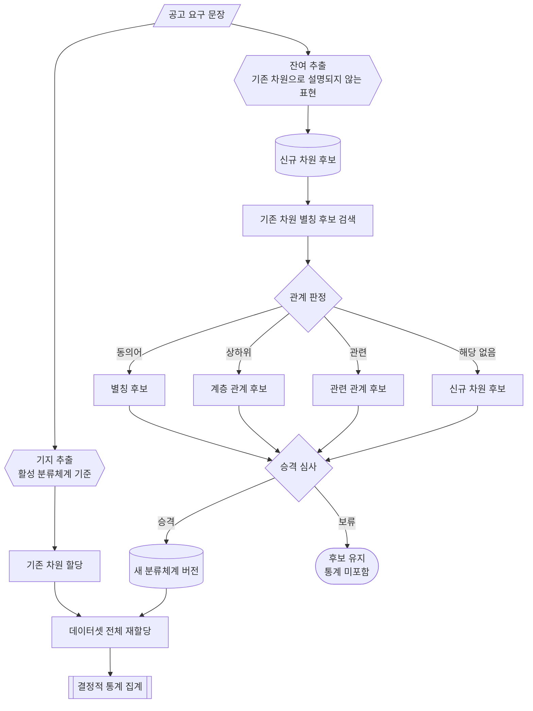
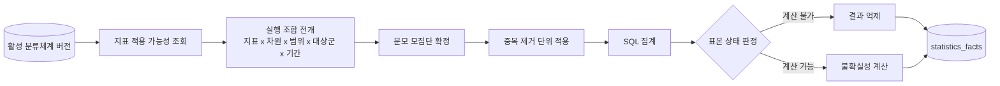

# CareerSignal 통계 모델

## 1. 문서 목적

이 문서는 직무별로 무엇을 세고 어떻게 세는지를 정의한다. 요구 차원의 발견과 승격 절차, 지표 family의 정의, 표본 정책, 화면 블록과 지표의 연결을 담는다.

분류체계와 지표의 테이블 정의는 [지식·저장 구조](knowledge-schema.md)에 있다. 이 문서는 그 테이블 위에서 동작하는 절차와 수식을 정의한다.

## 2. 측정 계약과 직무 어휘

측정의 구조는 직무와 무관하게 유지하고, 직무별 어휘는 자료에서 발견해 검증한 뒤 버전으로 승격한다.

| 종류 | 성격 | 예 |
| --- | --- | --- |
| 측정 계약 | 안정 | scope, version, evidence, claim, metric 인터페이스 |
| 핵심 온톨로지 | 안정, 버전 관리 | `Posting`, `RequirementDimension`, `Capability` |
| 직무 분류체계 | 발견과 승격으로 진화 | 백엔드의 동시성·정합성, 디자이너의 사용자 리서치 |

직무를 확장할 때 실행 파이프라인과 화면 계약을 재사용하고, 직무별 분류체계·근거 정책·표시 설정을 데이터로 추가한다. 자료의 구조가 다른 직무는 원문 파서와 지표 적용 규칙을 추가한다.

요구 차원을 코드에 고정하면 직무마다 다른 요구와 연도별 변화를 표현할 수 없다. 백엔드의 기술 빈도가 의미를 갖는 자리에서 다른 직무는 도구, 산업 도메인, 협업 범위가 의미를 갖는다.

## 3. 차원 발견

### 3.1 이중 경로 추출

활성 분류체계로 설명되는 표현과 설명되지 않는 표현을 분리해 추출한다. 개방 어휘만으로 추출하면 이미 확정된 차원을 누락하고, 의미가 가까운 별개 개념을 하나로 합친다.



### 3.2 관계 판정

후보 표현과 기존 차원의 관계를 네 가지로 판정한다.

| 판정 | 의미 | 처리 |
| --- | --- | --- |
| 동의어 | 같은 개념의 다른 표기 | `requirement_aliases`에 추가 |
| 상하위 | 한쪽이 다른 쪽을 포함 | `requirement_dimension_relations`에 `broader` 또는 `narrower` |
| 관련 | 자주 함께 나오지만 별개 개념 | `requirement_dimension_relations`에 `related` |
| 해당 없음 | 기존 차원으로 설명되지 않음 | 신규 차원 후보 |

의미가 가까운 표현을 동의어로 합치면 서로 다른 요구가 하나의 숫자로 뭉개진다. 메시지 큐, 비동기 처리, 이벤트 기반 아키텍처, 대용량 트래픽은 함께 나타나지만 각각 다른 준비를 요구한다. 관련 관계로 연결하고 별도 차원으로 유지한다.

### 3.3 차원 생명주기

```text
proposed
→ collecting_evidence
→ under_review
→ approved
→ active
→ merged | split | deprecated
```

`under_review`에서 나가는 전이는 셋이다.

```text
under_review → approved
under_review → merged
under_review → deprecated
```

승격 심사의 판정 가운데 `merge`는 후보를 기존 차원의 별칭으로 흡수하고 `reject`는 후보를 기각한다. 두 판정을 받은 후보는 차원이 되지 않으므로 `active`를 지나지 않으며, 심사를 받은 자리에서 `merged`와 `deprecated`로 끝난다.

`active` 이전의 후보는 통계에 포함하지 않는다. 발견은 후보 생성까지이며, 공식 분류체계 편입은 검증과 승격을 거친다.

### 3.4 승격 심사

승격 결정은 `requirement_candidate_decisions`에 다음을 기록한다.

```text
독립 공고 수
독립 회사 수
대표 문장
기존 차원과의 거리
표준 연결 상태
관계 판정 결과
평가 세트 대조 결과
검증 결과
승인 주체
taxonomy_policy_version
```

한 회사에서만 나타나는 표현은 차원이 아니라 그 회사의 특징이며 편차 해석이 다룬다.

승격 임계값은 `taxonomy_policy_version`이 정한다. 정책 버전 `tp_v1`의 임계값은 독립 공고 2건, 독립 회사 2곳이다. 임계값을 바꿀 때는 새 정책 버전을 등록하고 새 분류체계 버전이 그 버전을 적는다. 결정 기록이 심사에 사용한 정책 버전을 담으므로 이전 결정의 임계값 근거가 보존된다.

독립 공고 수와 독립 회사 수는 A 계층 자료에서 센다. 중복 제거 단위는 각각 `postings.posting_id`와 `companies.company_id`다.

### 3.5 재할당

새 분류체계 버전을 발행하면 해당 데이터셋의 mention 전체를 다시 할당한다. 버전이 다른 할당을 섞어 집계하지 않는다.

## 4. 표준 연결

발견된 시장 어휘를 외부 표준 용어로 치환하지 않는다. 표준은 직무 간 비교의 기준점이며, 연결의 성격을 상태로 기록한다.

| `standard_mapping_status` | 의미 |
| --- | --- |
| `exact` | 표준 항목과 같은 범위 |
| `broader` | 차원이 표준 항목보다 넓다 |
| `narrower` | 차원이 표준 항목보다 좁다 |
| `related` | 인접하지만 같지 않다 |
| `unmapped` | 대응하는 표준 항목이 없다 |

표준 문서는 최신 기술 어휘를 항상 담지 못한다. `unmapped` 상태를 정상 상태로 취급한다.

## 5. 지표

### 5.1 집계 파이프라인

집계는 결정적으로 수행한다. 생성 모델은 수치를 산출하지 않는다.



### 5.2 지표 family

| family | 입력 | 분자 | 분모 |
| --- | --- | --- | --- |
| `posting_prevalence` | 차원, 범위, 대상군, 기간 | 해당 차원 할당이 있는 `posting_version` 수 | 범위·대상군·기간의 `posting_version` 수 |
| `requiredness_ratio` | 차원, 범위, 대상군, 기간 | 필수 표현으로 나타난 `posting_version` 수 | 해당 차원이 나타난 `posting_version` 수 |
| `depth_distribution` | 차원, 범위, 대상군, 기간 | 깊이 등급별 `posting_version` 수 | 해당 차원이 나타난 `posting_version` 수 |
| `cluster_contrast` | 차원, 기업군, 대상군, 기간 | 기업군 `posting_prevalence` | 직무 전체 `posting_prevalence` |
| `cooccurrence` | 차원 두 개, 범위, 대상군, 기간 | measure별로 정의 | measure별로 정의 |
| `scope_expansion` | 범위, 대상군, 기간 | 역할 경계 범주 할당이 있는 `posting_version` 수 | 범위·대상군·기간의 `posting_version` 수 |
| `entry_label_advanced_signal_rate` | 범위, 기간 | 신입·주니어 표시 공고 중 심화 신호를 포함한 `posting_version` 수 | 신입·주니어 표시 `posting_version` 수 |

모든 지표의 중복 제거 단위는 `posting_version_id`다. 한 공고에서 같은 차원이 여러 번 나타나도 한 번으로 센다.

기업군 범위의 모집단은 `company_cluster_memberships`를 실행 봉투의 `as_of_date` 기준으로 해석해 확정한다. 공고 버전은 기업군을 속성으로 갖지 않는다.

### 5.3 대상군

대상군은 모집단을 나누는 축이며 모든 지표 행이 갖는다. 정의와 `entry_label` 대응은 [지표 명세](metric-spec.md) 2.7에 있다.

분모가 대상군으로 제한되므로 표본 판정도 대상군마다 따로 한다. 한 대상군이 최소 표본을 채우지 못하면 그 대상군의 수치만 억제하고 다른 대상군은 유지한다.

서로 다른 대상군의 수치를 하나의 기준선으로 비교하지 않는다. 신입·주니어 기준선과 경력 기준선을 나란히 두는 것이 비교의 목적이며, 두 값을 평균하지 않는다.

화면과 해석 이후 단계는 `all` 대상군을 기준선으로 쓴다. 정의는 [지표 명세](metric-spec.md) 2.7에 있다.

표본 상태가 노출 가능한 대상군은 기준선 옆에 함께 표시한다. 사용자가 대상군을 고르지 않으며, 억제는 대상군 단위로 적용해 표시 가능한 대상군만 남긴다. 신입·주니어 기준선은 지금 준비할 것을, 경력 기준선은 이후 기대 수준을 나타내므로 둘을 함께 볼 때 준비의 목표 지점이 드러난다.

`entry_label_advanced_signal_rate`는 대상군으로 전개하지 않는다. 분모가 이미 신입·주니어 표시 공고다.

### 5.4 `cluster_contrast`

차이와 비율을 모두 저장한다.

```text
prevalence_difference = cluster_prevalence - baseline_prevalence
prevalence_ratio      = cluster_prevalence / baseline_prevalence
```

`baseline_prevalence`가 0이면 `prevalence_ratio`를 저장하지 않고 `prevalence_difference`만 저장한다. 비율만 저장하면 작은 분모에서 과장된 값이 나오고, 차이만 저장하면 상대적 강조도가 사라진다.

### 5.5 `cooccurrence`

measure를 구분해 각각 저장한다.

| measure | 정의 |
| --- | --- |
| `count` | 두 차원이 함께 나타난 `posting_version` 수 |
| `jaccard` | 교집합 / 합집합 |
| `conditional_a_given_b` | 교집합 / B가 나타난 공고 수 |
| `conditional_b_given_a` | 교집합 / A가 나타난 공고 수 |
| `association_lift` | 관측 동시 출현 비율 / 독립 가정 기대 비율 |

### 5.6 `scope_expansion`

역할 경계를 넘어선 요구에만 적용한다. 백엔드 공고의 프론트엔드 요구, 개발 공고의 데이터 분석 요구, 구현 직무의 운영·인프라 요구가 해당한다.

적용 대상은 `requirement_dimension_versions.role_boundary_eligible`이 참인 차원으로 제한한다.

### 5.7 `entry_label_advanced_signal_rate`

신입·주니어 라벨을 붙인 공고 중 심화 신호를 포함한 공고의 비율이다. 심화 신호의 정의는 대용량, 동시성, 장애 대응 등 `depth_level`이 `tradeoff`인 할당의 존재로 판정한다.

이 지표는 관측값이며 기대값과의 차이가 아니다. 차이를 계산하려면 라벨별 기대 심화 신호 비율을 먼저 정의해야 한다.

### 5.8 시간 연산자

`temporal_delta`는 독립 지표가 아니라 다른 지표에 적용하는 연산자다.

```text
temporal_delta(
  base_metric,
  scope,
  period_a,
  period_b
)
```

어떤 지표의 변화인지를 `measure`에 함께 저장한다. `sample_size`는 두 기간 분모 중 작은 값을 담는다. 저장 항목은 [지표 명세](metric-spec.md) 4장에 있다.

### 5.9 지표 정책 버전

최소 표본, 억제 정책, 불확실성 계산 방법, 수식 버전은 상수가 아니라 `metric_policy_versions`로 관리한다. 테이블 정의는 [지식·저장 구조](knowledge-schema.md) 10장에 있다.

정책이 바뀌면 새 버전을 발행하고 이전 결과를 보존한다. 서로 다른 정책 버전의 수치를 비교하지 않는다.

### 5.10 표본 상태

표본이 적은 결과를 일괄로 숨기지 않고 사용 가능 범위를 구분한다.

| `sample_status` | 의미 |
| --- | --- |
| `not_computable` | 분모가 0이거나 계산할 수 없다 |
| `low_confidence` | 노출 가능하며 낮은 신뢰도를 표시한다 |
| `not_comparable` | 노출 가능하나 기간·기업군 비교에 사용하지 않는다 |
| `analysis_ready` | 해석·전략·로드맵의 근거로 사용한다 |

모든 `statistics_facts` 행은 `sample_size`, 기간, 범위, `uncertainty`를 함께 저장한다.

## 6. 지표 적용 가능성

지표마다 입력 차수와 적용 대상이 다르다. 모든 지표를 모든 차원에 적용하지 않는다. 차원 하나를 받는 지표, 차원 두 개를 받는 지표, 차원과 기업군을 함께 받는 지표, 차원 없이 범위만 받는 지표가 있다.

적용 가능성은 `dimension_metric_applicability`에 분류체계 버전별로 기록한다. 관련 테이블 정의는 [지식·저장 구조](knowledge-schema.md) 10장에 있다.

실행 조합은 다음으로 전개한다.

```text
활성 지표 템플릿
× 적용 가능한 차원 또는 차원 쌍
× 범위
× 대상군
× 기간
```

`entry_label_advanced_signal_rate`처럼 대상군이 분모에 이미 반영된 지표는 대상군으로 전개하지 않는다.

## 7. 화면 블록 연결

통계 화면의 블록은 지표 결과를 조합해 표시하는 계층이다. 블록과 지표는 일대일 대응이 아니다. 연결은 `screen_block_metric_bindings`에 기록한다.

블록의 구성은 직무와 무관하게 유지하고 블록이 표시하는 차원은 활성 분류체계에서 결정한다.

| 블록 | 사용하는 지표 |
| --- | --- |
| 지표 카드 | 모집단 수, `posting_prevalence` 상위 |
| 직무 외 요구 범위 | `scope_expansion` |
| 필수 인플레이션 | `temporal_delta(requiredness_ratio)` |
| 숨은 난이도 | `entry_label_advanced_signal_rate`, `depth_distribution` |
| 요구 빈도 | `posting_prevalence`, `requiredness_ratio` |
| 조합과 구현 수준 | `cooccurrence`, `depth_distribution` |
| 증가·유지·감소 추이 | `temporal_delta(posting_prevalence)` |
| 라벨과 현실 | `requiredness_ratio`, `entry_label_advanced_signal_rate` |
| 기업군 성향 | `cluster_contrast` |
| 요구 항목 전체표 | 전 지표 |

## 8. 표본 수렴

공고를 추가할 때 새로 등장하는 차원 후보의 증가량을 `saturation_observations`에 기록한다. 공고 누적 수, 신규 후보 수, 누적 차원 수, 한계 증가량을 담는다.

이 기록은 데이터셋 충분성의 진단 자료이며 수집이나 분석 실행의 단독 종료 사유가 아니다. 증가 곡선과 기업군별 확보 범위를 함께 검토해 표본의 충분성을 판단한다.

## 9. 깊이 프로파일

`depth_distribution`에서 역량별 기대 깊이를 도출해 `capability_depth_profiles`에 저장한다. 테이블 정의는 [지식·저장 구조](knowledge-schema.md) 8장에 있다.

깊이 등급의 의미는 Wiki가 정의하고, 어느 등급이 기대되는지는 이 산출물이 정의한다. 기대 깊이는 직무, 대상군, 기업군, 기간, 표본에 따라 달라지므로 개념 문서의 고정 속성으로 두지 않는다.

## 10. 검증

통계 산출물의 검사 목록은 [지표 명세](metric-spec.md) 7장에 있다. 검사 절차와 판정 형식은 [에이전트 설계](agent-design.md) 9장을 따른다.

## 11. 관련 문서

- [지표 명세](metric-spec.md)
- [지식·저장 구조](knowledge-schema.md)
- [아키텍처](architecture.md)
- [에이전트 설계](agent-design.md)
- [데이터 전략](data-strategy.md)
- [기획서](plan.md)
