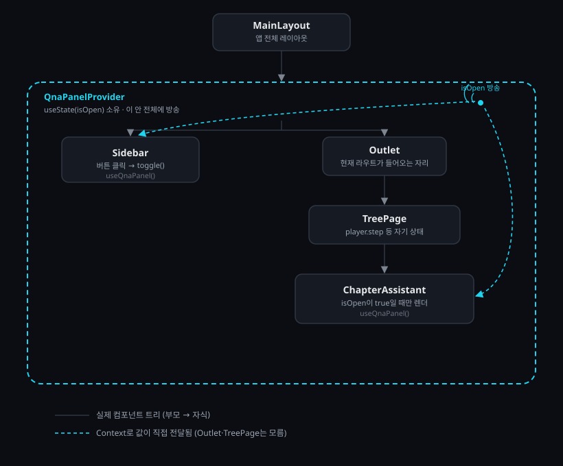

# AI Q&A 기능 코드 학습 노트 (2026-07-15)

오늘 만든 "AI Q&A 플로팅 패널" 기능 — 사이드바 버튼을 누르면 트리 페이지 등에 반투명 채팅창이 뜨는 기능 — 의 코드를 자바스크립트 문법 기초부터 한 줄씩 뜯어보며 학습한 내용을 순서대로 정리한다. 코드는 직접 CodeSandbox/StackBlitz의 **React (JavaScript)** 템플릿에 타이핑하며 따라감.

## 전체 그림 — 컴포넌트 트리 구조



- **실선**: 실제 코드 구조 그대로. `MainLayout`이 렌더링될 때 안에 `QnaPanelProvider`가 있고, 그 안에 `Sidebar`와 `Outlet`(→`TreePage`→`ChapterAssistant`)이 나란히 들어있는 진짜 부모-자식 트리.
- **점선(청록색)**: React Context가 하는 일. `QnaPanelProvider`가 가진 `isOpen` 값이 `Outlet`이나 `TreePage`를 전혀 거치지 않고, `Sidebar`와 저 멀리 있는 `ChapterAssistant`한테 곧바로 전달됨. 둘 다 `useQnaPanel()`을 부르는 순간 그 값을 받음.

**왜 이런 구조가 필요한가**: `Sidebar`와 `ChapterAssistant`는 부모-자식이 아니라 서로 다른 가지(사촌 관계)다. 상태가 바뀌면 "상태를 가진 곳(`QnaPanelProvider`)부터 그 자손 전체로" 리랜더링되는 리액트의 기본 규칙은 그대로이고, Context는 그 자손들 중 누구나(트리 상 아무리 멀어도) 중간 컴포넌트를 거치지 않고 값을 직접 읽을 수 있게 해주는 배송 수단이다.

## 1. `ChatMessage` 타입 (개념만, 실제 파일은 안 만듦)

실제 프로젝트(`src/features/qna/types.ts`, 타입스크립트)에는 이렇게 정의되어 있다.

```ts
export interface ChatMessage {
  role: 'user' | 'ai'
  text: string
}
```

- `interface`는 타입스크립트 전용 문법. "이 모양의 객체는 반드시 이런 속성을 가져야 한다"는 설계도이며, 컴파일 시점에만 존재하고 실행 시에는 완전히 사라짐.
- `role: 'user' | 'ai'` — `|`는 "또는". 값이 정확히 이 두 문자열 중 하나여야 하는 유니언 타입.

**JS 템플릿에서 연습할 때는 이 타입 자체가 필요 없다** — 실행 시 사라지는 문법이라 파일을 안 만들어도 되고, 그냥 나중에 `{ role: 'user', text: '...' }` 같은 평범한 객체를 직접 만들면 됨.

## 2. `QnaPanelContext.jsx` — Context로 상태 공유하기

```jsx
import { createContext, useContext, useState } from 'react'

const QnaPanelContext = createContext(null)

export function QnaPanelProvider({ children }) {
  const [isOpen, setIsOpen] = useState(false)
  const toggle = () => setIsOpen((value) => !value)

  return <QnaPanelContext.Provider value={{ isOpen, toggle }}>{children}</QnaPanelContext.Provider>
}

export function useQnaPanel() {
  const ctx = useContext(QnaPanelContext)
  if (!ctx) throw new Error('useQnaPanel must be used within QnaPanelProvider')
  return ctx
}
```

### `import { createContext, useContext, useState } from 'react'`

`react` 라이브러리 안에 미리 만들어져 있는 여러 도구 중, 이 세 개만 이름으로 콕 집어 가져온다는 뜻.

- **`createContext`** — 값을 방송할 "채널" 객체를 만드는 함수
- **`useContext`** — 그 채널에서 값을 꺼내오는 함수
- **`useState`** — 컴포넌트가 상태(시간에 따라 바뀌는 값)를 가질 수 있게 해주는 함수

`use`로 시작하는 함수는 리액트에서 **훅(Hook)**이라 부르는 특별한 종류의 함수.

### `const QnaPanelContext = createContext(null)`

- `createContext`는 React에 내장된 함수(공장), `QnaPanelContext`는 우리가 그 공장을 한 번 돌려서 얻은 결과물에 붙인 이름. **내장 객체가 아니라 우리가 호출해서 만든 것.**
- `createContext(null)`이 반환하는 건 대략 이런 모양의 평범한 객체:
  ```js
  {
    Provider: (리액트가 만들어준 특수 컴포넌트),
    현재_방송값: null   // 초기값
  }
  ```
- `.Provider`라는 이름은 **항상 고정** — 어떤 컨텍스트를 만들든 리액트가 정해놓은 이름이라 우리가 바꿀 수 없다. (예전엔 `.Consumer`도 있었지만 지금은 `useContext`로 대체됨.)
- `null`은 "이 채널이 아직 아무 `Provider`로도 안 감싸였을 때 받는 기본값"일 뿐.
- **왜 평범한 객체 `{}`로 직접 안 만드나?** 일반 객체는 리액트의 리랜더링 시스템과 연결이 전혀 없다. `createContext`가 만든 특수 객체만 `.Provider`로 값을 방송하면 리액트가 "이 채널을 구독 중인 컴포넌트들"을 자동으로 다시 렌더링해주는 배선이 되어 있음.

### `export function QnaPanelProvider({ children }) {`

- `function 이름(매개변수) { ... }` — 함수 선언의 기본 틀. `이름` 자리에 우리가 원하는 이름을 짓고, `(매개변수)`는 나중에 호출할 때 밖에서 넘겨줄 값을 받는 자리.
- `export` — 이 함수를 다른 파일에서 `import`로 가져다 쓸 수 있게 공개.
- **`({ children })`** — 리액트 컴포넌트는 항상 딱 하나의 매개변수(`props`, "이 컴포넌트한테 전달된 것들을 담은 객체")만 받는다. `{ children }`은 그 객체에서 `children` 속성만 바로 꺼내는 **구조 분해(destructuring)** 문법. 풀어쓰면:
  ```jsx
  function QnaPanelProvider(props) {
    // props.children 대신 그냥 children으로 바로 씀
  }
  ```
- `children`에 실제로 들어오는 값 — `<QnaPanelProvider>여기 안의 내용물 전부</QnaPanelProvider>`처럼 태그 사이에 있는 모든 것이 자동으로 `children`이 됨.

**리액트 컴포넌트가 받는 "객체"는 C++ 클래스 인스턴스가 아니다.** 자바스크립트 객체는 클래스 선언 없이 `{ 키: 값 }` 문법으로 그 자리에서 즉석으로 만드는 key-value 묶음일 뿐 (C++로 억지로 비유하면 타입 선언 없는 `map<string, 아무거나>`에 가까움). `QnaPanelProvider`도 `QnaPanelContext`의 "인스턴스"가 아니라, 그냥 자기 함수 본문 안에서 `QnaPanelContext.Provider`(객체의 필드 접근, `obj.name`과 같은 문법)를 갖다 쓰는 완전히 별개의 함수.

### `const [isOpen, setIsOpen] = useState(false)`

- `useState(false)` — `false`는 자바스크립트 기본 불리언 값(C++의 `bool`과 동일). "처음엔 꺼져있다"는 초기값.
- `useState`는 원소 2개짜리 **배열**을 반환: [지금 값, 그 값을 바꾸는 함수].
- `const [isOpen, setIsOpen] = ...` — 배열용 구조 분해. `{ children }`(객체 구조 분해)과 비슷하지만 배열은 **순서**로 매칭됨. `isOpen`, `setIsOpen`이라는 이름은 리액트가 정한 게 아니라 **우리가 직접 지은 이름** — 리액트는 그냥 "값 하나 + 바꾸는 함수 하나"를 순서대로 반환했을 뿐.

**`setState` 함수가 실제로 하는 일**: "값을 바꾼다"기보다 "새 값으로 통째로 갈아끼운다"에 가깝다. `setText('안녕하세요')`처럼 문자열을 넣으면 이전 값이 뭐였든 무시하고 그냥 새 문자열로 교체. 부르는 방법은 두 가지:
1. **직접 새 값을 준다**: `setText('안녕')` — 이전 값과 무관하게 그냥 교체할 때
2. **"이전 값을 받아 새 값을 계산하는 함수"를 준다**: `setIsOpen((value) => !value)` — 새 값이 이전 값에 의존할 때만 필요 (뒤집기가 대표적인 예)

### `const toggle = () => setIsOpen((value) => !value)`

- **화살표 함수(arrow function)**: `() => 무언가`는 함수를 짧게 쓰는 문법. `function toggle() { return setIsOpen(...) }`와 완전히 같음. C++ 람다(`auto f = [](){...};`)와 비슷한 개념 — 만들어서 변수에 담아두면 그 자리에서 실행되지 않고 저장만 됨.
- `(value) => !value` — `value`라는 매개변수(현재 상태값이 들어올 자리)를 받아 그걸 뒤집은(`!value`) 값을 반환하는 함수. `setIsOpen`에 **값이 아니라 이 함수 자체**를 넘김.
- **리액트가 실행하는 방식**: `setIsOpen`이 함수를 받으면, "지금 저장된 현재 값"을 그 함수의 매개변수 자리에 직접 넣어서 실행한다. 예: 현재 `isOpen`이 `false`일 때 → `value` 자리에 `false`가 들어감 → `!false` = `true` → 새 `isOpen`은 `true`가 됨.

### 클릭이 `toggle()` 실행으로 이어지는 과정

```jsx
<button onClick={toggle}>...</button>
```

- `onClick={toggle}` (괄호 없음) — 지금 실행하는 게 아니라 **함수 자체(참조)**를 리액트에게 건네줘서 "나중에 클릭되면 이 함수를 실행해달라"고 예약해두는 것. `onClick={toggle()}`이라고 쓰면 렌더링되는 순간 즉시 실행되어버리므로 틀림.
- C++로 비유하면 구조체 필드에 함수 포인터를 등록해두는 것과 같음: `struct Button { void (*onClick)(); }; b.onClick = toggle;` — 필드 이름(`onClick`)과 실제 가리키는 함수의 이름(`toggle`)은 서로 무관.
- 사용자가 실제로 버튼을 클릭하면, 리액트가 브라우저의 클릭 이벤트를 감지하고 그제서야 등록해둔 `toggle()`을 (괄호 붙여) 호출.

### `return <QnaPanelContext.Provider value={{ isOpen, toggle }}>{children}</QnaPanelContext.Provider>`

**이건 HTML이 아니라 JSX** — 자바스크립트 함수 호출을 HTML처럼 보기 좋게 쓴 문법이며, 빌드 도구가 아래처럼 평범한 함수 호출로 자동 변환해준다.

```js
return React.createElement(
  QnaPanelContext.Provider,       // 어떤 컴포넌트를 렌더링할지
  { value: { isOpen, toggle } },  // props 객체
  children                        // 안에 들어갈 내용물
)
```

- 소문자로 시작하는 태그(`<div>`, `<button>`)는 진짜 HTML 요소, 대문자/점으로 시작하는 것(`<QnaPanelContext.Provider>`)은 우리 코드에 있는 컴포넌트나 값을 가리킴.
- `value={{ isOpen, toggle }}` — 바깥 `{ }`는 "여기부터 자바스크립트 값"이라는 JSX 문법, 안쪽 `{ isOpen, toggle }`는 **객체 리터럴 축약 문법**으로 `{ isOpen: isOpen, toggle: toggle }`와 완전히 같음. 즉 `value`에 담기는 객체는 정확히 `isOpen`, `toggle` 두 필드를 가짐 — 이 필드 이름들이 나중에 받는 쪽에서 그대로 구조 분해될 이름과 일치해야 함:
  ```jsx
  const { isOpen, toggle } = useQnaPanel()
  ```
- `{children}` — 태그 사이의 이 중괄호는 매개변수로 받은 `children` 변수의 값을 그대로 그 자리에 끼워넣으라는 뜻.
- 함수가 최종적으로 돌려주는 건 HTML 텍스트가 아니라 "화면에 뭘 그려야 하는지 설명하는 자바스크립트 객체"이고, 리액트가 이를 받아 실제 브라우저 화면(DOM)에 반영한다.

## 헷갈렸던 부분 정리

### Context가 정당화될 만큼 prop drilling이 "얼마나" 비효율적인가

이 "비효율"은 **실행 속도(성능) 문제가 아니다.** props를 여러 컴포넌트를 거쳐 전달하는 건 컴퓨터 입장에선 거의 공짜 — 자바스크립트가 함수 인자 몇 개 더 넘기는 걸로 느려지지 않는다. 진짜 비효율은 **"코드를 수정하고 유지보수하는 사람"의 수고**다.

Context 없이 `isOpen`을 props로만 전달했다면:

```
MainLayout (isOpen 소유)
  └── Outlet
        └── TreePage (안 쓰는데 그냥 받아서 다시 넘겨줘야 함)
              └── ChapterAssistant (여기서 진짜로 씀)
```

3단계뿐이면 참을 만하지만, 실제 계획은 `ChapterAssistant`를 정렬/스택/큐/덱/유기화학/일반화학 등 거의 모든 페이지에 붙이는 것. props만 썼다면:

- 페이지가 10개면, `isOpen`을 안 쓰는 10개의 페이지 컴포넌트 전부에 "그냥 통과시켜주는 코드"를 매번 추가해야 함
- 나중에 `isOpen` 하나였던 게 `{ isOpen, unreadCount }`처럼 값이 늘어나면, 그 통과 경로에 있는 **모든 컴포넌트의 매개변수 목록**을 일일이 다시 고쳐야 함
- `TreePage`를 보는 사람 입장에서는 "이 컴포넌트가 Q&A 패널이랑 무슨 상관이지?" 싶은, 본래 역할(트리 시각화)과 무관한 코드가 계속 섞여 들어감

"비효율"의 단위는 **"값 하나가 바뀔 때마다 건드려야 하는 파일 개수"**. prop drilling은 트리가 깊어지고 넓어질수록 이 개수가 계속 늘어나고, Context는 이 개수를 "상태를 실제로 쓰는 컴포넌트 수"로 고정시켜줌 — 중간 컴포넌트는 그 값의 존재 자체를 몰라도 되니까.

Context도 공짜는 아님(상태가 트리 어딘가에 숨어있어서 처음 보는 사람은 "이 값이 어디서 오는지" 파악하기 조금 더 어려워짐). 그래서 실무에서도 **"여러 군데서 널리 쓰이는 값"**(로그인 여부, 다크모드, 우리 경우 Q&A 패널 열림 여부)에만 Context를 쓰고, 부모-자식 2~3단계 안에서 끝나는 값은 그냥 props로 넘기는 게 보통. 우리 경우는 "앱의 거의 모든 페이지가 이 값을 봐야 한다"는 조건에 맞아서 Context를 쓴 것.

### JSX가 함수 호출로 바뀌는 과정과 이유

**어떻게(How) — "트랜스파일(transpile)"이라는 별도 변환 단계**

브라우저는 JSX를 전혀 모른다. `<div>안녕</div>` 같은 코드를 브라우저에 그대로 던지면 문법 에러가 남 — 브라우저가 실행할 수 있는 건 순수 자바스크립트뿐.

`npm run dev`(Vite)를 실행하면, 코드가 브라우저에 도달하기 **전에** 중간 변환 단계가 끼어든다:

```
우리가 쓴 .tsx 파일 (JSX 포함)
        ↓
Vite가 내부적으로 돌리는 변환 도구(esbuild)가 JSX를 읽어서
        ↓
순수 자바스크립트 함수 호출로 바꿔치기한 새 코드
        ↓
이 변환된 코드만 브라우저로 전달되어 실행됨
```

이 변환 작업을 **트랜스파일(transpile)**이라고 부름 — "한 언어(JSX가 섞인 코드)를 다른 언어(순수 JS)로 바꿔주는 것". 개발자는 개발하는 동안 JSX 버전만 보고, 브라우저는 변환된 순수 JS 버전만 봄. 개발자 도구에서 실제 실행되는 코드를 열어보면 `<div>`가 하나도 없고 전부 함수 호출로 바뀌어 있음.

**왜(Why) — 개발자가 읽고 쓰기 편하려고**

JSX 없이 순수 함수 호출로 직접 쓰는 것도 가능하다:

```js
// JSX 없이 직접 쓰면
React.createElement('div', null,
  React.createElement('h1', null, '제목'),
  React.createElement('p', null, '설명')
)
```

```jsx
// JSX로 쓰면
<div>
  <h1>제목</h1>
  <p>설명</p>
</div>
```

둘은 완전히 같은 결과를 만들지만, 화면 구조가 조금만 복잡해져도(중첩이 3~4단계만 되어도) 함수 호출 버전은 괄호가 겹겹이 쌓여서 눈으로 구조를 따라가기 거의 불가능해짐. 반면 JSX는 들여쓰기와 여는/닫는 태그가 트리 구조(부모-자식)를 그대로 눈에 보이게 그려줘서, 실제 화면 모양을 상상하기 훨씬 쉬움.

정리: JSX는 자바스크립트에 새로운 실행 능력이 추가된 게 아니라, "UI는 원래 트리(중첩) 구조인데, 그걸 표현하기에 HTML 비슷한 태그 문법이 사람 눈엔 훨씬 편하니까" 순전히 **개발자 편의를 위해 만든 겉모습**이고, 실제로 실행되는 건 트랜스파일 이후의 100% 평범한 자바스크립트 함수 호출이다.

## 3. `useEffect` — 렌더링 이후에 딱 한 번만 실행하기

(오늘 만든 AI Q&A 코드에는 없지만, 별도로 학습한 리액트 훅. 다른 튜토리얼 예시로 학습함)

### 문제 상황: 왜 `fetch`를 컴포넌트 본문에 그냥 쓰면 안 되나

리액트의 기본 규칙: "상태(state)가 바뀌면 그 컴포넌트가 다시 렌더링(본문이 처음부터 다시 실행)된다." `useEffect` 없이 이렇게 쓰면:

```js
function Todos() {
  const [todos, setTodos] = useState([])

  fetch('...').then(data => setTodos(data))  // 본문에 바로 씀 — 하면 안 됨

  return <ul>...</ul>
}
```

1. 렌더링됨 → 본문 실행 → `fetch` 호출
2. 데이터 도착 → `setTodos(data)` → 상태 변경
3. 상태가 바뀌었으니 리액트가 다시 렌더링
4. 다시 렌더링 = 본문이 또 처음부터 실행 → `fetch`가 또 호출됨
5. 또 데이터 도착 → 또 `setTodos` → 또 리랜더링 → 또 `fetch`... **무한 반복**

"렌더링될 때마다 본문이 통째로 다시 실행된다"는 규칙 자체는 그대로인데, 이 규칙 때문에 "렌더링 중에 상태를 바꾸는 일(fetch 결과로 setState)"을 본문에 그냥 두면 무한루프가 생김.

### 해결책: `useEffect`로 "렌더링이 끝난 다음에만" 실행

```js
useEffect(() => {
  // 할 일
}, [])
```

인자 두 개:
1. **실행할 일을 담은 함수** (화살표 함수 — 함수를 값으로 넘기는 익숙한 패턴)
2. **의존성 배열** — "이 안의 값이 바뀌면 다시 실행해라"는 조건. **비어있으면(`[]`)** "아무것도 의존 안 함" → "컴포넌트가 화면에 처음 뜬 직후 딱 한 번만 실행"이라는 뜻.

`fetch`가 본문(렌더링 계산 중)이 아니라 "렌더링이 끝나고 화면에 반영된 다음"에 딱 한 번만 실행되므로, `setTodos`로 인한 리랜더링에서는 `useEffect`가 다시 실행되지 않음(의존성 배열이 비어있으니까) → 무한루프 없음.

### 예시 코드 한 줄씩

```js
function Todos() {
  const [todos, setTodos] = useState([])  // 처음엔 빈 배열

  useEffect(() => {
    fetch('https://jsonplaceholder.typicode.com/todos')
      .then(res => res.json())
      .then(data => setTodos(data))
  }, [])  // 빈 배열 → 딱 한 번만 실행

  return <ul>{todos.map(t => <li key={t.id}>{t.title}</li>)}</ul>
}
```

1. 처음 렌더링 시 `todos`가 `[]`라 `<ul>`은 일단 비어있는 채로 화면에 뜸
2. 화면에 뜬 직후 `useEffect` 안의 함수 실행 → `fetch(...)`로 데이터 요청
3. `.then(res => res.json())` — 응답을 실제 사용 가능한 데이터(JSON)로 변환
4. `.then(data => setTodos(data))` — 변환된 데이터로 상태를 통째로 교체(새 값으로 갈아끼우기)
5. `todos` 상태 변경 → 다시 렌더링 → 이번엔 실제 데이터가 들어있어 `<ul>`에 목록이 그려짐
6. 의존성 배열이 `[]`라서 이 리랜더링 때는 `useEffect`가 다시 실행 안 됨 → `fetch` 재호출 없이 한 번으로 끝

정리: `useEffect`는 렌더링 계산과 분리해서 "화면에 반영된 후 실행할 부수적인 일(서버 요청 등)"을 등록하는 도구이고, 의존성 배열은 "언제 다시 실행할지"를 정하는 조건. `[]`는 "딱 한 번만"이라는 특별한 경우.

## 다음에 이어서 볼 것

**다음 시작 지점: `QnaPanelContext.tsx`의 `export function useQnaPanel()` 부터**

```jsx
export function useQnaPanel() {
  const ctx = useContext(QnaPanelContext)
  if (!ctx) throw new Error('useQnaPanel must be used within QnaPanelProvider')
  return ctx
}
```

- `MainLayout.tsx`에서 `QnaPanelProvider`로 전체를 감싸는 실제 코드
- `Sidebar.tsx`/`ChapterAssistant.tsx`에서 `useQnaPanel()`로 값을 꺼내 쓰는 코드
- `useState`로 메시지 목록(`ChatMessage[]`)을 관리하는 `ChapterAssistant`의 나머지 로직
