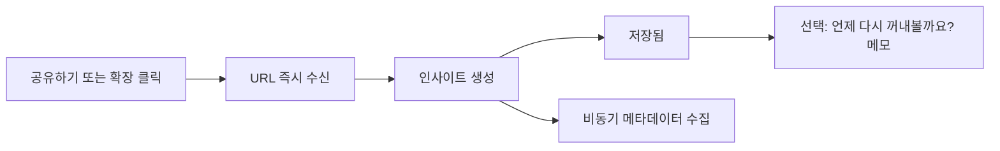

# 캡처 우선 저장 경험 설계

## 문서 목적

아맞다에서 저장은 링크를 잃지 않게 하는 가장 짧은 행동이어야 한다. 이 문서는 사용자가 URL을 복사·붙여넣기하지 않고도 여러 기기에서 인사이트를 저장하는 제품 원칙과 확정된 조건을 기록한다.

## 후속 범위 결정

2026-07-16 #37은 Android의 네이티브 앱·공유 Intent 대신 설치형 Chrome PWA를 현재 구현 범위로 확정했다. PWA 공유 대상 선택은 자동 저장하지 않고 인증된 웹 저장 화면에 초안을 채운 뒤 사용자의 명시적 저장 확인을 받는다. 아래의 네이티브 공유·즉시 저장 내용은 장기 제품 방향의 역사 기록으로 보존하며, 현재 Android 웹 구현은 [모바일 웹 저장과 Android PWA 공유 진입 설계](2026-07-16-mobile-web-pwa-save-design.md)가 대체한다.

## 확정된 제품 조건

### 1. 저장의 최우선 결과

- 사용자가 저장 의도를 표현하면 링크가 먼저 보관되어야 한다.
- 카테고리, 메모, 제목 수정, 미리보기, 메타데이터 수집, AI 처리는 저장 성공의 선행 조건이 아니다.
- URL 직접 입력은 예외 상황을 위한 대체 경로이며, 일상적인 저장의 주 경로가 아니다.

### 2. 개인 맥락의 기록

- `메모`는 사용자가 링크를 저장한 이유 또는 다시 꺼내볼 상황을 남기는 선택 입력이다.
- 메모는 링크 저장이 끝난 뒤 즉시 보이지만, 작성하지 않고 닫을 수 있다.
- 메모는 짧은 한두 문장 용도로 길이를 제한한다. 정확한 글자 수는 구현 전에 별도 결정한다.
- 카테고리는 기존 분류 기능으로 유지하며, 개인 맥락 메모를 대체하지 않는다.
- LLM이 사용자의 개인적 의도를 생성하거나 확인하도록 하지 않는다.
- 사용자가 선택한 원문 문장을 메모에 활용하는 기능은 URL만 공유되는 자료도 있으므로 필수 저장 경로가 아닌 후속 보조 기능으로 둔다.

저장 직후의 질문은 다음 문구를 기본으로 한다.

> 언제 다시 꺼내볼까요?

### 3. 자동 처리의 역할

- 시스템은 제목, 설명, 썸네일 등 원문을 설명하는 메타데이터를 비동기로 수집할 수 있다.
- 자동 처리는 자료가 무엇인지 설명하고 검색용 정보를 보완한다. 사용자가 왜 저장했는지는 메모만 신뢰할 수 있는 신호로 취급한다.
- 메타데이터 수집 실패는 이미 완료된 링크 저장을 되돌리지 않는다.
- 자동 처리의 진행 상태와 실패 상태를 저장 화면에 노출하지 않는다.

### 4. 사용자에게 보이는 결과

- 링크를 받아들이는 데 성공했을 때만 짧게 `저장됨`을 보여준다.
- 링크를 안전하게 받아들이지 못한 경우에만 `저장하지 못했어요. 다시 시도해 주세요.`처럼 행동이 분명한 오류를 보여준다.
- `동기화 대기`, `메타데이터 수집 중`, `재시도 중`처럼 시스템 내부 상태를 사용자에게 보여주지 않는다.
- 저장 후 메모를 쓰려는 사용자는 성공 안내와 같은 흐름에서 바로 입력할 수 있다.

### 5. 기기별 저장 진입점

| 환경        | 반복 사용자의 주 저장 동작     | 제품 원칙                                                      |
| ----------- | ------------------------------ | -------------------------------------------------------------- |
| iOS·Android | 공유하기에서 아맞다 선택       | 공유 대상 선택 자체를 저장 의도로 보고 링크를 즉시 받아들인다. |
| PC Chrome   | 고정한 아맞다 확장 아이콘 클릭 | 팝업을 먼저 열지 않고 현재 탭을 즉시 저장한다.                 |
| 웹          | URL 붙여넣기                   | 공유·확장을 쓸 수 없을 때의 대체 경로다.                       |

- iOS는 설치형 앱에 Share Extension을 포함해 공유 시트의 수신 대상으로 제공한다.
- Android는 설치형 앱이 공유 Intent를 수신해 공유 시트의 수신 대상으로 제공한다.
- PC Chrome은 Manifest V3 확장이 현재 탭의 URL과 제목을 받아 공통 저장 흐름으로 전달한다.
- 공유 시트에서 아맞다가 선택지로 노출되는 것은 보장하되, 운영체제가 정하는 표시 순서까지 제어한다고 약속하지 않는다.

### 6. 공통 캡처 계약

모든 저장 진입점은 같은 캡처 계약을 사용한다. 진입점에 따라 저장 규칙이나 데이터 모델이 달라지지 않게 한다.

```text
공유 시트 / Chrome 확장 / 웹 URL 입력
                 ↓
           공통 캡처 처리
                 ↓
        URL 검증·정규화·중복 처리
                 ↓
          인사이트 즉시 생성
           ├─ 선택 메모 저장
           └─ 메타데이터 비동기 수집
```

- 공유 시트와 확장에서 받은 URL, 제목, 텍스트는 모두 신뢰하지 않는 외부 입력으로 검증한다.
- URL은 `http`와 `https`만 허용하고, 서버에서 URL 검증·정규화·중복 처리를 수행한다.
- 사용자 데이터 저장은 파라미터화된 API와 RLS를 사용한다. 클라이언트·확장 프로그램·공유 확장에는 서비스 역할 키를 두지 않는다.
- 메모와 메타데이터는 일반 텍스트로 렌더링하며 HTML로 해석하지 않는다.

## 비협상 저장 흐름



1. 사용자가 공유 시트에서 아맞다를 선택하거나 Chrome 확장을 클릭한다.
2. 시스템은 URL을 받아들여 인사이트를 생성한다.
3. 사용자에게는 `저장됨`만 짧게 알린다.
4. 같은 흐름에서 메모를 입력하거나 닫을 수 있다.
5. 메타데이터 수집과 검색 데이터 보강은 저장 이후에 독립적으로 실행된다.

## 구현 전에 결정할 사항

다음 사항은 제품 원칙을 바꾸지 않지만, 구현 계획을 만들기 전에 결정해야 한다.

1. 메모의 정확한 최대 글자 수와 글자 수에 도달했을 때의 입력 피드백
2. 공유된 텍스트에 URL이 없을 때의 처리 문구와 선택한 원문 문장 보조 기능의 도입 시점
3. 네트워크가 불안정할 때 내부 저장 대기열을 언제까지 유지하고 어떤 조건에서 재시도하는지
4. iOS·Android 앱 셸의 구현 방식과 기존 Google 로그인 세션을 네이티브 앱·확장에 연결하는 방법
5. Chrome 확장의 첫 로그인·아이콘 고정 온보딩과 즉시 메모 입력 UI

## 범위와 검증 기준

- 설치와 첫 로그인을 마친 반복 사용자는 모바일에서 `공유하기 → 아맞다 선택`, PC Chrome에서 확장 아이콘 한 번으로 링크 저장을 시작할 수 있어야 한다.
- URL 복사, 앱 전환, URL 붙여넣기, 별도 저장 버튼을 반복 저장의 필수 행동으로 만들지 않는다.
- 카테고리와 메모를 비워도 저장할 수 있어야 한다.
- 자동 수집 또는 메모 저장 실패가 링크 저장 자체를 없애지 않아야 한다.
- 각 진입점에서 URL 수신 실패, 인증 실패, 중복 URL, 메타데이터 수집 실패를 별도로 검증한다.

## 관련 문서

- [현재 MVP](../../../CONTEXT.md)
- [인사이트 저장 계획](../plans/amadda-insight-save.md)
- [URL 메타데이터 수집 계획](../plans/amadda-metadata.md)
- [로컬 우선 북마크 MVP 설계](2026-07-13-local-first-bookmark-mvp-design.md)
