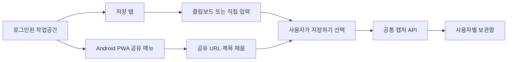

# 모바일 웹 저장과 Android PWA 공유 진입 설계

## 목적

별도 iOS·Android 네이티브 앱을 만들지 않고, 기존 React 웹을 모바일에서도 편하게 사용할 수 있게 한다. 로그인한 사용자는 일반 모바일 웹과 설치된 Android Chrome PWA의 공유 메뉴에서 모두 같은 보관함에 링크를 저장할 수 있다.

## 범위

- 기존 React 앱의 모바일 반응형 화면을 정비한다.
- 저장 탭에 클립보드 붙여넣기 보조 동작을 추가한다.
- 설치된 Android Chrome PWA를 공유 대상으로 등록하고, 공유한 링크를 저장 화면에 채운다.
- 첫 저장을 마친 Android Chrome 사용자에게만 선택적 설치 안내를 한 번 제공한다.
- 기존 #38 공통 캡처 API와 Supabase 인증·RLS 경계를 그대로 사용한다.

## 범위 밖

- iOS·Android 네이티브 앱, 네이티브 공유 확장, 앱 스토어 배포
- iPhone의 시스템 공유 메뉴를 통한 아마다 저장
- 비로그인 상태의 저장, 임시 링크 보관, 로그인 뒤 저장 재개 흐름
- 오프라인 저장·동기화

## 사용자와 인증 경계

서비스는 다음 흐름으로만 이용한다.

```text
온보딩 → Google 로그인 → 홈 · 보관함 · 저장
```

- 홈·보관함·저장 화면은 로그인된 작업공간 안에서만 렌더링한다.
- 일반 저장과 공유 저장 모두 현재 세션의 액세스 토큰으로만 요청한다.
- 로그인되지 않은 상태는 서비스 사용 시나리오로 확장하지 않는다. 작업공간과 저장 기능을 렌더링하지 않으며, 링크를 임시 보관하거나 서버에 전달하지 않는다.
- 서비스 역할 키는 브라우저, PWA, 서비스 워커에 두지 않는다. #38의 브라우저 캡처 서비스와 서버의 사용자 토큰 검증·RLS를 유지한다.

## 저장 진입점

두 진입점은 같은 저장 화면과 같은 공통 캡처 API로 수렴한다.



### B. 일반 모바일 웹 저장

1. 사용자는 하단 내비게이션의 `저장` 탭을 연다.
2. `클립보드에서 붙여넣기`를 누르면, 사용자 동작 안에서 클립보드 텍스트를 읽어 URL 입력칸에 채운다.
3. 클립보드 읽기를 지원하지 않거나 권한을 주지 않은 환경에서는 기존 입력칸에 직접 붙여넣는다.
4. 사용자가 `저장하기`를 눌렀을 때만 캡처 API를 호출한다.
5. 성공·중복 모두 `저장됨`으로 안내하고, 제목·메모·카테고리는 선택적으로 뒤이어 편집한다.

### C. 설치된 Android Chrome PWA 공유 저장

1. 사용자는 Android Chrome에서 설치한 아마다를 시스템 공유 메뉴의 대상으로 선택한다.
2. PWA 공유 대상은 전달받은 URL과 선택적 제목을 같은 저장 화면에 채운다.
3. 공유 URL은 사용자 확인 전 자동 저장하지 않는다.
4. 사용자가 `저장하기`를 누르면 공통 캡처 API를 호출한다.
5. PWA 공유 진입은 `android_share`, 일반 웹 저장은 `web` 소스를 사용한다. 두 소스 모두 현재 저장 스키마를 분기하지 않고 공통 계약으로 처리한다.

공유 대상 기능은 설치된 PWA에서만 제공하며, Android Chrome을 지원 환경으로 한정한다. iPhone과 설치하지 않은 모바일 웹 사용자는 B 흐름을 사용한다.

## PWA 구성

- 웹 앱 매니페스트에 앱 이름·아이콘·표시 모드·공유 대상 선언을 추가한다.
- 서비스 워커를 등록해 설치 가능 조건과 공유 대상 요청을 처리한다.
- 공유 대상 요청의 URL·제목은 인증된 작업공간의 저장 초안으로만 전달하고, API 요청은 만들지 않는다.
- 저장 초안이 화면에 전달된 뒤 외부 진입 매개변수는 주소에서 제거한다.
- 설치 안내는 Android Chrome에서 첫 저장에 성공한 뒤 한 번만 보인다. 설치를 거부하거나 닫아도 저장 기능은 변하지 않는다.
- iPhone과 미지원 브라우저에는 설치 안내를 보이지 않는다.

## 모바일 화면 규칙

- `<= 767px`에서는 한 열, 전폭 입력과 섹션 구성을 사용한다.
- 기존 고정 하단 내비게이션의 `보관함 · 홈 · 저장` 탭을 유지하고, 저장 탭을 두 진입점의 공통 목적지로 사용한다.
- 모든 터치 제어는 최소 44px을 유지한다.
- URL 입력칸은 항상 표시한다. 클립보드 버튼은 입력을 돕는 보조 동작이며 입력을 대체하지 않는다.
- 공유 진입에서는 URL·제목을 미리 채우되, 저장 버튼과 저장 후 선택적 맥락 입력의 구조는 일반 저장과 동일하다.
- 데스크톱과 태블릿의 기존 3열·2열 정보 구조를 바꾸지 않는다.

## 오류 처리

- 잘못된 URL, 지원하지 않는 프로토콜, 권한 거부, 원격 저장 실패는 #38의 재시도 가능한 오류 표현을 그대로 사용한다.
- 클립보드 읽기 실패는 오류 경고 대신 직접 입력 가능한 기존 저장 화면을 유지한다.
- 공유로 들어온 URL도 서버 정규화·검증·사용자별 중복 규칙을 통과해야 저장된다.
- 자동 저장과 익명 저장을 추가하지 않는다.

## 검증 기준

- 로그인된 사용자는 모바일 폭에서 홈·보관함·저장 탭을 사용할 수 있다.
- 저장 탭의 클립보드 버튼은 사용자 동작으로 URL을 채우고, 실패하면 직접 입력을 막지 않는다.
- 설치된 Android Chrome PWA는 공유 메뉴에서 URL·제목을 저장 화면으로 전달한다.
- 공유 URL은 사용자가 저장을 누르기 전에는 캡처 API를 호출하지 않는다.
- 일반 웹은 `web`, PWA 공유 진입은 `android_share`로 공통 캡처 서비스를 호출한다.
- 인증 세션 없이 캡처 API 요청을 만들지 않으며, 서버는 토큰과 RLS로 사용자 소유권을 계속 보장한다.
- 매니페스트·서비스 워커·아이콘이 프로덕션 HTTPS 환경에서 설치 가능 조건을 충족한다.
- 모바일 전용 변경이 데스크톱 저장·보관함·검색 흐름을 회귀시키지 않는다.

## 구현 순서

1. 모바일 저장 화면과 하단 내비게이션의 반응형 규칙을 테스트와 함께 정비한다.
2. 클립보드 붙여넣기 보조 동작과 직접 입력 대체 경로를 구현한다.
3. 매니페스트·아이콘·서비스 워커·공유 대상 진입을 추가한다.
4. 공유 URL·제목을 저장 화면 초안으로 연결하고, `android_share` 소스로 공통 캡처 API를 호출한다.
5. 설치 안내, 브라우저 지원 분기, 단위·통합·빌드 검증을 추가한다.
