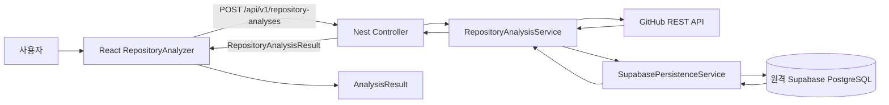

# PtoP 원격 Supabase 수직 슬라이스 설계

## 목표

Docker 로컬 환경 구성을 먼저 확장하지 않고, 사용자가 React 화면에 GitHub Repository URL을 입력했을 때 Nest API가 공개 GitHub 데이터를 분석하고 원격 Supabase에 저장한 뒤 실제 결과를 화면에 반환하는 한 사이클을 완성한다.

이번 구현의 성공 기준은 다음과 같다.

1. React에서 Repository URL을 입력하고 분석을 요청할 수 있다.
2. Nest가 URL을 검증하고 공개 GitHub Repository 정보를 가져온다.
3. Nest가 Repository, 분석 결과, 참여자 지표, 분석 근거를 원격 Supabase에 저장한다.
4. Nest가 저장된 분석 결과를 React에 반환한다.
5. React가 mock 데이터가 아닌 API 결과를 표시한다.
6. API 실패와 저장 실패가 사용자에게 명확하게 표시된다.
7. API 동작과 Supabase 저장을 테스트로 검증한다.

## Docker를 지금 사용하지 않는 이유

Docker는 PtoP의 핵심 기능이 아니라 로컬 개발 환경을 격리하고 반복 가능하게 만드는 도구다. 현재는 `React -> Nest -> Supabase` 연결 자체가 완성되지 않아 Docker가 해결해야 할 환경 문제가 아직 구체적이지 않다.

따라서 다음 순서로 진행한다.

- 먼저 원격 Supabase를 사용해 실제 수직 슬라이스를 완성한다.
- 원격 테스트 데이터 관리, migration 반복 검증, 팀 환경 재현이 불편해질 때 Docker를 도입한다.
- 이미 작성한 migration, seed, pgTAP 테스트는 삭제하지 않고 이후 로컬 환경 구성의 기반으로 유지한다.
- 구현 중에는 현재 실행 중인 Supabase Docker 컨테이너를 중지하고 원격 환경만 사용한다.

Docker는 다음 조건 중 하나가 발생할 때 다시 도입한다.

- 원격 개발 DB의 테스트 데이터가 실제 개발 데이터를 방해한다.
- migration을 원격 반영 전에 독립 DB에서 반복 검증해야 한다.
- 다른 개발자가 같은 Supabase 환경을 재현해야 한다.
- CI에서 매번 초기화되는 통합 테스트 DB가 필요하다.

## 범위

### 포함

- 공개 GitHub Repository URL 분석
- GitHub Repository 기본 정보 조회
- 최근 contributor와 commit 조회
- commit 수 기준 활동 비율 계산
- 원격 Supabase 네 테이블 저장
- 동일한 분석 결과 중복 저장 방지
- React loading, success, error 상태 연결
- Nest 단위·E2E 테스트
- 원격 Supabase 저장 통합 테스트
- React API 연동 테스트

### 제외

- 비공개 Repository OAuth 인증
- 사용자 로그인과 분석 결과 소유권
- README 및 코드 파일 내용 분석
- PR, Issue, Review 분석
- AI 회고 또는 포트폴리오 문장 생성
- Realtime, Storage, Edge Function
- Docker 기반 로컬 실행 자동화

## 아키텍처



React는 Supabase에 직접 접근하지 않는다. Supabase Secret Key와 데이터 저장 책임은 Nest API 내부에만 둔다.

## API 계약

### 요청

```http
POST /api/v1/repository-analyses
Content-Type: application/json
```

```json
{
  "repositoryUrl": "https://github.com/SubJeeLee/hub",
  "githubLogin": "SubJeeLee"
}
```

- `repositoryUrl`은 필수다.
- `githubLogin`은 선택 값이다.
- URL은 `https://github.com/{owner}/{repository}` 형식만 허용한다.
- Repository owner를 현재 사용자로 단정하지 않는다.

### 성공 응답

공유 타입 `RepositoryAnalysisResult`를 사용한다.

```json
{
  "id": "analysis-result-uuid",
  "repository": {
    "url": "https://github.com/SubJeeLee/hub",
    "owner": "SubJeeLee",
    "name": "hub",
    "description": "Repository description",
    "defaultBranch": "main",
    "languages": {
      "TypeScript": 80,
      "CSS": 20
    }
  },
  "contributors": [
    {
      "login": "SubJeeLee",
      "commitCount": 12,
      "commitActivityPercent": 60
    }
  ],
  "commits": [
    {
      "sha": "commit-sha",
      "authorLogin": "SubJeeLee",
      "message": "feat: add Repository analysis",
      "committedAt": "2026-07-16T00:00:00Z"
    }
  ],
  "contributionSummary": {
    "metric": "commit_count",
    "notice": "commit 수 기준 활동 비율이며 실제 기여도나 작업 난이도를 의미하지 않습니다."
  },
  "analyzedAt": "2026-07-16T00:05:00Z"
}
```

### 오류 응답

| 상태 | 상황 | 사용자 메시지 기준 |
| --- | --- | --- |
| `400` | URL 누락 또는 잘못된 형식 | 올바른 GitHub Repository URL 입력 요청 |
| `404` | 공개 Repository를 찾을 수 없음 | 주소 또는 공개 여부 확인 요청 |
| `429` | GitHub API 제한 | 잠시 후 재시도 안내 |
| `502` | GitHub 또는 Supabase 외부 요청 실패 | 분석 과정의 일시적 실패 안내 |
| `500` | 분류되지 않은 서버 오류 | 재시도 안내, 내부 로그에 원인 기록 |

응답에는 Supabase 키, GitHub Token, 내부 DB 오류 전문을 포함하지 않는다.

## Nest 구성

### `RepositoryAnalysisController`

- `POST /repository-analyses` 요청을 받는다.
- body를 공유 요청 타입으로 전달한다.
- URL 형식 오류를 `400`으로 변환한다.
- 비즈니스 로직과 외부 API 호출을 직접 수행하지 않는다.

### `RepositoryAnalysisService`

- URL에서 owner와 Repository 이름을 추출한다.
- GitHub Client를 통해 Repository, languages, contributors, commits를 조회한다.
- GitHub languages API의 byte 수를 화면과 저장 형식에서 사용할 비율로 정규화한다.
- contributor commit 합계를 기준으로 활동 비율을 계산한다.
- 분석 결과의 안정적인 hash를 생성해 동일 결과를 구분한다.
- Persistence Service에 저장을 요청하고 저장된 결과를 반환한다.

### `GitHubRepositoryClient`

- Node의 `fetch`를 사용해 GitHub REST API를 호출한다.
- `GITHUB_TOKEN`이 있으면 Authorization header를 추가하고 없으면 공개 API로 요청한다.
- 최대 contributor 100명과 최근 commit 100개만 조회한다.
- GitHub 응답 DTO를 PtoP 내부 모델로 변환한다.

### `SupabaseClientService`

- `SUPABASE_URL`, `SUPABASE_SECRET_KEY`로 서버 전용 Client를 한 번 생성한다.
- 환경 변수가 없으면 애플리케이션 시작 단계에서 실패시킨다.
- Client 자체만 제공하며 Repository 분석 저장 규칙을 포함하지 않는다.
- API 연동 전에 로컬에서 검증한 `20260716064914_grant_repository_analysis_service_role.sql`을 원격 Supabase에 적용한다.

### `RepositoryAnalysisPersistenceService`

- `repositories`를 `github_repository_id` 기준으로 upsert한다.
- 같은 Repository, 대상 GitHub ID, analyzer version, result hash의 완료 결과를 먼저 조회한다.
- 동일 결과가 있으면 새 snapshot을 만들지 않고 기존 결과를 반환한다.
- 새 결과라면 `analysis_results`, `contributor_metrics`, `analysis_evidence`를 저장한다.
- 하위 저장이 실패하면 새 `analysis_results`를 삭제해 부분 저장을 정리한다.

## 데이터 저장 규칙

### `repositories`

- GitHub API의 Repository ID, owner, 이름, URL, 설명, 기본 branch, 공개 범위, fork/archive 여부, topic, license, homepage, 생성·push 시점을 저장한다.

### `analysis_results`

- 분석 결과를 먼저 `pending`으로 생성하고 contributor와 evidence 저장이 모두 끝난 뒤에만 `completed`로 변경한다.
- `analyzed_ref`는 기본 branch, `head_sha`는 최근 commit SHA를 사용한다.
- `analyzer_version`은 첫 수직 슬라이스에서 `github-metadata-v1`로 고정한다.
- `result_hash`는 시각을 제외한 Repository 정보, contributor, commit 결과를 정규화해 생성한다.
- API 제한이나 일부 데이터 누락은 `warnings`에 저장한다.

### `contributor_metrics`

- GitHub contributors API의 commit 수를 저장한다.
- 전체 commit 수 합계를 기준으로 `commit_activity_percent`를 계산한다.
- `githubLogin`과 일치할 때만 `is_target`을 `true`로 기록한다.

### `analysis_evidence`

- 이번 범위에서는 최근 commit만 `evidence_type = commit`으로 저장한다.
- SHA, message, URL, 작성 시점, author login을 근거로 남긴다.

## React 변경

- `RepositoryAnalyzer`의 인위적인 `wait`와 `createMockAnalysisResult` 호출을 제거한다.
- API 요청 코드는 `repositoryAnalysisApi.ts`로 분리한다.
- `VITE_API_BASE_URL`이 있으면 사용하고, 없으면 `http://localhost:3000/api/v1`을 기본값으로 사용한다.
- loading 상태에서는 기존 spinner를 유지한다.
- 성공 시 공유 `RepositoryAnalysisResult`를 `AnalysisResult`에 전달한다.
- 실패 시 서버 응답의 안전한 사용자 메시지를 표시한다.
- mock 안내 문구와 `isMock` 필드는 제거한다.
- 결과 화면은 contributor의 commit 수 기준 활동 비율과 최근 commit message를 표시한다.

## 테스트 전략

### Nest 단위 테스트

- 올바른 GitHub URL을 owner와 Repository 이름으로 분리한다.
- 잘못된 URL을 거절한다.
- contributor 활동 비율 합계가 반올림 오차 범위에서 100이 되는지 확인한다.
- GitHub Client와 Persistence Service를 대역으로 두고 분석 orchestration을 검증한다.
- 동일 result hash일 때 기존 결과를 반환하는 저장 규칙을 검증한다.

### Nest E2E 테스트

- `POST /api/v1/repository-analyses`가 요청 body를 Service에 전달하고 `201` 응답을 반환하는지 확인한다.
- 잘못된 URL이 `400`을 반환하는지 확인한다.
- 외부 API 실패가 정의된 상태 코드와 안전한 메시지로 변환되는지 확인한다.

### Supabase 저장 통합 테스트

- 별도 명령으로 실행하며 기본 `npm test`에는 포함하지 않는다.
- 실제 원격 Supabase에 고유한 테스트 Repository ID로 네 테이블을 저장한다.
- 저장한 행과 관계를 다시 조회한다.
- Repository 테스트 행을 삭제하고 cascade 정리를 확인한다.
- 성공과 실패 여부와 관계없이 `finally`에서 테스트 데이터를 삭제한다.
- 테스트 로그에는 Secret Key를 출력하지 않는다.

### React 테스트

- URL 입력 후 API 요청 payload를 확인한다.
- 요청 중 loading 상태를 확인한다.
- 성공 응답이 contributor와 commit 결과로 표시되는지 확인한다.
- 실패 응답의 사용자 메시지가 표시되는지 확인한다.

## 보안

- `SUPABASE_SECRET_KEY`와 `GITHUB_TOKEN`은 `apps/api/.env`에만 둔다.
- `apps/web`과 `VITE_` 환경 변수에는 서버 Secret을 넣지 않는다.
- `.env` 파일은 Git에 포함하지 않는다.
- Supabase 접근은 Nest API만 수행한다.
- 현재는 사용자 인증이 없으므로 `anon`, `authenticated`에 테이블 정책을 열지 않는다.
- 원격 저장 통합 테스트 데이터는 실행 직후 삭제한다.

## 운영 및 관찰 기준

- Nest는 분석 요청 시작, GitHub 조회 실패, Supabase 저장 실패를 단계별로 기록한다.
- 로그에는 URL owner/name과 내부 분석 ID만 남기고 Secret과 GitHub 원본 응답 전체는 기록하지 않는다.
- 프론트엔드에는 사용자가 조치할 수 있는 오류만 전달한다.

## 완료 기준

- 공개 GitHub Repository URL로 React에서 분석 요청을 보낼 수 있다.
- Nest가 실제 GitHub 데이터를 가져와 원격 Supabase 네 테이블에 저장한다.
- React가 저장된 실제 분석 결과를 표시한다.
- 같은 분석 결과를 반복 요청해도 중복 snapshot이 생성되지 않는다.
- API 단위·E2E·React 테스트가 통과한다.
- 원격 Supabase 저장 통합 테스트가 저장·조회·cleanup을 검증한다.
- `npm test`, `npm run typecheck`, `npm run build`가 통과한다.
