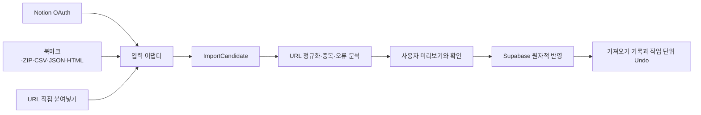

# 범용 인사이트 가져오기 설계

## 문서 상태

- 작성일: 2026-07-25
- 관련 제품 결정: [#24 기존 북마크 가져오기의 첫 범위를 정한다](https://github.com/ppre1ude/hub/issues/24)
- 선행 설계: [인사이트 마이그레이션과 원문 복원력 설계](2026-07-10-insight-migration-design.md)
- 상태: 사용자 승인 완료

이 문서는 기존 설계의 제품 원칙을 유지하면서 현재 코드베이스와 첫 사용자 범위에 맞춘 1차 구현 기준을 정의한다. 기존 문서는 장기적인 서비스 확장 방향을 보존하는 참고 자료이며, 첫 구현 범위와 구조가 충돌할 때는 이 문서를 우선한다. 2026-07-10 Chrome 전용 구현 계획은 현재 FSD, 저장소와 디자인 계약이 바뀌기 전 문서이므로 그대로 실행하지 않는다.

## 배경과 결정

아맞다 사용자는 업무와 학습 중 발견한 링크를 여러 서비스에 나누어 저장한다. 문제는 특정 서비스에 저장했다는 사실보다 저장 위치가 파편화되어 있고, 필요한 순간에 다시 찾기 어렵다는 데 있다.

첫 사용자 페르소나는 다음과 같이 정의한다.

> Notion, 브라우저 북마크, YouTube, 카카오톡 등에 업무·학습 자료를 분산 저장하고, 필요할 때 다시 찾기 어려운 국내 지식노동자

초기 검증 채널은 개발자 커뮤니티로 삼되 제품을 개발자 전용으로 제한하지 않는다. 서비스 사용 여부를 물은 기존 설문은 첫 사용자 후보를 찾는 근거로만 사용하며, 서비스별 저장량이나 이전 의향을 입증한 자료로 해석하지 않는다.

제품의 핵심 단위는 서비스명이 아니라 `외부 저장물에서 링크 기반 인사이트 후보를 가져오는 행동`이다. 대표 서비스는 출시 순서와 빠른 안내를 위한 우선순위이며, 지원 가능한 출처의 전체 목록이나 도메인 모델이 아니다.

## 제품 약속

사용자는 저장 출처를 정확히 알거나 파일 구조를 이해하지 않아도 자신의 저장물을 아맞다 보관함으로 옮길 수 있다.

- 공식 계정 연결이 가능한 출처는 OAuth를 우선 사용한다.
- 파일을 제공하는 출처는 형식과 구조를 자동 감지한다.
- 처음 보는 출처도 `http` 또는 `https` URL을 찾을 수 있으면 최선형으로 가져온다.
- URL 외의 제목, 메모와 컬렉션은 의미를 확정할 수 있을 때만 보존한다.
- 분석 결과를 확인하기 전에는 보관함을 변경하지 않는다.
- 기존 인사이트를 덮어쓰지 않으며 가져오기 작업을 안전하게 되돌릴 수 있다.

범용 지원은 모든 출처를 완전하게 복원한다는 뜻이 아니다. 전용 어댑터가 없는 출처는 URL 복원을 성공 기준으로 삼고, 추출하지 못한 제목·메모·컬렉션을 추측하지 않는다.

## 검토한 접근

### 1. 서비스 목록 중심

Notion, Pinterest, YouTube처럼 지원할 서비스를 먼저 정하고 서비스별 기능을 각각 구현한다.

- 장점: 사용자에게 익숙한 이름과 안내를 제공하기 쉽다.
- 단점: 새로운 출처마다 분석, 중복, 반영과 Undo가 중복되고 제품 범위가 서비스 목록에 종속된다.

제품 구조로 채택하지 않는다. 대표 서비스 이름은 빠른 진입점과 출시 순서에서만 사용한다.

### 2. 파일 형식 중심

CSV, JSON, HTML 같은 범용 파일만 지원하고 서비스별 의미와 OAuth 연결을 다루지 않는다.

- 장점: 넓은 출처를 적은 구조로 처리할 수 있다.
- 단점: 내보내기와 업로드를 사용자에게 맡겨 편리함이 떨어지고, 폴더나 데이터베이스 의미를 놓친다.

공식 연결이 없는 출처의 안전망으로만 사용한다.

### 3. 기능 중심의 범용 파이프라인과 선택적 어댑터

모든 입력을 같은 표준 후보로 변환하고, 서비스·형식별 어댑터는 인식 정확도와 입력 편의만 높인다.

- 장점: OAuth와 파일 입력이 같은 분석·반영 정책을 사용하고, 처음 보는 출처도 최소 이관할 수 있다.
- 단점: 공통 계약과 어댑터 책임을 초기에 명확히 분리해야 한다.

이 접근을 채택한다.

## 1차 범위

### 포함

- 출처와 무관한 입력 감지와 후보 표준화
- URL 검증과 기존 보관함·입력 내부 중복 분석
- 신규·중복·오류 미리보기
- 사용자 확인 뒤 원자적 반영
- 멱등한 재실행
- 가져오기 기록과 작업 단위 Undo
- Notion Public Connection OAuth
- Chrome을 첫 픽스처로 사용하는 브라우저 북마크 HTML
- CSV, JSON, HTML, Markdown, 일반 텍스트의 범용 URL 추출
- 안전한 ZIP 입력
- URL 목록 직접 붙여넣기
- 외부 컬렉션과 아맞다 카테고리의 선택적 연결

### 후속 범위

- YouTube 사용자 생성 재생목록 OAuth
- YouTube `나중에 볼 동영상`의 공식 이전 경로
- 카카오톡 나와의 채팅 대량 이전
- Pinterest OAuth
- Instagram 저장 게시물과 컬렉션
- 추가 서비스와 파일 형식 전용 어댑터

후속 서비스도 이 문서의 공통 파이프라인을 사용한다. 공식 API가 저장 목록을 제공하지 않는 출처를 비공개 API, 세션 쿠키, DOM 스크래핑으로 우회하지 않는다.

### 제외

- 외부 서비스와의 지속 동기화
- 외부 서비스에 대한 쓰기 권한
- 외부 원문의 본문·이미지·파일 복제
- 외부 설명이나 캡션을 사용자 메모로 추론
- AI를 이용한 URL·카테고리·메모 추측
- 가져오기 전 개별 항목 선택을 필수로 만드는 흐름
- 원본 업로드 파일의 서버 보관
- 가져오기 때문에 별도 대시보드를 만드는 작업

## 핵심 아키텍처



`features/insight-import`는 사용자 행동, 표준 후보, 분석 정책과 UI를 소유한다. 입력 어댑터는 이 feature 안의 공개 계약을 구현하되, 외부 서비스와 통신하는 서버 코드는 `server` 경계에 둔다. 보관함 page는 `onOpenImport` callback만 노출하고 app 조합 경계가 feature의 `InsightImportDialog`를 렌더링한다.

- 브라우저 파일 어댑터는 원본을 브라우저 안에서 파싱한다.
- Notion 어댑터는 서버에서 OAuth 토큰을 사용해 사용자가 허용한 콘텐츠만 읽는다.
- 모든 어댑터는 같은 `ImportCandidate`를 반환한다.
- 분석기는 현재 `normalizeInsightUrl` 계약과 같은 URL 정책을 사용한다.
- 반영기는 Supabase RPC 한 경계에서 중복을 다시 검사하고 작업 기록과 인사이트를 함께 반영한다.
- 저장·검색·꺼내보기는 가져온 인사이트를 일반 인사이트와 구분하지 않는다.

외부 사용자는 feature 내부 구현 경로가 아니라 `features/insight-import/index.ts`의 named export만 사용한다. 화면은 외부 UI 패키지를 직접 import하지 않고 `shared/ui` public API와 `DESIGN.md`의 White Canvas 계약을 따른다.

## 입력 어댑터 계약

어댑터는 출처를 제품 도메인으로 승격하지 않고 입력을 표준 후보로 번역한다.

```ts
type ImportInput =
  | { kind: 'connected-account'; connectionId: string }
  | { kind: 'file'; file: File }
  | { kind: 'pasted-text'; text: string };

type ImportCandidate = {
  candidateId: string;
  originalUrl: string;
  titleCandidate: string | null;
  explicitMemoCandidate: string | null;
  collectionPath: string[];
  capturedAtCandidate: string | null;
  sourceLocation: string;
  warnings: ImportWarning[];
};

type ImportSourceAdapter = {
  detect(input: ImportInput): Promise<number>;
  extract(input: ImportInput): Promise<ImportCandidate[]>;
};
```

`detect` 결과는 일치 가능성을 나타내며, 가장 높은 신뢰도의 전용 어댑터를 먼저 사용한다. 전용 어댑터가 구조를 확정하지 못하면 범용 추출기로 내려간다. 낮은 신뢰도로 여러 URL 필드가 발견될 때만 사용자에게 URL·제목·메모 필드를 한 번 매핑하도록 요청한다.

`candidateId`는 입력 안의 위치를 안정적으로 식별하기 위한 값이며 외부 서비스의 영구 ID를 인사이트에 저장한다는 뜻이 아니다. `sourceLocation`은 오류 항목을 사용자가 찾을 수 있는 행·파일·페이지 위치이며 가져오기 기록을 삭제하면 함께 삭제한다.

## 입력별 동작

### Notion OAuth

- 사용자는 `Notion에서 가져오기`를 선택하고 Notion의 공식 OAuth 화면으로 이동한다.
- Public Connection의 페이지 선택기에서 가져올 페이지와 데이터베이스를 직접 허용한다.
- 읽기 권한만 요청하며 콘텐츠 생성·수정 권한은 요청하지 않는다.
- 서버는 허용된 페이지, 데이터베이스와 하위 콘텐츠만 조회한다.
- URL 속성, URL을 값으로 가진 텍스트 필드와 명시적 링크를 후보로 감지한다.
- 데이터베이스에 URL 후보 필드가 여러 개면 가져오기 전에 한 번 매핑을 요청한다.
- Notion 페이지 자체 주소는 기본적으로 제외하며, 사용자가 연결 전에 `Notion 페이지 자체 주소도 가져오기`를 명시적으로 선택한 경우에만 후보로 포함한다.
- OAuth 연결은 일회성 마이그레이션에만 사용한다. 완료·취소·만료 뒤 토큰을 삭제하고 Provider가 지원하는 경우 연결을 철회한다.

### 브라우저 북마크 HTML

- 첫 실제 픽스처는 Chrome이 내보내는 Netscape Bookmark HTML을 사용한다.
- 같은 구조를 사용하는 다른 브라우저 파일은 서비스명과 무관하게 형식 감지로 처리한다.
- 링크 제목과 중첩 폴더 경로를 후보에 보존한다.
- HTML을 문서로 표시하거나 안의 script, event handler, embed를 실행하지 않는다.
- 원본 파일은 브라우저 메모리를 벗어나지 않는다.

### 범용 파일과 ZIP

- CSV와 JSON은 URL을 포함한 필드 후보를 찾는다.
- HTML과 Markdown은 링크 문법과 텍스트 URL을 찾는다.
- 일반 텍스트는 줄 단위 URL과 문장 안의 URL을 찾는다.
- ZIP은 허용된 파일만 안전하게 해제해 같은 감지 절차에 전달한다.
- 구조가 알려지지 않아도 URL을 확정할 수 있으면 가져오기를 막지 않는다.
- URL 의미를 확정할 수 없으면 보관함을 변경하지 않고 필드 매핑이나 다른 파일을 요청한다.

모든 파서는 명시적인 파일 크기, 항목 수, 압축 해제 크기, 파일 개수와 중첩 깊이 제한을 가져야 한다. 구현 계획은 선택한 파서의 메모리 특성을 기준으로 운영 값을 고정하며, 제한과 보안 회귀 테스트 없이 파서를 활성화하지 않는다.

### URL 직접 붙여넣기

- 한 줄에 하나 또는 문장 안에 섞인 여러 URL을 감지한다.
- 붙여넣은 설명을 메모로 자동 저장하지 않는다.
- 같은 입력 안의 중복도 분석 결과에 포함한다.

## 사용자 흐름

1. 로그인한 사용자가 보관함에서 `내 저장물 가져오기`를 선택한다.
2. `계정 연결`, `파일 선택`, `링크 붙여넣기` 중 한 입력 방식을 선택한다.
3. 시스템이 출처와 형식을 감지하고 보관함을 변경하지 않은 채 후보를 분석한다.
4. 구조가 모호한 입력만 필드 매핑을 한 번 요청한다.
5. 신규, 기존 보관함 중복, 입력 내부 중복, 제외 항목과 발견한 컬렉션을 요약한다.
6. 사용자는 외부 컬렉션을 기존 또는 새 카테고리에 선택적으로 연결한다.
7. 사용자가 `가져오기`를 누르면 준비된 묶음을 반영한다.
8. 완료 화면은 성공·중복·제외 개수, 제외 항목 확인과 `가져오기 되돌리기`를 제공한다.

빈 보관함에서는 첫 링크 저장과 `내 저장물 가져오기`를 함께 눈에 띄게 제공한다. 기존 인사이트가 있으면 보관함 안의 지속적인 보조 진입점으로 둔다. 가져오기는 로그인이나 온보딩의 필수 단계가 아니다.

미리보기는 모든 항목의 긴 목록보다 결과와 정책을 먼저 보여준다. 사용자는 예외가 있을 때만 상세 목록을 펼친다. Loading은 Mist 기반 정적 상태, Error는 원인·복구 행동, Success는 결과·다음 행동을 함께 제공하며 반복 애니메이션을 사용하지 않는다.

모든 입력과 버튼에는 visible label을 제공하고 진행 상태는 `aria-live`로 전달한다. 파일 선택, 필드 매핑, 상세 예외, 반영과 Undo는 키보드만으로 완료할 수 있어야 한다. 터치 타깃은 최소 44px이며 모바일에서는 입력과 주요 액션을 한 열로 배치한다.

## 분석과 충돌 정책

### URL 검증

- 앞뒤 공백 제거, 호스트 소문자화, 기본 포트 제거, fragment 제거와 추적 파라미터 제거는 기존 URL 정규화 계약을 재사용한다.
- `http`와 `https`만 허용한다.
- `javascript:`, `data:`, `file:`, `ftp:`와 로컬·사설망 주소는 제외한다.
- 가져오기 분석은 외부 원문에 네트워크 요청을 보내지 않는다.

### 중복

- 사용자별 동일한 정규화 URL은 하나의 인사이트다.
- 입력 안의 중복과 기존 보관함 중복을 구분해 집계한다.
- 분석 뒤 다른 저장 경로에서 같은 URL이 추가될 수 있으므로 반영 RPC가 DB 고유 제약을 기준으로 다시 판정한다.
- 같은 가져오기를 재실행해도 새 중복이 생기지 않는다.

### 기존 데이터 보호

- 기존 인사이트의 제목, 메모와 카테고리를 덮어쓰지 않는다.
- 1차 구현에서는 기존 인사이트의 빈 필드도 자동 보충하지 않는다.
- 중복 후보의 외부 제목, 메모와 컬렉션은 결과 설명에 필요한 범위만 가져오기 기록에 남긴다.
- 중복 후보 하나 때문에 정상 신규 후보의 가져오기를 막지 않는다.

### 신규 필드

- 외부 제목이 있으면 신규 인사이트의 제목 후보로 사용한다.
- 제목이 없으면 기존 저장 계약과 같이 도메인 또는 URL을 사용한다.
- 명시적인 사용자 메모 필드만 메모 후보로 사용할 수 있다.
- 게시물 설명, 캡션, 페이지 본문과 컬렉션 이름을 메모로 승격하지 않는다.

### 컬렉션과 카테고리

- 브라우저 폴더, Notion 데이터베이스·페이지 경로와 다른 외부 컬렉션은 같은 `collectionPath`로 표현한다.
- 외부 컬렉션을 아맞다 카테고리로 자동 확정하지 않는다.
- 사용자가 미리보기에서 명시적으로 연결한 경우에만 기존 또는 새 카테고리를 사용한다.
- 매핑하지 않은 신규 인사이트는 미분류로 가져온다.
- 현재 단일 카테고리 계약에서는 하나의 후보가 여러 외부 경로를 가질 때 사용자가 선택한 한 카테고리만 연결한다.

## 저장 모델과 원자성

정확한 SQL 이름은 구현 계획에서 현재 migration 순서와 충돌하지 않게 확정하되 저장 책임은 다음 세 경계로 분리한다.

### 가져오기 작업

- 사용자 ID
- 입력 종류와 감지된 어댑터
- `analyzing`, `ready`, `committing`, `completed`, `failed`, `undone` 상태
- 전체·신규·중복·제외·생성·보존 개수
- 멱등성 키
- 생성·완료·만료 시각

### 가져오기 항목

- 작업과 후보 식별자
- 표준화한 후보 필드
- 분석 분류와 경고
- 생성된 인사이트 ID
- Undo 판단을 위한 반영 직후 수정 시각
- 선택한 카테고리 ID

### 임시 OAuth 연결

- 사용자와 Provider
- 암호화한 access token과 refresh token
- 토큰 만료 시각
- OAuth `state`와 연결 상태
- 자동 삭제 시각

OAuth 토큰은 AES-256-GCM으로 암호화하고 암호화 키는 Vercel Sensitive 환경 변수에만 둔다. token, nonce와 인증 tag를 분리해 저장하며 키와 평문 토큰은 데이터베이스, 브라우저, 로그와 빌드 산출물에 남기지 않는다. OAuth callback과 자동 정리는 서버 전용 경계에서 수행한다.

OAuth `state`는 발급 후 10분 동안 한 번만 사용할 수 있다. 연결 토큰은 완료·취소 시 즉시 삭제하며, 중단된 가져오기는 연결 후 24시간이 지나면 토큰과 미반영 분석 후보의 만료 대상이 된다. 실제 삭제는 다음 일일 Cron에서 실행하므로 24시간 즉시 삭제를 보장하지 않는다.

반영을 완료하면 후보·오류·컬렉션 정보는 commit 트랜잭션에서 즉시 삭제한다. 생성 인사이트 ID와 반영 직후 수정 시각만 최소 Undo 원장에 완료 후 24시간까지 보관하고, DB 시각으로 기한을 넘긴 Undo 요청은 거부한다. Supabase Cron은 만료 원장을 1분마다 정리한다. 완료·Undo된 요약 작업 기록은 사용자가 삭제할 때까지 유지하며, 기록을 삭제해도 이미 가져온 인사이트는 유지된다.

가져오기 작업·항목은 사용자별 RLS를 적용한다. 서버 전용 권한은 OAuth callback과 만료된 토큰 정리에만 사용하고, 일반 조회·분석·반영은 로그인한 사용자 세션과 RLS 경계를 따른다. 서버 전용 secret은 `VITE_*` 환경 변수에 두지 않고 client bundle secret 검사 범위를 유지한다.

반영 RPC는 `ready` 작업만 받는다. 작업을 `committing`으로 잠그고 현재 DB 중복을 다시 확인한 뒤 신규 인사이트, 카테고리 연결과 항목 결과를 한 트랜잭션으로 기록한다. 실패하면 모든 변경을 롤백하고 작업을 재시도 가능한 실패 상태로 둔다.

## Undo

- Undo는 해당 작업에서 새로 만든 인사이트만 대상으로 한다.
- 가져오기 전에 존재한 중복 인사이트는 삭제하지 않는다.
- 반영 직후 기록한 `updated_at`과 현재 값이 같은 인사이트만 삭제한다.
- 가져온 뒤 사용자가 수정했거나 다른 시스템 작업으로 변경된 인사이트는 보수적으로 유지한다.
- 이미 사용자가 삭제한 인사이트는 오류가 아니라 결과의 이미 삭제됨 개수로 처리한다.
- Undo는 생성된 카테고리를 자동 삭제하지 않는다. 다른 인사이트가 사용할 수 있기 때문이다.
- 완료된 Undo는 같은 요청을 다시 보내도 추가 데이터를 변경하지 않는다.

## 실패 처리

| 실패 범위                    | 처리                                                  |
| ---------------------------- | ----------------------------------------------------- |
| 파일 손상·미지원·제한 초과   | 보관함을 변경하지 않고 다른 입력을 요청한다.          |
| URL 필드 식별 실패           | 필드 매핑 또는 재업로드를 요청한다.                   |
| 개별 URL 오류                | 해당 후보만 제외하고 정상 후보는 유지한다.            |
| OAuth 취소·권한 거부         | 연결되지 않은 상태로 돌아가며 데이터를 만들지 않는다. |
| 토큰 만료·철회               | 재연결을 안내하고 기존 보관함을 유지한다.             |
| Provider 호출 제한·일시 장애 | `Retry-After`를 우선하고 지수 백오프로 재시도한다.    |
| DB 반영 실패                 | 트랜잭션을 롤백하고 부분 완료를 남기지 않는다.        |
| Undo 대상 사용자 수정        | 수정된 인사이트를 유지하고 보존 개수를 알린다.        |

Notion 분석처럼 여러 요청이 필요한 작업은 마지막으로 완료한 cursor를 기록해 재개할 수 있다. 재개 과정에서도 동일한 후보 ID와 멱등성 키를 사용해 중복 분석 작업을 만들지 않는다.

## 보안과 개인정보

- OAuth 요청은 추측 불가능하고 일회성인 `state`를 사용하며 callback에서 사용자·Provider·만료를 검증한다.
- Provider client secret과 토큰 교환은 서버에서만 수행한다.
- 외부 계정 비밀번호, 세션 쿠키와 개인 토큰을 사용자에게 직접 입력하도록 요구하지 않는다.
- 원본 파일과 파일 안의 문자열은 신뢰하지 않는다.
- HTML·Markdown의 script, event handler, iframe과 embed를 실행하지 않는다.
- ZIP은 경로 이탈, 심볼릭 링크, 중첩 압축과 압축 폭탄을 차단한다.
- 가져오기 파서는 외부 URL을 따라가거나 메타데이터를 요청하지 않는다.
- 운영 로그는 작업 ID, 단계, 어댑터와 개수만 기록한다.
- 전체 URL, query 값, 제목, 메모, 원본 파일명, OAuth code와 token을 로그에 기록하지 않는다.
- 가져오기 기록 삭제는 후보, 오류 위치와 미해결 컬렉션 매핑 정보를 함께 삭제한다.
- 완료·취소·실패 후 더 이상 필요하지 않은 OAuth 토큰은 즉시 삭제하고, 중단된 연결은 자동 만료로 정리한다.

## 테스트 전략

테스트는 내부 구현 횟수보다 사용자가 관찰하는 공개 행동을 검증한다. 행동 하나마다 `RED → GREEN → REFACTOR`를 반복한다.

### 픽스처

- 실제 Chrome 형식을 익명화한 북마크 HTML
- URL 속성, 텍스트 링크, 중첩 페이지와 데이터베이스를 포함한 익명화 Notion 응답
- URL 열이 하나인 CSV와 여러 개인 CSV
- 중첩 JSON, HTML, Markdown, 일반 텍스트
- 안전한 ZIP과 경로 이탈·압축 폭탄을 모사한 악성 ZIP

### 계층별 검증

- 모든 어댑터가 같은 `ImportCandidate` 계약을 만족하는 계약 테스트
- 신규, 입력 내부 중복, 기존 중복, 잘못된 URL과 재실행 도메인 테스트
- 분석 전 무변경과 사용자 승인 뒤 반영 UI 테스트
- OAuth `state`, 권한 거부, 토큰 만료, 철회와 호출 제한 서버 테스트
- 원자적 반영, 멱등성, RLS와 사용자 수정 보호 Undo pgTAP 테스트
- 악성 HTML, 위험 프로토콜, ZIP 경로 이탈과 제한 초과 보안 회귀 테스트
- 파일 선택, 필드 매핑, 미리보기, 반영, 상세 예외와 Undo 접근성 테스트
- Desktop, Tablet, Mobile에서 진행 상태·결과·긴 제목의 시각 검증

실제 OAuth Provider는 CI에서 호출하지 않는다. 공식 응답 계약을 고정한 fixture와 서버 경계 mock을 사용하고, 출시 전 승인된 테스트 계정으로 Preview 환경의 OAuth callback과 최소 권한을 확인한다.

## 완료 기준

- 사용자는 출처를 정확히 지정하지 않아도 지원 파일이나 붙여넣기에서 URL 후보를 분석할 수 있다.
- 사용자는 Notion 계정을 연결하고 허용한 콘텐츠에서 링크 후보를 가져올 수 있다.
- 분석 전에는 보관함이 변경되지 않는다.
- 미리보기의 신규·중복·제외 개수와 실제 반영 결과가 일치한다.
- 기존 제목·메모·카테고리가 변경되지 않는다.
- 동일한 입력과 반영 요청을 다시 실행해도 중복 인사이트가 생성되지 않는다.
- 기술적 실패는 부분 완료를 정상 상태로 남기지 않는다.
- 원본 파일과 평문 OAuth 토큰이 서버 저장소, 로그와 클라이언트 번들에 남지 않는다.
- Undo가 기존 인사이트와 사용자가 수정한 가져온 인사이트를 보존한다.
- 가져온 인사이트를 일반 저장물과 동일하게 보관함, 검색과 꺼내보기에서 사용할 수 있다.

## 출시와 학습

1차 출시에서는 Notion OAuth와 Chrome 북마크 HTML을 대표 진입점으로 보여주되 `지원 서비스 전체`라고 표현하지 않는다. 범용 파일과 URL 붙여넣기는 `다른 곳에서 가져오기`로 제공한다.

출시 후 다음 행동을 제품 개선 근거로 사용한다.

- 선택한 입력 방식과 감지된 형식
- 분석 시작·완료·반영·Undo 여부
- 전체·신규·중복·제외 개수
- 필드 매핑이 필요했는지
- 실패 단계와 오류 코드

원본 URL, 제목, 메모와 외부 파일 내용은 분석 지표로 수집하지 않는다. 후속 전용 어댑터는 서비스 일반 이용률이 아니라 실제 가져오기 시도, 저장량, 완료율과 사용자의 명시적 요청을 근거로 정한다.

## 참고 자료

- [작업 컨텍스트](../../../CONTEXT.md)
- [개발 아키텍처](../../development-architecture.md)
- [기술 스택](../../tech-stack.md)
- [운영 배포](../../deployment.md)
- [디자인 계약](../../../DESIGN.md)
- [Notion Public Connections](https://developers.notion.com/guides/get-started/public-connections)
- [Notion Authorization](https://developers.notion.com/guides/get-started/authorization)
- [Pinterest OAuth](https://developers.pinterest.com/docs/getting-started/set-up-authentication-and-authorization/)
- [YouTube Data Portability schema](https://developers.google.com/data-portability/schema-reference/youtube)
- [Google Data Portability 지원 지역](https://support.google.com/accounts/answer/14452558?hl=ko)
- [Instagram API Overview](https://developers.facebook.com/docs/instagram-platform/instagram-api-with-instagram-login/overview)
