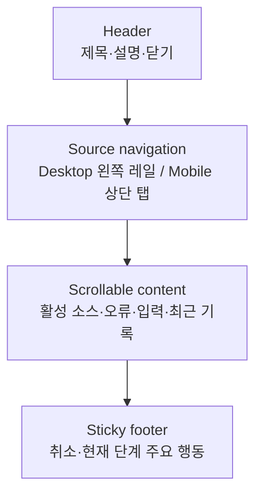
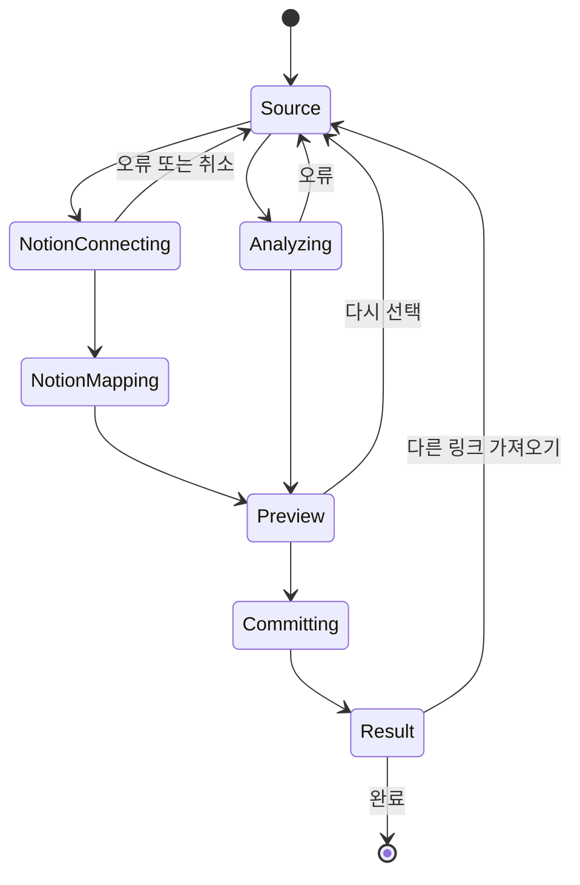

# 반응형 가져오기 대화상자 설계

## 문서 상태

- 작성일: 2026-07-28
- 관련 이슈: [#86 가져오기 대화상자의 반응형 정보 구조를 개선한다](https://github.com/ppre1ude/hub/issues/86)
- 상위 설계: [범용 인사이트 가져오기 설계](2026-07-25-universal-insight-import-design.md)
- 상태: 시각 방향 승인 완료, 상세 명세 검토 대기

2026-07-28 사용자와 `가로 탭`, `소스 카드`, `왼쪽 소스 레일` 세 방향을 비교했다. 사용자는 Desktop의 왼쪽 소스 레일과 Mobile의 상단 소스 탭 조합을 승인했다. 이 문서는 승인한 시각 방향을 현재 가져오기 기능과 `DESIGN.md` 계약 안에서 구현하기 위한 상세 기준을 정의한다.

## 배경

현재 `보관함 가져오기` 대화상자는 파일, Notion, 링크 입력 방식을 같은 세로 흐름에 독립 버튼으로 나열한다. 선택한 입력 방식의 설명과 입력, 오류, 최근 기록이 그 아래에 이어져 다음 문제가 생긴다.

- 세 버튼이 하나의 소스 선택 제어보다 서로 다른 주요 행동처럼 보인다.
- 오류가 전체 대화상자 상단에 표시되어 어떤 소스에서 발생했는지 시각적 연결이 약하다.
- 좁은 대화상자에서 내용이 길어지면 현재 단계의 주요 행동이 화면 밖으로 밀린다.
- Desktop의 넓은 폭을 사용하지 못하고 Mobile에서는 작은 모달 안에 중첩 스크롤이 생길 수 있다.

가져오기 분석, 반영, Undo의 기능과 데이터 정책은 이미 구현되어 있다. 이번 변경은 새 흐름을 발명하지 않고 입력 소스 선택과 작업 영역의 정보 구조를 명확하게 만드는 작업이다.

## 목표

- 입력 소스 선택을 하나의 명확한 내비게이션으로 표현한다.
- 활성 소스의 설명, 입력, 오류와 복구 행동을 같은 작업 문맥에 둔다.
- Desktop·Tablet과 Mobile에서 화면 폭에 맞는 배치를 제공하되 상태와 기능 로직은 하나만 유지한다.
- 긴 내용에서도 현재 단계의 주요 행동을 쉽게 찾을 수 있게 한다.
- 기존 파일, Notion, 링크, 미리보기, 결과와 Undo 동작을 보존한다.

## 제외

- 새로운 가져오기 소스 추가
- 가져오기 후보, 기록, Undo 또는 OAuth 데이터 계약 변경
- Notion 운영 환경변수와 배포 설정 변경
- 분석·반영 API의 요청 또는 응답 변경
- 공유 `Modal`을 사용하는 다른 화면의 시각 변경
- 가져오기 기록을 별도 화면이나 별도 도메인으로 분리하는 작업

## 검토한 방향

### A. 가로 탭과 단일 작업면

구조가 간결하고 Mobile로 옮기기 쉽지만 Desktop에서 충분한 가로 공간을 활용하지 못한다.

### B. 소스 카드와 상세 단계

처음 사용하는 사람에게 입력 방식의 차이를 설명하기 좋지만 선택과 작업이 두 단계처럼 느껴지고 소스가 늘면 카드 영역이 다시 복잡해진다.

### C. 왼쪽 소스 레일과 반응형 상단 탭

Desktop에서는 소스 선택과 상세 작업을 안정적으로 분리하고, Mobile에서는 같은 선택지를 상단 탭으로 재배치할 수 있다. 기능 상태를 복제하지 않으면서 현재 제품 규모와 향후 소스 확장 가능성의 균형이 가장 좋다.

이 방향을 채택한다.

## 정보 구조

대화상자는 다음 네 영역으로 구성한다.

상태와 콘텐츠 소유권은 기존 `InsightImportDialog`와 hook에 유지한다. 반응형 배치는 CSS가 담당하며 Desktop과 Mobile 전용 상태 또는 별도 대화상자 컴포넌트를 만들지 않는다.

## 반응형 셸

### Desktop·Tablet: 768px 이상

- 기존 `large` 대화상자 크기 안에서 Header, 본문, Footer의 세 행을 만든다.
- 소스 선택 단계의 본문은 왼쪽 소스 레일과 오른쪽 작업 패널의 두 열로 나눈다.
- 왼쪽 레일은 `파일`, `Notion`, `링크`를 세로로 표시한다.
- 오른쪽 패널만 세로 스크롤을 허용한다.
- Header, 소스 레일과 Footer는 패널 스크롤에 따라 움직이지 않는다.
- 활성 소스는 Mist 표면, 1px 경계와 글자 굵기로 표현한다. 색만으로 선택 상태를 전달하지 않는다.

### Mobile: 767px 이하

- 대화상자는 viewport 전체를 사용하는 화면으로 전환한다.
- `100dvh`를 우선하고 기기 안전 영역을 Header와 Footer 여백에 반영한다.
- 카드 반경과 외곽 여백을 제거해 작은 모달 안의 중첩 스크롤을 만들지 않는다.
- 왼쪽 레일은 Header 아래의 동일 폭 상단 탭 세 개로 재배치한다.
- Header, 소스 탭과 Footer는 고정하고 활성 소스의 작업 패널만 스크롤한다.
- 입력과 Footer 행동은 한 열 또는 사용 가능한 전체 폭을 사용한다.

Mobile 전용 드롭다운이나 햄버거 메뉴는 사용하지 않는다. 소스가 세 개인 현재 범위에서는 항상 보이는 탭이 발견 가능성과 전환 비용 면에서 낫다.

## 소스 선택

- 소스 선택기는 `가져올 위치`라는 접근 가능한 이름을 가진다.
- 각 소스는 실제 `button`으로 렌더링하고 `aria-pressed`로 선택 상태를 전달한다.
- 시각 레이블은 `파일`, `Notion`, `링크`처럼 짧게 유지하되 접근 가능한 이름은 현재 테스트와 제품 문구인 `파일에서 가져오기`, `Notion에서 가져오기`, `링크 붙여넣기`를 유지한다.
- 각 선택 버튼의 터치 타깃은 최소 44px이다.
- 키보드 Tab 순서는 화면에 보이는 순서와 같아야 한다.
- 분석, Notion 연결 또는 반영처럼 중단 확인이 필요한 작업 중에는 소스 선택을 비활성화한다. 취소는 현재 작업 패널의 명시적인 복구 행동으로 수행한다.
- 소스를 다시 선택하면 기존 계약대로 준비 상태, 붙여넣은 텍스트와 진행 중인 연결을 정리한다.

초기 선택이 없으면 작업 패널에 `가져올 위치를 선택해 주세요`라는 짧은 안내만 표시하고 주요 행동을 노출하지 않는다. Notion callback 또는 오류로 진입한 경우에는 기존처럼 Notion을 바로 선택한다.

## 활성 소스 작업 패널

작업 패널은 다음 순서를 사용한다.

1. 소스 이름과 한 문장 설명
2. 활성 소스에서 발생한 오류와 복구 안내
3. 입력 또는 선택 옵션
4. 보조 설명
5. 최근 가져오기 기록

오류는 전체 대화상자 Header 아래가 아니라 원인이 발생한 활성 패널 안에 표시한다. 상태는 오류 색상에 더해 제목, 설명과 `role="alert"`를 사용한다. 오류 뒤에도 현재 입력을 유지하고 가능한 복구 행동을 Footer 또는 오류 메시지 안에 제공한다.

### 파일

- 파일 형식과 크기 제한 안내를 입력 가까이에 유지한다.
- `파일 선택`이 현재 단계의 주요 행동이며 선택 즉시 기존 분석 흐름을 시작한다.
- 원본 파일을 서버로 보내지 않는다는 현재 안내를 유지한다.

### Notion

- 읽기 권한과 완료 후 연결 해제 안내를 작업 패널 상단에 둔다.
- `Notion 페이지 자체 주소도 가져오기` 선택과 보조 설명을 하나의 경계 안에 묶는다.
- `Notion 연결하기`를 Footer의 주요 행동으로 둔다.
- 연결·분석 중에는 작업 공간 이름, 완료 요청 수와 후보 수를 같은 패널에 표시하고 `연결 취소`를 복구 행동으로 제공한다.
- 필드 매핑 중에는 소스 선택을 잠그고 현재 매핑 폼을 작업 패널에 표시한다.

### 링크

- visible label과 기존 TextArea 값을 유지한다.
- 값이 비어 있으면 `분석하기`를 비활성화한다.
- 분석 중에는 입력과 소스 선택을 비활성화하고 버튼 문구를 `분석 중`으로 바꾼다.

### 최근 기록

- 최근 기록은 활성 소스 입력보다 낮은 보조 계층으로 작업 패널 아래에 둔다.
- 기존 요약, Undo와 삭제 동작을 유지한다.
- 기록이 길어져도 Footer는 화면에 남고 작업 패널만 스크롤한다.

## 분석 이후 단계

미리보기, 필드 매핑, 반영 결과와 Undo 단계에서는 소스 선택보다 현재 작업 완료가 중요하다.

- 소스 레일과 Mobile 탭을 숨기고 전체 본문 폭을 현재 단계에 사용한다.
- Header와 Footer 구조는 유지한다.
- `다시 선택`, `가져오기`, `완료`와 Undo 확인 행동은 현재 계약을 유지한다.
- 미리보기와 결과 본문만 스크롤하며 단계별 주요 행동은 Footer에 둔다.
- Notion 연결·분석·필드 매핑처럼 아직 입력 소스 단계 안에 있는 상태에서는 선택한 Notion 소스를 보이되 전환을 잠근다.

## 시각 계약

- `DESIGN.md`와 `designTokens`가 값의 단일 원천이다.
- 제품 CSS는 `var(--...)` 토큰만 사용하고 raw 색상 또는 별도 테마 값을 만들지 않는다.
- Canvas 표면, Ash 1px 경계, Mist 선택 상태와 Charcoal 주요 행동을 사용한다.
- 기본 그림자, hover lift와 장식용 gradient를 사용하지 않는다.
- 대화상자, 입력과 버튼 반경은 각각 기존 Card, Input, Button 토큰을 사용한다.
- 일반 본문은 Graphite 이상 대비를 사용하며 16px 본문에 Smoke를 사용하지 않는다.
- `:focus-visible`은 2px Electric Blue outline과 2px offset을 사용한다.
- Loading은 Mist 기반 정적 상태로 표시하고 pulse 또는 shimmer를 추가하지 않는다.

## 상태와 데이터 흐름

이번 변경은 기존 controller와 Notion hook의 상태 전이를 바꾸지 않는다.

레이아웃에 필요한 파생 값은 현재 controller와 Notion stage에서 계산한다. 반응형 viewport를 React 상태로 저장하지 않고 CSS media query로 같은 DOM을 재배치한다.

## 컴포넌트 경계

- `features/insight-import/ui/insight_import_dialog.tsx`가 대화상자 상태와 영역 조합을 유지한다.
- 소스 선택 마크업이 반복되거나 대화상자 본문을 읽기 어렵게 만들면 같은 `ui` 디렉터리 안의 작은 named component로만 분리한다.
- 화면 전용 스타일은 `insight_import_dialog.css`에 유지한다.
- 외부 UI 패키지를 직접 import하지 않고 `@/shared/ui` public API만 사용한다.
- 공유 `Modal` 변경이 필요하면 feature class에 한정된 opt-in hook만 추가하고 다른 화면의 기본 동작은 바꾸지 않는다.

## 테스트와 검증

### 자동 테스트

- 초기 상태와 Notion callback 상태에서 올바른 소스가 선택되는지 검증한다.
- 소스 버튼의 접근 가능한 이름과 `aria-pressed` 상태를 검증한다.
- 활성 소스 오류가 작업 패널 안의 alert로 노출되는지 검증한다.
- 분석·연결 중 소스 전환이 잠기고 취소 행동이 유지되는지 검증한다.
- 파일 선택, 링크 분석, Notion 연결, 미리보기, 반영, 결과와 Undo의 기존 행동 테스트를 유지한다.
- CSS 계약 테스트에서 768px 분기, Mobile 전체 화면, 고정 Footer와 토큰 사용을 검증한다.

### 시각 검증

- Desktop `1440 × 900`
- Tablet `768 × 1024`
- Mobile `390 × 844`
- 작은 Mobile `320 × 568`
- 긴 오류 문구, 최근 기록 다수, 필드 매핑 다수와 결과 상세가 있는 상태
- 키보드 focus 순서와 200% 확대

## 완료 기준

- Desktop·Tablet에서 소스 선택이 왼쪽 레일로 보인다.
- Mobile에서 동일한 선택이 상단 탭으로 재배치되고 대화상자가 전체 화면을 사용한다.
- 상태와 이벤트 로직을 화면별로 복제하지 않는다.
- 오류, 입력과 복구 행동이 활성 소스 문맥 안에 보인다.
- 긴 본문에서도 현재 단계의 주요 행동을 찾을 수 있다.
- 기능 회귀 테스트, lint, build와 네 viewport의 시각 검증이 통과한다.
