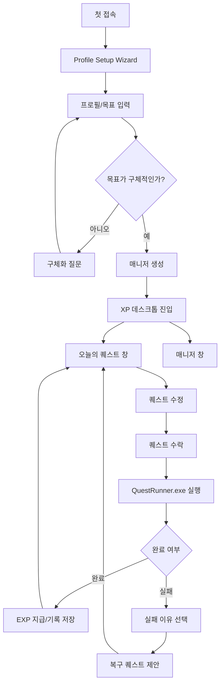

# User Flow & Wireframes

## 핵심 루프



## 화면 목록

| 우선순위 | 화면 | 목적 | MVP 여부 |
|---:|---|---|---|
| 1 | Profile Setup Wizard | 첫 접속 프로필/목표 입력 | MVP |
| 2 | Manager Created | 매니저 생성 결과 확인 | MVP |
| 3 | XP Desktop | 메인 작업 공간 | MVP |
| 4 | 오늘의 퀘스트 창 | 퀘스트 초안 확인/수정/수락 | MVP |
| 5 | QuestRunner.exe | 활성 퀘스트 진행 | MVP |
| 6 | 실패 이유 선택 | 실패 원인 기록 | MVP |
| 7 | 복구 퀘스트 제안 | 작은 크기의 재시도 제안 | MVP |
| 8 | 매니저 창 | 레벨/EXP/상태 메시지 확인 | MVP |
| 9 | 기록 노트 창 | 완료/실패/복구 기록 확인 | MVP |
| 10 | 내 프로필 창 | 프로필 재확인/수정 | MVP |
| 11 | 주간 리포트 | 누적 기록 요약 | 확장 |
| 12 | 매니저 꾸미기 | 외형/보상 커스터마이징 | 확장 |

## 화면별 와이어프레임

### 1. Profile Setup Wizard

```text
┌────────────────────────────────────────────────────┐
│ Manager.exe 설치 마법사                         _ □ x │
├────────────────────────────────────────────────────┤
│  전자 생물 매니저를 깨울 준비를 할게요              │
│                                                    │
│  이름       [ 김동민                         ]     │
│  닉네임     [ 루카스                         ]     │
│                                                    │
│  함께 키울 목표                                    │
│  [ 정보처리기사 자격증 취득                  ]     │
│                                                    │
│  하루 가능 시간   [ 30분 ▼ ]                       │
│  퀘스트 크기      [ 아주 작게 ][ 보통 ][ 도전적 ]  │
│  매니저 말투      [ 차분함 ][ 친구 같음 ][ 단호함 ]│
│                                                    │
│                         [이전] [매니저 깨우기]     │
└────────────────────────────────────────────────────┘
```

### 2. XP Desktop

```text
┌──────────────────────────────────────────────────────────────┐
│                                                              │
│  📝 오늘의 퀘스트                                             │
│  ◇ 매니저                                                     │
│  👤 내 프로필                                                 │
│  📓 기록 노트                                                 │
│  🗑 휴지통                                                    │
│                                                              │
│         ┌ 오늘의 퀘스트 ─────────────────────── _ □ x ┐       │
│         │                                             │       │
│         │          퀘스트 작성 및 수락 영역           │       │
│         │                                             │       │
│         └─────────────────────────────────────────────┘       │
│                                                              │
│                              ┌ 매니저 ─────── _ □ x ┐         │
│                              │                       │         │
│                              │   매니저 상태 영역    │         │
│                              │                       │         │
│                              └───────────────────────┘         │
│                                                              │
├──────────────────────────────────────────────────────────────┤
│ 시작 | 오늘의 퀘스트 | 매니저                      14:30  Lv.1 │
└──────────────────────────────────────────────────────────────┘
```

### 3. 오늘의 퀘스트 창

```text
┌ 오늘의 퀘스트 ───────────────────────────── _ □ x ┐
│ 오늘 수행할 퀘스트 초안                            │
│                                                    │
│ 제목                                               │
│ [ 데이터베이스 개념 15분 공부                 ]    │
│                                                    │
│ 유형        [시간형 ▼]                             │
│ 분량        [15] [분 ▼]                            │
│ 난이도      [쉬움] [보통] [어려움]                 │
│ 제한 시간   [오늘 23:59 ▼]                         │
│                                                    │
│ 예상 보상: EXP 20                                  │
│                                                    │
│                                          [수락]    │
└────────────────────────────────────────────────────┘
```

### 4. QuestRunner.exe

```text
┌ QuestRunner.exe ────────────────────────── _ □ x ┐
│ File  Quest  Help                                  │
├────────────────────────────────────────────────────┤
│ [RUN] 데이터베이스 개념 15분 공부                  │
│                                                    │
│ 상태: 실행 중                                      │
│ 남은 시간: 04:21:33                                │
│ 보상: EXP 20                                       │
│                                                    │
│ [■■■■■■□□□□□□]                                  │
│                                                    │
│                         [완료했어] [실패 처리]      │
└────────────────────────────────────────────────────┘
```

### 5. 실패 이유 선택

```text
┌ 퀘스트가 소멸했어 ──────────────────────── _ □ x ┐
│                                                    │
│ ○ 시간이 부족했다                                  │
│ ○ 목표가 너무 컸다                                 │
│ ○ 집중이 안 됐다                                  │
│ ○ 컨디션이 좋지 않았다                             │
│ ○ 까먹었다                                         │
│                                                    │
│                                  [복구 퀘스트 받기]│
└────────────────────────────────────────────────────┘
```

### 6. 복구 퀘스트 제안

```text
┌ 복구 퀘스트 ───────────────────────────── _ □ x ┐
│                                                    │
│ 데이터베이스 핵심 개념 5분 읽기                    │
│                                                    │
│ 보상: EXP 5                                        │
│                                                    │
│                              [수정] [수락하기]     │
└────────────────────────────────────────────────────┘
```
### 7. 매니저 창

```text
┌ 매니저 ──────────────────────────────── _ □ x ┐
│                                                    │
│                    ◇ 루미 ◇                        │
│                                                    │
│                    [말풍선]                        │
│                 [전자 생물 모습]                   │
│                                                    │
│  Lv.1     EXP [██████░░░░░░] 20 / 100              │
│                                                    │
│               [⌛] 기다리는 중                     │
├────────────────────────────────────────────────────┤
│  기다리고 있었어. 오늘 할 분량은 네가 정해도 돼.  │
└────────────────────────────────────────────────────┘
```

상태 표현 기준:

- `[⌛]` 기다림
- `[▶]` 퀘스트 진행
- `[★]` 완료 및 성장
- `[↻]` 실패 후 리밸런싱
- `[+]` 복구 퀘스트 준비
- `[Zz]` 휴식

실제 화면에서는 일반 이모지 대신 동일한 크기의 픽셀 상태 아이콘을 사용하고, 아이콘 옆에는 짧은 상태 라벨만 표시한다.

반응 효과 기준:

- 말풍선은 상시 표시하지 않고 완료처럼 감정 변화가 큰 순간에만 잠깐 나타난다.
- 말풍선 안에는 대사를 넣지 않는다. 할 말이나 반응이 생겼다는 시각적 신호로만 사용한다.
- 실제 멘트는 항상 하단 대화 패널에 표시한다.
- 말풍선이 나타난 뒤 하단 대사가 갱신되도록 연출할 수 있다.
- 이 위치는 추후 말풍선, 별, 느낌표, 빛, 파동 등으로 교체 가능한 `반응 효과 슬롯`으로 설계한다.
- 애니메이션은 사용자의 클릭을 막거나 창의 크기를 변경하지 않아야 한다.

대사 표시 기준:

- 대사는 구분선 아래의 고정된 2줄 높이 대화 패널에 표시한다.
- 대화 패널에는 화자 이름을 반복해서 표시하지 않는다.
- 퀘스트 초안: 사용자의 수정을 기다리는 대사
- 퀘스트 진행: 수행을 조용히 기다리는 대사
- 완료: 함께 성장한 결과를 반영하는 대사
- 실패: 비난 없이 다음 크기를 조정하는 대사
- 복구 퀘스트: 다시 시도할 수 있도록 안내하는 대사

루미의 대사는 QuestRunner.exe, 실패 이유, 복구 퀘스트 창에 중복 표시하지 않고 이 창에서만 변경한다.
### 8. 기록 노트

```text
┌ 기록 노트 ───────────────────────────── _ □ x ┐
│ 최근 기록                                           │
│                                                    │
│ ✓ DB 개념 15분 공부        EXP +20    완료          │
│ × 알고리즘 20문제 풀이     EXP +0     시간 부족     │
│ ↺ DB 핵심 개념 5분 읽기    EXP +5     복구 완료     │
│                                                    │
└────────────────────────────────────────────────────┘
```

## 화면 설계 기준

- 첫 접속에서는 프로필 입력 마법사가 먼저 보여야 한다.
- 프로필 저장 후에는 XP 데스크톱으로 진입한다.
- 기본으로 열리는 창은 오늘의 퀘스트와 매니저뿐이다.
- 기록 노트와 내 프로필은 아이콘 클릭 시 열리는 보조 창이다.
- 퀘스트를 수락하면 QuestRunner.exe가 열린다.
- 실패는 리밸런싱과 복구 퀘스트 흐름으로 이어진다.


