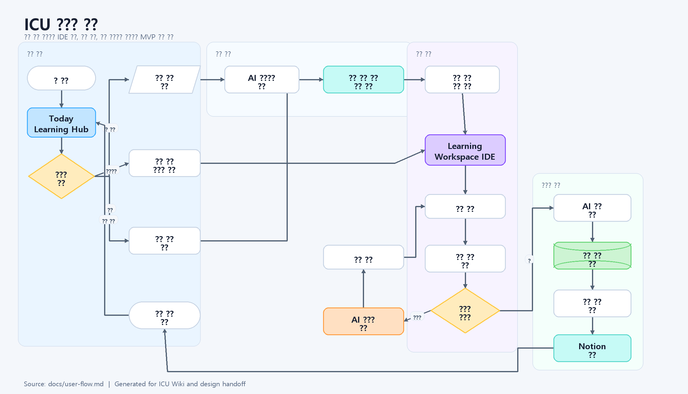

# DevChat 사용자 흐름

이 문서는 DevChat을 사용자가 어떤 순서로 경험하는지 설명합니다. 기능 목록이 아니라, 사용자가 앱을 열고 학습을 시작해 복습 기록까지 남기는 실제 흐름을 기준으로 정리합니다.

## 사용자 흐름 이미지



원본 Mermaid 파일은 [icu-user-flow.mmd](./design/flows/icu-user-flow.mmd), 벡터 원본은 [icu-user-flow.svg](./design/flows/icu-user-flow.svg)에 저장합니다.

## 1. 사용자가 겪는 시작 상황

사용자는 새로운 기술을 배워야 하지만 어디서부터 시작해야 할지 막막한 상태에서 DevChat을 실행합니다.

- React를 배워야 하지만 컴포넌트, props, state 중 무엇부터 봐야 할지 모릅니다.
- Python 문법을 공부했지만 실제 문제 풀이로 어떻게 연결할지 모릅니다.
- FastAPI로 API를 만들어야 하지만 공식 문서의 어떤 부분부터 읽어야 할지 모릅니다.
- 코딩테스트 문제를 풀고 싶지만 개념 복습과 문제 풀이 흐름이 분리되어 있습니다.

DevChat의 첫 목표는 사용자가 스스로 커리큘럼을 설계하지 않아도, 오늘 학습할 순서와 첫 실습을 바로 잡아주는 것입니다.

## 2. 첫 실행

사용자가 앱을 실행하면 AI 튜터가 현재 학습 목표를 묻습니다.

```text
안녕하세요. 오늘 어떤 기술을 배우고 싶나요?
목표를 말해주면 현재 수준에 맞춰 학습 순서와 첫 실습을 잡아드릴게요.
```

첫 화면에서 사용자는 배우고 싶은 기술 입력, 추천 커리큘럼 선택, 이전 학습 이어서 하기, 오늘 학습 큐 항목 선택, 오늘 복습할 항목 보기를 선택할 수 있습니다.

## 3. 학습 목표 입력

사용자는 자연어로 목표를 입력합니다.

```text
React를 처음부터 배우고 싶어요.
Python 리스트랑 반복문을 연습하고 싶어요.
FastAPI로 간단한 API를 만들고 싶어요.
BFS 문제를 풀어보고 싶어요.
```

AI 튜터는 입력을 바탕으로 학습할 기술, 현재 수준, 오늘의 목표, 실습 중심 여부, 코딩테스트 준비 여부를 추정하거나 추가 질문합니다.

## 4. 커리큘럼 생성

AI 튜터는 목표를 바탕으로 오늘의 학습 흐름을 제안합니다.

```text
개념 설명 -> 짧은 퀴즈 -> 코드 실습 -> 실행 검증 -> AI 피드백 -> 다음 단계 추천
```

React 학습 예시는 다음과 같습니다.

```text
오늘의 커리큘럼
1. 컴포넌트가 왜 필요한지 이해하기
2. props로 값을 전달하는 방법 익히기
3. state로 화면 변화를 만들기
4. Counter 컴포넌트 실습하기
5. 실행 결과 확인 후 코드 리뷰 받기
```

사용자는 제안된 커리큘럼을 그대로 시작하거나, 더 쉽게/더 어렵게 조정할 수 있습니다.

Today Learning Hub에서 `학습 시작`을 누르면 현재 생성된 오늘 미션이 `generated-first-mission`으로 Learning Workspace IDE에 전달됩니다. 학습 큐의 개별 항목을 누르면 해당 큐 item id가 `mission` 값으로 전달되고, 복습 시작은 `ai-review` 미션으로 진입합니다.

## 5. 개념 학습

AI 튜터는 공식 문서 기반으로 개념을 설명합니다. 입문자에게는 쉬운 비유와 짧은 코드 예시를, 경험자에게는 핵심 개념과 주의점을, 취업 준비생에게는 문제 풀이와 연결되는 포인트를 중심으로 설명합니다.

답변 하단에는 참고한 공식 문서 출처를 표시합니다.

```text
참고 문서
- React Docs: State: A Component Memory
- React Docs: Responding to Events
```

근거 문서가 부족하면 AI 튜터는 확정적으로 말하지 않고 확인이 필요하다고 안내합니다.

## 6. 실습 진행

Learning Workspace IDE는 전달받은 `mission` 값에 맞춰 현재 미션, 커리큘럼 단계, 파일명, 스타터 코드를 표시합니다. 개념 설명 후 AI 튜터는 오른쪽 코드 에디터에 스타터 코드를 제공합니다.

```jsx
function Counter() {
  return <button>0</button>
}
```

사용자는 에디터에서 코드를 직접 수정합니다.

```text
미션: 버튼을 클릭할 때마다 숫자가 1씩 증가하도록 만들어보세요.
```

## 7. 실행 결과와 피드백

사용자가 실행 버튼을 누르면 DevChat은 코드를 실행하고 결과를 보여줍니다.

성공 예시:

```text
3/3 테스트 통과
버튼 클릭 시 count가 정상적으로 증가합니다.
```

실패 예시:

```text
2번 테스트 실패
버튼 클릭 이벤트는 연결되었지만 state 업데이트가 누락되었습니다.
```

실패한 경우 AI 튜터는 바로 정답을 주지 않고 접근 방향, 필요한 개념, 코드 구조 순서로 단계별 힌트를 제공합니다.

## 8. 코드 리뷰

실습을 통과하면 AI 튜터가 논리 오류, 간결성, 가독성, 시간복잡도, 공식 문서 기준의 권장 사용 방식을 리뷰합니다. 코드가 통과했더라도 더 좋은 방식이 있다면 개선 제안을 제공합니다.

## 9. 학습 상태 저장

학습이 끝나면 DevChat은 오늘 학습한 주제, 완료한 단계, 퀴즈 정답률, 실습 통과 여부, 틀린 문제와 원인, 사용자가 어려워한 개념을 저장합니다.

이 정보는 다음 학습에서 AI 튜터가 사용자의 수준과 맥락을 기억하는 데 사용됩니다.

## 10. 복습과 기록

DevChat은 오답과 취약 개념을 바탕으로 복습 일정을 제안합니다.

```text
1일 -> 3일 -> 7일 -> 14일 -> 30일
```

앱 종료 또는 수동 동기화 시 오늘의 학습 내용은 Notion에 정리됩니다. 기록에는 오늘 배운 개념, 실습 결과, 오답 요약, AI 코드 리뷰 요약, 다음 복습 일정이 포함됩니다.

## 11. 대표 시나리오: React 입문자

1. 사용자가 `React를 처음 배워야 해요`라고 입력합니다.
2. AI 튜터가 `컴포넌트 -> props -> state -> 이벤트` 순서의 커리큘럼을 제안합니다.
3. 사용자는 컴포넌트 설명을 읽고 짧은 퀴즈를 풉니다.
4. 오른쪽 에디터에 Counter 스타터 코드가 열립니다.
5. 사용자는 state와 클릭 이벤트를 추가합니다.
6. 실행 결과에서 테스트 통과 여부를 확인합니다.
7. 실패하면 AI 튜터가 단계별 힌트를 제공합니다.
8. 통과하면 AI 튜터가 코드 리뷰와 다음 학습 주제를 추천합니다.
9. 학습 결과와 복습 일정이 저장됩니다.

## 12. 대표 시나리오: 코딩테스트 준비생

1. 사용자가 `BFS 문제를 풀고 싶어요`라고 입력합니다.
2. AI 튜터가 BFS 개념을 먼저 볼지, 바로 문제를 풀지 묻습니다.
3. 사용자가 바로 문제 풀이를 선택합니다.
4. AI 튜터가 난이도에 맞는 문제와 입출력 예시를 제공합니다.
5. 사용자는 에디터에서 풀이 코드를 작성합니다.
6. 실행 결과에서 실패 케이스를 확인합니다.
7. AI 튜터가 방문 처리, 큐 사용, 경계 조건 등 단계별 힌트를 제공합니다.
8. 통과 후 시간복잡도와 코드 스타일 리뷰를 받습니다.
9. 틀렸던 케이스는 오답노트에 저장되고 복습 일정이 생성됩니다.

## 13. 사용자 흐름 요약

```text
기술/목표 입력
-> AI 커리큘럼 제안
-> Today Learning Hub에서 오늘 미션 또는 큐 항목 선택
-> 공식 문서 기반 개념 설명
-> 퀴즈 또는 확인 질문
-> 코드 에디터 실습
-> 실행 결과 확인
-> AI 힌트와 코드 리뷰
-> 학습 상태 저장
-> 복습 일정과 Notion 기록
```

DevChat의 핵심 사용 흐름은 사용자가 학습 순서를 직접 설계하지 않아도, AI 튜터가 개념 학습과 실습, 피드백, 복습을 하나의 흐름으로 이어주는 것입니다.
