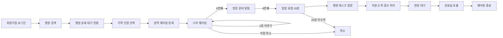
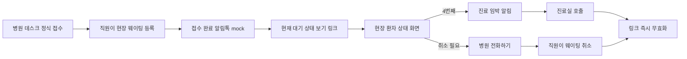
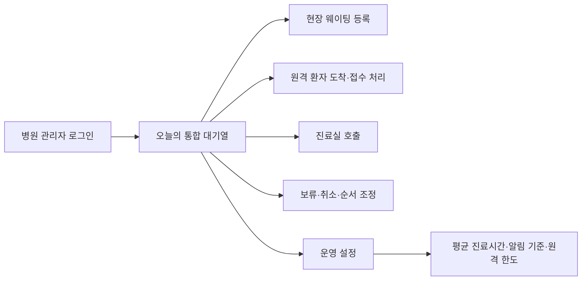
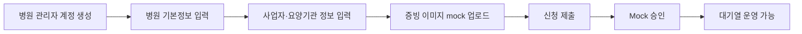
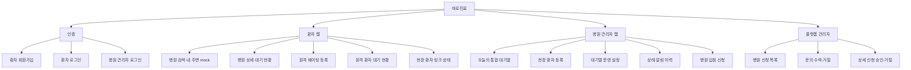

# 바로진료 UX 구조

이 문서는 [`plan.md`](./plan.md)의 MVP 범위를 화면 단위로 시각화합니다. 환자 화면은 모바일을 우선하고 병원 관리자 화면은 데스크톱의 반복 업무에 맞춥니다.

## 1. 화면 흐름(User Flow)

### 1.1 원격 환자



### 1.2 현장 환자



### 1.3 병원 관리자



### 1.4 병원 입점



## 2. 화면 목록(IA)



| 사용자 | 화면 | 우선순위 |
|---|---|---|
| 환자 | 회원가입·로그인 | P0 |
| 환자 | 병원 검색·상세 | P1 |
| 환자 | 원격 웨이팅 등록 | P0 |
| 환자 | 원격 환자 대기 현황 | P0 |
| 현장 환자 | 링크 상태 화면 | P0 |
| 병원 관리자 | 통합 대기열 | P0 |
| 병원 관리자 | 현장 환자 등록 | P0 |
| 병원 관리자 | 운영 설정 | P1 |
| 병원 관리자 | 입점 신청 | P1 |
| 플랫폼 관리자 | 문의·상세 신청 검토 화면 | P1 |

## 3. 와이어프레임

### 3.1 환자 로그인 · 모바일

```text
┌──────────────────────────────┐
│ 바로진료                     │
│ 이메일 [                  ] │
│ 비밀번호 [                ] │
│          [로그인]            │
│       [환자 회원가입]         │
└──────────────────────────────┘
```

회원가입 제출 후에는 `인증 메일을 확인해 주세요` 화면을 표시하고 재발송 동작을 제공합니다. 이메일 확인 전 로그인 시에는 확인 필요 상태와 재발송 동작을 보여줍니다.

### 3.2 병원 검색 · 모바일

```text
┌──────────────────────────────┐
│ 동네병원 찾기                 │
│ [ 병원명 또는 지역 검색   🔍 ] │
│ [전체] [이비인후과] [정형외과] │
├──────────────────────────────┤
│ 내 주변                      │
│ 현재는 예시 병원 데이터 표시   │
├──────────────────────────────┤
│ 서울이비인후과   원격 접수 중   │
│ 앞 대기 8명 · 약 80분          │
│                    [상세 보기] │
└──────────────────────────────┘
```

### 3.3 원격 웨이팅 등록 · 모바일

```text
┌──────────────────────────────┐
│ ← 원격 웨이팅 등록            │
│ 서울이비인후과                 │
├──────────────────────────────┤
│ 가족 인원                     │
│ 소아       [−] 0 [+]           │
│ 청소년     [−] 0 [+]           │
│ 성인       [−] 1 [+]           │
│ 총 1명                         │
├──────────────────────────────┤
│ 연락처는 회원 전화번호로 알림   │
│ 도착 후 데스크 접수가 필요함    │
│        [웨이팅 등록]            │
└──────────────────────────────┘
```

### 3.4 원격 환자 대기 현황 · 모바일

```text
┌──────────────────────────────┐
│ 나의 웨이팅                   │
│ 서울이비인후과                 │
├──────────────────────────────┤
│ [원격 대기 / 입장 요청]         │
│ 접수번호 17                   │
│ 현재 진료 대기 6번째            │
│ 예상 대기 약 50분              │
│ 마지막 갱신 10:32              │
├──────────────────────────────┤
│ 가족  성인 1 · 소아 1          │
│ 진료 상황에 따라 달라질 수 있음 │
├──────────────────────────────┤
│ [순서 1회 미루기] [웨이팅 취소] │
│ 4번째부터 20분 내 데스크 방문   │
└──────────────────────────────┘
```

### 3.5 현장 환자 링크 상태 · 모바일

```text
┌──────────────────────────────┐
│ 서울이비인후과                 │
│ 이비인후과 · 서울 ○○구         │
│ [병원 전화하기]                │
├──────────────────────────────┤
│ 접수번호 21                   │
│ 현재 진료 대기 4번째            │
│ 예상 대기 약 30분              │
│ 가족  성인 1                   │
├──────────────────────────────┤
│ 웨이팅 취소는 병원으로          │
│ 전화해 주세요.                 │
└──────────────────────────────┘
```

원격 환자 화면과 같은 상태 컴포넌트를 사용하지만 직접 미루기·취소 버튼은 표시하지 않습니다.

### 3.6 병원 관리자 통합 대기열 · 데스크톱

```text
┌────────────────────────────────────────────────────────────────────────┐
│ 서울이비인후과 · 2026-07-13                 [현장 등록] [운영 설정]     │
│ 접수 중 · 총 12명 · 원격 8/20명 · 평균 진료 10분                       │
├────┬────────┬──────┬────────────┬──────────┬─────────────────────────┤
│순서│접수번호│유형  │가족 인원    │상태      │가능한 조작               │
├────┼────────┼──────┼────────────┼──────────┼─────────────────────────┤
│ 1  │12      │현장  │성인 1       │현장 대기 │[호출] [보류] [취소]       │
│ 2  │13      │원격  │소아 1 성인 1│원격 대기 │[도착 처리] [보류] [취소] │
│ 3  │14      │원격  │청소년 1     │입장 요청 │[도착 처리] [보류] [취소] │
├────┴────────┴──────┴────────────┴──────────┴─────────────────────────┤
│ 선택 행 상세: 전화번호 · 등록 시각 · 알림 이력 · 상태 변경 이력         │
└────────────────────────────────────────────────────────────────────────┘
```

### 3.7 현장 환자 등록 · 데스크톱 모달

```text
┌──────────────────────────────────┐
│ 현장 웨이팅 등록              × │
├──────────────────────────────────┤
│ 휴대전화 번호 [                 ] │
│ 소아 [−] 0 [+]                  │
│ 청소년 [−] 0 [+]                │
│ 성인 [−] 1 [+]                  │
│ 총 1명                           │
├──────────────────────────────────┤
│ 알림톡으로 상태 링크를 전송합니다 │
│              [취소] [대기열 등록]│
└──────────────────────────────────┘
```

## 4. 화면 설계 원칙

- 현재 진료 대기 순서, 예상 시간, 상태를 가장 먼저 보여줍니다.
- 예상 시간은 확정 시간이 아니라는 안내를 함께 표시합니다.
- 가족은 하나의 접수번호로 묶되 실제 환자 수를 계산에 사용합니다.
- 원격 환자에게만 6번째 준비 알림과 4번째 입장 요청·20분 기한을 적용합니다.
- 현장 환자에게는 접수 완료와 4번째 진료 임박 알림을 제공합니다.
- 현장 링크 화면은 원격 상태 화면에서 직접 취소·미루기 버튼을 제거한 형태입니다.
- 직원은 화면 이동 없이 현재 상태에 허용된 동작만 실행합니다.
- 전화번호는 직원 상세 영역에서만 보이고 환자 간 화면이나 공개 목록에는 노출하지 않습니다.
- 상태 링크가 무효화되면 접수 내용을 표시하지 않고 만료 안내만 보여줍니다.

## 5. 프로토타입 상태

기존 [`prototype/`](../prototype/)은 이전 비회원·수동 방문 요청 흐름을 검증한 정적 자료입니다. 회원가입, 자동 2단계 알림, 현장 상태 링크와 병원 입점 신청을 반영하려면 개발 착수 전에 별도 갱신이 필요합니다.
