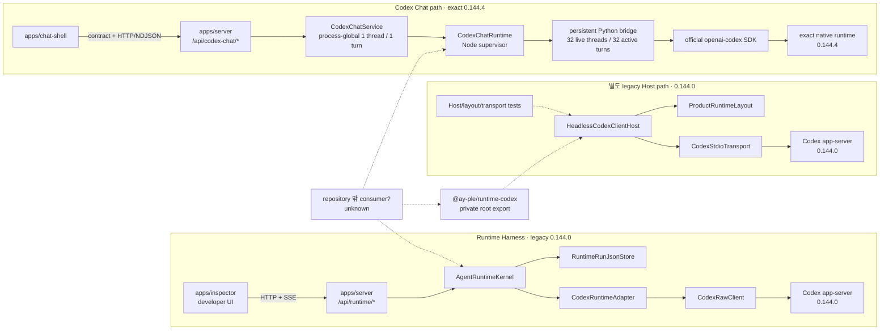

# 001 — 현재 runtime capability와 ownership 조사

- 조사 기준: 2026-07-17의 tracked repository와 현재 문서
- 대상: Runtime Harness, legacy `HeadlessCodexClientHost` 경로, Codex Chat 경로
- 결과 성격: cutover 판정을 위한 evidence snapshot
- 판정 범위: 이 문서는 capability의 유지·이관·제거 verdict를 내리지 않는다.

## 조사 경계와 용어

이 문서에서 **actual repository caller**는 현재 workspace의 production app composition에서 도달할 수 있는 import 또는 HTTP 호출을 뜻한다. Test, generator, smoke는 별도 caller로 표시한다. Repository 밖의 source import, 복사본, 실행 중인 Inspector, 수동 운영 script는 tracked source 검색만으로 부재를 증명할 수 없으므로 `unknown`으로 남긴다. Root와 두 runtime package가 `private: true`인 것은 npm publish 방지 근거일 뿐 외부 local consumer 부재의 근거는 아니다([root package](../../../../package.json#L1-L8), [`runtime-codex` package](../../../../packages/runtime-codex/package.json#L1-L13), [`codex-chat-runtime` package](../../../../packages/codex-chat-runtime/package.json#L1-L17)).

`persistence`는 native Codex conversation/runtime state 또는 제품 state의 disk 수명을 뜻한다. `diagnostic history`는 prompt, output, normalized event와 debug evidence를 담는 Runtime Harness 기록을 뜻한다. 둘은 소유자와 보존 목적이 다르다([ADR 0004](../../../adr/0004-split-runtime-history-semantics-from-workspace-storage.md#L9-L25), [runtime isolation table](../../../architecture/codex-runtime-isolation.md#L18-L26)).

또한 legacy 경로의 `HeadlessCodexClientHost`와 그 아래 `CodexStdioTransport`를 같은 capability로 취급하지 않는다. Transport는 four-direction protocol primitive를 구현하지만 Host는 관측한 Server request를 모두 `dismiss()`한다([transport observation contract](../../../../packages/runtime-codex/src/stdio-transport.ts#L117-L170), [Host observation pump](../../../../packages/runtime-codex/src/headless-codex-client-host.ts#L394-L434)).

## 한눈에 보는 실제 caller와 경계

| 경로 | actual repository production caller | repository-local 비제품 caller | 외부 consumer evidence | engine/source pin |
| --- | --- | --- | --- | --- |
| Runtime Harness: `AgentRuntimeKernel → CodexRuntimeAdapter → CodexRawClient` | `apps/server`가 Fake와 Codex adapter, JSON store, kernel을 조립하고 `/api/runtime/*`를 제공한다. `apps/inspector`가 그 API와 SSE를 호출한다([Server composition](../../../../apps/server/src/server.ts#L112-L174), [Inspector load/start/stream](../../../../apps/inspector/src/App.tsx#L86-L117), [Inspector run/SSE](../../../../apps/inspector/src/App.tsx#L123-L215)). | `runtime-core`, `runtime-codex`, Server, Inspector unit/integration/E2E와 Codex smoke/generator | `unknown`. 현재 문서는 이 경로를 developer-only surface로 분류하지만 실제 운영 빈도나 repository 밖 caller telemetry는 없다([implementation map](../../../architecture/runtime-harness-implementation-map.md#L23-L30)). | legacy `@openai/codex@0.144.0` exact dependency([package](../../../../packages/runtime-codex/package.json#L38-L42)) |
| legacy Host: `HeadlessCodexClientHost → ProductRuntimeLayout → CodexStdioTransport` | 없음. 현재 Server·Inspector composition에는 이 edge가 없다고 코드와 구현 지도가 함께 보여 준다([implementation map](../../../architecture/runtime-harness-implementation-map.md#L17-L19), [Server imports/composition](../../../../apps/server/src/server.ts#L112-L145)). | Host, layout, transport actual-child/unit tests. `HeadlessCodexClientHost`와 layout은 package root export다([root exports](../../../../packages/runtime-codex/src/index.ts#L17-L35)). | `unknown`. Package가 private이고 repository production caller가 없다는 것만 확인했다. untracked source, 복사된 코드, 로컬 도구 consumer는 검증하지 못했다. | legacy generated schema와 `@openai/codex@0.144.0`([package](../../../../packages/runtime-codex/package.json#L25-L42), [README pin](../../../../packages/runtime-codex/README.md#L9-L23)) |
| Codex Chat: `CodexChatRuntime → CodexChatService → Chat Shell` | `apps/server`가 process당 service 하나와 `/api/codex-chat/*` router를 만들고, `apps/chat-shell`이 browser-safe contract와 HTTP/NDJSON route를 사용한다([Server composition](../../../../apps/server/src/codex-chat.ts#L23-L42), [Chat Shell boundary](../../../../apps/chat-shell/README.md#L1-L17)). | Runtime provenance/materializer, bridge/unit/actual/local-provider tests, Server contract/disconnect/actual shutdown tests, Chat Shell unit/E2E | `unknown`. 현재 tracked first consumer는 Chat Shell이지만 private workspace package가 외부 local consumer 부재까지 증명하지 않는다. | source commit `8c68d4c87dc54d38861f5114e920c3de2efa5876`, runtime `0.144.4`([ADR 0011](../../../adr/0011-reuse-official-codex-python-sdk-for-chat-shell.md#L11-L20), [upstream record](../../../../packages/codex-chat-runtime/upstream/UPSTREAM.md#L5-L16)) |

## Dependency/caller graph

실선은 현재 production composition 또는 browser 호출이다. 점선은 export/test 또는 존재 여부를 확인하지 못한 외부 caller다. 특히 Server에서 legacy Host로 향하는 실선은 없다.

Graph의 Harness edge는 Server 조립 코드와 Inspector 호출에서 확인되고([Server](../../../../apps/server/src/server.ts#L121-L174), [Inspector](../../../../apps/inspector/src/App.tsx#L123-L215)), Host 비연결은 구현 지도와 ADR에서 명시된다([implementation map](../../../architecture/runtime-harness-implementation-map.md#L17-L19), [ADR 0011](../../../adr/0011-reuse-official-codex-python-sdk-for-chat-shell.md#L20-L23)). Chat의 32/32 내부 cap과 process-global 1/1 축소는 서로 다른 계층의 cardinality다([bridge CLI defaults](../../../../packages/codex-chat-runtime/python/bridge/ay_ple_codex_bridge/cli.py#L20-L33), [Server fields and guards](../../../../apps/server/src/codex-chat-service.ts#L51-L64), [Server README](../../../../apps/server/README.md#L69-L82)).

## State ownership, cardinality와 lifetime

Cardinality는 구현된 현재 상한을 계층별로 기록한다. `—`는 해당 경로가 그 state를 모델링하지 않는다는 뜻이며, engine 내부에 state가 절대 없다는 뜻은 아니다.

| capability | 경로 | 현재 owner | cardinality | lifetime / 종료 조건 | 근거 |
| --- | --- | --- | --- | --- | --- |
| Thread | Runtime Harness | Native Codex가 thread record를, `CodexRuntimeAdapter`가 실행 중 handle을 소유한다. Kernel contract에는 native `threadId`가 없다. | Codex run당 새 app-server와 새 thread 1개; kernel은 여러 run을 보유할 수 있다. | Process handle은 run 종료 때 닫히지만 archive/delete를 보내지 않아 native record는 engine storage에 남을 수 있다. | [Adapter run](../../../../packages/runtime-codex/src/adapter.ts#L76-L144), [implementation map](../../../architecture/runtime-harness-implementation-map.md#L132-L143) |
| Thread | legacy Host | —. Host는 initialize/initialized와 lifecycle만 소유하고 thread API를 제공하지 않는다. | 0 managed thread | Host connection lifetime에 thread handle 없음 | [Host public lifecycle](../../../../packages/runtime-codex/src/headless-codex-client-host.ts#L190-L272), [README boundary](../../../../packages/runtime-codex/README.md#L73-L87) |
| Thread | Codex Chat | Python `BridgeWorker`가 live `AsyncThread` handle을, Server service가 현재 browser-facing `threadId`를 소유한다. Native history가 source of truth다. | Bridge 기본 live thread 최대 32; 각 thread active turn 최대 1. Server는 모든 browser에 공유되는 current thread 1개로 축소한다. | Bridge handle은 `release_thread`, bridge close 또는 process loss까지. `release_thread`는 local handle release이며 native history 삭제가 아니다. Browser reload 뒤 현재 UI는 resume하지 않는다. | [bridge records](../../../../packages/codex-chat-runtime/python/bridge/ay_ple_codex_bridge/runtime.py#L55-L69), [bridge caps](../../../../packages/codex-chat-runtime/python/bridge/ay_ple_codex_bridge/cli.py#L20-L33), [Server replacement/release](../../../../apps/server/src/codex-chat-service.ts#L102-L151), [isolation](../../../architecture/codex-runtime-isolation.md#L32-L38) |
| Turn | Runtime Harness | Kernel이 normalized `RuntimeRun`을, adapter가 native turn scope와 interrupt confirmation을 소유한다. | run당 native turn 1개; kernel map에는 여러 run 가능 | start부터 completed/cancelled/failed까지. Kernel terminal transition 뒤 diagnostic record는 별도 수명으로 남는다. | [kernel start/run maps](../../../../packages/runtime-core/src/index.ts#L264-L278), [kernel start](../../../../packages/runtime-core/src/index.ts#L345-L395), [adapter-confirmed cancel](../../../../packages/runtime-core/src/index.ts#L469-L506) |
| Turn | legacy Host | —. Host에는 turn start, stream, interrupt가 없다. | 0 managed turn | 해당 없음 | [README explicit omissions](../../../../packages/runtime-codex/README.md#L73-L87) |
| Turn | Codex Chat | Bridge가 `AsyncTurnHandle`과 stream task를, Node가 correlation route와 stream을, Server가 browser-facing active lease를 소유한다. | Bridge 기본 active turn 최대 32, 각 thread당 1; Server는 process-global active turn 1개 | authoritative `turn.completed`, interrupt 후 terminal, runtime failure 또는 close까지 | [bridge turn record](../../../../packages/codex-chat-runtime/python/bridge/ay_ple_codex_bridge/runtime.py#L64-L69), [Node route](../../../../packages/codex-chat-runtime/src/runtime.ts#L442-L513), [Server reservation](../../../../apps/server/src/codex-chat-service.ts#L153-L187) |
| Transcript | Runtime Harness | Kernel의 `RuntimeRunLog.output/events/debugLog`; Inspector는 선택한 run view를 소유한다. | run당 log 1개와 subscriber 0..N | memory에서는 kernel lifetime, disk에서는 retention 또는 explicit clear까지 | [contract](../../../../packages/runtime-core/src/index.ts#L93-L113), [read/subscription](../../../../packages/runtime-core/src/index.ts#L398-L467), [Inspector state](../../../../apps/inspector/src/App.tsx#L48-L70) |
| Transcript | legacy Host | —. Lifecycle snapshot/event만 있고 AgentMessage transcript가 없다. | 0 transcript | 해당 없음 | [Host event publication](../../../../packages/runtime-codex/src/headless-codex-client-host.ts#L503-L519), [README boundary](../../../../packages/runtime-codex/README.md#L73-L87) |
| Transcript | Codex Chat | Native Codex history가 권위 state다. Browser `ChatState.messages`가 현재 표시 transcript를 소유하며 Server는 이를 저장하지 않는다. | Browser tab의 current conversation 1개; Server transcript store 0 | Browser memory lifetime이며 reload 시 소실. Native history는 runtime home에 남지만 현재 Shell은 `thread/read`/`resume`을 호출하지 않는다. | [Chat model](../../../../apps/chat-shell/src/chat-model.ts#L20-L64), [reload notice](../../../../apps/chat-shell/src/App.tsx#L210-L213), [Chat README](../../../../apps/chat-shell/README.md#L1-L17) |
| Runtime health | Runtime Harness | Kernel이 sticky persistence `ready/degraded`를, status helper가 Codex binary/config/auth probe를 소유한다. Server가 HTTP로 투영한다. | Server process당 kernel health 1개 + 요청 시 raw Codex status snapshot | Kernel lifetime; persistence error 후 degraded는 sticky. Raw status는 probe 시점 snapshot | [kernel health](../../../../packages/runtime-core/src/index.ts#L334-L343), [Server health/status](../../../../apps/server/src/server.ts#L154-L172) |
| Runtime health | legacy Host | Host snapshot이 `stopped/starting/ready/stopping/failed` transition과 generation/failure를 소유한다. `restarting`은 status union에 예약돼 있지만 현재 publish되는 transition은 아니다. | Host instance당 snapshot 1개 | Host object/connection lifetime; subscriber는 bounded queue 종료까지 | [Host types/fields](../../../../packages/runtime-codex/src/headless-codex-client-host.ts#L20-L69), [start/stop transitions](../../../../packages/runtime-codex/src/headless-codex-client-host.ts#L209-L271), [ready/stopped transitions](../../../../packages/runtime-codex/src/headless-codex-client-host.ts#L321-L385), [failure transition](../../../../packages/runtime-codex/src/headless-codex-client-host.ts#L447-L471) |
| Runtime health | Codex Chat | Node runtime의 once-only terminal과 `CodexChatService`의 unavailable/configured/starting/ready/failed status가 owner다. Browser는 status를 읽는다. | Server composition당 service/runtime 최대 1개 | Server shutdown, autonomous runtime failure 또는 close까지; failure code는 service에 latch된다. | [service status](../../../../apps/server/src/codex-chat-service.ts#L75-L100), [terminal observation](../../../../apps/server/src/codex-chat-service.ts#L377-L427), [Node failure settlement](../../../../packages/codex-chat-runtime/src/runtime.ts#L783-L855) |
| Persistence | Runtime Harness | Native Codex가 자체 home/SQLite의 thread state를 소유한다. Harness는 repository-local root만 전달하며 제품 state로 읽지 않는다. | configured runtime-home pair 하나에 여러 native run/thread record 가능 | disk cleanup 또는 별도 native operation까지; Harness run clear와 독립 | [runtime isolation](../../../architecture/codex-runtime-isolation.md#L18-L25), [adapter behavior](../../../architecture/runtime-harness-implementation-map.md#L132-L143) |
| Persistence | legacy Host | `ProductRuntimeLayout`이 app data/workspace/root pairing을 검증하고 native runtime이 파일을 소유한다. Host는 persistence API를 제공하지 않는다. | Host input당 prepared layout 1개 | prepared layout은 Host lifetime; directory/native data는 disk lifetime | [layout contract](../../../../packages/runtime-codex/src/product-runtime-layout.ts#L15-L47), [preflight](../../../../packages/runtime-codex/src/product-runtime-layout.ts#L65-L115), [ADR 0006](../../../adr/0006-separate-package-app-data-and-semester-workspace-roots.md#L7-L20) |
| Persistence | Codex Chat | Native history와 explicit `CODEX_HOME`/`CODEX_SQLITE_HOME`이 source of truth다. Server/Browser에는 product conversation persistence owner가 없다. | prepared runtime directory set 하나, native threads 여러 개 가능 | runtime directories의 disk lifetime. Current Server current-thread lease와 Browser transcript는 process/tab lifetime만 가진다. | [isolation current boundary](../../../architecture/codex-runtime-isolation.md#L28-L40), [Server README](../../../../apps/server/README.md#L30-L82) |
| Diagnostic history | Runtime Harness | Kernel이 schema/transition/durability semantics를, Server `RuntimeRunJsonStore`가 JSON serialization/atomic file/retention을 소유한다. | run당 canonical JSON 1개; terminal 기본 최대 100개와 100 MiB, active 제외 | Server restart를 통과하며 explicit terminal clear 또는 retention prune까지 | [kernel persistence seam](../../../../packages/runtime-core/src/index.ts#L175-L195), [store save/retention](../../../../apps/server/src/runtime-run-json-store.ts#L72-L164), [history semantics](../../../architecture/runtime-harness-implementation-map.md#L115-L130) |
| Diagnostic history | legacy Host | Durable owner 없음. Host가 transient lifecycle event를 subscriber별 queue에 배포한다. | Host snapshot 1개, subscriber 0..N, subscriber queue bounded | Host/subscription lifetime; disk 기록 없음 | [Host publication](../../../../packages/runtime-codex/src/headless-codex-client-host.ts#L503-L519), [bounded subscriber](../../../../packages/runtime-codex/src/headless-codex-client-host.ts#L539-L642) |
| Diagnostic history | Codex Chat | Durable `RuntimeRunLog` owner 없음. Node의 bounded stderr capture와 Browser transcript는 각각 내부 diagnostic/test seam과 transient UI state다. | runtime당 bounded stderr 1개; tab당 transcript 1개 | runtime 또는 browser tab lifetime | [Node bounded capture](../../../../packages/codex-chat-runtime/src/runtime.ts#L317-L326), [test-only snapshot](../../../../packages/codex-chat-runtime/src/runtime.ts#L537-L552), [Browser state](../../../../apps/chat-shell/src/chat-model.ts#L51-L64) |
| Bidirectional request | Runtime Harness | `CodexRawClient`가 Client request/response와 Server notification을 다룬다. Server request response owner는 없다. | Codex run별 raw client 1개 | run process lifetime | [RawClient API/notifications](../../../../packages/runtime-codex/src/raw-client.ts#L317-L478), [README limitation](../../../../packages/runtime-codex/README.md#L89-L100) |
| Bidirectional request | legacy Host | `CodexStdioTransport`가 Client request/response, Client notification, Server request/response, Server notification과 ID registry를 소유한다. Host는 Server request를 모두 dismiss하여 제품 interaction으로 승격하지 않는다. | transport connection당 client request registry, active Server request registry, sole observation consumer 1개 | connection/timeout/close lifetime | [transport registries](../../../../packages/runtime-codex/src/stdio-transport.ts#L172-L225), [send/observe](../../../../packages/runtime-codex/src/stdio-transport.ts#L261-L375), [Host dismiss](../../../../packages/runtime-codex/src/headless-codex-client-host.ts#L394-L434) |
| Bidirectional request | Codex Chat | Official SDK low-level router가 native mechanics를 소유하지만 public `CodexChatRuntime`은 start thread/turn, interrupt, release, close와 browser-safe event union만 노출한다. Interactive pending request owner는 없다. | Node operation/correlation route와 Bridge pending operation은 bounded; Server interactive pending request는 0 | operation deadline, turn terminal 또는 runtime close까지 | [public contract](../../../../packages/codex-chat-runtime/src/contract.ts#L121-L152), [bridge commands](../../../../packages/codex-chat-runtime/python/bridge/ay_ple_codex_bridge/protocol.py#L26-L117), [ADR approval boundary](../../../adr/0011-reuse-official-codex-python-sdk-for-chat-shell.md#L33-L39) |
| Process lifecycle | Runtime Harness | Codex adapter가 Codex run마다 `CodexRawClient`/app-server child를 생성하고 `finally`에서 닫는다. Kernel은 adapter abort와 run state를 소유한다. | active Codex run당 child 1개 | run terminal/cancel/failure까지. 다만 Server application `close()`는 Chat service와 listener만 명시적으로 닫고 active Harness kernel/run close를 호출하지 않는다. | [adapter create/close](../../../../packages/runtime-codex/src/adapter.ts#L76-L80), [adapter finally](../../../../packages/runtime-codex/src/adapter.ts#L241-L244), [Server close path](../../../../apps/server/src/server.ts#L330-L355) |
| Process lifecycle | legacy Host | Host가 validated layout, epoch/generation과 transport child 하나를 소유한다. | Host instance당 child 최대 1개 | explicit `start()`부터 `stop()`, transport loss 또는 failure cleanup까지 | [Host start/stop](../../../../packages/runtime-codex/src/headless-codex-client-host.ts#L209-L305), [transport close](../../../../packages/runtime-codex/src/stdio-transport.ts#L352-L385) |
| Process lifecycle | Codex Chat | Server가 lazily cached Node runtime 하나를, Node가 detached Python process group을, Python SDK가 native child를 소유한다. | Server process당 runtime 0..1; 그 아래 Python 1 + native child 1 | Server close 또는 fatal failure까지. graceful close 뒤 terminate/kill와 process-group disappearance 확인이 있다. | [lazy runtime](../../../../apps/server/src/codex-chat-service.ts#L286-L313), [Server close](../../../../apps/server/src/server.ts#L330-L355), [process-tree cleanup](../../../../packages/codex-chat-runtime/src/runtime.ts#L921-L1010) |

## Capability → implementation → test → docs → pin evidence matrix

아래 표의 test는 capability가 전혀 무검증이라는 오판을 막기 위한 direct evidence다. 마지막 열은 그 test가 root default gate에 포함되는지까지 구분한다.

| capability | 구현 owner / seam | direct test evidence | owning docs | pin / gate evidence |
| --- | --- | --- | --- | --- |
| Normalized single-run lifecycle, SSE, cancellation | `runtime-core`의 `AgentRuntimeAdapter`와 `AgentRuntimeKernel`; Server `/api/runtime/runs*` | Kernel hydration/recovery([test](../../../../packages/runtime-core/src/index.test.ts#L631-L700)), terminal durability([test](../../../../packages/runtime-core/src/index.test.ts#L1622-L1675)), Server HTTP/SSE([test](../../../../apps/server/src/server.test.ts#L286-L390)), Codex cancel([test](../../../../apps/server/src/server.test.ts#L1001-L1040)) | [implementation map contract](../../../architecture/runtime-harness-implementation-map.md#L100-L113) | Root `npm test`에 runtime-core/runtime-codex/Server suite가 포함된다([root scripts](../../../../package.json#L9-L17)); Codex engine pin `0.144.0` |
| Durable developer diagnostic history | Kernel persistence seam + `RuntimeRunJsonStore` | restart history([Server test](../../../../apps/server/src/server.test.ts#L362-L390)), hydration/recovery와 durability([core tests](../../../../packages/runtime-core/src/index.test.ts#L631-L700), [terminal barrier](../../../../packages/runtime-core/src/index.test.ts#L1622-L1675)) | [history table](../../../architecture/runtime-harness-implementation-map.md#L115-L130), [ADR 0004](../../../adr/0004-split-runtime-history-semantics-from-workspace-storage.md#L9-L45) | Engine pin과 무관한 Server-owned schema; default test 포함 |
| Harness raw status/capability/debug projection | `CodexRawClient`, status helper, capability slots, `CodexRuntimeAdapter` debug mapping | Adapter output/debug and terminal([test](../../../../packages/runtime-codex/src/adapter.test.ts#L23-L135)), interrupt confirmation([test](../../../../packages/runtime-codex/src/adapter.test.ts#L137-L190)), Server actual adapter route([test](../../../../apps/server/src/server.test.ts#L932-L1040)) | [adapter responsibilities](../../../architecture/runtime-harness-implementation-map.md#L132-L149) | Generated legacy roster and package dependency are `0.144.0`([README](../../../../packages/runtime-codex/README.md#L9-L23)); default test 포함 |
| Product root preflight | `ProductRuntimeLayout` canonical root, overlap, binary와 home pair 검증 | nominal layout([test](../../../../packages/runtime-codex/src/product-runtime-layout.test.ts#L21-L45)), root overlap([test](../../../../packages/runtime-codex/src/product-runtime-layout.test.ts#L180-L255)), binary ownership/pin([test](../../../../packages/runtime-codex/src/product-runtime-layout.test.ts#L257-L368)) | [runtime-codex README](../../../../packages/runtime-codex/README.md#L57-L71), [ADR 0006](../../../adr/0006-separate-package-app-data-and-semester-workspace-roots.md#L7-L20) | legacy package pin `0.144.0`; default runtime-codex test 포함 |
| Schema-validated four-direction stdio | Package-internal `CodexStdioTransport`, generated Client/Server schemas와 original ID registry | four directions, exact IDs와 approval response([test](../../../../packages/runtime-codex/src/stdio-transport.test.ts#L19-L118)) | [runtime-codex README](../../../../packages/runtime-codex/README.md#L43-L55) | generated legacy schema `0.144.0`; default runtime-codex test 포함 |
| Legacy Host lifecycle, atomic snapshot/subscription | Root-exported `HeadlessCodexClientHost`; layout + transport composition | one child, root/env/handshake/lifecycle([test](../../../../packages/runtime-codex/src/headless-codex-client-host.test.ts#L12-L148)), slow subscriber([test](../../../../packages/runtime-codex/src/headless-codex-client-host.test.ts#L150-L189)), invalid layout([test](../../../../packages/runtime-codex/src/headless-codex-client-host.test.ts#L191-L210)) | [runtime-codex README](../../../../packages/runtime-codex/README.md#L73-L87), [historical ADR status](../../../adr/0008-separate-headless-codex-client-host-from-product-ui.md#L3-L18) | legacy package pin `0.144.0`; default runtime-codex test 포함 |
| Browser-safe native Chat contract | `@ay-ple/codex-chat-runtime/contract`: native IDs, 네 native notification projection, `runtime.failed`, terminal과 safe failure | Server/browser exact contract([test](../../../../apps/server/src/codex-chat-contract.test.ts#L17-L106)), browser parser error/framing cases([test](../../../../apps/chat-shell/src/chat-api.test.ts#L14-L121)) | [runtime README boundary](../../../../packages/codex-chat-runtime/README.md#L25-L48), [Chat Shell README](../../../../apps/chat-shell/README.md#L1-L17) | runtime `0.144.4`; contract unit tests는 root default 포함 |
| Native thread/turn/interrupt/same-thread follow-up | Persistent Python `BridgeWorker` + official `AsyncCodex`; Node `CodexChatRuntime` supervisor | response-last/FIFO, multi-route/overflow, interrupt, process loss와 release([actual tests](../../../../packages/codex-chat-runtime/src/runtime.actual.test.ts#L210-L375), [release/loss](../../../../packages/codex-chat-runtime/src/runtime.actual.test.ts#L563-L614)); exact local-provider conversation([test](../../../../packages/codex-chat-runtime/src/local-provider.actual.test.ts#L46-L157)) | [runtime README](../../../../packages/codex-chat-runtime/README.md#L67-L138), [ADR 0011](../../../adr/0011-reuse-official-codex-python-sdk-for-chat-shell.md#L15-L31) | exact source/runtime `0.144.4`. `test:node-actual`과 `test:local-provider`는 root default `npm test`에 포함되지 않고 opt-in이다([package scripts](../../../../packages/codex-chat-runtime/package.json#L25-L45)) |
| Process supervision, bounded queues/deadlines/cleanup | Node sole stdout ingress, bounded writer/event/stderr, once-only failure settlement, process-group cleanup | close/process group([actual test](../../../../packages/codex-chat-runtime/src/runtime.actual.test.ts#L692-L746)), response timeout unknown outcome([test](../../../../packages/codex-chat-runtime/src/runtime.actual.test.ts#L1027-L1063)), stream idle([test](../../../../packages/codex-chat-runtime/src/runtime.actual.test.ts#L1104-L1146)) | [runtime README](../../../../packages/codex-chat-runtime/README.md#L96-L138), [ADR packaging responsibilities](../../../adr/0011-reuse-official-codex-python-sdk-for-chat-shell.md#L41-L53) | `validate:node-runtime` opt-in; default test에는 Node unit만 포함([package scripts](../../../../packages/codex-chat-runtime/package.json#L30-L45)) |
| Server process-global thread/turn lease, disconnect and shutdown | `CodexChatService`와 route/composition | browser contract([test](../../../../apps/server/src/codex-chat-contract.test.ts#L17-L106)), disconnect interrupt/drain([test](../../../../apps/server/src/codex-chat-disconnect.test.ts#L20-L190)); actual shutdown은 별도 script | [Server README](../../../../apps/server/README.md#L69-L82) | Server default unit suite는 root default 포함. `test:codex-chat-actual`은 별도 opt-in([Server scripts](../../../../apps/server/package.json#L6-L13)) |
| Browser transcript reconciliation, error/interrupt UX | `ChatState` reducer + strict NDJSON client + one-conversation React UI | parser cases([test](../../../../apps/chat-shell/src/chat-api.test.ts#L14-L121)), nominal/retry/failure/interrupt/follow-up Playwright([E2E](../../../../apps/chat-shell/e2e/chat-shell.spec.ts#L9-L51), [interrupt slice](../../../../apps/chat-shell/e2e/chat-shell.spec.ts#L299-L380)) | [Chat Shell README](../../../../apps/chat-shell/README.md#L29-L46) | Unit은 root default 포함. Playwright는 root `test:e2e`에만 포함([root scripts](../../../../package.json#L14-L17), [app scripts](../../../../apps/chat-shell/package.json#L6-L13)) |
| Reproducible exact artifact/provenance | exact SDK generator, ordered patch stack, canonical production manifest와 full-tree verifier | verifier acceptance/drift([unit](../../../../packages/codex-chat-runtime/src/production-bundle.unit.test.ts#L148-L240)); package default가 provenance/production-runtime tests 실행 | [runtime README](../../../../packages/codex-chat-runtime/README.md#L7-L65), [upstream record](../../../../packages/codex-chat-runtime/upstream/UPSTREAM.md#L5-L45) | source commit + runtime `0.144.4`; provenance/unit verifier는 default, 실제 materialized child 실행은 opt-in validation |
| Approval/pending-interaction boundary | Bridge는 `deny_all + read_only`; public product pending-interaction seam 없음. Official SDK low-level default handler는 unexpected schema-valid command/file approval을 accept한다. | Exact local-provider가 effective policy를 검증하지만 interactive decision UI/lease test는 없다([local-provider test](../../../../packages/codex-chat-runtime/src/local-provider.actual.test.ts#L46-L157)); default handler 자체([official client](../../../../packages/codex-chat-runtime/python/openai-codex/sdk/python/src/openai_codex/client.py#L773-L779)) | [ADR boundary](../../../adr/0011-reuse-official-codex-python-sdk-for-chat-shell.md#L33-L39) | exact `0.144.4`; policy conformance는 opt-in local-provider evidence |

### Test gate를 해석할 때의 제한

현재 suite는 nominal path만 검증하지 않는다. Harness에는 persistence failure/restart/cancellation, legacy transport에는 duplicate/unknown/request direction, Chat runtime에는 response ordering, overflow, process loss, timeout, cleanup, Shell에는 retry/error/malformed stream/interrupt가 있다. 위 matrix의 direct test가 그 근거다. 다만 아래 세 가지를 섞으면 coverage를 과대평가한다.

| gate | 실제로 자동 실행하는 것 | 포함하지 않는 것 |
| --- | --- | --- |
| Root `npm test` | 각 package의 default unit/integration suite와 `apps/inspector` default test가 호출하는 Inspector Playwright([root script](../../../../package.json#L14-L17), [Inspector scripts](../../../../apps/inspector/package.json#L9-L11)) | Chat Shell Playwright, Chat Node actual-child, exact local-provider, Server actual shutdown |
| Root `npm run test:e2e` | Inspector Playwright를 다시 실행하고 Chat Shell Playwright도 실행한다([root script](../../../../package.json#L15-L15), [Inspector scripts](../../../../apps/inspector/package.json#L9-L11)) | exact native runtime/provider. Chat Shell E2E는 public deterministic fake를 사용한다([Chat Shell README](../../../../apps/chat-shell/README.md#L29-L42)). |
| Chat opt-in validation | `test:node-actual`, `test:local-provider`, bridge/full bundle validation을 명시적으로 실행할 때 actual child/exact local provider를 검증한다([runtime package scripts](../../../../packages/codex-chat-runtime/package.json#L31-L45)) | disposable-auth live-provider 자동화, packaged Desktop distribution/signing/notarization([ADR 0011](../../../adr/0011-reuse-official-codex-python-sdk-for-chat-shell.md#L41-L53)) |

따라서 fixture 기반 green은 protocol/lifecycle conformance evidence이고 실제 repository 밖 consumer, 운영 사용량, 장기 disk migration, provider variability의 evidence는 아니다. 반대로 actual-child와 failure-path test가 존재하므로 전체 변경을 “happy path fixture만 있다”고 분류할 근거도 없다.

## 고유 가치, 중복과 운영 의무

이 표는 disposition이 아니라 현재 유지되는 capability가 요구하는 운영 surface를 고정한다.

| 경로/asset | 현재 고유하게 소유하는 evidence-backed capability | 다른 경로와 겹치는 이름, 다른 semantics | 현재 운영 의무 |
| --- | --- | --- | --- |
| `runtime-core` + Server JSON store + Inspector | engine-neutral normalized single-run lifecycle, durable developer diagnostic history, Fake/Codex 비교와 raw/debug 관측 | Chat도 “turn”과 “stream”을 갖지만 native identity/authoritative terminal contract이며 `RuntimeRunLog`가 아니다([implementation map](../../../architecture/runtime-harness-implementation-map.md#L100-L130)). | run schema/recovery/retention/durability barrier, prompt/raw evidence 민감도, Inspector/API compatibility. Server shutdown이 active Harness run을 명시 close하지 않는 현재 lifecycle도 별도 evidence로 관리해야 한다([Server close](../../../../apps/server/src/server.ts#L330-L355)). |
| `CodexRuntimeAdapter` + `CodexRawClient` | 현재 Inspector가 실제 쓰는 Codex adapter, raw status/auth/config/capability/debug projection | Chat path도 같은 native method 이름 일부를 쓰지만 pin과 wire owner가 달라 shape parity 근거가 아니다([implementation map](../../../architecture/runtime-harness-implementation-map.md#L145-L149)). | `0.144.0` binary/generated schema parity, repository-local home, interrupt confirmation와 raw/debug safety |
| `ProductRuntimeLayout` | appData/workspace/binary/runtime-home pair의 canonical preflight | Chat도 explicit six-path config와 bundle verifier를 갖지만 동일 type/interface가 아니다([isolation](../../../architecture/codex-runtime-isolation.md#L18-L38)). | root overlap/canonical path, package-owned binary pin과 runtime-home pair tests |
| `CodexStdioTransport` | TypeScript generated-schema 기반 four-direction JSONL, original request ID와 explicit Server request responder | Official Python SDK도 bidirectional mechanics를 갖지만 Chat public contract는 pending interaction을 노출하지 않는다. Host 또한 이 transport의 Server request를 제품 state로 연결하지 않는다. | generated schemas, response validators, ID/queue/timeouts, sole observation consumer와 child cleanup |
| `HeadlessCodexClientHost` | atomic lifecycle snapshot/generation, one-child start/stop, bounded multi-subscriber delivery | Node Chat supervisor도 process lifecycle을 갖지만 thread/turn/stream과 stronger process-tree policy를 함께 소유한다. Host는 thread/turn이 없다. | root export/API compatibility, Host state/failure vocabulary, Host-owned child environment allowlist([owner](../../../../packages/runtime-codex/src/headless-codex-client-host.ts#L126-L141), [builder](../../../../packages/runtime-codex/src/headless-codex-client-host.ts#L644-L660))와 actual-child lifecycle tests. Production caller는 확인되지 않음. |
| `codex-chat-runtime` | exact official SDK/native bundle lineage, native ID/event projection, multiple internal live thread/turn routes, bounded Node↔Python supervision | legacy transport/Host와 process·protocol mechanics가 겹치지만 public interface, engine pin, process tree와 approval policy가 다르다. | source commit/runtime dual pin, ordered patches, generated artifact/manifest, macOS bundle, queue/deadline/cleanup conformance, notice provenance([runtime README](../../../../packages/codex-chat-runtime/README.md#L7-L65)). |
| Server `CodexChatService` | browser-safe status와 process-global one-thread/one-turn lease, disconnect cleanup, acceptance-first NDJSON | Bridge가 32/32를 지원해도 current product concurrency는 Server에서 1/1이다. | all-browser shared state, unknown-outcome latch, listener/runtime close-once, Origin/loopback/error contract([Server README](../../../../apps/server/README.md#L69-L82)). |
| `apps/chat-shell` | native identity를 유지하는 one-conversation reducer, AgentMessage transcript, interrupt ack와 authoritative terminal 구분 | Inspector transcript는 durable diagnostic run log view이며 Chat transcript와 복구 semantics가 다르다. | contract/parser/reducer/E2E, transient reload semantics와 safe failure copy([Chat README](../../../../apps/chat-shell/README.md#L1-L17)). |

## Deletion tests와 재사용 가능한 asset

아래의 “삭제 시 관측”은 실제 삭제 명령을 수행한 결과가 아니라 현재 dependency를 역으로 읽은 test oracle이다. 각 행의 precondition을 확인하지 않은 채 삭제하는 것은 이 조사 범위에 포함되지 않는다. 행 자체는 유지·이관·제거 결론이 아니다.

| deletion target | 즉시 깨질 것으로 관측되는 repository surface | 삭제 실험 전 필요한 evidence/precondition | 독립적으로 식별되는 재사용 가능 asset |
| --- | --- | --- | --- |
| Runtime Harness HTTP surface(`/api/runtime/*`)와 Inspector | Inspector load/run/SSE/cancel/history/status/capability 흐름과 Server/Inspector tests([Inspector calls](../../../../apps/inspector/src/App.tsx#L86-L117), [run/SSE](../../../../apps/inspector/src/App.tsx#L123-L215)) | 실제 developer 운영 사용량, 대체 diagnostic 경로, retained `.ay-ple/runtime-harness/runs` 처리와 rollback smoke | `AgentRuntimeAdapter` contract, normalized event vocabulary, `RuntimeRunJsonStore`, Fake adapter, Inspector diagnostic interaction patterns |
| `packages/runtime-core` | Server kernel composition, Inspector type imports, runtime-fake와 Codex adapter compilation 및 모든 normalized run/history tests | 모든 direct workspace dependency inventory와 alternative owner가 같은 durability/cancel semantics를 보존하는 conformance | engine-neutral run contract, persistence seam, checkpoint/durability/recovery algorithms |
| Harness의 `CodexRuntimeAdapter`/`CodexRawClient` slice | Inspector에서 Codex 선택, `/api/runtime/codex/status`, capability/debug, Codex cancellation tests. Fake Harness는 별도 남을 수 있다. | Codex-specific Inspector 사용처, raw evidence 필요성, 0.144.0 native home/history migration 및 status 대체 | notification-to-normalized-event mapping, raw status/auth/config probe, generated legacy method decision evidence |
| `HeadlessCodexClientHost` class만 | 현재 production route는 깨지지 않는다. Package root export, Host tests, historical API/docs가 깨진다([root export](../../../../packages/runtime-codex/src/index.ts#L25-L35), [no production edge](../../../architecture/runtime-harness-implementation-map.md#L17-L19)). | repository 밖 consumer 확인, export compatibility 정책, Host test를 transport/layout asset test로 재배치할지의 evidence | atomic lifecycle snapshot/generation, bounded subscriber queue, one-child start/stop composition, child environment allowlist |
| `ProductRuntimeLayout` | Host construction/preflight와 exported layout API/test가 깨진다. Runtime Harness adapter는 별도 raw-client root resolver를 사용한다. | 제품 root policy owner와 Chat six-path config 간 semantic mapping, external export consumer 확인 | canonical path/root-overlap checks, binary/runtime-home pair validation |
| `CodexStdioTransport` + generated Server request validators | Host 시작/handshake와 transport four-direction/ID/queue tests가 깨진다. Runtime Harness `CodexRawClient`와 Chat Python SDK는 별도 구현이라 같은 방식으로 깨지지 않는다. | pending-interaction 요구가 생길 때 필요한 original ID/response validator semantics, generated pin ownership | TypeScript four-direction JSONL parser/router, ID registry, typed responder, bounded observation queue |
| `packages/runtime-codex` 전체 | 위 Host뿐 아니라 현재 Server/Inspector Harness의 Codex adapter/status/capability, package tests/generator가 함께 깨진다([Server dependencies](../../../../apps/server/package.json#L15-L19), [Server composition](../../../../apps/server/src/server.ts#L121-L145)). | Host-only 삭제와 whole-package 삭제를 별개 experiment로 다루고, Fake-only Harness 또는 Chat replacement 범위를 먼저 고정 | 앞선 세 legacy asset군 + 0.144.0 method decision/generated roster. Whole-package deletion은 Host deletion의 동의어가 아님. |
| `packages/codex-chat-runtime` | Server Chat config/composition/contract imports, Chat Shell contract import, exact artifact/provenance/bridge tests와 `/api/codex-chat/*` path가 깨진다. Legacy Harness는 별도 남는다. | Browser product seam replacement, native state/pin migration, exact artifact/process-supervision owner와 rollback path | browser-safe contract, deterministic fake, official SDK patch/materializer/manifest, bridge protocol, Node supervisor |
| Server `CodexChatService`/router | Runtime package는 남지만 Chat Shell status/thread/turn/interrupt HTTP/NDJSON과 Server contract/disconnect tests가 깨진다. | Server-vs-client session owner, multi-client cardinality, disconnect/unknown-outcome/Origin semantics의 새 owner | process-global lease rules, acceptance-first streaming, safe HTTP errors, close-once composition |
| `apps/chat-shell` | 현재 첫 product browser consumer와 its unit/E2E가 사라진다. Server/runtime API와 tests는 직접 삭제하지 않는 한 남는다. | 다른 product consumer 존재 여부, transcript/reload/interrupt UX replacement와 desktop validation surface | native identity reducer, strict NDJSON parser, AgentMessage transcript rendering, safe failure/interrupt interaction |

## 확인되지 않은/open evidence

| open evidence | 현재 repository로 말할 수 있는 것 | cutover 판정 전에 별도로 확인할 질문/증거 |
| --- | --- | --- |
| 실제 Inspector 운영 사용처와 빈도 | Developer UI이며 tracked caller는 Server뿐이다. | 누가 어떤 debugging incident에서 쓰는가? 삭제/변경 시 대체 관측 수단과 rollback smoke는 무엇인가? |
| Repository 밖 package consumer | Packages are private이고 tracked production caller graph는 위와 같다. | local scripts, 다른 checkout/worktree, source import, copied code, 배포 artifact에서 Host/runtime-core/runtime package를 쓰는가? |
| On-disk Harness history와 native thread 가치 | 기본 `.ay-ple/runtime-harness/runs`와 legacy Codex homes가 존재할 수 있으며 diagnostic/native semantics가 다르다([default history path](../../../../apps/server/src/server.ts#L366-L372), [isolation](../../../architecture/codex-runtime-isolation.md#L18-L25)). | 실제 데이터 개수/민감도/복구 가치, 보존·삭제·migration·rollback 요구는 무엇인가? |
| Cross-pin state compatibility | Harness `0.144.0`, Chat `0.144.4`가 서로 다른 homes/contracts를 쓴다. Shared method name은 parity 증거가 아니다. | 0.144.0 native thread/config/auth state를 0.144.4 product path에서 읽거나 옮길 필요가 있는가? Exact migration/rollback test는 무엇인가? |
| Harness shutdown ownership | Codex adapter는 run `finally`에서 child를 닫지만 Server `close()`는 active kernel/run close를 호출하지 않는다. | Shutdown 중 active Harness run의 기대 terminal/durability/process cleanup은 무엇이며 이를 검증하는 actual test가 있는가? |
| Product conversation/session cardinality | Bridge는 32/32, Server는 all-browser shared 1/1, Shell은 tab당 transient conversation 1개다. | user/window/tab/workspace 중 어느 것이 conversation owner인가? multi-client replacement/eviction/authorization semantics는 무엇인가? |
| Transcript retention/privacy/restore | Native history가 source of truth이고 Browser transcript는 reload 시 사라지며 current Shell에는 read/resume이 없다. | 어떤 item family를 어떤 retention/redaction 정책으로 복원하며 native-to-view projection version을 누가 소유하는가? |
| Interactive approval와 pending request | Current slice는 `deny_all + read_only`, public pending interaction 없음, unexpected schema-valid approval은 SDK default accept residual이 있다. | Upstream public extension, product policy owner, request lease/expiry/reconnect와 fail-closed gate 중 무엇이 필요한가? |
| Test fixture 일반화 | Failure/ordering/overflow/cleanup path는 폭넓게 deterministic test되어 있다. Exact local-provider와 actual child는 opt-in이다. | CI에서 어떤 opt-in gate를 PR-required로 승격할지, disposable auth/provider variability를 어떻게 격리할지 결정되지 않았다. |
| Packaged Desktop readiness | Local macOS tracer와 exact bundle evidence는 있다. ADR은 distribution을 별도 범위로 둔다. | platform artifact, license audit, signing/notarization, update/rollback과 distribution smoke evidence가 필요하다([ADR 0011](../../../adr/0011-reuse-official-codex-python-sdk-for-chat-shell.md#L41-L53)). |

## 다음 판정 단계에 넘길 facts

1. 현재 topology에는 이름이 비슷하지만 서로 대체 관계가 증명되지 않은 세 lifecycle layer가 있다: normalized developer run, legacy Host connection, native Chat conversation/runtime.
2. Legacy Host는 production caller가 확인되지 않지만 lower transport/layout과 whole `runtime-codex` package의 삭제 비용은 서로 다르다.
3. Chat bridge의 내부 32-thread/32-turn capability는 현재 Server의 process-global 1-thread/1-turn product seam을 통과할 때 노출되지 않는다.
4. Browser transcript, native history, Runtime Harness diagnostic history는 owner·cardinality·retention이 모두 다르다.
5. Default test green과 opt-in actual/E2E/native/local-provider green은 별도 evidence다.
6. 이 facts만으로 module disposition을 결정할 수 없으며, open evidence와 product/session ownership 결정을 함께 사용해야 한다.

이 여섯 문장은 조사 결과의 압축본이며 유지·이관·제거 verdict가 아니다.
