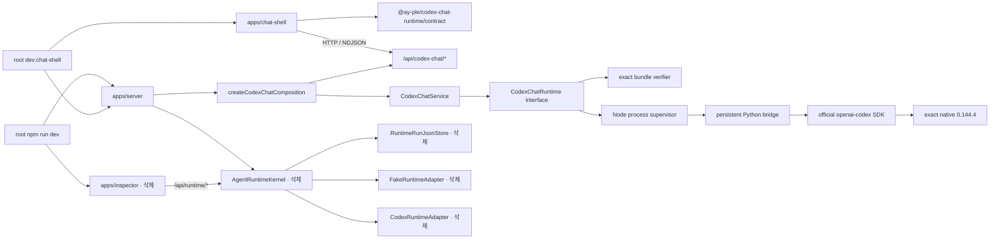

# 004 — Codex Chat target fitness와 legacy deletion blocker 감사

- 조사 기준: 2026-07-17의 tracked repository, 현재 문서와 test
- 판정 기준: [002의 behavior-preserving deletion contract](../tickets/002-extension-envelope.md#L22-L36)
- 대상: 삭제 뒤 살아남는 `@ay-ple/codex-chat-runtime`·Server Chat composition·`apps/chat-shell`, 그리고 이를 아직 감싸는 legacy workspace edge
- 제외: 다음 pin rebase 비용, multi-client/resume·activity·pending interaction·두 번째 engine 설계

## 감사 결론

현재 Codex Chat 경로는 002의 status·native identity/FIFO·acceptance-first stream·authoritative terminal·interrupt·safe failure·bounded cleanup contract를 유지할 수 있다. Browser-safe contract, `CodexChatService`, reducer와 process supervisor는 각각 현재 역할에 맞는 Module이고, production·test Adapter가 공존하는 `CodexChatRuntime` Interface는 실제 Seam이다. 이 경로는 raw App Server shape를 제품 Interface로 누출하지 않는다.

다만 **현재 repository에서 legacy package를 먼저 물리적으로 삭제하면 Chat-only Server가 compile/start되지 않는다.** 원인은 `apps/server/src/server.ts` 하나가 Chat composition과 legacy kernel·adapter·persistence composition을 동시에 조립하고, root command와 Chat fixture도 이 mixed composition을 전제로 하기 때문이다. 이는 실제 deletion-direct residual이지만, 살아남는 Chat Module이 contract를 보존하지 못한다는 architecture blocker는 아니다. 014의 exact removal manifest에서 composition·manifest·script·fixture reference를 같은 deletion slice로 제거하면 된다.

따라서 004는 별도 broad abstraction이나 신규 remediation ticket을 요구하지 않는다. 현재 판정은 다음과 같다.

| 분류 | 판정 |
| --- | --- |
| Survivor fitness | 002의 current contract에 적합 |
| Deletion-direct residual | 있음 — mixed Server/root/test composition |
| 삭제 후에도 남는 semantic blocker | 확인되지 않음 |
| 신규 remediation ticket | 만들지 않음; 014 removal manifest와 016 gate로 전달 |
| General maintainability debt | 있음 — type-level impossible state, fixture oracle 한계, interrupt attempt/ack state conflation, exact-pin patch maintenance |

여기서 **deletion-direct residual**은 삭제 대상 reference를 함께 지우지 않고 package만 지울 때 즉시 깨지는 edge를 뜻한다. **Semantic blocker**는 필요한 reference cleanup까지 끝낸 뒤에도 002 contract를 유지할 수 없다는 증거를 뜻한다. 이번 감사에서 전자만 확인됐다.

## Deletion-oriented production graph

실선은 현재 production import·호출이고, `삭제` 표시는 Chat-only cutover에서 없어질 surface다. `apps/chat-shell` production source에서 legacy package로 향하는 edge와 `@ay-ple/codex-chat-runtime`에서 legacy package로 향하는 edge는 없다.

Graph의 production import 방향은 다음 코드에서 확인된다.

- Chat Shell은 shared package의 `./contract` subpath만 import하고 HTTP client와 reducer를 app 내부에서 조립한다([`chat-api.ts`](../../../../apps/chat-shell/src/chat-api.ts#L1-L9), [`chat-model.ts`](../../../../apps/chat-shell/src/chat-model.ts#L1-L6), [`use-chat-shell.ts`](../../../../apps/chat-shell/src/use-chat-shell.ts#L14-L30)).
- Package는 Node root, browser-safe `./contract`, test-only `./testing` 세 export를 구분한다([package exports](../../../../packages/codex-chat-runtime/package.json#L8-L23)). Server config만 Node root의 verifier와 production factory를 소비한다([`codex-chat-config.ts`](../../../../apps/server/src/codex-chat-config.ts#L5-L12), [candidate preparation](../../../../apps/server/src/codex-chat-config.ts#L141-L165)).
- Root factory는 full bundle을 검증한 뒤 private supervisor를 시작한다([`index.ts`](../../../../packages/codex-chat-runtime/src/index.ts#L41-L60)). Supervisor는 bundled Python을 detached child로 시작하고 controlled environment를 전달한다([`runtime.ts`](../../../../packages/codex-chat-runtime/src/runtime.ts#L203-L265), [controlled environment builder](../../../../packages/codex-chat-runtime/src/runtime.ts#L1203-L1238)).
- Python bridge는 official `AsyncCodex` types를 직접 사용하고 네 adopted notification family만 safe event로 project한다([bridge imports](../../../../packages/codex-chat-runtime/python/bridge/ay_ple_codex_bridge/runtime.py#L10-L27), [projection](../../../../packages/codex-chat-runtime/python/bridge/ay_ple_codex_bridge/runtime.py#L87-L162)).
- 반면 같은 Server source가 legacy `runtime-core`, `runtime-codex`, `runtime-fake`를 top-level import하고 Chat router와 함께 조립한다([Server imports](../../../../apps/server/src/server.ts#L5-L31), [mixed composition](../../../../apps/server/src/server.ts#L112-L152)).

## State ownership과 lifetime

State는 한곳에 몰려 있지 않지만 계층별 의미가 다르다. Browser는 표시 state, Server는 현재 product lease, Node와 Python은 process-local correlation·handle, native runtime은 persisted conversation을 소유한다. Legacy `RuntimeRunLog`나 `RuntimeRunJsonStore`는 이 graph의 Chat state owner가 아니다.

| State | 현재 owner | Cardinality와 lifetime | 근거 |
| --- | --- | --- | --- |
| HTTP stream sequence | Browser `consumeCodexChatTurnResponse()` | 요청당 acceptance 1개와 terminal 1개; EOF 또는 terminal 뒤 종료 | [`chat-api.ts`](../../../../apps/chat-shell/src/chat-api.ts#L113-L154) |
| 표시 transcript·terminal | Browser `ChatState` reducer | tab의 current conversation 1개; reload 시 소실 | [`chat-model.ts`](../../../../apps/chat-shell/src/chat-model.ts#L20-L64), [stream transitions](../../../../apps/chat-shell/src/chat-model.ts#L227-L355) |
| Status·request controller | `useChatShell()` | tab lifetime; reducer 밖에서 status, pending flag와 `AbortController`를 소유 | [`use-chat-shell.ts`](../../../../apps/chat-shell/src/use-chat-shell.ts#L42-L58), [turn effect](../../../../apps/chat-shell/src/use-chat-shell.ts#L121-L173) |
| Current thread·active turn lease | `CodexChatService` | Server process 전체가 thread 1개·active turn 1개를 공유 | [service fields](../../../../apps/server/src/codex-chat-service.ts#L51-L66), [thread lease](../../../../apps/server/src/codex-chat-service.ts#L102-L151), [turn reservation](../../../../apps/server/src/codex-chat-service.ts#L153-L187) |
| Pending operation·turn route·terminal | `NodeCodexChatRuntime` | runtime process당 bounded map과 once-only terminal; close/process loss까지 | [supervisor fields](../../../../packages/codex-chat-runtime/src/runtime.ts#L268-L326), [failure settlement](../../../../packages/codex-chat-runtime/src/runtime.ts#L783-L825) |
| Live SDK handle | Python `BridgeWorker` | 기본 live thread/active turn 32/32 내부 cap; release, terminal 또는 bridge close까지 | [bridge records/state](../../../../packages/codex-chat-runtime/python/bridge/ay_ple_codex_bridge/runtime.py#L55-L69), [worker maps](../../../../packages/codex-chat-runtime/python/bridge/ay_ple_codex_bridge/runtime.py#L165-L205) |
| Persisted native conversation | exact native runtime의 explicit Chat homes | disk lifetime; current Browser/Server는 read/resume하지 않음 | [explicit environment](../../../../apps/server/src/codex-chat-config.ts#L109-L167), [native start/turn](../../../../packages/codex-chat-runtime/python/bridge/ay_ple_codex_bridge/runtime.py#L368-L456) |

이 ownership은 002가 이번 deletion에서 보존하기로 한 process-global 1/1과 browser-memory transcript limitation을 그대로 표현한다. Multi-client owner나 resume owner가 없는 것은 이번 삭제의 blocker가 아니다([002 known limitations](../tickets/002-extension-envelope.md#L45-L51)).

## Surviving Module·Interface·Seam fitness

`Depth`는 Interface가 숨기는 behavior의 leverage로, `Leverage`는 caller가 적은 지식으로 얻는 capability로, `Locality`는 변경·오류·검증이 모이는 정도로 판정했다. 구현 줄 수를 Depth로 계산하지 않았다.

| Module과 Seam | Interface | Depth·Leverage | Locality | 판정과 근거 |
| --- | --- | --- | --- | --- |
| Browser-safe contract Module | Native ID, 다섯 event variant, closed status union, exact decoder | **깊음.** Server, Node frame decoder, browser parser와 tests가 한 vocabulary를 재사용한다. | **높음.** Exact key, status, safe error code 검증이 한 파일에 있다. | 유지. Runtime Interface의 다섯 operation과 event/status union은 private frame을 노출하지 않는다([event/status](../../../../packages/codex-chat-runtime/src/contract.ts#L35-L119), [runtime Interface](../../../../packages/codex-chat-runtime/src/contract.ts#L121-L152), [exact decoders](../../../../packages/codex-chat-runtime/src/contract.ts#L154-L333)). |
| `CodexChatRuntime` Seam | `terminal`, `startThread`, `startTurn`, `interrupt`, `releaseThread`, `close` | **매우 깊음.** Verified bundle, private correlation, bounds, deadline, safe failure와 process-tree reap을 여섯 member 뒤에 숨긴다. Production adapter와 deterministic adapter가 모두 있어 실제 Seam이다. | **높음.** Caller는 Node/Python/process detail을 알지 않고 같은 Interface로 Server와 fixture를 조립한다. | 유지. Public factory가 verifier와 supervisor를 감추고([`index.ts`](../../../../packages/codex-chat-runtime/src/index.ts#L33-L60)), production·test adapter가 같은 Interface를 구현한다([production class](../../../../packages/codex-chat-runtime/src/runtime.ts#L268-L326), [deterministic adapter](../../../../packages/codex-chat-runtime/src/testing.ts#L47-L65)). |
| Process supervisor Module | 위 `CodexChatRuntime` Interface의 production Adapter | **매우 깊음.** Spawn, sole ingress, writer/event budget, correlation, unknown outcome, deadline와 cleanup을 숨긴다. | **높음.** Pending/turn registry와 first terminal settlement가 한 Module에 있다. 내부 state flag가 많지만 public caller로 퍼지지 않는다. | 유지. Result/event scope 검증과 failure settlement가 supervisor에 집중된다([operation routing](../../../../packages/codex-chat-runtime/src/runtime.ts#L600-L760), [once-only failure](../../../../packages/codex-chat-runtime/src/runtime.ts#L783-L855), [bounded cleanup](../../../../packages/codex-chat-runtime/src/runtime.ts#L921-L1040)). |
| Server lease Module (`CodexChatService`) | Status, thread/turn lease, stream, interrupt, shutdown | **중간 이상.** Lazy runtime, 1/1 lease, disconnect drain, unknown outcome와 close-once를 Express 밖에 숨긴다. 다만 caller가 `startTurn → streamTurn`, `disconnectTurn`, `startThread → abandonThread` choreography를 알아야 한다. | **중간.** Product lease는 모였지만 `ActiveTurn`과 runtime lifecycle이 여러 independent field로 표현된다. | 유지하되 general debt 기록. HTTP Module은 validation·Origin·NDJSON만 맡고 service를 호출한다([router operations](../../../../apps/server/src/codex-chat-http.ts#L71-L177), [service lifecycle](../../../../apps/server/src/codex-chat-service.ts#L267-L433)). |
| Browser reducer Module | `ChatState × ChatAction → ChatState` | **중간 이상.** Native scope reconciliation, delta/completed merge, interrupt acknowledgement, terminal/failure 전이를 한 pure Interface로 제공한다. | **높음(전이), 중간(state shape).** 전이는 한 파일에 있지만 effect state는 hook과 parser에 나뉜다. | 유지하되 general debt 기록. Wrong scope와 late frame은 한 safe failure로 수렴한다([reducer](../../../../apps/chat-shell/src/chat-model.ts#L105-L185), [frame reducer](../../../../apps/chat-shell/src/chat-model.ts#L227-L355), [safe convergence](../../../../apps/chat-shell/src/chat-model.ts#L438-L453)). |

### Impossible state, settlement, raw leakage와 shotgun surgery

| 감사 축 | 현재 판정 | 삭제와의 관계 | 근거 |
| --- | --- | --- | --- |
| Type-level impossible terminal | `TurnCompletedEvent`는 `status: 'completed'`와 `failure`를 함께 표현하거나 `failed`에 `failure`가 없는 값을 type-level로 허용한다. Runtime decoder는 exact key와 failed payload를 검사하지만 injected adapter는 decoder를 우회할 수 있다. | General debt | [event type](../../../../packages/codex-chat-runtime/src/contract.ts#L60-L69), [runtime parser repair](../../../../packages/codex-chat-runtime/src/contract.ts#L287-L316) |
| Server impossible state | `ActiveTurn.phase`와 optional `turn`, `disconnected`, `interruptRequested`, deadline 및 service의 independent optional fields 때문에 compiler가 불가능한 조합을 배제하지 못한다. | General debt; current tests와 private mutation discipline이 현재 contract를 지킨다. | [`ActiveTurn`](../../../../apps/server/src/codex-chat-service.ts#L21-L28), [service fields](../../../../apps/server/src/codex-chat-service.ts#L51-L66) |
| Browser impossible state | `ChatState`는 phase와 optional `threadId`, `activeTurnId`, terminal, interrupt, failure를 독립 field로 두므로 예를 들어 `empty` + terminal도 type-expressible하다. Reducer guard는 runtime trace를 안전하게 만든다. | General debt | [`ChatState`](../../../../apps/chat-shell/src/chat-model.ts#L8-L64), [transition guards](../../../../apps/chat-shell/src/chat-model.ts#L105-L185) |
| Duplicate settlement | Node는 first `terminalError`, pending/turn map deletion과 coalesced close promise로 settlement를 집중한다. Server도 runtime close promise와 first failure code를 coalesce하고 Browser parser는 terminal 뒤 frame을 거부한다. | 현재 blocker 없음 | [Node close](../../../../packages/codex-chat-runtime/src/runtime.ts#L537-L598), [Node terminal guard](../../../../packages/codex-chat-runtime/src/runtime.ts#L783-L825), [Server close-once](../../../../apps/server/src/codex-chat-service.ts#L388-L428), [Browser terminal policing](../../../../apps/chat-shell/src/chat-api.ts#L124-L153) |
| Raw leakage | Python은 네 allowlisted event만 project하고 Node exact decoder는 `bridgeRequestId`를 private correlation에만 쓴다. Browser contract에는 native ID와 safe fields만 있다. Untrusted error code는 public stream으로 내보내지 않는다. | 현재 blocker 없음 | [Python projection](../../../../packages/codex-chat-runtime/python/bridge/ay_ple_codex_bridge/runtime.py#L87-L162), [Node scope check](../../../../packages/codex-chat-runtime/src/runtime.ts#L736-L760), [unsafe code oracle](../../../../packages/codex-chat-runtime/src/runtime.actual.test.ts#L634-L689) |
| Shotgun surgery | Current event family 변경은 Python projection, shared contract와 reducer/presentation의 의도적인 observable-contract 변경을 요구한다. Exact pin 변경은 source constants, patch ledger, manifest와 oracles를 함께 갱신해야 한다. 현재 deletion에는 event/pin 변경이 없다. | General maintenance obligation; broad event bus나 generic engine Interface를 미리 만들 근거가 아님 | [exact provenance owner](../../../../packages/codex-chat-runtime/upstream/UPSTREAM.md#L5-L30), [manifest patch roster](../../../../packages/codex-chat-runtime/manifests/production-runtime-darwin-arm64.json#L123-L186) |

한 구체적인 state debt도 확인했다. `CodexChatService.interrupt()`는 runtime acknowledgement를 기다리기 전에 `interruptRequested = true`로 바꾸고 known nonfatal rejection 때 되돌리지 않는다([interrupt](../../../../apps/server/src/codex-chat-service.ts#L245-L264)). 이후 같은 stream이 disconnect되면 cleanup은 그 flag를 보고 두 번째 interrupt를 생략하고 drain timeout으로만 수렴한다([disconnect cleanup](../../../../apps/server/src/codex-chat-service.ts#L329-L351)). Existing test는 nonfatal rejection 뒤 stream이 계속 authoritative하다는 사실은 검증하지만 rejection 뒤 disconnect 조합은 만들지 않는다([lifecycle test](../../../../apps/server/src/codex-chat-lifecycle.test.ts#L86-L121)). 이는 attempt와 acknowledgement state가 합쳐진 general debt다. Timeout과 runtime close가 bounded cleanup outcome을 계속 제공하므로 legacy deletion이 만든 회귀는 아니다.

## Observable conformance와 fixture independence

| Surface | 무엇을 실제로 생성하는가 | 무엇을 독립 관찰하는가 | 보장하지 않는 것 |
| --- | --- | --- | --- |
| Production `NodeCodexChatRuntime` | Verified bundled Python process, persistent bridge, exact native child | Private response/event correlation, FIFO, bounds, terminal, child/pipe/process group | HTTP, browser rendering, live credential/provider variability. 그 사실은 별도 Server·browser·local-provider gate가 맡는다. |
| `DeterministicCodexChatRuntime` | Caller가 제공한 thread/turn ID와 event script, call log | Input/script 일치, live thread, active turn, event scope, single consumer, sticky runtime failure | Native ID 생성, OS process, frame parsing, timing/backpressure, terminal completeness·uniqueness·post-terminal policing. Empty event script도 허용된다([adapter](../../../../packages/codex-chat-runtime/src/testing.ts#L42-L129), [single-consumer iterator](../../../../packages/codex-chat-runtime/src/testing.ts#L195-L216), [empty script test](../../../../packages/codex-chat-runtime/src/testing.unit.test.ts#L166-L188)). |
| Server fixture | Actual Express listener/router/NDJSON와 `ControlledRuntime` 또는 deterministic Adapter | HTTP validation, Server 1/1 lease, disconnect/backpressure, safe error, close invocation | Production child, opaque native identity authority, bundle/policy. `ControlledRuntime`은 `thread-A`·`turn-A1`을 고정하고 operation input을 독립 검증하지 않는다([fixture](../../../../apps/server/src/testing/codex-chat-test-support.ts#L122-L212)). |
| Chat Shell Playwright | Actual browser, Vite, actual Express Server, deterministic Adapter scenario | DOM status/identity/transcript, HTTP stream, reducer, interrupt acknowledgement와 follow-up | Exact native/runtime mechanics. Malformed-stream scenario는 Playwright route가 Server를 우회해 browser fail-closed만 증명한다([harness composition](../../../../apps/chat-shell/e2e/chat-shell-harness.ts#L96-L151), [nominal browser assertion](../../../../apps/chat-shell/e2e/chat-shell.spec.ts#L9-L51), [malformed route](../../../../apps/chat-shell/e2e/chat-shell.spec.ts#L538-L563)). |
| Node actual-child | Verified bundle + full bridge + purpose-built fake App Server 또는 synthetic worker | Response-last, malformed/duplicate frame, queue/deadline, unknown outcome, terminal settlement와 process-group reap | Browser/HTTP, live provider. Fixed prompt/ID는 fault injection control이지 native identity oracle이 아니다. |
| Exact local-provider actual | Production Node→bundled Python→official SDK→exact native와 official local Responses harness | Opaque relational native IDs, nominal/interrupt/distinct same-thread follow-up, effective policy와 reap | Fault/late/duplicate/wrong-owner, disconnect, browser와 real credential/provider variability([test](../../../../packages/codex-chat-runtime/src/local-provider.actual.test.ts#L46-L151)). |
| Server actual shutdown | Actual Server listener + verified Python/native process tree fixture | Fresh intake refusal, close wait, independent worker/native PID와 process-group disappearance | Active turn close, disconnect, provider response와 browser state([test](../../../../apps/server/src/testing/codex-chat-shutdown.actual.ts#L26-L76), [PID oracles](../../../../apps/server/src/testing/codex-chat-shutdown.actual.ts#L96-L126)). |

### 이번 조사에서 실행한 verification

| Gate | 결과 | 해석 |
| --- | --- | --- |
| `@ay-ple/codex-chat-runtime` default suite | 51 pass | Provenance, synthetic production verifier, bridge protocol unit와 Node unit |
| Server default suite | 91 pass | Legacy와 Chat Server tests를 함께 실행 |
| Chat Shell unit suite | 15 pass | Contract/parser/reducer behavior |
| Chat Shell Playwright | 13 pass (`1440×900`) | Actual browser + Server + deterministic runtime |
| Production bundle verifier | green | 현재 ignored materialized bundle과 canonical manifest 일치 |
| Survivor production builds | `codex-chat-runtime`, Server, Chat Shell 모두 green | 현재 mixed repository에서 compile 가능 |
| Chat Shell lint | green | 현재 production/E2E source lint |
| Node actual-child | 53/53 pass | Adversarial bridge/supervisor/process-tree gate |
| Exact local-provider | 1/1 pass | Exact native + official local provider gate |
| Server actual shutdown | 1/1 pass | Listener refusal + process-tree reap gate |

Actual gate가 green이어도 root default `npm test`가 이를 자동 포함하는 것은 아니다. Runtime package의 default `test`와 `test:node-actual`·`test:local-provider`는 별도 script이고([runtime scripts](../../../../packages/codex-chat-runtime/package.json#L30-L43)), Server actual shutdown도 별도 `test:codex-chat-actual`이다([Server scripts](../../../../apps/server/package.json#L7-L13)). 016은 삭제 뒤에도 이 구분을 verification gate에 보존해야 한다.

## Falsifying trace 감사

전체 suite를 happy-path fixture 편중으로 분류할 근거는 없다. Production/runtime layer에는 response-last, malformed result, process loss, queue overflow, deadline, duplicate/post-terminal과 close race가 있고, Server/browser layer에는 conflict, disconnect, backpressure, retryable error, failed terminal과 malformed stream이 있다. 다만 fixture별 oracle은 서로 대체할 수 없다.

| Trace | 현재 evidence | 남은 한계와 판정 |
| --- | --- | --- |
| Opaque native identity·FIFO | Response-last actual-child가 returned native ID와 event order를 관찰하고 private `bridgeRequestId` 비노출을 확인한다([test](../../../../packages/codex-chat-runtime/src/runtime.actual.test.ts#L210-L239)). Exact local-provider는 prompt 상수가 아니라 relational ID와 distinct follow-up을 관찰한다. | Deterministic/Server fixture의 canned ID만으로는 증명하지 못한다. Actual evidence가 있으므로 deletion blocker 아님. |
| Wrong scope/owner | Node는 contradictory mutation result를 fatal로 닫고([test](../../../../packages/codex-chat-runtime/src/runtime.actual.test.ts#L508-L531)), deterministic adapter는 scripted event의 wrong thread/turn을 start 전 거부하며([test](../../../../packages/codex-chat-runtime/src/testing.unit.test.ts#L135-L164)), reducer는 mismatched event를 safe failure로 닫는다([test](../../../../apps/chat-shell/src/chat-model.test.ts#L452-L485)). | HTTP owner isolation은 없다. ID를 아는 allowed loopback/Origin caller는 process-global active turn을 interrupt할 수 있다([route](../../../../apps/server/src/codex-chat-http.ts#L159-L176), [guard](../../../../apps/server/src/codex-chat-http.ts#L373-L377)). 이는 002의 multi-client non-goal이다. |
| Missing terminal | Browser client는 matching acceptance 뒤 terminal이 없으면 reject하고([implementation](../../../../apps/chat-shell/src/chat-api.ts#L124-L153), [test](../../../../apps/chat-shell/src/chat-api.test.ts#L121-L199)), Server는 accepted stream EOF를 safe `runtime.failed`로 정산한다([service](../../../../apps/server/src/codex-chat-service.ts#L189-L235)). | Deterministic adapter 자체는 terminal을 요구하지 않는다. Fixture alone green은 oracle이 아니다. General fixture debt. |
| Duplicate/late event | Supervisor는 duplicate result와 terminal 뒤 event를 protocol failure로 만들되 이미 전달한 success를 rewrite하지 않는다([actual test](../../../../packages/codex-chat-runtime/src/runtime.actual.test.ts#L1364-L1408)); reducer도 late frame을 safe failure로 수렴한다. | Deterministic adapter는 same-scope duplicate/post-terminal script를 막지 않는다. Actual/browser oracle이 보완한다. |
| Active close/race | Node actual은 repeated close + simultaneous fatal, active stream + pending mutation close race를 once-only로 정산한다([tests](../../../../packages/codex-chat-runtime/src/runtime.actual.test.ts#L782-L862)). Server actual은 idle process-tree shutdown을 독립 관찰한다. | Server actual fixture에는 accepted active turn close가 없다. Node oracle과 Server controlled tests가 계층별 evidence이며, 016 gate에서 둘 다 필요하다. |
| Unknown mutation outcome | Bridge/App Server pre-response loss는 dispatched mutation을 `unknownOutcome: true`로 reject하고 process를 reap한다([actual tests](../../../../packages/codex-chat-runtime/src/runtime.actual.test.ts#L410-L474)). | Browser는 status refresh로만 수렴하며 retry하지 않는다. 이는 002 current behavior다. |
| Raw/error leakage | Invalid child error code를 protocol failure로 바꾸고 raw string을 stream에서 제거한다([actual test](../../../../packages/codex-chat-runtime/src/runtime.actual.test.ts#L634-L689)); Playwright malformed stream도 raw secret을 표시하지 않는다. | Raw payload debug UI를 새로 만드는 것은 non-goal이다. |
| Interrupt rejection→disconnect | Existing Server test는 nonfatal interrupt rejection 뒤 stream 유지까지만 검증한다. 앞서 기록한 attempt/ack flag 때문에 이어지는 disconnect에서는 재-interrupt하지 않고 timeout close로 간다. | 새 deletion trigger가 아니라 general state-model/test trace debt다. |

Fixture-shaped identifier도 production contract와 분리되어 있다.

- `thread-A`, `turn-A1`, `item-A1`, `thread-native-*`와 `codexChatIdentity` 고정 값은 test fixture에만 있다([Server fixture IDs](../../../../apps/server/src/testing/codex-chat-test-support.ts#L13-L59), [Chat API fixture](../../../../apps/chat-shell/src/chat-api.test.ts#L94-L143)).
- `DeterministicCodexChatRuntime`과 `ControlledRuntime`은 이름부터 test role을 드러낸다. 전자는 public testing subpath, 후자는 Server test support에만 있다.
- Production의 `agent_message.*`, `turn.error`, `turn.completed`는 first-tracer 우연이 아니라 002가 보존하기로 한 current allowlist다. Activity family를 미리 generic event bus로 바꾸지 않는다.
- `CreateLegacyServerAppOptions`와 `createServerApp()` compatibility factory는 명시적으로 legacy-shaped이며 Chat runtime을 항상 disable한다([factory](../../../../apps/server/src/server.ts#L38-L70)). 이는 survivor Interface로 보존할 근거가 아니라 014 removal manifest 항목이다.

## Exact bundle과 ordered patch maintenance baseline

현재 exact owner는 `@ay-ple/codex-chat-runtime` package다. Source oracle, tracked snapshot, manifest, patch ledger와 regression oracle을 아래처럼 연결하며 다음 pin rebase 비용은 판정하지 않는다.

| Owner asset | Current source·책임 | Regression oracle |
| --- | --- | --- |
| `upstream/UPSTREAM.md` + unpatched snapshot/manifest | `references/openai-codex` commit `8c68d4c87dc54d38861f5114e920c3de2efa5876`, tag `rust-v0.144.4`, native `0.144.4`; production은 oracle checkout으로 fallback하지 않음 | Exact generate/verify, two clean build와 complete official suite([authority](../../../../packages/codex-chat-runtime/upstream/UPSTREAM.md#L5-L30), [tracked assets](../../../../packages/codex-chat-runtime/upstream/UPSTREAM.md#L32-L59)) |
| Patch 0001 | `_message_router.py`: response-last pending FIFO와 terminal 보존 | Purpose-built response-last child, patch-owned official router test, exact derivation([ledger](../../../../packages/codex-chat-runtime/upstream/PATCHES.md#L19-L47)) |
| Patch 0002 | `_message_router.py`: adopted route item/byte/count bound와 sticky overflow | Default 4,096 boundary A/B test, 14-case injected limit matrix와 official tests([ledger](../../../../packages/codex-chat-runtime/upstream/PATCHES.md#L49-L76)) |
| Patch 0003 | `_message_router.py`: malformed response decode 중 waiter ownership과 complete-zero accounting | Current/future waiter terminal, 16-field usage cleanup oracle([ledger](../../../../packages/codex-chat-runtime/upstream/PATCHES.md#L78-L97)) |
| Patch 0004 | `client.py`: public notification opt-out config | Official config test와 bridge 64-method complement journal([ledger](../../../../packages/codex-chat-runtime/upstream/PATCHES.md#L99-L118)) |
| Patch 0005 | `_message_router.py`: correlated result/error strict classification | Malformed envelope matrix, valid result/error 대조군과 bridge mutation matrix([ledger](../../../../packages/codex-chat-runtime/upstream/PATCHES.md#L120-L140)) |
| Production manifest | Ordered `0001 → 0002 → 0003 → 0004 → 0005`, patched SDK wheel, standalone Python, native/runtime/bridge roster와 digest | Full-tree verifier와 actual-child gates([manifest patch order](../../../../packages/codex-chat-runtime/manifests/production-runtime-darwin-arm64.json#L123-L186)) |
| AY-PLE bridge | `python/bridge`의 five-file local adapter; ordered upstream patch는 아님 | Bridge actual-child가 acceptance-first FIFO, identity, policy, interrupt, limits, fatal과 close를 검증([ledger disposition](../../../../packages/codex-chat-runtime/upstream/PATCHES.md#L142-L148)) |

이 patch stack은 현재 유지 의무이지만 legacy 삭제 때문에 새로 생기는 비용이 아니다. Exact pin을 바꾸지 않는 이번 cutover에서 patch abstraction이나 upstream rebase framework를 추가하지 않는다.

## Legacy deletion blocker와 general debt 분리

### Deletion-direct residual: 하나의 mixed-composition cause cluster

| Residual | Package만 먼저 삭제할 때의 구체 failure | 014에서 함께 제거할 edge |
| --- | --- | --- |
| Server production composition | Top-level legacy import가 resolve되지 않아 Server typecheck/build/start가 실패한다. Import를 남겨 둔 채 package dependency만 지울 수 없다. 또한 default app creation은 Chat router를 만들기 전에 legacy kernel, Fake/Codex Adapter와 history store를 항상 만든다. | Legacy imports/options, compatibility factory, kernel/store construction과 `/api/runtime/*`·`/api/health` routes([imports/options](../../../../apps/server/src/server.ts#L5-L70), [construction/routes](../../../../apps/server/src/server.ts#L112-L327)) |
| Server manifest/compiled source | Server production dependencies가 세 legacy workspace를 요구한다. `tsconfig`는 non-test `src` 전체를 compile하므로 `codex-parity.ts`와 `runtime-run-json-store.ts`를 남기면 legacy import가 계속 build를 막는다. | Manifest dependency와 legacy-only source/script([Server dependencies](../../../../apps/server/package.json#L15-L22), [tsconfig include](../../../../apps/server/tsconfig.json#L10-L14), [`codex-parity.ts`](../../../../apps/server/src/codex-parity.ts#L7-L20), [`runtime-run-json-store.ts`](../../../../apps/server/src/runtime-run-json-store.ts#L12-L21)) |
| Root commands | Current `npm run dev`는 Server + Inspector이고 root test/build/typecheck가 legacy workspaces와 Inspector를 explicit하게 호출한다. Workspace를 먼저 지우면 command가 실패하고 002의 canonical entrypoint가 성립하지 않는다. | `dev`를 Server + Chat Shell로 전환하고 삭제 workspace command를 root script에서 제거([root scripts](../../../../package.json#L10-L17)) |
| Chat test composition | Shared Server fixture와 Chat Shell E2E가 Chat과 무관한 `runtimeHistoryDirectory` option을 넘긴다. Legacy option/type을 제거한 뒤 fixture를 같이 고치지 않으면 typecheck/test가 실패한다. | `CreateServerAppOptions`의 legacy fields와 temporary history setup([Server test helper](../../../../apps/server/src/testing/test-server.ts#L4-L26), [Shell E2E setup](../../../../apps/chat-shell/e2e/chat-shell-harness.ts#L112-L151)) |

네 행은 독립 architecture 문제 네 개가 아니라 **mixed Server composition을 workspace·command·fixture까지 일관되게 삭제해야 한다는 하나의 cause cluster**다. Chat Module을 먼저 일반화하거나 새로운 Host Interface를 만들 필요가 없다. 014가 exact removal manifest와 atomic order를 소유하고, 016이 그 결과의 build/start/test를 검증한다.

### 삭제와 무관한 general debt

| Debt | 현재 영향 | 이번 deletion 판정 |
| --- | --- | --- |
| `TurnCompletedEvent`, Server `ActiveTurn`, Browser `ChatState`의 type-level impossible state | 잘못된 injected Adapter나 future edit가 runtime guard를 우회할 여지 | Contract regression evidence 없음; 후속 bounded refactor 후보일 뿐 |
| Interrupt attempt와 acknowledgement를 한 boolean으로 표현 | Known rejection 뒤 disconnect가 재-interrupt 대신 timeout close로 감 | Bounded cleanup은 유지; deletion-caused 아님 |
| Deterministic/Controlled fixture의 scripted·fixed identity와 incomplete terminal policing | Fixture green을 native conformance로 과대해석할 위험 | Actual/local-provider gate가 별도 oracle; 016에서 구분 |
| HTTP caller ownership 없음 | Allowed caller가 global 1/1 active turn ID를 알면 interrupt 가능 | Multi-client/session isolation은 002 non-goal |
| Hook의 reducer 밖 pending/status/controller state와 presentation의 hook-owned type dependency | Impossible UI combination·last-writer-wins status refresh 가능성 | 현재 contract regression이 증명되지 않은 locality debt |
| Exact source constants·patch ledger·manifest의 coordinated update | Pin upgrade 때 여러 owner asset을 함께 변경해야 함 | Current exact pin은 유지; next-pin rebase는 조사 범위 밖 |
| Root default test가 actual gates를 포함하지 않음 | Default green만으로 exact child·provider·reap을 증명할 수 없음 | 016 verification policy fact; deletion remediation 아님 |

## 최종 판정과 handoff

1. 살아남는 `CodexChatRuntime` Seam, Server lease Module, browser contract/parser/reducer와 process supervisor는 002 current observable contract에 맞는다.
2. Legacy package를 지금 단독 삭제하면 mixed Server/root/test reference 때문에 compile/start/test가 깨진다. 이 사실은 014의 removal order와 manifest를 구체화하는 deletion residual이다.
3. Expected reference cleanup까지 포함한 Chat-only slice가 native identity/FIFO, terminal, interrupt, safe failure 또는 bounded process cleanup을 보존하지 못한다는 evidence는 없다. Default, Playwright, Node actual, exact local-provider와 Server actual shutdown gate가 모두 green이다.
4. 그러므로 002의 “semantic regression이면 원인 하나의 remediation ticket” trigger는 충족되지 않았다. 별도 Interface 설계 ticket을 만들지 않고 014에 mixed composition removal을, 016에 default + actual gate 분리를 넘긴다.
5. Impossible state, fixture hardcoding, wrong-owner non-goal과 interrupt attempt/ack conflation은 general debt로 보존하되 legacy 존치 근거나 이번 cutover blocker로 사용하지 않는다.
