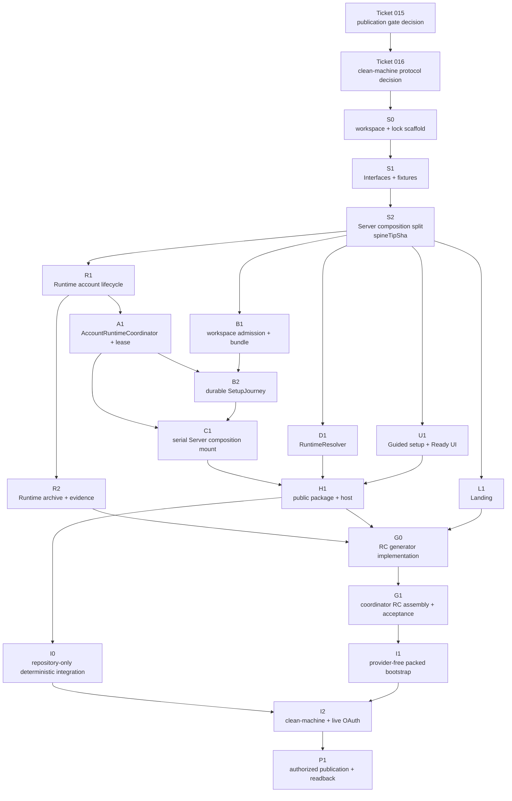

# 최종 병렬 delivery contract 연구

작성일: 2026-07-23

상태: Ticket 014의 확정 research evidence

## 결론

첫 public preview 구현은 **세 개의 linear commit으로 만든 하나의 immutable reviewed contract-spine tip에서 시작하고, coordinator 1명과 동시에 최대 3명의 lane writer가 exclusive path에서 작업한 뒤, 한 integration queue로 직렬 수렴**한다. 최대 병렬성보다 authoritative release 수렴을 우선한다.

구현을 여는 순서는 다음과 같이 고정한다.

1. 아직 열려 있는 [Ticket 015](../tickets/015-publication-release-gates.md)를 먼저 끝내고, 그 결정을 입력으로 [Ticket 016](../tickets/016-clean-machine-smoke-protocol.md)을 끝낸 뒤 implementation-ready spec과 tickets를 만든다.
2. integrator가 이 문서의 `S0 → S1 → S2` 세 commit을 순서대로 만들고 각 commit gate와 final independent review를 통과시킨다. `S2`의 SHA가 `spineTipSha`다.
3. Root workstream은 모두 같은 immutable `spineTipSha`에서 분기한다. Implementation predecessor는 green integration merge를 ancestry로 가진 새 immutable `handoffSha`로 전달한다. Commit 없는 coordinator checkpoint predecessor는 그 checkpoint의 fixed input integration SHA를 `handoffSha`로 유지하고 accepted receipt·retained artifact path/digest를 함께 전달한다. Lane은 sibling branch를 직접 merge하지 않는다. Shared Interface 또는 dependency가 바뀌면 lane이 직접 고치지 않고 integrator가 serial spine-delta를 만든다. `spineTipSha`는 계속 원래 `S2`를 가리키며, delta의 reviewed 결과는 별도 `contractTipSha`와 downstream `handoffSha`로 기록한다.
4. lane은 fixed commit SHA 단위로 review를 받고, integration branch에는 DAG 순서대로 한 번에 하나씩 merge된다.
5. repository-only deterministic `SetupJourney` checkpoint와 actual tarball의 provider-free signed-out bootstrap checkpoint가 모두 green이 되기 전에는 live OAuth를 release evidence로 사용하지 않는다. Public repository, npm, GitHub Release, Pages에는 Ticket 015가 정할 publication gate와 사용자 승인 전까지 쓰지 않는다.

이 문서는 제품 schema, OAuth, Runtime release, repository publication의 새 authority를 만들지 않는다. 다음 owner가 이미 채택한 결정을 **delivery edge**로 연결한다.

| Authority | 이 contract가 소비하는 결정 |
| --- | --- |
| [ADR 0014](../../../adr/0014-create-app-owned-normalized-semester-workspaces.md), [Ticket 009 evidence](semester-workspace-schema-scaffold-research.md) | app-owned v3 `SemesterWorkspace`, authoritative `WorkspaceManifest`, new-leaf scaffold, no-clobber admission |
| [Ticket 010 evidence](resumable-setup-authority-design.md), [Ticket 011 evidence](bootstrap-setup-durability-recovery-research.md) | dedicated package resource bundle, `VerifiedBundleSource`, single setup envelope, `SetupJourney.reconcile/observe`, `LaunchBinding`, app-wide account/Runtime transition lease |
| [ADR 0017](../../../adr/0017-use-codex-managed-browser-oauth-for-product-account-lifecycle.md), [Ticket 008 evidence](codex-oauth-integration-research.md) | official managed ChatGPT Browser OAuth, app-managed `CODEX_HOME`, fresh Account Read authority, auth-only Runtime에서 workspace Runtime으로의 전환 |
| [ADR 0016](../../../adr/0016-distribute-public-preview-with-an-exact-npx-launcher-and-verified-runtime-release.md), [Ticket 006 evidence](npx-production-composition-research.md), [Ticket 007 evidence](runtime-release-delivery-research.md) | exact `npx ay-ple@<version>`, one-package·one-host, embedded immutable Runtime descriptor, verified content-addressed Runtime resolution |
| [ADR 0015](../../../adr/0015-bootstrap-public-repository-from-reviewed-clean-snapshot.md), [Ticket 003 evidence](publication-inventory-audit.md), [Ticket 003a evidence](third-party-redistribution-evidence.md) | fixed `hub` SHA에서 positive allowlist로 만드는 clean public root, first-party Apache-2.0, redistribution evidence와 외부 write 금지 |
| [Ticket 012 evidence](semester-ready-surface-prototype.md), [Ticket 013 evidence](public-landing-prototype.md) | Guided setup에서 Compact Ready surface로의 전환, release-generated install truth를 읽는 official Landing entrypoint |

## 현재 topology가 강제하는 delivery boundary

[초기 collision audit](parallel-delivery-collision-audit.md)의 잠정 경계를 live code에 다시 대입하면 다음 제약이 남는다.

| 관찰된 현재 surface | 확정 delivery consequence |
| --- | --- |
| [`@ay-ple/product-contract`](../../../../packages/product-contract/README.md)은 Server와 Browser가 공유하는 유일한 product wire contract다. | Browser-safe Account·Setup·Ready projection과 decoder는 contract-spine owner만 바꾼다. Runtime native shape나 path를 추가하지 않는다. |
| Root [`package.json`](../../../../package.json)과 [`package-lock.json`](../../../../package-lock.json)이 모든 workspace dependency graph를 함께 소유한다. | root와 모든 workspace manifest·lockfile mutation은 integrator 한 명에게만 허용한다. |
| [`@ay-ple/codex-chat-runtime`](../../../../packages/codex-chat-runtime/README.md)은 official SDK snapshot, patch stack, Python bridge, Node Runtime, canonical manifests와 ignored materialization output을 함께 가진다. | OAuth와 release archive를 별도 writer가 동시에 만질 수 없다. `R1`과 `R2`는 같은 Runtime owner가 직렬 수행한다. |
| [`createServerApplication()`](../../../../apps/server/src/server.ts)은 현재 reusable application seam이지만 listener, environment, Runtime composition이 아직 public host용으로 분리되지 않았다. | setup business logic과 production host composition은 서로 다른 새 module에 놓고, 기존 composition 파일은 spine/integrator만 직렬 수정한다. Public host는 분리된 seam만 소비한다. |
| 현재 [`App.tsx`](../../../../apps/chat-shell/src/App.tsx)와 [`App.css`](../../../../apps/chat-shell/src/App.css)는 shell 조합을 함께 소유한다. | Product UI writer는 한 명이다. onboarding과 Ready를 여러 UI lane으로 쪼개지 않는다. |
| [`apps/chat-shell/e2e`](../../../../apps/chat-shell/e2e/chat-shell-harness.ts)는 UI, Server, Runtime과 fixture를 교차 조합한다. | 이 디렉터리는 UI가 아니라 Integration/QA owner가 소유한다. Feature failure를 fixture 수정으로 숨길 수 없다. |
| Root [development bootstrap](../../../../scripts/product-development-bootstrap.mts), [dogfood launcher](../../../../scripts/product-dogfood.mts), [workspace materializer](../../../../scripts/semester-workspace-materializer.mts)는 repository 개발 surface다. | 구현 참고 donor로만 사용한다. public bin, setup state, canonical v3 scaffold 또는 package resource authority로 승격하지 않는다. |
| Repository의 [`.agents/skills`](../../../../.agents/skills/ask-matt/SKILL.md)는 camp engineering workflow다. | Public package는 ambient repository `.agents/**`를 복사하지 않는다. 제품용 built-in Skill의 canonical source는 `packages/semester-workspace/resources/workspace/**`의 dedicated resource bundle만 사용하고 release assembler가 검증된 copy를 tarball에 넣는다. |

## 역할과 동시성 계약

동시에 active한 구현 역할은 네 개로 제한한다.

| 역할 | 수 | write 권한 | 금지 |
| --- | ---: | --- | --- |
| Integration coordinator | 1 | integration worktree, `S0 → S1 → S2`, root/workspace manifest·lockfile, 승인된 spine-delta, merge commit | feature implementation을 대신 작성하거나 review와 author를 겸하지 않음 |
| Lane writer | 최대 3 | 자신의 attached worktree와 아래 exclusive path만 | 다른 lane, shared contract, root manifest·lockfile, integration branch 수정 |
| Fixed-SHA reviewer | 필요 시 writer slot을 잠시 교대 | detached review worktree의 read-only 검사와 review record | review 대상 SHA에서 수정·commit·merge |
| Integration/QA runner | coordinator가 queue checkpoint에서 수행하거나 독립 reviewer에게 위임 | integration-owned test/fixture path와 실행 evidence | feature source를 green으로 만들기 위한 즉석 수정 |

Coordinator는 lane writer로 전환하지 않는다. 네 번째 feature writer를 추가하려면 coordinator 역할을 없애야 하므로 허용하지 않는다. 한 lane이 blocked되면 dependency가 없는 다른 lane으로 slot을 넘길 수 있지만, branch·worktree·owner를 그대로 양도하지 않는다. 새 owner는 새 branch 또는 명시적인 ownership handoff record로 시작한다.

## Contract spine: `S0 → S1 → S2`

### 목적과 commit 경계

Contract spine은 여러 lane이 같은 workspace graph, Interface, fixture와 composition seam을 컴파일하도록 만드는 **최소 integration skeleton**이다. Product feature, network call, durable mutation, 다운로드, static hosting, visual implementation 또는 release publication을 수행하지 않는다. 세 commit은 linear history이며 squash하지 않는다. 각 commit의 책임과 review evidence를 보존한 `S2` SHA만 downstream `spineTipSha`로 사용한다.

| Commit | Exact responsibility | Required gate | 포함하지 않는 것 |
| --- | --- | --- | --- |
| `S0 — workspace/lock scaffold` | `packages/runtime-release`, `packages/semester-workspace`, `apps/ay-ple`, `apps/landing`의 compile-only workspace scaffold와 canonical `packages/semester-workspace/resources/workspace/**` root를 만든다. Root/workspace scripts, TypeScript reference/build order와 단일 lockfile을 연결한다. | clean `npm install`, root test/typecheck/build/lint, pack되지 않는 empty scaffold 확인 | Interface field, feature behavior, actual resource bytes, publish metadata의 release value |
| `S1 — frozen Interfaces/fixtures` | Browser-safe Account·Setup·Ready DTO/decoder, Runtime-private account lifecycle, `RuntimeReleaseDescriptor`/resolver, v3 workspace/setup, Server account/Runtime coordinator와 host composition port를 interface-only로 고정하고 아래 fixture roster를 추가한다. | contract decoder, package typecheck, producer/consumer compile conformance, private-field leak scan | OAuth/network/store/scaffold/lease/download implementation |
| `S2 — pure Server composition/listener split` | 현재 [`server.ts`](../../../../apps/server/src/server.ts)의 Express application construction, TCP listener, environment/dev entrypoint와 signal wiring을 behavior-preserving modules로 나눈다. `dotenv.config()` 같은 import-time side effect를 executable entry로 한정하고 public host가 app factory를 재사용할 seam을 만든다. | 기존 Server tests, start/close/signal actual test, root four gates, behavior diff 0 review | Setup route, OAuth, dynamic public host, SPA serving, new state mutation |

`S0`는 다음 고정 package boundary를 만든다.

| Package/app | Contract spine에서 고정할 역할 | Feature owner handoff |
| --- | --- | --- |
| `packages/runtime-release/**` | Ticket 007의 descriptor decoder와 `resolveRuntime({ appDataRoot, signal, report })` public seam을 소유하는 Node-only deep Module | `D1` |
| `packages/semester-workspace/**` | v3 manifest/schema, admission, resource bundle verification/materialization, single setup envelope/store와 `SetupJourney`의 Node-only deep Module seam | `B1`, 이어서 `B2` |
| `apps/ay-ple/**` | one public package/bin이 위 Modules, Server와 built SPA를 조립하는 thin application; verified workspace resource copy는 release assembly input으로 받음 | `H1`; canonical resource content는 `B`, packed copy는 `G` |
| `apps/landing/**` | release-generated display input을 읽는 public product homepage | `L1` |
| `packages/product-contract/**` | 유일한 Browser-safe product wire contract | Contract/spine owner만 계속 수정 |
| `packages/codex-chat-runtime/**` | official SDK와 private Runtime process/account capability | `R1`, 이어서 `R2` |

`S1`의 Interface roster는 다음 정보 경계를 줄이지 않는다.

| Interface group | Spine content | 이후 exclusive owner | 금지되는 노출·중복 |
| --- | --- | --- | --- |
| Browser-safe contract | `packages/product-contract/src/account.ts`, `setup.ts`, `semester-ready.ts`, strict decoder와 root export | Contract/spine owner | token, native `loginId`, `CODEX_HOME`, absolute path, Runtime PID/identity, native protocol enum |
| Runtime-private account seam | `packages/codex-chat-runtime/src/account-contract.ts`의 `CodexAccountLifecycle` read/start/status/cancel/release/logout, auth-only/workspace Runtime role, typed test port | `R1` | Browser DTO, OAuth endpoint 직접 호출, separate token store |
| Account/Runtime coordination | `apps/server/src/account-runtime/contract.ts`의 Server-private `AccountRuntimeCoordinator` port: account transition serialization, auth-only Runtime retirement, workspace Runtime activation과 fresh Account Read 뒤 `B2`의 Ready commit·readback까지 callback scope 하나의 lease | `A1` Server coordinator owner | `SetupJourney` state·Ready commit 소유, 별도 mutex, route-local login state, lease 일부 조기 해제 |
| Semester/setup seam | `packages/semester-workspace/src/contract.ts`의 `WorkspaceManifest`, `SemesterWorkspaceAdmission`, `VerifiedBundleSource`, root별 complete-tree descriptor, `LaunchBinding`, `SetupJourney.reconcile/observe`와 single-envelope store port | `B1`/`B2` | v2 store 재사용, Skill-owned schema, ambient repository resource source |
| Runtime release seam | `packages/runtime-release/src/contract.ts`의 Ticket 007 `RuntimeReleaseDescriptor` decoder, resolved identity/error/progress와 synthetic descriptor input | `D1` | actual release value, caller URL/version override, moving tag, download implementation |
| Host composition seam | `apps/ay-ple/src/host-contract.ts`의 package/app-data/workspace roots, preflight result, dynamic origin, readiness/close와 single-instance result의 application-private port | `H1` | fixed port, Vite dev server, Browser open을 readiness로 간주 |

### Spine과 owner fixture contract

Shared fixture는 mock implementation 모음이 아니라 producer와 consumer가 같은 state vocabulary를 사용한다는 executable contract다. 모든 fixture가 spine-owned인 것은 아니다. State authority에 가장 가까운 owner가 mutation/fault fixture를 소유하고, cross-surface hostile fixture만 QA가 소유한다.

| Fixture set | 유일한 소유 위치/owner | 최소 scenario | 소비 gate |
| --- | --- | --- | --- |
| Browser Account/Setup/Ready | `packages/product-contract` test-only export / contract owner | signed-out, login offered, login pending, auth cancelled, authenticated; input required, confirmation required, working, recovery required, Ready; operation blocked during transition. Internal `approved`·`prepared` phase name은 포함하지 않음 | contract decoder, Server projection conformance, Chat Shell rendering |
| Runtime account fake | `packages/codex-chat-runtime` testing export / `R` | delayed completion, cancel/completion race, fresh read mismatch, close during pending, auth-only→workspace transition | Runtime unit, `A1` coordinator와 `B2` deterministic tests |
| Pending-vs-Ready fault fixture | `packages/semester-workspace/src/testing/**` / `B` | approved write 뒤 crash, prepared write 뒤 crash, Browser response loss, duplicate approve, commit 직전/직후 crash | setup store/journey test와 `I0` cross-surface E2E |
| Repository-only setup smoke adapter | `apps/chat-shell/e2e/support/setup-journey-smoke-adapter.ts` / `I` | explicit setup input과 deterministic Runtime/account fake를 같은 production `SetupJourney` facade에 전달하고 projection·trace만 출력 | `I0`; 별도 schema/default/filesystem mutation, public bin·tarball 포함 금지 |
| Hostile native-context root | `apps/chat-shell/e2e/fixtures/public-preview/native-context/**` / `I` | parent Git root의 conflicting `AGENTS.md`·`.codex/`·`.agents/skills/`, workspace-local override·extra Skill conflict, clean control | `I0` deterministic guard와 `I2` actual pinned Runtime context smoke; feature lane write 금지 |
| Synthetic Runtime transport | `packages/runtime-release/src/testing/**` / `D` | 200/206/416, redirect policy, corrupt partial/cache/archive, unavailable asset, no fallback | `D1` resolver integration |
| Landing release display | `apps/landing/src/testing/**` / `L` | release-generated display artifact의 valid/missing/mismatch | `L1` render test; final value는 `G1`이 생성 |

Spine fixture의 stable scenario 이름과 Browser observable fields는 consumer가 임의로 확장하지 않는다. 새로운 state가 필요하면 contract owner가 producer·consumer·decoder test를 한 spine-delta에 함께 바꾸고 새 immutable `contractTipSha`와 affected lane의 `handoffSha`를 발행한다. 원래 `S2`의 `spineTipSha`는 바꾸지 않는다. `B`와 `I`가 소유한 fault/native-context fixture는 contract vocabulary를 소비하지만 새 product state를 정의하지 않는다.

## Exclusive file ownership

Directory owner는 그 subtree의 모든 tracked source, colocated tests와 README update를 함께 소유한다. 표의 `shared/serial` surface는 lane writer가 직접 건드리지 않는다. 단, owner handoff 전 `S0 → S1 → S2`에서만 `C`가 새 workspace의 compile-only skeleton, exact `*-contract.ts`와 Server composition seam을 쓸 수 있다. `S2` review 뒤에는 각 feature owner가 exclusive surface를 넘겨받고, `C`는 reviewed serial contract/composition delta 외에는 그 subtree를 수정하지 않는다.

| Owner | Exclusive writable surface | 허용된 책임 | 명시적 금지 |
| --- | --- | --- | --- |
| `C` Contract/integrator | `packages/product-contract/**`; 위 S1의 exact `*-contract.ts`; S2가 소유한 Server application/listener/entrypoint file; root `package.json`, `package-lock.json`, `.gitignore`, root build/test/typecheck wiring; 모든 workspace `package.json`·publish metadata·tsconfig graph | Browser-safe wire contract, Browser contract fixture, dependency graph, spine와 contract delta, cross-lane composition mount | Server/Runtime private fields 노출, feature behavior 구현 |
| `R` Runtime core | `packages/codex-chat-runtime/**`, 단 workspace `package.json`과 `src/account-contract.ts` 제외 | `R1` managed account lifecycle, exact SDK/patch/bridge/Node adapter; 이어서 `R2` manifest schema 2, archive/legal/provenance generation | Distribution resolver·host 구현, Browser contract 수정, 병렬 generate/materialize |
| `A` Account/Runtime coordinator | `apps/server/src/account-runtime/**`, 단 `contract.ts` 제외; `codex-chat-service.ts`, `codex-chat.ts`, `codex-chat-config.ts`, `product-operation-coordinator.ts`와 관련 colocated tests·route adapter | Browser account command를 `R1`에 연결하고 app-wide lease 하나로 login/cancel/logout, auth-only close, workspace Runtime start와 fresh Account Read를 직렬화하며 `B2`의 Ready commit·readback callback이 끝난 뒤 lease를 해제 | `SetupJourney` state 또는 Ready pointer 쓰기, token/native ID projection, Runtime package·workspace state 직접 수정, spine-owned application composition 직접 수정 |
| `B` Semester workspace/setup core | `packages/semester-workspace/**`, 단 workspace `package.json`과 `src/contract.ts` 제외; 새 `apps/server/src/setup/**`·`workspace-admission/**` adapter와 colocated tests | v3 admission/scaffold, `packages/semester-workspace/resources/workspace/AGENTS.md`와 `.agents/skills/<built-in>/**`의 root별 complete-tree descriptor/materializer/verifier, `packages/semester-workspace/src/native-context/**` policy, `apps/server/src/setup/native-project-boundary.ts`의 fixed `project_root_markers=[]`, `apps/server/src/setup/workspace-action-admission.ts`의 Runtime·thread·product action 직전 bundle/effective-context verifier, `appDataRoot/setup/v1/state.json` single-envelope codec/store·reconcile/observe와 pending/Ready fault fixture | app-wide lease·Runtime process start 소유, 기존 v2를 v3 authority로 재사용, ambient root `.agents/**` copy, setup·“학기 시작” Skill 추가, Server composition/UI/E2E 수정 |
| `D` Runtime resolver | `packages/runtime-release/**`, 단 workspace `package.json`과 `src/contract.ts` 제외 | embedded descriptor decode, safe download/resume/cache/extract/complete verification와 transport fixture | `packages/codex-chat-runtime/**`, actual release value, GitHub API compatibility lookup 수정 |
| `H` Public host | `apps/ay-ple/src/**`와 host adapter tests, 단 workspace `package.json`·`src/host-contract.ts`·release-generated values 제외 | one foreground host, roots/preflight, dynamic listener/same-origin static serving, singleton, Browser open, close/process supervision | S2 Server seam 재구성, setup/resolver internals·Runtime package·root manifest 수정 |
| `U` Product UI | `apps/chat-shell/src/**` 전체와 colocated tests, 단 package manifest 제외 | A Guided setup → C Compact Ready/recovery UX, desktop 1440–1920 composition | `apps/chat-shell/e2e/**`, production truth hardcode, private path/native identity 표시 |
| `L` Landing | `apps/landing/src/**`, `apps/landing/public/**`, visual tests, 단 package manifest 제외 | editorial product homepage, release display artifact reader, Docs/GitHub/license/trust links | command/version/prerequisite 값을 source에 직접 고정, deploy/publish 실행 |
| `G` Distribution/public release | tracked `scripts/public-release/**`, `distribution/public-root/**`, `distribution/public-source-allowlist.json`과 Ticket 015가 고정할 release ledger/display source | fixed `hub` SHA clean export·RC assembly generator, public-owned `README`·Docs·`.github` workflow·`LICENSE`·`NOTICE`·`SECURITY.md`·`CONTRIBUTING.md`·`PRIVACY.md`, pack roster/readback rule, legal/SBOM/provenance, exact release display 생성, publication reconciliation | Landing visual/source 수정, feature source 즉석 수정, generated staging commit, dirty root export, external write 자동 승인 |
| `I` Integration/QA | `apps/chat-shell/e2e/**`, 새 cross-surface/packed smoke harness와 integration-only fixture/evidence schema | merged system deterministic E2E, packed install smoke, actual context fixture, clean root isolation, process cleanup assertion | feature implementation 수정, contract fixture를 failure에 맞춰 변경 |

두 경계는 추가로 잠근다.

- `apps/server/src/product-http.ts`에 setup/account route를 직접 계속 쌓지 않는다. `A`와 `B`가 각자 새 router module을 만들고 `C1`에서 integrator가 S2의 application composition point에 serial mount한다. `C1`은 adapter wiring만 가지며 feature logic을 소유하지 않는다. `H`는 이 Server seam을 소비할 뿐 기존 Server source를 재구성하지 않는다.
- `packages/semester-workspace/resources/workspace/**`의 **canonical 내용 authority는 `B`**, tracked `apps/ay-ple/package.json`·publish template·`files` roster와 root lockfile은 **`C`**, 이를 `distribution/staging/npm/ay-ple/resources/workspace/**`로 복사해 tarball을 만드는 generator와 packed bytes·digest·public ledger 판정은 **`G`**다. Source, generated staging, tarball의 `package/resources/workspace/**`는 byte·complete-tree digest가 같아야 한다. Staging의 package root와 tarball에는 ambient repository-root `AGENTS.md`·`.agents/**`가 없어야 하며 dedicated resource subtree만 허용한다.

### Generated artifact mutation 권한

| Artifact | 유일한 writer | 실행 규칙 |
| --- | --- | --- |
| Root `package-lock.json` | Integrator | dependency request를 모아 한 serial commit으로 생성하고 root gates 후 새 `contractTipSha`·affected `handoffSha`를 공지한다. Lane worktree에서 lockfile-mutating install 금지 |
| Tracked public package manifest/template·`files` roster | `C` | `S0` 또는 reviewed serial delta에서만 바꾸며 actual release version·digest를 tracked feature source에 주입하지 않는다. |
| Generated RC staging·publish용 `npm-shrinkwrap.json` | `G`가 작성한 generator, coordinator가 실행 | coordinator가 제공한 clean RC worktree에서 `distribution/staging/npm/ay-ple/**`만 새로 만들고 그 isolated package 안에서 `npm shrinkwrap`·`npm pack`을 실행한다. Staging은 ignored·untracked이며 commit·lane handoff 대상이 아니다. 실행 전후 root `package-lock.json`과 tracked source bytes가 같아야 한다. |
| exact SDK snapshot·patches·Runtime manifests | `R` | [Runtime README](../../../../packages/codex-chat-runtime/README.md)의 exact verify/generate 순서로 같은 worktree에서 직렬 실행 |
| ignored `packages/codex-chat-runtime/.artifacts/**` | `R` | 한 materializer process만 사용; 결과는 tracked authority가 아니며 lane handoff에 의존하지 않음 |
| Runtime archive·legal/SBOM/provenance candidate | `R2`, 최종 assembly는 `G` | immutable candidate identity를 넘기고 `G`가 Ticket 015 gate에서 package/public ledger와 결합 |
| built Server·SPA·Landing output | 각 lane의 local build, final RC generator는 `G`, runner는 coordinator | lane-local output은 review input이 아니다. Coordinator가 제공한 clean RC worktree에서 G-owned tooling으로 staging을 재생성하고 tracked source의 before/after identity를 확인한다. |
| release ledger·Landing display artifact·public source snapshot | `G`가 작성한 generator, coordinator가 실행·accept | fixed clean integration SHA에서만 생성한다. Final generated bytes를 feature branch에서 hand-edit하지 않고, coordinator가 output digest와 clean-source evidence를 accept한다. |

## Independently mergeable workstreams

Writer row는 `/to-tickets`가 한 fresh-context implementation ticket으로 만들 수 있는 최소 tracer bullet이며 한 owner·한 worktree·한 review SHA를 가진다. `R1`과 `R2`, `B1`과 `B2`는 같은 owner가 맡더라도 separate commit/review unit으로 유지한다. Coordinator-only `G1`은 feature source를 쓰는 implementation ticket이 아니라 fixed integration SHA에서 reviewed `G0` generator를 실행·accept하는 RC checkpoint다. 따라서 lane review SHA 대신 exact input SHA, command, output digest와 acceptance receipt를 가진다.

| Node | Workstream과 완료 observable | Depends on | Exclusive owner | Merge/acceptance gate |
| --- | --- | --- | --- | --- |
| `S0` | 네 새 workspace scaffold, root build graph와 단일 lockfile이 behavior 없이 green이다. | Tickets 015·016 research와 implementation spec | `C` | clean install + root four gates |
| `S1` | frozen Interface와 owner별 fixture가 compile되고 producer/consumer boundary가 private field를 거절한다. | `S0` | `C` | decoder/type conformance + leak scan |
| `S2` | Server application/listener/entrypoint 분리가 기존 behavior와 lifecycle을 그대로 보존한다. 이 commit의 SHA가 `spineTipSha`다. | `S1` | `C` | Server/actual lifecycle + root four gates + independent spine review |
| `R1` | auth-only Runtime에서 official managed Browser OAuth start/status/cancel/release/logout와 fresh Account Read를 deterministic fake/actual adapter 뒤에 제공하며 token·native ID가 위로 새지 않는다. | `S2` | `R` | Runtime exact SDK/bridge/unit gates, non-mutation verify |
| `B1` | new-leaf v3 workspace가 no-clobber scaffold와 fresh manifest validation으로 admission된다. 이어 package-owned resource bundle을 설치·검증하되 bundle/context mismatch는 admitted workspace를 보존한 채 `prepared`·Ready·Codex action만 막고 discard를 제공하지 않는다. Fixed `project_root_markers=[]` policy와 Runtime·thread·product action 직전 Server-side bundle/effective-native-context verifier도 같은 B-owned port에서 제공한다. | `S2` | `B` | admission/bundle/native-policy unit + clean-control·mismatch preservation deterministic tests |
| `D1` | exact embedded descriptor 하나로만 Runtime을 resolve하고 download/resume/cache/extract failure에서 fallback 없이 fail closed한다. | `S2` synthetic descriptor | `D` | 200/206/416·corrupt/offline/abort integration matrix |
| `A1` | Server `AccountRuntimeCoordinator`가 app-wide lease 하나로 account lifecycle과 auth-only→workspace Runtime transition·fresh Account Read를 직렬화하고, caller callback의 Ready readback이 끝난 뒤에만 lease를 해제한다. Setup state와 Ready pointer는 쓰지 않는다. | `R1` | `A` | login/cancel/logout/close/Ready race matrix + projection conformance |
| `U1` | frozen Browser fixture로 Guided setup, OAuth pending/cancel/retry, recovery, Compact Ready와 desktop visual state가 동작한다. | `S2` | `U` | decoder/render tests + 1440×900/1920×1080 visual review |
| `L1` | Landing이 product promise와 copyable exact-command slot을 렌더하고, release display input이 없거나 불일치하면 publishable output을 만들지 않는다. | `S2` | `L` | render/link/visual tests; fixture watermark/read-only adapter evidence |
| `R2` | Runtime archive schema·canonical complete-tree manifest·legal/SBOM/provenance candidate가 deterministic하게 생성·검증된다. | `R1`과 Ticket 015의 exact publication inputs | `R` | two-build identity, archive traversal/legal roster, post-run non-mutation |
| `B2` | `appDataRoot/setup/v1/state.json` single-envelope store와 `SetupJourney.reconcile/observe`가 approved→prepared→active_ready, discard, crash/race를 같은 transaction으로 수렴시킨다. `A1`이 보유한 lease callback 안에서 **B만** Ready pointer를 commit하고 즉시 readback하며, A는 그 뒤 lease만 해제한다. | `B1`, `A1` | `B` | owner-held fault injection matrix + Server projection conformance |
| `C1` | S2 composition point에 A-owned account router와 B-owned setup router, `AccountRuntimeCoordinator`·`SetupJourney` adapter와 B-owned workspace action admission port를 feature logic 없이 mount한다. Runtime start와 모든 thread/product action path가 fixed project boundary·fresh context verifier를 우회하지 못하게 조립한다. | `A1`, `B2` | `C` | Server route/guard producer-consumer conformance + legacy 404/origin behavior + root four gates + independent fixed-SHA review |
| `H1` | synthetic/preverified package resource fixture·Runtime descriptor, composed Server와 built SPA가 dynamic loopback origin의 one foreground/single-instance process tree로 기동하고 모든 exit path에서 닫힌다. Actual release resource·descriptor assembly는 `G1` 전에는 주장하지 않는다. | `C1`, `D1`, `U1` | `H` | host lifecycle/preflight/same-origin/static/signal tests |
| `I0` | repository-only smoke adapter가 production `SetupJourney` facade와 deterministic Runtime/account fake를 사용해 fresh connected-account read, setup/Ready/relaunch, crash/race와 native-context rejection을 검증한다. Adapter는 public package·tarball에 들어가지 않는다. | `H1` | `I` | deterministic cross-surface/fault matrix + root four gates + pack exclusion scan |
| `G0` | fixed clean `hub` SHA를 positive allowlist public root, isolated staging, one-package tarball, release ledger/display와 legal/trust evidence로 만드는 tracked generator와 fail-closed validator를 구현한다. Final RC byte는 아직 생성·승인하지 않는다. | `R2`, `H1`, `L1`, Ticket 015 | `G` | generator fixture tests, two-export identity, source/staging/tarball roster rules, independent fixed-SHA review |
| `G1` | coordinator가 reviewed `G0`가 merge된 fixed clean integration SHA에서 disposable RC worktree를 만들고 generator를 실행해 actual `distribution/staging/npm/ay-ple/**`와 tarball·ledger를 accept한다. Canonical bundle source↔staging↔tarball bytes/digest equality, ambient root instructions 부재와 tracked source before/after identity를 증명하며 external publication은 하지 않는다. | `G0` | Coordinator | Ticket 015 local/private RC assembly gate, exact input/output digest와 acceptance receipt |
| `I1` | `G1`이 만든 exact tarball을 isolated roots와 pre-seeded exact verified Runtime cache에서 black-box 실행한다. Provider OAuth나 test adapter 없이 signed-out fresh Account Read·login offer, workspace mutation 0건, dynamic host와 full shutdown을 검증한다. Setup/Ready 성공은 이 node가 주장하지 않는다. | `G1` | `I` | actual provider-free packed bootstrap checkpoint + root four gates |
| `I2` | clean supported Mac에서 G1과 같은 exact package의 public-equivalent command, first Runtime install, OAuth, scaffold, `Semester Ready`, actual pinned native-context matrix, relaunch와 full cleanup의 bounded trace를 남긴다. | `I0`, `I1`, Ticket 016 | `I` + independent release reviewer | Ticket 016 clean-machine/live gate; missing prerequisite는 blocked |
| `P1` | reviewed RC identity를 Ticket 015가 확정한 external ordering으로 publish·read back·reconcile한다. | `I2`, Ticket 015 authorization | `G` + user approval | exact release ledger의 모든 external readback; partial failure는 Ticket 015 규칙 |

Writer wave는 다음 순서로 고정한다. 한 wave에서 빨리 끝난 slot은 다음 wave node를 당겨 시작하지 않고 review·merge 지원 또는 disjoint diagnostic에 사용한다. 이것이 moving-base rework보다 수렴 속도가 빠르다.

| Wave | 동시 writer node | Wave exit |
| --- | --- | --- |
| `W0` | 없음 — coordinator가 `S0 → S1 → S2` 직렬 작성 | reviewed `spineTipSha` |
| `W1` | `R1 + B1 + D1` | 세 fixed SHA가 DAG 순서로 integration merge되고 root gate green |
| `W2` | `A1 + U1 + L1` | Account coordinator와 두 UI consumer가 frozen contract에 수렴 |
| `W3` | `B2 + R2` | durable setup/Ready와 Runtime candidate가 각각 green; 세 번째 slot은 reviewer |
| `W4` | 없음 — coordinator가 `C1`을 직렬 작성 | A/B router와 coordinator/journey adapter의 reviewed composition SHA |
| `W5` | `H1` | synthetic/preverified host lifecycle green; 나머지 slot은 integration reviewer/diagnostic |
| `W6` | `I0 + G0` | repository-only deterministic vertical과 reviewed RC generator가 각각 green |
| `W7` | 없음 — coordinator가 `G1` 실행 | fixed input SHA의 local/private RC tarball과 exact ledger acceptance receipt green |
| `W8` | `I1` | G1의 exact tarball에 대한 provider-free signed-out bootstrap green |
| `W9` | `I2` | Ticket 016의 clean-machine/live evidence green |
| `W10` | `P1` | 사용자 승인 아래 Ticket 015 publication/readback 완료 |

## Authoritative implementation DAG

아래 그래프의 실선은 dependency prerequisite다. Writer predecessor는 integration branch에 green으로 merge되어야 한다. Commit 없는 coordinator checkpoint `G1`은 fixed input integration SHA에 bind된 acceptance receipt와 retained artifact digest가 green이어야 하며 merge commit을 만들지 않는다. 같은 wave의 dependent writer도 해당 종류의 predecessor evidence가 생기기 전에는 final review SHA를 제출할 수 없다.

`L1`은 fixture로 독립 개발되지만 `G1`이 만든 exact display artifact 없이는 release output이 아니다. `D1`과 `H1`도 synthetic/preverified input으로 독립 개발되고 `I0`은 repository-only adapter로 deterministic Ready를 증명하지만, 셋 모두 actual tarball이나 public behavior를 주장하지 않는다. `G0`의 reviewed generator를 coordinator가 `G1`에서 실행해 actual RC tarball을 만든 뒤에만 `I1`이 public package에 test hook을 넣지 않은 black-box signed-out bootstrap을 검증한다. Full Ready는 이 deterministic source-level evidence와 actual packed bootstrap을 모두 통과한 `I2` live smoke에서만 release evidence가 된다. `A1`만 app-wide lease를 소유하고 Runtime/account transition을 수행하며, `B2`만 그 lease callback 안에서 Ready를 commit·readback한다. `C1`은 둘과 B-owned action admission을 조립할 뿐 어느 authority도 복제하지 않는다.

## Branch, worktree와 dependency handoff

### Naming

| 용도 | 고정 형식 | 예 |
| --- | --- | --- |
| Integration branch | `codex/public-preview-integration` | 하나만 존재 |
| Lane branch | `codex/public-preview-<node>-<slug>` | `codex/public-preview-r1-runtime-account` |
| Lane worktree | `<hub-parent>/hub-public-preview-worktrees/<node>-<slug>` | `.../hub-public-preview-worktrees/r1-runtime-account` |
| Detached review worktree | `<hub-parent>/hub-public-preview-worktrees/review-<node>-<short-sha>` | `.../review-r1-a1b2c3d` |
| RC worktree | fixed integration SHA에서 coordinator가 만든 disposable clean worktree 하나 | 별도 lane branch가 아니며 한 번에 하나만 사용 |

Branch는 repo 규칙의 `codex/<work>` working branch이며 `main`, `N180_하성욱`, `origin` 또는 미래 public repository branch가 아니다. Working branch를 공유해야 하면 `fork`에만 push한다. Camp integration은 [issue tracker 규칙](../../../agents/issue-tracker.md)과 `/camp-pr` 경계를 그대로 따른다.

### Handoff envelope

Coordinator는 immutable `spineTipSha`, 적용 가능한 latest `contractTipSha`와 predecessor 종류별 evidence가 green일 때 다음 값을 모든 lane ticket에 고정한다.

| Field | 의미 |
| --- | --- |
| `handoffSha` | lane의 exact base commit |
| `node` | DAG node ID |
| `owner` | 한 명의 writer identity |
| `writablePaths` | 위 exclusive roster의 exact glob; 이외 change는 reject |
| `consumedContracts` | import path와 contract version/fixture scenario names |
| `predecessorEvidence` | Writer predecessor의 merged commit·gate record 또는 coordinator checkpoint의 fixed input integration SHA·accepted receipt·retained artifact path/digest |
| `requiredChecks` | lane-local command와 expected artifact/observable |
| `reviewOwner` | writer와 다른 사람 |
| `handoffArtifact` | downstream이 소비하는 interface, fixture, descriptor 또는 receipt의 path·digest |

Lane은 `handoffSha` 위에서만 작업한다. 다른 lane branch를 merge하거나 cherry-pick하지 않는다. Dependency가 아직 구현되지 않았으면 spine의 contract fixture/fake를 사용한다. Production implementation import는 predecessor가 integration branch에 merge된 뒤의 새 handoff에서만 연결하고, checkpoint output은 receipt가 bind한 같은 fixed integration SHA에서 retained exact path/digest로만 소비한다. Coordinator는 모든 descendant checkpoint가 끝날 때까지 accepted artifact를 보존한다.

### Shared dependency request

Lane에 새 dependency, workspace export, contract field 또는 root script가 필요하면 다음 순서를 지킨다.

1. Lane은 자신의 branch를 dirty하게 만들기 전에 requested package, exact reason, affected contract와 alternative를 coordinator에게 제출한다.
2. Coordinator와 contract owner가 authority drift 여부를 검토한다.
3. 승인되면 coordinator가 integration branch에서 manifest·lockfile·contract producer/consumer fixture를 한 **spine-delta commit**으로 바꾸고 root gate와 independent review를 실행한 뒤 그 SHA를 새 `contractTipSha`로 기록한다. 원래 `spineTipSha`는 바꾸지 않는다.
4. Affected lane은 새 handoff SHA에서 새 branch를 만들거나 clean rebase한다. Old-base review SHA는 폐기한다.
5. Disjoint lane은 계속 작업할 수 있지만 old contract를 소비하는 commit은 queue에 merge할 수 없다.

## Integration merge queue

Integration branch의 single writer는 coordinator다. Queue entry는 review가 끝난 fixed SHA만 받는다.

### Admission record

| 필수 evidence | Reject 조건 |
| --- | --- |
| Node, branch, fixed commit SHA, `handoffSha` | moving branch head만 제시 |
| `git diff --name-only <handoffSha>...<sha>`와 writable path 대조 | owner 밖 파일, generated output 또는 lockfile 포함 |
| Lane-local check command·exit status·timestamp | command 누락, 실패 뒤 근거 없는 재실행만 green |
| Downstream handoff artifact path·digest | Writer output이 reviewed commit 밖에만 있거나 checkpoint output이 accepted receipt·fixed input SHA 없이 local path에만 존재 |
| Independent review approval와 unresolved finding 0개 | author self-review, review 후 SHA 변경 |
| Predecessor evidence | Writer predecessor가 integration에 merge되지 않았거나 checkpoint predecessor의 accepted receipt·input SHA·retained artifact digest가 없음 |

### Queue algorithm

1. Coordinator는 integration worktree가 clean하고 head가 recorded expected SHA인지 확인한다.
2. DAG에서 writer predecessor merge와 checkpoint predecessor receipt가 모두 green인 **writer queue entry** 하나만 선택한다. 빠른 완료 순서로 dependency를 건너뛰지 않는다. `G1` 같은 coordinator checkpoint는 merge queue entry가 아니라 해당 wave의 별도 acceptance run이다.
3. Fixed lane SHA를 `--no-ff` merge해 lane identity를 보존한다. Cherry-pick으로 일부 commit만 골라 새로운 unreviewed 조합을 만들지 않는다.
4. Conflict가 나면 coordinator가 해결하지 않는다. Merge를 중단하고 lane owner가 최신 integration head에서 conflict-only 새 commit을 만든 뒤 전체 diff와 새 fixed SHA를 다시 review받는다.
5. 아래 merge gate를 같은 clean integration worktree에서 직렬 실행한다.
6. Writer entry가 green이면 merge commit·gate record·새 integration head를 downstream handoff에 기록한다. Coordinator checkpoint가 green이면 input integration SHA·command·output path/digest·acceptance receipt를 기록하되 integration commit을 만들지 않는다. Failure면 어느 evidence도 publication/next dependency에 사용하지 않는다.

Integration branch는 release source authority가 아니다. `G1`이 Ticket 015 규칙으로 fixed clean integration SHA를 export한 결과와 mapping을 만들 때만 public RC input이 된다.

## Verification과 smoke cadence

### 항상 실행하는 cadence

| Trigger | Required gate | Owner |
| --- | --- | --- |
| Lane commit 제출 | 해당 workspace unit/integration test, typecheck, build 또는 lint; generated output 제외 clean diff | Lane writer |
| 모든 integration merge | `npm test` → `npm run typecheck` → `npm run build` → `npm run lint -w @ay-ple/chat-shell` | Coordinator, 한 process씩 직렬 |
| `product-contract` delta | strict decoder tests, Server producer conformance, Chat Shell consumer/fixture conformance | Contract owner + independent reviewer |
| Runtime source/patch/bridge delta | `verify:exact-sdk`, 필요한 generate 후 다시 verify, bridge/unit/actual 범위, `verify:production-runtime` before/after | `R`; exact 순서는 Runtime README |
| Runtime manifest/archive delta | production materializer tests, canonical complete-tree verify, two-build identity, tracked non-mutation | `R`, final candidate readback은 `G` |
| Setup state/admission delta | deterministic crash/fault/race matrix, no-clobber, roots disjointness, projection conformance | `B` |
| Host/resolver delta | isolated temp roots·ephemeral port, abort/signal/process-tree cleanup, no system/repository fallback | `D`/`H` |
| UI/Landing delta | 1440×900과 1920×1080 visual review, keyboard/focus/error state, fixture-only truth 표시 | `U`/`L` + visual reviewer |

### Wave checkpoint

| Checkpoint | 시점 | 판정 |
| --- | --- | --- |
| Contract checkpoint | `S1`, `S2`와 모든 spine-delta | Server producer와 Browser consumer가 같은 fixture를 decode하고 private field leak scan이 0건 |
| Host composition checkpoint | `H1` merge 뒤 | synthetic/preverified resource·Runtime input으로 dynamic host, same-origin SPA와 full process-tree shutdown을 재현; setup Ready나 actual packed release를 주장하지 않음 |
| Deterministic SetupJourney checkpoint | `I0` merge 뒤 | repository-only adapter와 production facade가 deterministic fresh connected-account read, setup pending/Ready/relaunch, crash/race와 native-context rejection을 재현하고 adapter pack exclusion이 확인됨 |
| Runtime candidate checkpoint | `R2` merge 뒤 | archive, manifest, legal/SBOM/provenance와 resolver fixture의 identity가 일치하고 두 clean build가 같은 결과 |
| Local/private RC assembly checkpoint | `G1` 뒤 | clean export, isolated staging, canonical bundle copy, `npm pack` roster/readback과 Landing display가 같은 exact ledger input을 가리키고 tracked source before/after identity가 같음 |
| Actual packed bootstrap checkpoint | `I1` 뒤 | G1의 exact tarball이 pre-seeded exact verified Runtime cache와 isolated roots에서 signed-out fresh Account Read·login offer, workspace mutation 0건, dynamic host와 full shutdown을 black-box로 통과함 |
| Bounded live checkpoint | `I2` | isolated app data/Codex home/workspace에서 actual Browser OAuth, bootstrap close, workspace Runtime start, fresh read, Ready commit, relaunch와 cleanup 성공 |
| Publication checkpoint | `P1` | Ticket 015가 정한 exact external readback과 reconciliation이 모두 green |

Live OAuth는 nondeterministic provider gate다. 한 번 성공했다고 deterministic failure를 덮지 않는다. 계정·network·GitHub prerequisite가 없으면 `blocked`로 기록하며 fake 성공이나 기존 사용자 `~/.codex` 재사용으로 green 처리하지 않는다. 상세 clean-machine matrix와 retained release/rollback evidence는 [Ticket 016](../tickets/016-clean-machine-smoke-protocol.md)이 소유한다.

### Retry 규칙

- Deterministic test가 실패하면 blind retry budget은 **0회**다. 첫 output과 roots를 보존하고 원인 확인용 diagnostic run은 pass evidence로 세지 않는다. Fix commit, independent re-review, affected checkpoint 전체 재실행이 필요하다.
- Network/OAuth/registry 같은 external transient는 implementation이 정한 bounded retry만 허용한다. Human rerun은 새 attempt ID·timestamp·이전 failure classification을 기록한다.
- Flaky 판정은 test를 skip하거나 threshold를 늘릴 권한이 아니다. Reproducible cause와 owner가 정해질 때까지 dependent merge queue를 멈춘다.

## Review ownership

Review owner는 author와 달라야 하며 fixed SHA만 본다.

| Change class | Required reviewer | Review focus |
| --- | --- | --- |
| `S0 → S1 → S2`, spine-delta, Browser contract | Contract/integration reviewer + Server·UI consumer 각 1명 | authority duplication, decoder strictness, private leak, fixture producer/consumer equality |
| Runtime core·generated surface | Runtime owner가 아닌 independent runtime/provenance reviewer | official SDK seam, patch provenance, token boundary, generate drift, manifest completeness |
| Durable setup·workspace mutation | Integration reviewer | old-or-new completeness, no-clobber, discard intent, lease serialization, Ready commit truth |
| Resolver·host lifecycle | Integration/process reviewer | exact descriptor only, roots, abort, singleton, signal cleanup, no fallback |
| Product UI | Visual reviewer + contract reviewer | Guided→Compact transition, readable desktop scale, recovery/action truth, contract-only data |
| Landing | Visual reviewer + release-truth reviewer | product promise, generated command, prerequisite/trust visibility, missing-input fail closed |
| Export/legal/release | Release owner가 아닌 provenance reviewer; external write는 사용자 | positive allowlist, license/NOTICE/SBOM, source↔artifact mapping, exact readback |
| Cross-surface smoke | Feature author가 아닌 QA reviewer | fixture independence, clean roots, negative path, retained evidence |

Reviewer가 수정을 발견하면 inline patch를 직접 commit하지 않고 finding을 lane owner에게 반환한다. Owner가 새 SHA를 만들고 reviewer는 전체 relevant diff와 gates를 다시 본다.

## Stop-the-line과 재개 계약

다음 조건은 warning이 아니라 queue stop이다.

| Stop condition | 즉시 조치 | 재개 조건 |
| --- | --- | --- |
| 같은 worktree·branch·exclusive path에 writer가 둘 이상 있거나 예상 밖 shared file diff가 생김 | 두 writer와 merge queue 중단, dirty diff 보존 | owner 하나를 재지정하고 clean base에서 새 fixed SHA review |
| Lane이 root/workspace manifest, lockfile, shared contract 또는 다른 owner generated surface를 수정 | queue reject | integrator spine-delta로 분리하고 affected lane 재base·재review |
| Integration worktree dirty, review base 이동, unreviewed conflict resolution | integration 중단 | clean expected head와 fixed reviewed SHA 복구 |
| Server producer·Browser decoder·fixture가 다른 state roster를 가정하거나 Runtime private/token/path/native ID가 public projection에 나타남 | 모든 dependent lane 중단 | contract owner의 atomic producer/consumer delta와 leak scan green |
| `packageRoot`, `appDataRoot`, `workspaceRoot`, app-managed `CODEX_HOME`가 겹치거나 서로 다른 instance가 writable root를 공유 | 해당 smoke/host 중단, process tree 종료 | isolated root 증거와 stale state cleanup 뒤 전체 lifecycle rerun |
| concurrent login/cancel/logout/Ready transition이 lease를 우회하거나 pending을 Ready로 합성 | setup/host merge 중단 | same transaction convergence와 fresh read gate green |
| admitted workspace를 discard하거나 기존 nonempty target을 덮어씀; bundle/context mismatch인데 action 실행 | setup/QA 중단, bytes 보존 | no-clobber/recovery fix와 hostile fixture matrix green |
| Runtime generate/materialize가 겹침, tracked drift, manifest/archive/hash/legal roster 불일치, orphan process | Runtime과 downstream queue 중단 | Runtime owner가 clean regenerate하고 independent provenance review·before/after verify green |
| resolver가 moving tag, system Python, repository tree, stale/corrupt cache 또는 unverified archive로 fallback | distribution queue 중단 | exact descriptor negative matrix green |
| Landing/README/package가 release-generated 값과 다르거나 source에 command/version/hash를 hardcode | `G1`/publication 중단 | ledger에서 재생성하고 pack·Landing readback 일치 |
| Public export가 dirty/untracked/worktree-local bytes를 포함하거나 positive allowlist 밖 path·unknown third-party component가 발견됨 | export와 external publication 중단 | hub source 수정 후 fixed 새 SHA에서 전체 export·RC 재생성 |
| `origin`, `N180_하성욱`, public repository, npm, GitHub Release/Pages에 승인 없이 write하려 함 | 모든 external write 중단 | Ticket 015 authorization과 exact target을 사용자에게서 다시 확인 |
| Deterministic gate 실패를 rerun만으로 green 처리, fixture 변경으로 failure 은폐, required gate skip | affected merge와 dependent queue 중단 | root cause fix, 새 SHA review, 전체 affected checkpoint green |

Stop 뒤에는 실패 command, fixed SHA, root identities, first output, affected DAG nodes와 owner를 incident record에 남긴다. 실패 node와 모든 descendant는 freeze한다. Dependency가 완전히 분리된 sibling lane은 계속 작업할 수 있지만 blocked node를 건너뛰어 integration하거나 RC를 만들 수 없다.

## `/to-spec`과 `/to-tickets`로 넘길 분해 기준

이 research에서 implementation planning으로 넘길 때 다음을 그대로 acceptance structure로 사용한다.

1. Spec은 `S1`의 exact type/field/file names를 Tickets 008–013과 ADR 0014–0017의 owner 문서에 맞춰 resolve하되 새 umbrella schema를 만들지 않는다.
2. Writer ticket은 위 DAG의 node 하나만 소유한다. 한 ticket이 둘 이상의 exclusive owner path를 요구하면 먼저 composition seam을 더 깊게 만들거나 serial integration delta로 분리한다. `G1`은 writer ticket이 아니라 reviewed `G0`를 fixed integration SHA에서 실행하는 coordinator checkpoint로 만들고 input SHA·command·output digest·acceptance receipt를 요구한다.
3. 모든 ticket front matter/body에는 `handoffSha`, `writablePaths`, predecessor, fixture, required checks, review owner, downstream artifact를 적는다.
4. `R1`/`R2`와 `B1`/`B2`는 같은 owner의 serial tickets다. `U1`은 한 UI composition ticket이며 `App.tsx`/`App.css`를 여러 writer에게 나누지 않는다.
5. `G0`, `G1`, `I2`, `P1`의 exact publication/readback와 clean-machine commands는 Tickets 015·016의 Answer 이후에만 작성한다. 이 문서의 placeholder node를 세부 release authority로 오인하지 않는다.
6. 첫 release 범위는 `Landing → exact npx → preflight/Runtime → Browser OAuth → new SemesterWorkspace scaffold → yearLevel·term metadata + app-owned instruction/Skill bundle → Semester Ready → ready relaunch`다. Default Course·timezone·locale·model·reasoning effort·service tier와 setup·“학기 시작” Skill은 만들지 않는다. ImportSource, 기존 학기 migration, 자료 archive, 실제 학업 action, update/migration UX와 rollback UI는 이 DAG에 추가하지 않는다.

이 계약을 따르면 병렬 lane은 fixture 뒤에서 독립적으로 속도를 내면서도, 최종 release truth는 contract spine과 single merge queue, clean RC, explicit publication gate 한 곳으로 수렴한다.
