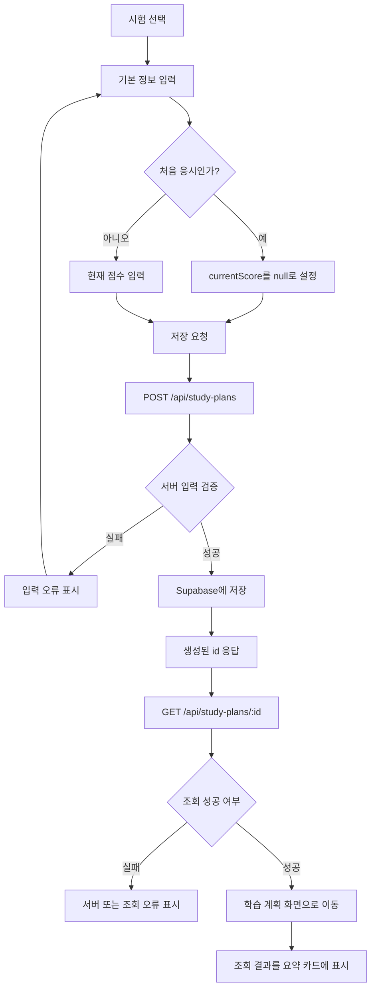

# 2주차 수직 슬라이스 구현 계획

## 1. 현재 구현 상태

### 프런트엔드

- React 18과 Vite 5를 사용한다.
- `src/App.jsx`는 `src/components/ProjectIntro.jsx`를 렌더링한다.
- `ProjectIntro`에서 현재 화면(`activeScreen`)과 선택 시험(`selectedExam`)만 React 상태로 관리한다.
- 서비스 소개, 시험 선택, 정보 입력, 취약 영역 진단, 학습 계획의 5개 화면을 한 컴포넌트 안에서 조건부 렌더링한다.
- 정보 입력 화면의 현재 점수, 목표 점수, 시험일, 하루 가능 시간은 제어 컴포넌트가 아니며 제출 동작이 없다.
- 처음 응시 여부를 선택하는 UI와 상태는 없다.
- 학습 계획 화면의 D-Day, 오늘의 학습, 주간 완료율은 고정 샘플이다.
- 전역 스타일은 `src/index.css`에 있으며 `docs/design.md`의 파스텔 블루, 흰색, 네이비 중심 디자인 토큰과 반응형 규칙을 일부 반영한다.

### 백엔드

- `server/index.js`에 Express 서버가 있으며 기본 포트는 4000이다.
- 구현된 API는 `GET /api/health`뿐이다.
- `express.json()` 미들웨어, 요청 검증, Supabase 연결, 데이터 저장·조회 라우트는 없다.
- `server/.env.example`에는 `PORT=4000`만 기록되어 있다.

### 프로젝트 설정

- `package.json`에는 React, Express, dotenv가 등록되어 있다.
- 프런트엔드와 서버는 각각 `npm run dev`, `npm run dev:server`로 실행한다.
- AGENTS.md는 개발 중 `/api` 요청을 Vite proxy로 Express에 전달하도록 규정한다.
- 현재 Vite proxy의 실제 설정 상태와 변경 필요 여부: **이 문서의 작성 범위에서 확인되지 않음. 구현 시작 전에 `vite.config.js`를 확인한다.**
- Supabase는 React에서 직접 연결하지 않고 Express 서버에서만 사용한다. 프런트엔드는 Supabase 키를 갖지 않으며 모든 DB 요청은 Express API를 거친다.
- 사용할 Supabase JavaScript 클라이언트와 버전: **확인되지 않음. 새 라이브러리는 임의로 설치하지 않는 규칙에 따라 구현 전 승인 또는 결정이 필요하다.**

## 2. 이번 수직 슬라이스 목표

사용자가 시험과 기본 정보를 입력한 뒤 저장 결과를 다시 확인할 수 있는 최소한의 종단 간 흐름을 완성한다.

1. 프런트엔드가 입력값을 제어 상태로 관리한다.
2. 프런트엔드가 `POST /api/study-plans`로 JSON을 전송한다.
3. Express 서버가 입력값을 검증한다.
4. 검증된 입력값을 Supabase `study_plans` 테이블에 저장한다.
5. 저장으로 생성된 `id`를 사용해 `GET /api/study-plans/:id`를 호출한다.
6. 조회 결과를 기존 학습 계획 화면의 요약 카드에 표시한다.

이번 슬라이스의 결과는 “학습 계획 생성” 자체가 아니라, **입력 → 검증 → 저장 → id 기반 재조회 → 실제 저장값 표시**가 연결된 상태다.

## 3. 사용자 흐름



이번 범위에서는 새로고침 후 마지막 결과를 복구하지 않는다. 동일 사용자 흐름 안에서 POST 응답의 id를 메모리 상태로 유지하고 즉시 GET하는 범위까지만 다룬다.

## 4. 프런트엔드 작업

### 상태와 입력

- `ProjectIntro` 또는 하위 폼 컴포넌트에서 다음 값을 제어 상태로 관리한다.
  - `examType`
  - `isFirstAttempt`
  - `currentScore`
  - `targetScore`
  - `examDate`
  - `dailyStudyMinutes`
- 기존 `selectedExam`과 API 계약의 `examType`을 중복 관리하지 않도록 하나의 값을 기준으로 사용한다.
- `isFirstAttempt`가 `true`이면 현재 점수 입력을 숨기거나 비활성화하고 전송값을 `null`로 정규화한다. 서버도 저장 전에 `currentScore`를 `null`로 정규화한다.
- `isFirstAttempt`가 `false`이면 `currentScore`를 필수로 입력받는다.
- 현재의 “하루 가능 시간” 텍스트 입력은 API 계약에 맞춰 분 단위 숫자 입력으로 변경한다.
- 제출 성공 전에는 고정 샘플을 실제 데이터처럼 표시하지 않는다.

### API 호출과 화면 상태

- 브라우저 기본 `fetch`를 사용한다.
- 상대 경로 `/api/study-plans`를 사용해 Vite proxy를 거친다.
- POST 성공 시 응답에서 `id`를 얻고, 해당 id로 GET 요청을 수행한다.
- GET 성공 결과를 별도 상태에 저장하고 학습 계획 화면으로 이동한다.
- 최소 UI 상태는 다음과 같이 구분한다.
  - 입력 중
  - 저장 중
  - 저장 후 조회 중
  - 성공
  - 입력 오류
  - 서버 또는 네트워크 오류
- 요청 중에는 중복 제출을 방지하고 버튼에 텍스트로 진행 상태를 표시한다.
- 오류는 색상만으로 나타내지 않고 입력 필드 설명 또는 오류 요약 문구로 제공한다.
- 오류 발생 시 사용자가 입력한 값은 유지한다.

### 학습 계획 요약 카드

- 기존 `PlanDashboard`의 고정 샘플을 조회 결과 기반 요약으로 교체한다.
- 이번 API에서 실제로 제공되는 값만 표시한다.
  - 선택 시험
  - 처음 응시 여부
  - 현재 점수 또는 “처음 응시”
  - 목표 점수
  - 시험일
  - 하루 학습 가능 시간(분)
- 이번 단계에서는 D-Day를 계산하지 않고 저장된 시험일만 표시한다.
- 오늘의 학습 내용과 주간 완료율은 이번 범위에서 생성되지 않으므로 실제 값처럼 표시하지 않는다.
- 기존 디자인 시스템에 맞춰 흰색 카드와 파스텔 블루 강조를 사용하고, 연한 분홍색은 보조 상태나 섹션 구분에만 사용한다.
- 모바일에서는 요약 카드를 단일 열로 유지한다.

### 예상 변경 대상

- `src/components/ProjectIntro.jsx`: 입력 상태, 제출 흐름, 조회 결과, UI 상태 연결
- `src/index.css`: 폼 상태, 오류, 로딩, 요약 카드 및 접근성 스타일
- `vite.config.js`: `/api` proxy가 없다면 추가

우선 기존 `ProjectIntro.jsx` 안에서 구현한다. 파일이 지나치게 복잡해질 때만 PascalCase 컴포넌트로 분리한다. 복잡도를 판단하는 구체적인 기준은 **확인되지 않음**이다.

## 5. 백엔드 작업

### 서버 구성

- `server/index.js`에 `express.json()`을 등록해 JSON 요청 본문을 파싱한다.
- JSON 응답 형식을 모든 신규 API에서 일관되게 사용한다.
- Supabase 연결 설정과 키는 Express 서버에서만 읽는다.
- React는 Supabase 클라이언트를 생성하거나 Supabase 키를 갖지 않으며 모든 DB 요청을 Express API로 보낸다.
- 브라우저 번들에 Supabase 키나 서버용 비밀 키를 노출하지 않는다.
- 기존 `GET /api/health`는 유지한다.

### POST `/api/study-plans`

1. 요청 본문에서 계약 필드를 추출한다.
2. 알 수 없는 필드를 허용할지 제거할지는 **확인되지 않음**이다.
3. 타입, 필수값, 허용 시험, 날짜 형식·범위, 숫자 범위를 검증한다.
4. `isFirstAttempt === true`이면 저장 전 `currentScore`를 `null`로 정규화한다.
5. `isFirstAttempt === false`이면 `currentScore`가 없을 때 검증 오류를 반환한다.
6. 클라이언트가 보낸 `id`와 `created_at`은 사용하지 않는다.
7. Supabase에 한 행을 삽입한다. PostgreSQL이 `id`와 `created_at` 기본값을 생성한다.
8. 생성된 전체 행을 `201 Created`로 반환한다.

### GET `/api/study-plans/:id`

1. 경로 매개변수 `id`가 UUID 형식인지 검증하고 형식이 잘못되면 `400 Bad Request`를 반환한다.
2. `study_plans`에서 해당 id의 한 행을 조회한다.
3. 존재하면 `200 OK`와 저장 데이터를 반환한다.
4. 존재하지 않으면 `404 Not Found`를 반환한다.
5. DB 연결 또는 쿼리 오류는 내부 상세 정보를 숨기고 `500 Internal Server Error`로 반환한다.

### 환경변수

`server/.env.example`에 필요한 변수 이름을 실제 선택한 Supabase 연결 방식에 맞춰 추가한다. 예상 후보는 Supabase URL과 서버용 키지만, 정확한 변수 이름과 사용할 키 종류는 **확인되지 않음**이다. 구현 전에 Supabase 프로젝트의 보안 정책과 RLS 사용 여부를 결정한다.

## 6. Supabase 테이블 구조

테이블명: `study_plans`

| 컬럼 | PostgreSQL 타입 | Null 허용 | 기본값/생성 주체 | 설명 |
|---|---|---:|---|---|
| `id` | `uuid` | 아니요 | `gen_random_uuid()` | PostgreSQL이 생성하는 기본 키 |
| `exam_type` | `text` | 아니요 | 없음 | 선택한 시험 |
| `is_first_attempt` | `boolean` | 아니요 | 없음 | 처음 응시 여부 |
| `current_score` | `text` | 예 | `null` | 현재 점수 또는 등급 |
| `target_score` | `text` | 아니요 | 없음 | 목표 점수 또는 등급 |
| `exam_date` | `date` | 아니요 | 없음 | 시험일 |
| `daily_study_minutes` | `integer` | 아니요 | 없음 | 하루 학습 가능 시간(분) |
| `created_at` | `timestamptz` | 아니요 | `now()` | PostgreSQL이 생성하는 생성 시각 |

확정된 DB 기본값과 제약:

- `id` primary key
- `id` 기본값 `gen_random_uuid()`
- `created_at` 기본값 `now()`
- `exam_type IN ('TOEIC', 'OPIc', 'TOEIC Speaking', 'TOEFL')` check
- `daily_study_minutes BETWEEN 1 AND 720` check
- `is_first_attempt = true`이면 `current_score IS NULL`, `is_first_attempt = false`이면 `current_score IS NOT NULL`이 되도록 조건부 check

`exam_date`는 서버에서 요청 시점의 오늘 날짜와 비교해 오늘 이후만 허용한다. 시간에 따라 결과가 달라지는 현재 날짜 비교를 DB check로도 둘지는 별도로 결정하지 않았으며, 이번 슬라이스의 필수 검증 책임은 Express 서버에 둔다.

다음 사항은 구현 전 결정이 필요하다.

- 로그인과 사용자별 권한은 이번 범위에서 제외하지만, 서버에서만 접근할 때 적용할 RLS 정책과 서버 키 종류: **확인되지 않음**
- 테이블 생성 SQL을 저장소의 migration 파일로 관리할지 Supabase SQL Editor에서만 적용할지: **확인되지 않음**

API에서는 camelCase를 사용하고 DB에서는 snake_case를 사용하는 매핑을 기준으로 계획한다. 다른 명명 규칙은 문서에서 확인되지 않는다.

## 7. API 요청·응답 예시

### POST 요청

```http
POST /api/study-plans
Content-Type: application/json
```

```json
{
  "examType": "TOEIC",
  "isFirstAttempt": false,
  "currentScore": "650",
  "targetScore": "850",
  "examDate": "2026-09-20",
  "dailyStudyMinutes": 120
}
```

처음 응시 요청:

```json
{
  "examType": "OPIc",
  "isFirstAttempt": true,
  "currentScore": null,
  "targetScore": "IH",
  "examDate": "2026-09-20",
  "dailyStudyMinutes": 90
}
```

### POST 성공 응답

```http
HTTP/1.1 201 Created
Content-Type: application/json
```

```json
{
  "data": {
    "id": "550e8400-e29b-41d4-a716-446655440000",
    "examType": "TOEIC",
    "isFirstAttempt": false,
    "currentScore": "650",
    "targetScore": "850",
    "examDate": "2026-09-20",
    "dailyStudyMinutes": 120,
    "created_at": "2026-07-15T06:00:00.000Z"
  }
}
```

POST 성공 응답은 PostgreSQL이 생성한 `id`, `created_at`을 포함한 전체 행을 반환한다. 프런트엔드는 응답에 포함된 `id`로 GET API를 호출해 저장 결과를 다시 조회한다.

### GET 요청과 성공 응답

```http
GET /api/study-plans/550e8400-e29b-41d4-a716-446655440000
```

```json
{
  "data": {
    "id": "550e8400-e29b-41d4-a716-446655440000",
    "examType": "TOEIC",
    "isFirstAttempt": false,
    "currentScore": "650",
    "targetScore": "850",
    "examDate": "2026-09-20",
    "dailyStudyMinutes": 120,
    "created_at": "2026-07-15T06:00:00.000Z"
  }
}
```

### 검증 오류 응답

```http
HTTP/1.1 400 Bad Request
Content-Type: application/json
```

```json
{
  "error": {
    "code": "VALIDATION_ERROR",
    "message": "입력값을 확인해 주세요.",
    "fields": {
      "targetScore": "목표 점수 또는 등급은 필수입니다.",
      "dailyStudyMinutes": "학습 가능 시간은 1 이상 720 이하의 정수여야 합니다."
    }
  }
}
```

### 조회 실패 응답

```json
{
  "error": {
    "code": "STUDY_PLAN_NOT_FOUND",
    "message": "학습 계획을 찾을 수 없습니다."
  }
}
```

오류 객체의 최종 필드명과 오류 코드 목록은 기존 문서에 없으므로 위 형식은 이번 계획의 제안이며, 구현 전에 확정해야 한다.

## 8. 입력 검증 규칙

| 필드 | 기본 검증 규칙 | 미결정 사항 |
|---|---|---|
| `examType` | 문자열, 필수, `TOEIC`·`OPIc`·`TOEIC Speaking`·`TOEFL` 중 하나 | 없음 |
| `isFirstAttempt` | boolean, 필수 | 없음 |
| `currentScore` | 문자열 또는 `null`; 처음 응시가 아니면 비어 있지 않은 문자열 필수, 처음 응시이면 서버에서 `null`로 정규화 | 시험별 점수 범위와 형식은 **확인되지 않음** |
| `targetScore` | 문자열, 필수, 공백만 있는 값 금지 | 시험별 점수·등급 범위는 **확인되지 않음** |
| `examDate` | 문자열, `YYYY-MM-DD` 형식, 실제 존재하며 서버 기준 오늘 이후인 날짜 | 서버의 날짜 기준 시간대는 **확인되지 않음** |
| `dailyStudyMinutes` | number, 필수, 1 이상 720 이하의 유한한 정수 | 없음 |
| `id` | POST 요청에서 받지 않음, GET 경로에서는 UUID 형식 | UUID 버전 제한은 **확인되지 않음** |
| `created_at` | 클라이언트 입력을 받지 않고 PostgreSQL `now()`로 생성 | 없음 |

공통 원칙:

- 프런트엔드 검증은 빠른 사용자 피드백을 위한 것이며 서버에서 동일하거나 더 엄격하게 다시 검증한다.
- 문자열은 저장 전에 앞뒤 공백을 제거한다.
- `isFirstAttempt`가 `true`이면 클라이언트가 다른 현재 점수를 보내더라도 서버에서 `currentScore`를 `null`로 정규화한다.
- `isFirstAttempt`가 `false`이면 공백 제거 후 `currentScore`가 비어 있을 때 검증 오류를 반환한다.
- JSON 본문이 없거나 파싱할 수 없으면 `400 Bad Request`를 반환한다.
- 시험별 상세 점수 검증은 규칙이 문서화된 뒤 추가한다.

## 9. 오류 처리

### 프런트엔드

- 필수 입력 누락과 기본 형식 오류는 요청 전에 표시한다.
- 서버의 필드별 검증 오류는 해당 입력 가까이에 연결한다.
- 오류 요약에는 `role="alert"` 또는 적절한 live region을 사용해 보조 기술에 전달한다.
- 첫 번째 오류 필드로 포커스를 이동할지 여부는 실제 접근성 테스트 후 결정한다.
- 네트워크 오류, 5xx 오류, 예상하지 못한 응답을 구분 가능한 사용자 메시지로 표시한다.
- 저장 중과 조회 중 상태를 텍스트로 알리고 제출 버튼을 비활성화한다.
- GET 실패 시 저장이 성공했을 가능성을 안내하고 재조회 동작을 제공할지 검토한다. 재시도 UI의 구체적 형태는 **확인되지 않음**이다.
- 오류가 발생해도 입력값과 선택 시험을 유지한다.

### 백엔드

- `400`: JSON 또는 입력값 검증 실패
- `400`: 잘못된 UUID 형식
- `404`: id에 해당하는 데이터 없음
- `500`: Supabase 연결·삽입·조회 오류 또는 예상하지 못한 서버 오류
- Supabase 원본 오류, SQL 정보, 키, 스택 트레이스를 클라이언트에 노출하지 않는다.
- 서버 로그에 기록할 항목과 로그 형식은 **확인되지 않음**이다.

## 10. 단계별 작업 순서

1. Supabase `study_plans` 테이블과 제약조건을 확정하고 생성한다.
2. Express 서버에서 사용할 Supabase 연결 방식, 패키지, 서버 키, RLS 정책을 결정한다. React에는 Supabase 연결이나 키를 추가하지 않는다.
3. `server/.env.example`에 비밀값 없이 필요한 환경변수 이름을 기록하고 서버 연결 모듈을 구성한다.
4. Express에 `express.json()`을 추가하고 POST 라우트의 기본 구조를 만든다.
5. 공통 서버 검증 함수를 구현하고 정상·오류 입력을 점검한다.
6. POST에서 데이터를 삽입하고 PostgreSQL이 생성한 전체 행을 반환한다.
7. GET에서 UUID를 검증하며 잘못된 형식은 400으로 처리하고, 유효한 id로 단일 저장 결과를 조회한다.
8. Vite의 `/api` proxy 설정을 확인하고 필요하면 추가한다.
9. 프런트 입력 필드를 제어 상태로 변경한다.
10. 처음 응시 토글과 `currentScore: null` 정규화를 연결한다.
11. 로딩·검증 오류·서버 오류 상태를 먼저 연결한 뒤 POST 요청을 구현한다.
12. POST 응답의 id로 GET 요청을 수행한다.
13. 조회 결과를 학습 계획 요약 카드에 표시하고 고정 샘플을 제거하거나 샘플임을 분명히 분리한다.
14. 키보드만으로 시험 선택, 입력, 토글, 제출, 오류 확인이 가능한지 점검한다.
15. 데스크톱과 모바일 레이아웃, 정상 흐름, 검증 실패, 404, 서버 오류, 중복 제출을 최종 점검한다.

각 단계에서는 요청하지 않은 기능이나 라이브러리를 함께 추가하지 않는다.

## 11. 완료 조건 체크리스트

### 데이터와 서버

- [ ] `study_plans` 테이블이 확정된 스키마와 제약조건으로 생성되어 있다.
- [ ] `id`와 `created_at`이 각각 PostgreSQL `gen_random_uuid()`, `now()` 기본값으로 생성된다.
- [ ] 허용 시험과 하루 1~720분 범위가 검증된다.
- [ ] Supabase 비밀 키가 프런트 번들 및 저장소에 포함되지 않는다.
- [ ] Express가 JSON 요청 본문을 파싱한다.
- [ ] `POST /api/study-plans`가 유효한 값을 저장하고 생성된 전체 행을 `201`로 반환한다.
- [ ] POST 요청의 `id`, `created_at` 값은 클라이언트가 결정할 수 없다.
- [ ] `GET /api/study-plans/:id`가 저장된 한 행을 조회한다.
- [ ] 존재하지 않는 id와 DB 오류가 합의된 JSON 오류 형식으로 반환된다.
- [ ] 서버가 모든 필수 필드와 기본 타입·형식을 검증한다.
- [ ] `isFirstAttempt === true`인 행의 `currentScore`가 `null`로 저장된다.
- [ ] `isFirstAttempt === false`이면 `currentScore` 누락 요청이 거부된다.
- [ ] 오늘 또는 과거의 `examDate` 요청이 거부된다.
- [ ] 잘못된 UUID 형식의 GET 요청이 `400`으로 반환된다.
- [ ] 기존 `GET /api/health`가 계속 작동한다.

### 프런트엔드

- [ ] 시험 및 기본 정보 입력이 React 제어 상태로 관리된다.
- [ ] 처음 응시 선택 시 현재 점수 입력과 전송값이 일관되게 처리된다.
- [ ] 기본 `fetch`와 `/api` 상대 경로로 POST 요청을 보낸다.
- [ ] POST로 받은 id를 이용해 GET 요청을 수행한다.
- [ ] GET 응답의 실제 데이터가 학습 계획 요약 카드에 표시된다.
- [ ] D-Day를 계산하지 않고 저장된 시험일만 표시한다.
- [ ] 로딩 중 중복 제출이 방지된다.
- [ ] 입력 오류와 서버·네트워크 오류가 구분되어 표시된다.
- [ ] 오류 발생 후에도 사용자의 입력값이 유지된다.
- [ ] 고정 D-Day, 오늘 학습, 진행률 값이 실제 결과로 오인되지 않는다.

### 접근성과 품질

- [ ] 모든 입력에 연결된 label이 있다.
- [ ] 시험 카드와 처음 응시 선택을 키보드로 조작할 수 있다.
- [ ] 버튼과 입력창의 focus 상태가 명확하다.
- [ ] 선택·오류·로딩 상태를 색상만으로 전달하지 않는다.
- [ ] 오류 메시지가 보조 기술에 전달된다.
- [ ] 모바일 단일 열에서도 입력과 요약 내용을 읽고 조작할 수 있다.
- [ ] API 요청·응답 필드명과 DB 매핑이 문서와 일치한다.
- [ ] 구현 중 확정된 미결정 사항이 이 문서 또는 관련 문서에 반영되어 있다.

## 12. 이번 범위에서 제외할 기능

- 로그인과 사용자 계정
- 사용자별 권한과 데이터 소유권 기능
- 계획 목록
- 저장된 계획 수정과 삭제
- AI 모델 연결
- 실제 취약 영역 분석
- 상세 학습 일정 생성
- 오늘의 학습 과제 생성
- 완료 체크와 진행률 계산
- 모의시험 결과 반영과 전체 계획 재조정
- 알림
- 새로고침 후 마지막 계획 자동 복구
- 시험별 정교한 점수·등급 검증 규칙

제외 항목 중 새로고침 복구, 로그인·사용자별 권한, 시험별 상세 검증은 후속 슬라이스에서 별도 요구사항과 완료 조건을 정의한다.

### 여전히 결정되지 않은 사항

확정 사항을 반영한 뒤에도 다음 항목은 문서나 현재 코드에서 확인되지 않았다.

- 현재 Vite proxy 설정 상태와 실제 변경 필요 여부
- 사용할 Supabase JavaScript 클라이언트와 버전
- Supabase 환경변수 이름, 서버 키 종류와 RLS 세부 정책
- 테이블 생성 SQL을 migration 파일로 관리할지 Supabase SQL Editor에서 적용할지
- API 요청의 알 수 없는 필드를 거부할지 제거할지
- 시험별 `currentScore`와 `targetScore`의 상세 형식·허용 범위
- 서버에서 “오늘”을 판단할 때 사용할 시간대
- GET 경로의 UUID 버전을 제한할지 여부
- POST·GET 오류 객체의 최종 필드명과 오류 코드 목록
- 저장 성공 후 GET 실패 시 제공할 재시도 UI
- 서버 로그 항목과 로그 형식
- `ProjectIntro.jsx`를 분리할 정도로 복잡하다고 판단할 구체적 기준
