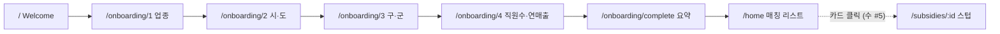

# 2주차 1일차 (월) — FE 기본 골격 / 온보딩 / 홈 mock

관련 이슈: [#11 FE 기본 골격/온보딩/홈 mock 통합](https://github.com/syd348/hub/issues/11)
기준 문서: [`docs/plan.md`](../plan.md), [`prototype/gov_subsidy_home_wireframe.html`](../../prototype/gov_subsidy_home_wireframe.html), [`.cursor/skills/gov-subsidy-design/`](../../.cursor/skills/gov-subsidy-design/)

## 목표

와이어프레임을 **React + React Router**로 이식해, mock 데이터 기준으로
`Welcome → 온보딩(1~4) → 완료 → 홈` 흐름을 동작시킨다.

## 데모 흐름 (확정)



- 상세화면(`/subsidies/:id`)은 **수요일 이슈 #5** 범위 → 오늘은 스텁 라우트만 연결
- API 연결(수 #6), Supabase(화 #3/#4)는 범위 외

## 확정된 결정

| 항목 | 결정 |
|------|------|
| 라우팅 | `react-router-dom` v7 |
| 온보딩 상태 | React Context + `sessionStorage` 영속화 |
| 공유 타입 | `@hub/shared`의 `OnboardingProfile`, `Subsidy` 재사용 |
| 스타일 | 컴포넌트별 co-located `.css`, 색상 토큰은 `src/styles/tokens.css` |
| 기존 `ProjectIntro` | `/intro` 라우트로 보존 |

## 작업 묶음

### 1) 앱 기본 골격
- [ ] `react-router-dom` 설치 + `main.tsx` `BrowserRouter`, `App.tsx` `Routes`
- [ ] 라우트: `/`, `/onboarding/:step`, `/onboarding/complete`, `/home`, `/subsidies/:id`(스텁), `/intro`
- [ ] `AppShell` — 모바일 390×844 중앙 프레임(PC), 와이어프레임 `.app` 스타일
- [ ] Pretendard CDN(`index.html`), `index.css` 중복 `@import` 제거 + body font/bg

### 2) 입력 플로우
- [ ] `OnboardingContext` (Context + sessionStorage) + `useOnboarding` 훅
- [ ] `regions.ts`(시·도 17 + `districts` 맵), `onboardingSteps.ts`(질문·힌트·옵션)
- [ ] `OnboardingStep`: Step1 업종(기타 직접입력), Step2 시·도, Step3 구·군(동적), Step4 직원수+연매출
- [ ] `ProgressBar`, `OptionButton` — 선택 완료 전 "다음" disabled 규칙

### 3) 화면 완성
- [ ] `WelcomeScreen` — navy 배경 + 기능 3개 + 시작하기 CTA
- [ ] `CompleteScreen` — popIn 체크 + 요약박스 + "맞춤 지원금 보러가기"
- [ ] `HomeScreen` — 헤더(프로필/알림 placeholder) + 정렬칩 + 카드 리스트 + 하단 탭바
- [ ] `FilterChip`, `SubsidyCard`(D-day 색상 규칙), `TabBar`
- [ ] `mockSubsidies.ts` — 와이어프레임 지원금 8건

## 파일 맵 (신규/수정)

```
src/
├── main.tsx                      # BrowserRouter (수정)
├── App.tsx                       # Routes (수정)
├── index.css                     # 중복 import 제거, body 스타일 (수정)
├── styles/tokens.css             # 색상 토큰 (유지)
├── context/OnboardingContext.tsx # 온보딩 상태
├── data/
│   ├── regions.ts                # 시·도 + districts
│   ├── onboardingSteps.ts        # 스텝 정의
│   └── mockSubsidies.ts          # 지원금 8건
├── components/
│   ├── AppShell.tsx / .css
│   ├── ProgressBar.tsx / .css
│   ├── OptionButton.tsx / .css
│   ├── FilterChip.tsx / .css
│   ├── SubsidyCard.tsx / .css
│   └── TabBar.tsx / .css
└── pages/
    ├── WelcomeScreen.tsx / .css
    ├── OnboardingStep.tsx / .css
    ├── CompleteScreen.tsx / .css
    ├── HomeScreen.tsx / .css
    └── SubsidyDetailScreen.tsx   # 스텁 (수 #5)
```

## 완료 기준

- [ ] `npm run dev`로 `Welcome → 온보딩 → 완료 → 홈` 흐름 동작
- [ ] 각 온보딩 단계에서 선택 완료 전 "다음" 버튼 비활성
- [ ] 모바일 톤/레이아웃이 와이어프레임과 크게 어긋나지 않음
- [ ] `npm run lint` 통과

## 범위 외 (다른 이슈)

- 상세화면 실제 구현 → 수 [#5](https://github.com/syd348/hub/issues/5)
- 프론트 ↔ Express API 연결 → 수 [#6](https://github.com/syd348/hub/issues/6)
- Supabase 스키마·조회 → 화 [#3](https://github.com/syd348/hub/issues/3)/[#4](https://github.com/syd348/hub/issues/4)
