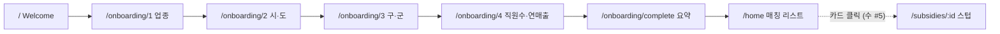

# 2주차 1일차 (월) — FE 기본 골격 / 온보딩 / 홈 mock

관련 이슈: [#11 FE 기본 골격/온보딩/홈 mock 통합](https://github.com/syd348/hub/issues/11)
작업 브랜치: `feat/issue-11-fe-mock`
기준 문서: [`docs/plan.md`](../plan.md), [`prototype/gov_subsidy_home_wireframe.html`](../../prototype/gov_subsidy_home_wireframe.html), [`.cursor/skills/gov-subsidy-design/`](../../.cursor/skills/gov-subsidy-design/)

## 목표

와이어프레임을 **React + React Router**로 이식해, mock 데이터 기준으로
`Welcome → 온보딩(1~4) → 완료 → 홈` 흐름을 동작시킨다.

## 진행 현황 (TODO)

> 이 섹션은 작업 진행에 따라 갱신한다.

### 사전·환경 설정
- [x] 이슈 #11용 브랜치 생성 (`feat/issue-11-fe-mock`)
- [x] `react-router-dom` 설치
- [x] 계획 산출물 문서 생성 (본 문서)
- [x] 이슈 #11 본문 업데이트

### 묶음 1 — 앱 기본 골격
- [x] 전역 스타일 + Pretendard CDN + `tokens.css` 정리
- [x] `AppShell` (모바일 `100dvh`, PC `min(844px, 100dvh)` — B안)
- [x] `BrowserRouter` + `Routes` 라우팅 골격
- [x] `OnboardingContext` (Context + sessionStorage)
- [x] 페이지 placeholder + `/subsidies/:id` 스텁, `/intro` 보존

### 묶음 2 — 입력 플로우 (세분화)
- [x] **2a.** 데이터: `regions.ts` + `onboardingSteps.ts`
  - `regions.ts`: 전국 시·군·구 전체 (2023-07-01 군위군 대구 편입 반영)
- [x] **2b.** 공용 컴포넌트 + `OnboardingStep` 공통 레이아웃
  - `ProgressBar`, `OptionButton`, 진행바/이전/`N/4`/하단 "다음" disabled 골격
- [x] **2c.** Step1 업종 (기타 직접입력)
- [x] **2d.** Step2 시·도 (2열 grid)
- [x] **2e.** Step3 구·군 (시·도 연동 동적, 제목 blue 강조)
- [ ] **2f.** Step4 직원수 + 연매출 (select)

### 묶음 3 — 화면 완성
- [ ] `WelcomeScreen` — navy 배경 + 기능 3개 + 시작하기 CTA
- [ ] `CompleteScreen` — popIn 체크 + 요약박스 + "맞춤 지원금 보러가기"
- [ ] `HomeScreen` — 헤더 + 정렬칩 + 카드 리스트 + 하단 탭바
- [ ] `FilterChip`, `SubsidyCard`(D-day 색상), `TabBar`
- [ ] `mockSubsidies.ts` — 와이어프레임 지원금 8건

### 검증
- [ ] `npm run dev`로 `Welcome → 온보딩 → 완료 → 홈` 흐름 동작
- [ ] 각 온보딩 단계 선택 완료 전 "다음" 비활성
- [ ] 모바일 톤/레이아웃 와이어프레임과 크게 어긋나지 않음
- [ ] `npm run lint` 통과

## 커밋 이력 (오늘)

| 커밋 | 요약 |
|------|------|
| `a2e5b6b` | `chore(client): react-router-dom 추가` |
| `424c45a` | `docs(client): 2주차 1일차 FE 계획 산출물 추가` |
| `c13277b` | `feat(client): 전역 스타일 토대 및 AppShell 프레임 추가` |
| `d7309d9` | `feat(client): React Router 라우팅 골격 및 온보딩 컨텍스트 추가` |
| `eac4a74` | `feat(client): 온보딩 데이터 및 공통 입력 레이아웃 추가` |
| `d8b1fde` | `feat(client): 온보딩 step1 업종 선택 UI 구현` |

## 데모 흐름 (확정)



- 상세화면(`/subsidies/:id`)은 **수요일 이슈 #5** 범위 → 오늘은 스텁 라우트만 연결
- API 연결(수 #6), Supabase(화 #3/#4)는 범위 외

## 확정된 결정

| 항목 | 결정 |
|------|------|
| 라우팅 | `react-router-dom` v7 |
| 온보딩 상태 | React Context + `sessionStorage` 영속화 |
| 공유 타입 | `@hub/shared`의 `OnboardingProfile`, `Subsidy` 재사용 |
| 스타일 | 컴포넌트별 co-located `.css`, 색상 토큰은 `src/styles/tokens.css` |
| 기존 `ProjectIntro` | `/intro` 라우트로 보존 |
| AppShell 높이 | **B안** — 모바일 `100dvh`, PC `min(844px, 100dvh)` |
| 지역 데이터 | 와이어프레임 축약본 → **전국 시·군·구 전체** (2023 행정구역 기준) |

## 작업 묶음 (상세)

### 1) 앱 기본 골격
- [x] `react-router-dom` 설치 + `main.tsx` `BrowserRouter`, `App.tsx` `Routes`
- [x] 라oute: `/`, `/onboarding/:step`, `/onboarding/complete`, `/home`, `/subsidies/:id`(스텁), `/intro`
- [x] `AppShell` — 모바일 390×844 중앙 프레임(PC), 와이어프레임 `.app` 스타일
- [x] Pretendard CDN(`index.html`), `index.css` 중복 `@import` 제거 + body font/bg

### 2) 입력 플로우
- [x] `OnboardingContext` (Context + sessionStorage) + `useOnboarding` 훅
- [x] `regions.ts`, `onboardingSteps.ts`
- [x] `ProgressBar`, `OptionButton` 공용 컴포넌트
- [x] `OnboardingStep` 공통 레이아웃 (진행바/이전/다음 disabled 골격)
- [x] Step1 업종 입력 UI (2c)
- [x] Step2 시·도 입력 UI (2d)
- [x] Step3 구·군 입력 UI (2e)
- [ ] Step4 실제 입력 UI (2f)

### 3) 화면 완성
- [ ] `WelcomeScreen` — navy 배경 + 기능 3개 + 시작하기 CTA
- [ ] `CompleteScreen` — popIn 체크 + 요약박스 + "맞춤 지원금 보러가기"
- [ ] `HomeScreen` — 헤더(프로필/알림 placeholder) + 정렬칩 + 카드 리스트 + 하단 탭바
- [ ] `FilterChip`, `SubsidyCard`(D-day 색상 규칙), `TabBar`
- [ ] `mockSubsidies.ts` — 와이어프레임 지원금 8건

## 파일 맵 (신규/수정)

```
src/
├── main.tsx                      # BrowserRouter ✅
├── App.tsx                       # Routes ✅
├── index.css                     # body 스타일, PC 중앙 정렬 ✅
├── styles/tokens.css             # 색상 토큰 ✅
├── context/OnboardingContext.tsx # 온보딩 상태 ✅
├── data/
│   ├── regions.ts                # 시·도 + 전국 districts ✅
│   ├── onboardingSteps.ts        # 스텝 정의 ✅
│   └── mockSubsidies.ts          # 지원금 8건 (미구현)
├── components/
│   ├── AppShell.tsx / .css       ✅
│   ├── ProgressBar.tsx / .css    ✅
│   ├── OptionButton.tsx / .css   ✅
│   ├── onboarding/
│   │   ├── Step1Industry.tsx     # step1 업종 ✅
│   │   ├── Step2Region.tsx       # step2 시·도 ✅
│   │   └── Step3District.tsx     # step3 구·군 ✅
│   ├── FilterChip.tsx / .css     (미구현)
│   ├── SubsidyCard.tsx / .css    (미구현)
│   └── TabBar.tsx / .css         (미구현)
└── pages/
    ├── WelcomeScreen.tsx / .css  (placeholder)
    ├── OnboardingStep.tsx / .css # 공통 레이아웃 ✅, step UI 2c~2f
    ├── CompleteScreen.tsx / .css (placeholder)
    ├── HomeScreen.tsx / .css     (placeholder)
    └── SubsidyDetailScreen.tsx   # 스텁 ✅
```

## 완료 기준

- [ ] `npm run dev`로 `Welcome → 온보딩 → 완료 → 홈` 흐름 동작
- [ ] 각 온보딩 단계에서 선택 완료 전 "다음" 버튼 비활성
- [ ] 모바일 톤/레이아웃이 와이어프레임과 크게 어긋나지 않음
- [ ] `npm run lint` 통과

## 범위 외 (다른 이슈)

- 상세화면 실제 구현 → 수 [#5](https://github.com/syd348/hub/issues/5)
- 프론트 ↔ Express API 연결 → 수 [#6](https://github.com/syd348/hub/issues/6)
- Supabase 스키마·조회 → 화 [#3](https://github.com/syd348/hub/issues/3)/[#4](https://github.com/syd348/hub/issues/4)

## 다음 작업

**2f. Step4 직원수 + 연매출 (select)** — `EMPLOYEE_OPTIONS` + `REVENUE_OPTIONS` + 둘 다 선택 전 disabled
