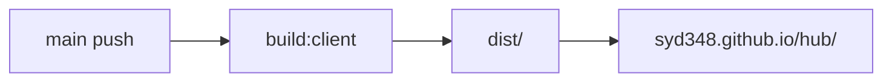

# Week 2 회고 — Context API부터 DB 쓰기 사이클까지

소상공인 정부지원금 큐레이터 · N106_신서연  
데모 프레젠테이션 / PR 회고용 문서

> 원래 Day 1(월) 작업만 다루던 문서였으나, 이슈 #10(학습 회고)에 맞춰 한 주 전체(월~금, #1~#9)
> 회고로 확장했다. 1~4장은 Day 1 원본, "Week 2 전체 회고"부터 목~금 작업(#3·#4·#6·#7·#8·#9)을 다룬다.

---

## 주요 작업 리스트

- [x] **Context API** — 온보딩 프로필 전역 상태 + `sessionStorage` 영속화
- [x] **GitHub Actions Pages 자동 배포** — `main` push → `https://syd348.github.io/hub/`
- [x] **PR CI + commitlint** — lint, test, 커밋 메시지 검증 (로컬 husky + Actions)
- [x] **React Component 데이터 흐름 정리** — Context / props / mock import 역할 분리
- [x] **캠퍼스 레포 PR** — `syd348/hub` → `connect-AIAgentChallenge-26-1/hub` (`N106_신서연`)

---

## 1. Context API — 온보딩 데이터 흐름

### 왜 Context?

온보딩 4단계, 완료 화면, 홈 화면이 **같은 사용자 프로필**을 공유한다.  
페이지마다 props로 넘기면 컴포넌트 깊이가 깊어지므로 `OnboardingProvider`로 한곳에서 관리한다.

### 구조

```
App.tsx
  OnboardingProvider
    ├─ profile (state)
    ├─ setField(field, value)
    ├─ reset()
    └─ sessionStorage 동기화
         │
         ├─ Step1Industry ~ Step4Scale  → setField()로 입력
         ├─ CompleteScreen            → profile 요약 표시
         └─ HomeScreen                → profile 기반 UI (지역 칩 등)
```

### 핵심 코드 위치

| 파일 | 역할 |
|------|------|
| `src/context/OnboardingContext.tsx` | Context 정의, `useOnboarding()` 훅 |
| `src/App.tsx` | `<OnboardingProvider>`로 앱 전체 감쌈 |
| `src/components/onboarding/Step*.tsx` | `setField`로 입력 저장 |
| `src/pages/HomeScreen.tsx` | `profile` 읽기 |

### 데이터 흐름 (한 줄)

```
사용자 입력 → setField() → React state 업데이트 → sessionStorage 저장
                ↓
다른 화면에서 useOnboarding() → profile 읽기
```

### mock 데이터는 Context 밖

지원금 목록은 `src/data/mockSubsidies.ts`를 `HomeScreen`에서 **직접 import**.  
서버 API / TanStack Query 연동 전까지는 전역 상태가 필요 없다.

---

## 2. GitHub Actions — Pages 자동 배포

### yml이 하는 일

`main`에 push하면 GitHub 서버가 자동으로:

1. `npm ci`
2. `VITE_BASE_PATH=/hub/ npm run build:client`
3. `dist/` 생성 → `404.html` 복사 (SPA 라우팅)
4. GitHub Pages에 배포

### 왜 설정이 필요했나

레포 이름이 `hub` → URL이 **서브경로** `https://syd348.github.io/hub/`

| 환경 | Vite `base` | Router `basename` |
|------|-------------|-------------------|
| 로컬 `npm run dev` | `/` | `/` |
| Actions 빌드 | `/hub/` | `/hub/` (`import.meta.env.BASE_URL`) |

### 관련 파일

| 파일 | 변경 |
|------|------|
| `.github/workflows/deploy-pages.yml` | 빌드 + 배포 workflow |
| `package.json` | `build:client` (프론트만 빌드) |
| `vite.config.ts` | `base: process.env.VITE_BASE_PATH ?? '/'` |
| `src/main.tsx` | `<BrowserRouter basename={import.meta.env.BASE_URL}>` |

### 배포 흐름



---

## 3. PR CI + commitlint

> **정정 (2026-07-22, #9~#10 작업 중 발견)**: 아래 `pr-checks.yml`은 이 문서를 처음 쓴 시점 기준이고,
> 실제로는 `.github/workflows/` 디렉토리 자체가 `main`에 존재하지 않는다 — PR에서 자동 검증이
> 돌지 않는다. `CLAUDE.md`에서도 같은 착오를 발견해 관련 문구를 삭제했다(PR #24). 로컬 husky
> `commit-msg` 훅(아래 표)만 실제로 동작 중이다.

### PR 열릴 때 (`pr-checks.yml`, 현재는 없음 — 위 정정 참고)

| Job | 검사 |
|-----|------|
| `lint-and-test` | `npm run lint` + `npm test` |
| `commitlint` | PR에 포함된 모든 커밋 메시지 형식 |

### 로컬 커밋 시 (husky)

`.husky/commit-msg` → `commitlint` 실행

허용 type: `feat`, `fix`, `docs`, `style`, `refactor`, `chore`, `test`

```
feat(client): 온보딩 step1 업종 선택 UI 구현
```

---

## 4. 캠퍼스 레포 PR · 자동 머지

### PR 정보

- **레포**: `connect-AIAgentChallenge-26-1/hub`
- **base**: `N106_신서연`
- **head**: `syd348/hub` `main` (포크 PR)
- **PR**: #1169

### 자동 머지가 실패한 이유

7/15 22:10 KST `auto-merge.yml` v3.4 실행 로그:

```
PR #1169 → 조건 통과 → 머지
PR #1169 병합 실패: Resource not accessible by integration
```

**원인**: 포크에서 온 cross-repository PR은 Actions `GITHUB_TOKEN`으로 merge 권한이 없는 경우가 많다.

**해결 (auto-merge 수정 없이)**:

1. **수동 Merge** — GitHub UI에서 PR #1169 Merge
2. **앞으로** — 조직 레포에 직접 브랜치 push 후 같은 레포 내 PR 생성

```bash
git remote add campus https://github.com/connect-AIAgentChallenge-26-1/hub.git
git push campus main:N106_신서연-작업명
gh pr create -R connect-AIAgentChallenge-26-1/hub \
  --base N106_신서연 --head N106_신서연-작업명
```

### auto-merge 규칙 요약 (v3.4)

| 조건 | 동작 |
|------|------|
| base `main` + `allow-main` 라벨 없음 | PR **close** |
| `review` 라벨 | 스킵 |
| `CHANGES_REQUESTED` | 연기 |
| 충돌 | PR **close** |
| 그 외 | **merge** 시도 (매일 22:00·22:30 KST) |

`N106_신서연` 대상 PR은 **close가 아니라 merge** 대상이다.

---

## 내가 설명할 수 있는 부분

### Context API

- `OnboardingProvider`가 `profile` 상태를 들고, `setField`로 필드 단위 업데이트
- `sessionStorage`에 JSON으로 저장해 새로고침·뒤로가기 후에도 유지
- `useOnboarding()` 훅으로 필요한 컴포넌트만 구독
- Provider 밖에서 호출하면 에러 (`must be used within OnboardingProvider`)

### GitHub Actions Pages

- 소스(`src/`)는 브라우저가 실행 못 함 → 반드시 `npm run build` 필요
- yml = 그 빌드·배포를 push마다 자동화
- SPA는 GitHub Pages에서 `404.html` 트릭 필요

### Git에 올리는 것 / 안 올리는 것

| 올림 | 안 올림 |
|------|---------|
| `.gitignore`, `.husky/commit-msg` | `.claude/settings.local.json` |
| `.github/workflows/` (CI·배포) | `node_modules`, `dist`, `.env` |

---

## 아직 이해 못 한 부분

- 캠퍼스 `auto-merge`에서 포크 PR merge 권한을 PAT로 푸는 org 설정 전체
- TanStack Query 도입 후 Context(온보딩) vs 서버 상태 역할 분할
- 매칭 API 연동 시 `profile`을 query string vs POST body 중 어디에 실을지

---

## 새로 알게 된 것

- **yml 없이도 Pages 가능** — 로컬 빌드 후 `gh-pages` 브랜치 수동 push (예전 방식)
- **yml 있으면** — `main` push만으로 빌드·배포 자동화
- **포크 PR**은 자동 머지가 실패할 수 있음 → 수동 머지 또는 같은 레포 PR
- **개인 레포 `main` push**와 **캠퍼스 `N106_신서연` PR**은 별개 흐름
- PR #18 머지 후 `syd348.github.io/hub/`에서 mock FE 데모 가능

---

---

## Week 2 전체 회고 (수~금, #3·#4·#6·#7·#8·#9)

### 무엇을 완성했나 — 수직 슬라이스 한 바퀴

```
온보딩 4단계 입력 → POST /api/match → Supabase 조회(정렬) + 저장(match_requests)
   → 응답을 React Query가 받아 홈 화면 갱신 → 완료 화면은 성공/실패 관계없이 /home 이동
```

| 이슈 | 무엇을 했나 | PR |
|------|------------|-----|
| #3 | Supabase `subsidies` 테이블 스키마 + 서버 전용 클라이언트 | #20 |
| #4 | `GET /api/subsidies`, `POST /api/match`를 Supabase 조회 기반으로 전환 | #21 |
| #6 | `client.ts`를 유일한 API 경계로 정리, 프록시로 실제 응답 확인 | #22 |
| #7 | `match_requests` 테이블 추가 + `insertMatchRequest`(best-effort) + 완료 화면에서 mutation 실제 호출 | #23 |
| #8 | FE-BE-DB 수직 슬라이스 검증 체크리스트 문서화 (`day6-verification-agent.md`) | #25 |
| #9 | `sort=new` 순서 버그 수정 + #8 체크리스트 재실행 + 서버 다운/복구 시나리오 검증 | #26 |

### Agent 활용 방식

`docs/week2/day6-remaining-work-plan.md`에 남은 이슈(#7~#10)를 **묶음(bundle) 단위**로 쪼갠
계획을 먼저 쓰고, 그 계획을 `.cursor/skills/issue-workflow/` 스킬로 구조화된 흐름을 따라
진행했다:

```
계획 문서화 → 묶음별 요약 → 승인 → 구현 → build/lint/test → curl·DB로 실제 동작 확인
   → 계획 문서 체크 갱신 → 관련 파일만 커밋 → PR(Closes #N) → 머지 확인 → main 동기화 → 다음 이슈
```

이슈 하나(#7)도 스키마 → 서버 쓰기 경로 → FE 연결 → 검증+PR의 4개 하위 묶음으로 더 쪼개서,
매번 "이 묶음에서 뭘 바꿀지" 3~5줄로 요약하고 승인받은 뒤에만 코드를 건드리는 방식으로 진행했다.
이슈 하나가 끝날 때마다 PR을 올리고 머지를 확인한 뒤에야 다음 이슈로 넘어갔다 — 중간에 실패해도
되돌릴 범위가 이슈 단위로 작아서 안전했다.

**실수하고 복구한 사례**: CLAUDE.md를 정리하던 중 `git checkout main -- CLAUDE.md`를 잘못
실행해 방금 만든 편집 내용(+ 내가 직접 고친 PR 타이틀 문구)이 통째로 날아간 적이 있다. 다행히
직전에 `git diff`를 파일로 저장해뒀던 게 있어서 `git apply`로 그대로 복구했다. 이후로는 브랜치를
옮기기 전엔 항상 uncommitted diff를 먼저 저장해두는 습관이 생겼다.

### 이번 주 설명할 수 있는 부분 (추가)

- **레포지토리 패턴**: `subsidies-repo.ts`/`match-requests-repo.ts`가 Supabase 접근·정렬·fallback을
  전담하고, 라우트는 `findAll`/`match`/`insertMatchRequest` 같은 함수만 호출한다. 라우트 테스트에서
  `vi.mock('../db/subsidies-repo.js', ...)`로 이 레이어 전체를 교체하면, 실제 Supabase 클라이언트를
  생성하지 않고도(= env var 없어도) HTTP 응답 로직만 독립적으로 검증할 수 있다.
- **fallback, 근데 두 가지 다른 의미로**: `client.ts`의 `getSubsidy`/`submitProfile`은 "실패해도
  화면엔 뭔가 보여줘야 한다"는 이유로 mock 데이터로 대체한다(UX 연속성). 반대로
  `insertMatchRequest`(#7)는 "로그성 저장이 실패해도 핵심 응답(조회 결과)을 막으면 안 된다"는
  이유로 에러를 삼키고 로그만 남긴다(best-effort). 같은 "실패해도 계속 진행" 패턴이지만 목적이
  다르다는 걸 이번에 구분하게 됐다.
- **`vi.mock`**: 모킹 안 하면 `match.ts`가 `match-requests-repo.js`를 import하고, 그게 다시
  `supabase.ts`를 import해서 `SUPABASE_URL`/`SUPABASE_SERVICE_ROLE_KEY`가 없으면 모듈 로드
  시점에 바로 throw한다. `vi.mock`은 이 import 체인 자체를 가짜 모듈로 바꿔치기해서 문제를 원천
  차단한다.
- **`zod`**: `matchRequestSchema.safeParse(req.body)`는 예외를 던지는 대신 `{ success, data }` 또는
  `{ success: false, error }`를 반환해서, 400 응답 분기를 try/catch 없이 if문으로 처리할 수 있게
  해준다. `creditScore`/`businessYears`처럼 `OnboardingProfile` 쪽에서 optional인 필드는 스키마에서도
  `.optional()`로 대응시켰다.
- **`as` 캐스팅**: `mappers.ts`의 `(data as SubsidyRow[]).map(rowToSubsidy)`처럼, Supabase 클라이언트가
  반환하는 타입을 우리가 정의한 Row 타입으로 강제로 좁힌다. 컴파일러가 실제 DB 컬럼까지는 확인 못 하기
  때문에 필요한 단언이지만, 스키마(`supabase/schema.sql`)와 타입(`mappers.ts`)이 어긋나도 컴파일
  타임엔 안 잡힌다는 리스크가 있다는 것도 같이 이해하게 됐다.

### 이번 주 아직 이해 못 한 부분 (추가)

- `insertMatchRequest`를 레포 내부(try/catch)와 라우트(또 다른 try/catch) 두 군데서 이중으로
  감쌌는데, 이게 "테스트 가능성을 위한 합리적 방어"인지 "같은 걸 두 번 하는 과한 코드"인지 아직
  판단이 명확하지 않다. 지금은 라우트 테스트에서 repo mock이 reject하는 상황까지 커버하려고
  일부러 그렇게 했다.
- `subsidies`/`match_requests` 모두 RLS는 켜뒀지만 정책(policy)은 하나도 안 만들었다 — service_role
  키로만 접근하니 지금은 막혀 있는 게 맞다고 이해하는데, 나중에 anon key를 쓰는 경로(예: 클라이언트
  직접 접근)가 생기면 뭐가 어떻게 뚫리는지는 아직 실감 나게 이해하지 못했다.
- `.order()` 없이 Supabase가 반환하는 순서가 정확히 어떤 규칙(인덱스 스캔 순서? 실행 계획?)을
  따르는지는 여전히 모른다 — "보장되지 않는다"까지만 확인했고, 왜 매번 같은 비-id 순서로 나왔는지는
  더 들여다봐야 한다.

### 새로 알게 된 것 (추가)

- Supabase 응답 순서는 "랜덤"이 아니라 "보장되지 않음"이다 — `sort=new`를 3번 반복 호출해도 항상
  같은 순서(`['5','6','1',...]`)가 나왔는데, 이게 무작위였다면 오히려 버그를 늦게 발견했을 것 같다.
- 브라우저 자동화 도구가 없어도 상당 부분은 검증할 수 있다: `curl`로 API 응답, 임시 스크립트로 DB
  row 증감, 서버 프로세스를 직접 죽였다 살려서 프록시 502 → fallback 트리거 조건까지 재현했다.
  다만 버튼 클릭·화면 전환 같은 순수 UI 상호작용은 결국 사람이 봐야 한다는 한계도 명확해졌다.
- "관련 파일만 커밋"이라는 원칙을 지키려면, 같은 작업 세션에서 나온 무관한 변경(예: CLAUDE.md
  오탈자 정리)은 진행 중인 이슈 브랜치가 아니라 완전히 별도 브랜치로 분리해야 한다 — 안 그러면
  PR 하나의 "Closes #N"이 실제로는 관련 없는 변경까지 같이 머지시킨다.

---

## Test plan

- [ ] 로컬 `npm run dev` — Welcome → 온보딩 → complete → home
- [ ] `sessionStorage` — 온보딩 중 새로고침 후 입력값 유지
- [ ] `https://syd348.github.io/hub/` — Pages 배포 화면 확인
- [ ] `/hub/onboarding/2` 직링크·새로고침 — 404 없음
- [ ] 캠퍼스 PR #1169 — 수동 머지 또는 재생성

---

## 참고 링크

- 개인 레포: https://github.com/syd348/hub
- Pages URL: https://syd348.github.io/hub/
- 캠퍼스 브랜치: https://github.com/connect-AIAgentChallenge-26-1/hub/tree/N106_%EC%8B%A0%EC%84%9C%EC%97%B0
- 캠퍼스 PR #1169: https://github.com/connect-AIAgentChallenge-26-1/hub/pull/1169
