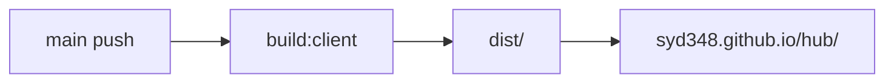

# Week 2 Day 1 — Context API · GitHub Actions · PR 자동화

소상공인 정부지원금 큐레이터 · N106_신서연  
데모 프레젠테이션 / PR 회고용 문서

> 한 주 전체(수~금, #3·#4·#6·#7·#8·#9) 회고는 [`week2/retrospective.md`](retrospective.md) 참고
> (이슈 #10 대응 중 이 문서에서 분리됨). 이 문서는 Day 1(월) 작업만 다룬다.

---

## 주요 작업 리스트

- [x] **Context API** — 온보딩 프로필 전역 상태 + `sessionStorage` 영속화
- [x] **GitHub Actions Pages 자동 배포** — `main` push → `https://syd348.github.io/hub/`
- [x] **PR CI + commitlint** — lint, test, 커밋 메시지 검증 (로컬 husky + Actions)
- [x] **React Component 데이터 흐름 정리** — Context / props / mock import 역할 분리
- [x] **캠퍼스 레포 PR** — `syd348/hub` → `connect-AIAgentChallenge-26-1/hub` (`N106_신서연`)

---

## 1. Context API — 온보딩 데이터 흐름

### 왜 Context?

온보딩 4단계, 완료 화면, 홈 화면이 **같은 사용자 프로필**을 공유한다.  
페이지마다 props로 넘기면 컴포넌트 깊이가 깊어지므로 `OnboardingProvider`로 한곳에서 관리한다.

### 구조

```
App.tsx
  OnboardingProvider
    ├─ profile (state)
    ├─ setField(field, value)
    ├─ reset()
    └─ sessionStorage 동기화
         │
         ├─ Step1Industry ~ Step4Scale  → setField()로 입력
         ├─ CompleteScreen            → profile 요약 표시
         └─ HomeScreen                → profile 기반 UI (지역 칩 등)
```

### 핵심 코드 위치

| 파일 | 역할 |
|------|------|
| `src/context/OnboardingContext.tsx` | Context 정의, `useOnboarding()` 훅 |
| `src/App.tsx` | `<OnboardingProvider>`로 앱 전체 감쌈 |
| `src/components/onboarding/Step*.tsx` | `setField`로 입력 저장 |
| `src/pages/HomeScreen.tsx` | `profile` 읽기 |

### 데이터 흐름 (한 줄)

```
사용자 입력 → setField() → React state 업데이트 → sessionStorage 저장
                ↓
다른 화면에서 useOnboarding() → profile 읽기
```

### mock 데이터는 Context 밖

지원금 목록은 `src/data/mockSubsidies.ts`를 `HomeScreen`에서 **직접 import**.  
서버 API / TanStack Query 연동 전까지는 전역 상태가 필요 없다.

---

## 2. GitHub Actions — Pages 자동 배포

### yml이 하는 일

`main`에 push하면 GitHub 서버가 자동으로:

1. `npm ci`
2. `VITE_BASE_PATH=/hub/ npm run build:client`
3. `dist/` 생성 → `404.html` 복사 (SPA 라우팅)
4. GitHub Pages에 배포

### 왜 설정이 필요했나

레포 이름이 `hub` → URL이 **서브경로** `https://syd348.github.io/hub/`

| 환경 | Vite `base` | Router `basename` |
|------|-------------|-------------------|
| 로컬 `npm run dev` | `/` | `/` |
| Actions 빌드 | `/hub/` | `/hub/` (`import.meta.env.BASE_URL`) |

### 관련 파일

| 파일 | 변경 |
|------|------|
| `.github/workflows/deploy-pages.yml` | 빌드 + 배포 workflow |
| `package.json` | `build:client` (프론트만 빌드) |
| `vite.config.ts` | `base: process.env.VITE_BASE_PATH ?? '/'` |
| `src/main.tsx` | `<BrowserRouter basename={import.meta.env.BASE_URL}>` |

### 배포 흐름



---

## 3. PR CI + commitlint

> **정정 (2026-07-22, #9~#10 작업 중 발견)**: 아래 `pr-checks.yml`은 이 문서를 처음 쓴 시점 기준이고,
> 실제로는 `.github/workflows/` 디렉토리 자체가 `main`에 존재하지 않는다 — PR에서 자동 검증이
> 돌지 않는다. `CLAUDE.md`에서도 같은 착오를 발견해 관련 문구를 삭제했다(PR #24). 로컬 husky
> `commit-msg` 훅(아래 표)만 실제로 동작 중이다.

### PR 열릴 때 (`pr-checks.yml`, 현재는 없음 — 위 정정 참고)

| Job | 검사 |
|-----|------|
| `lint-and-test` | `npm run lint` + `npm test` |
| `commitlint` | PR에 포함된 모든 커밋 메시지 형식 |

### 로컬 커밋 시 (husky)

`.husky/commit-msg` → `commitlint` 실행

허용 type: `feat`, `fix`, `docs`, `style`, `refactor`, `chore`, `test`

```
feat(client): 온보딩 step1 업종 선택 UI 구현
```

---

## 4. 캠퍼스 레포 PR · 자동 머지

### PR 정보

- **레포**: `connect-AIAgentChallenge-26-1/hub`
- **base**: `N106_신서연`
- **head**: `syd348/hub` `main` (포크 PR)
- **PR**: #1169

### 자동 머지가 실패한 이유

7/15 22:10 KST `auto-merge.yml` v3.4 실행 로그:

```
PR #1169 → 조건 통과 → 머지
PR #1169 병합 실패: Resource not accessible by integration
```

**원인**: 포크에서 온 cross-repository PR은 Actions `GITHUB_TOKEN`으로 merge 권한이 없는 경우가 많다.

**해결 (auto-merge 수정 없이)**:

1. **수동 Merge** — GitHub UI에서 PR #1169 Merge
2. **앞으로** — 조직 레포에 직접 브랜치 push 후 같은 레포 내 PR 생성

```bash
git remote add campus https://github.com/connect-AIAgentChallenge-26-1/hub.git
git push campus main:N106_신서연-작업명
gh pr create -R connect-AIAgentChallenge-26-1/hub \
  --base N106_신서연 --head N106_신서연-작업명
```

### auto-merge 규칙 요약 (v3.4)

| 조건 | 동작 |
|------|------|
| base `main` + `allow-main` 라벨 없음 | PR **close** |
| `review` 라벨 | 스킵 |
| `CHANGES_REQUESTED` | 연기 |
| 충돌 | PR **close** |
| 그 외 | **merge** 시도 (매일 22:00·22:30 KST) |

`N106_신서연` 대상 PR은 **close가 아니라 merge** 대상이다.

---

## 내가 설명할 수 있는 부분

### Context API

- `OnboardingProvider`가 `profile` 상태를 들고, `setField`로 필드 단위 업데이트
- `sessionStorage`에 JSON으로 저장해 새로고침·뒤로가기 후에도 유지
- `useOnboarding()` 훅으로 필요한 컴포넌트만 구독
- Provider 밖에서 호출하면 에러 (`must be used within OnboardingProvider`)

### GitHub Actions Pages

- 소스(`src/`)는 브라우저가 실행 못 함 → 반드시 `npm run build` 필요
- yml = 그 빌드·배포를 push마다 자동화
- SPA는 GitHub Pages에서 `404.html` 트릭 필요

### Git에 올리는 것 / 안 올리는 것

| 올림 | 안 올림 |
|------|---------|
| `.gitignore`, `.husky/commit-msg` | `.claude/settings.local.json` |
| `.github/workflows/` (CI·배포) | `node_modules`, `dist`, `.env` |

---

## 아직 이해 못 한 부분

- 캠퍼스 `auto-merge`에서 포크 PR merge 권한을 PAT로 푸는 org 설정 전체
- TanStack Query 도입 후 Context(온보딩) vs 서버 상태 역할 분할
- 매칭 API 연동 시 `profile`을 query string vs POST body 중 어디에 실을지

---

## 새로 알게 된 것

- **yml 없이도 Pages 가능** — 로컬 빌드 후 `gh-pages` 브랜치 수동 push (예전 방식)
- **yml 있으면** — `main` push만으로 빌드·배포 자동화
- **포크 PR**은 자동 머지가 실패할 수 있음 → 수동 머지 또는 같은 레포 PR
- **개인 레포 `main` push**와 **캠퍼스 `N106_신서연` PR**은 별개 흐름
- PR #18 머지 후 `syd348.github.io/hub/`에서 mock FE 데모 가능

---

## Test plan

- [ ] 로컬 `npm run dev` — Welcome → 온보딩 → complete → home
- [ ] `sessionStorage` — 온보딩 중 새로고침 후 입력값 유지
- [ ] `https://syd348.github.io/hub/` — Pages 배포 화면 확인
- [ ] `/hub/onboarding/2` 직링크·새로고침 — 404 없음
- [ ] 캠퍼스 PR #1169 — 수동 머지 또는 재생성

---

## 참고 링크

- 개인 레포: https://github.com/syd348/hub
- Pages URL: https://syd348.github.io/hub/
- 캠퍼스 브랜치: https://github.com/connect-AIAgentChallenge-26-1/hub/tree/N106_%EC%8B%A0%EC%84%9C%EC%97%B0
- 캠퍼스 PR #1169: https://github.com/connect-AIAgentChallenge-26-1/hub/pull/1169
