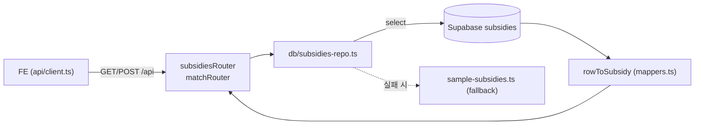

# 오늘 할 일 — Express 매칭 API를 Supabase 조회로 전환 (이슈 #4)

> 작성일: 2026-07-21 (화) · 대상 이슈: [#4 Express 매칭 API를 Supabase 조회 기반으로 전환](https://github.com/syd348/hub/issues/4)

## 오늘의 목표 (한 줄)

**`GET /api/subsidies`(목록)·`GET /api/subsidies/:id`(상세)·`POST /api/match`(조건 매칭)를 `sample-subsidies.ts` 대신 Supabase에서 조회하도록 전환한다.**

이미 준비된 자산(`server/src/db/supabase.ts`, `mappers.ts`, seed/check 스크립트)을 재사용하고, 실패 시에도 서버가 죽지 않도록 fallback을 둔다.

## 현재 상태 (전환 전)

- `server/src/routes/subsidies.ts` — `sampleSubsidies` 배열을 직접 반환. 정렬·필터 없음. `POST /api/match` 미존재.
- `server/src/db/` — `supabase.ts`(클라이언트), `mappers.ts`(`rowToSubsidy`/`subsidyToRow`), `seed.ts`, `check.ts` 준비 완료.
- 시드 데이터는 **2건**뿐 (mock은 8건) — 상세 진입 시 불일치. 오늘 seed를 8건으로 맞출지 결정 필요.
- FE `src/api/client.ts`는 실패 시 mock fallback이라, 서버가 바뀌어도 화면은 깨지지 않음.

## 범위

### 포함 (오늘)
- 목록/상세 API를 Supabase 조회로 전환
- `POST /api/match` 신규 — 프로필 조건 + 정렬 처리
- 정렬 로직(`match`/`deadline`/`amount`/`new`)을 서버에서 처리
- Supabase 조회 실패 시 `sample-subsidies.ts` fallback + 에러 로깅
- 서버 라우트 엣지 케이스 테스트 (404, 잘못된 sort, 빈 결과)

### 제외 (오늘 아님)
- FE를 실제 API로 강제 연결 (`VITE_USE_MOCK=false`) → 이슈 #6 (수)
- DB 쓰기/저장 사이클 (사용자 조건 로그) → 이슈 #7 (목)
- 매칭 점수 알고리즘 가중치 정교화 → 3주차
- 크롤러로 실데이터 적재 → 1주차 트랙

## 실행 순서

### 묶음 1 — 조회 레포지토리 분리 (30분)
- [ ] `server/src/db/subsidies-repo.ts` 신규
  - `findAll(sort?): Promise<Subsidy[]>` — `select('*')` 후 `rowToSubsidy` 매핑, 정렬 적용
  - `findById(id): Promise<Subsidy | null>` — 단건 select, 없으면 null
  - `match(profile, sort?): Promise<Subsidy[]>` — 조건 필터 + 정렬 (MVP: 필터는 최소, 정렬 위주)
  - Supabase 오류 시 `console.error` 로깅 후 `sampleSubsidies` fallback 반환
- [ ] 정렬 유틸: `match`(내림차순), `deadline`(dday 오름차순), `amount`(금액 파싱 내림차순), `new`(created_at 내림차순)
  - 금액 문자열 파싱은 FE `sortSubsidies` 로직과 규칙 통일

### 묶음 2 — 라우트 전환 (30분)
- [ ] `server/src/routes/subsidies.ts`
  - `GET /` → `repo.findAll(req.query.sort)` 사용, 응답 형태 `SubsidyListResponse` 유지
  - `GET /:id` → `repo.findById`, 없으면 404 `{ error: 'Not found' }`
  - `sort` 쿼리 zod 검증 (허용값 외에는 기본 `match`)
- [ ] `server/src/routes/match.ts` 신규 + `index.ts`에 `/api/match` 등록
  - `POST /api/match` — body `MatchRequest` zod 검증 → `repo.match` → `MatchResponse`
  - 잘못된 body는 400 `{ error }`

### 묶음 3 — 데이터 정합성 (20분)
- [ ] 시드 데이터를 **8건으로 확장** 여부 결정
  - 옵션 A: `sample-subsidies.ts`를 8건으로 늘리고 재시드 → FE mock과 개수 일치, `getSubsidy` 404 fallback 이슈 근본 해소
  - 옵션 B: 2건 유지 + FE fallback에 계속 의존 (오늘 최소 범위)
  - **추천: A** (이후 #6 연결 시 화면이 자연스러움)
- [ ] 결정 시 `npm run db:seed -w @hub/server` → `db:check`로 검증

### 묶음 4 — 테스트 + 검증 (30분)
- [ ] `server/src/routes/*.test.ts` — 엣지 케이스 위주
  - 존재하지 않는 id → 404
  - 잘못된 `sort` 값 → 기본 정렬로 응답
  - `POST /api/match` 빈/잘못된 body → 400
  - Supabase 미설정/오류 상황에서 fallback 동작 (supabase 모듈 mock)
- [ ] `npm test`, `npm run lint` 통과
- [ ] 수동: 서버 켜고 `curl /api/subsidies?sort=deadline`, `curl -X POST /api/match` 응답 확인

## 완료 기준

- [ ] 업종/지역/직원수/매출 조건과 정렬 옵션으로 **DB 결과**가 반환된다 (#4 이슈 기준).
- [ ] Supabase 연결이 안 돼도 서버가 죽지 않고 fallback으로 응답한다.
- [ ] `npm test` / `npm run lint` 통과.
- [ ] 응답 형태가 `SubsidyListResponse`/`MatchResponse` 계약과 일치해 FE 훅이 그대로 소비 가능.

## 리스크 / 결정 필요

| 항목 | 내용 | 기본 방침 |
|------|------|-----------|
| 시드 개수 | 서버 2건 vs mock 8건 불일치 | 8건으로 확장 (묶음 3-A) |
| 매칭 필터 강도 | 조건 완전 일치 vs 느슨한 매칭 | MVP는 정렬 위주, 필터는 지역/업종만 최소 적용 |
| fallback 노출 | fallback 사용 시 FE에 알릴지 | 오늘은 서버 로그만, 응답 형태는 동일 유지 |
| `POST /api/match` vs query 필터 | 매칭을 POST로 둘지 GET query로 둘지 | shared 타입에 `MatchRequest` 이미 정의 → POST 채택 |

## 오늘 끝나면 다음 (참고)

- **#6 (수)**: `VITE_USE_MOCK=false`로 FE를 실제 API에 연결, mock fallback은 안전망으로 유지
- **#7 (목)**: 사용자 조건 제출을 Supabase에 기록하는 쓰기 사이클
