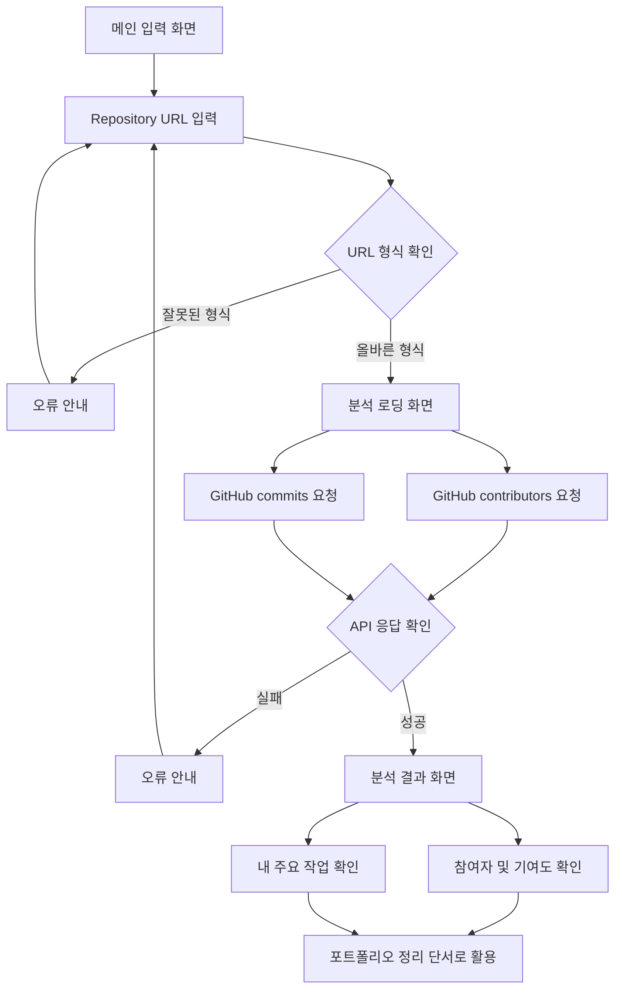

# PtoP(Project to Portfolio) 기획서

## 문제 정의

프로젝트 경험을 쌓는 대학생 개발자는 프로젝트가 끝난 뒤 시간이 지나면 자신이 맡은 역할, 기여도, 핵심 구현 내용, 문제 해결 과정을 정확히 기억하고 정리하기 어렵다.

## 서비스 목표

PtoP는 GitHub Repository를 기반으로 프로젝트 참여 정보와 작업 흔적을 빠르게 확인하고, 나중에 포트폴리오와 회고로 확장할 수 있는 프로젝트 정리 초안을 만드는 서비스다.

## 사용자 시나리오

1. 사용자는 프로젝트가 끝난 뒤 포트폴리오에 정리할 내용이 필요하다고 느낀다.
2. 사용자는 PtoP 첫 화면에서 GitHub Repository URL을 입력한다.
3. 사용자는 `분석 시작` 버튼을 누르고, 로딩 상태를 보며 Repository 분석이 진행 중임을 확인한다.
4. PtoP는 GitHub 공개 API를 통해 참여자 정보와 최근 커밋 정보를 가져온다.
5. 사용자는 분석 결과 화면에서 프로젝트 참여자, 기여도, 자신의 주요 커밋 메시지를 확인한다.
6. 사용자는 결과를 보며 “내가 주로 어떤 일을 했는지”를 빠르게 복기한다.
7. 이후 사용자는 이 정보를 바탕으로 회고, 포트폴리오, 자기소개서에 쓸 내용을 정리한다.

## 핵심 기능 2개

### 1. Repository 분석 기능

GitHub Repository URL을 입력하면 contributors API와 commits API를 사용해 프로젝트 참여자, commit 수, 기여도 퍼센트, 최근 commit message를 확인한다.

### 2. 작업 내용 정리 기능

Repository owner 기준 최근 commit message를 모아 사용자가 자신이 주로 어떤 작업을 했는지 빠르게 복기할 수 있는 단서를 제공한다.

## 화면 흐름

## 프로토타입

- 메인 페이지: Repository URL 입력 후 로딩 상태와 결과 화면을 같은 페이지에서 확인
- [동작 프로토타입](../prototype/index.html): 참여자별 기여도와 최근 커밋 기반 작업 내용을 별도 페이지에서 확인
- GitHub API 응답 실패 시 임의 결과를 만들지 않고 오류 안내

## 관련 문서

- [PtoP 기획서](./plan.md)
- [1주차 작업 체크리스트](./checklist.md)
- [Git Repository 분석 학습 노트](./repo-analysis-study.md)
- [PtoP 테스트 케이스](./test-cases.md)
- [기획하기 with AI 가이드](./planning-tip.md)
