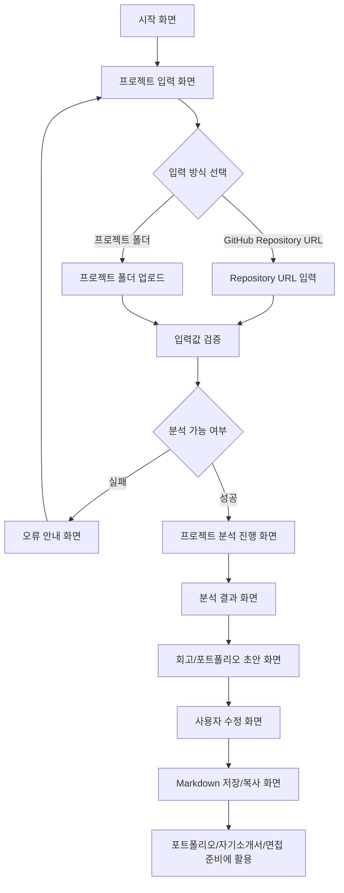

# PtoP(Project to Portfolio) 기획서

## 문제 정의

프로젝트 경험을 쌓는 대학생 개발자는 프로젝트가 끝난 뒤 시간이 지나면 자신이 맡은 역할, 핵심 구현 내용, 문제 해결 과정을 정확히 기억하고 정리하기 어렵다.

## 서비스 목표

PtoP는 GitHub Repository나 프로젝트 폴더를 바탕으로 프로젝트 경험을 빠르게 복기하고, 포트폴리오와 회고에 바로 활용할 수 있는 초안을 만드는 AI Agent 서비스다.

## 사용자 시나리오

1. 사용자는 프로젝트가 끝난 뒤 포트폴리오에 정리할 내용이 필요하다고 느낀다.
2. 사용자는 PtoP에서 GitHub Repository URL 또는 프로젝트 폴더를 입력한다.
3. PtoP는 README, 폴더 구조, 설정 파일, 주요 코드 파일을 분석한다.
4. 사용자는 분석된 프로젝트 목적, 기술 스택, 핵심 기능, 역할 후보를 확인한다.
5. PtoP는 분석 결과를 바탕으로 회고/포트폴리오 초안을 생성한다.
6. 사용자는 초안에서 맞지 않는 표현을 수정하고 자신의 경험에 맞게 다듬는다.
7. 사용자는 최종 결과를 Markdown으로 복사해 포트폴리오, 자기소개서, 면접 준비에 활용한다.

## 핵심 기능 2개

### 1. 프로젝트 분석 기능

GitHub Repository 또는 프로젝트 폴더를 바탕으로 README, 폴더 구조, 설정 파일, 주요 코드 파일, commit log를 분석해 프로젝트 목적, 기술 스택, 핵심 기능, 역할 후보를 정리한다.

### 2. 회고/포트폴리오 초안 생성 기능

분석 결과를 바탕으로 내가 한 일, 어려웠던 점, 해결 과정, 배운 점, 포트폴리오용 한 줄 설명을 Markdown 형태로 생성한다.

## 화면 흐름

## 프로토타입

- [동작 프로토타입](../prototype/index.html)
- HTML/CSS와 Vanilla JavaScript로 구성
- Repository 입력, 분석 진행, 참여자별 기여도, 내 주요 작업 메시지 흐름 표현
- GitHub API 응답 실패 시 임의 결과를 만들지 않고 오류 안내

## 관련 문서

- [PtoP 기획서](./plan.md)
- [1주차 작업 체크리스트](./checklist.md)
- [Git Repository 분석 학습 노트](./repo-analysis-study.md)
- [PtoP 테스트 케이스](./test-cases.md)
- [기획하기 with AI 가이드](./planning-tip.md)
