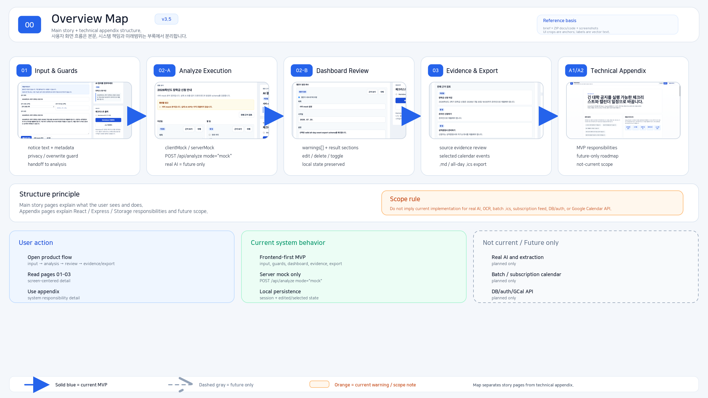
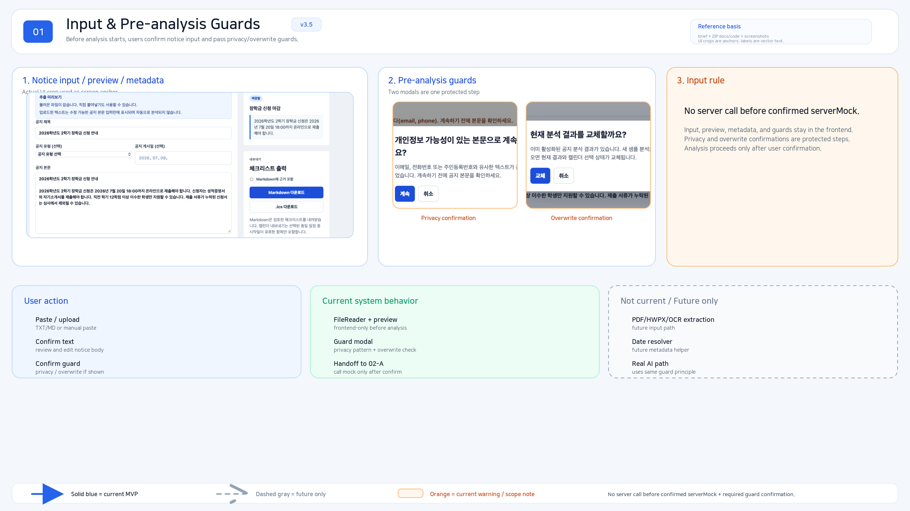
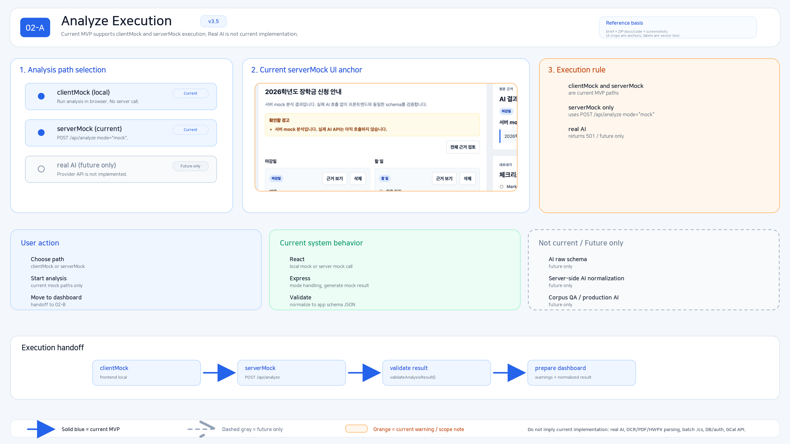
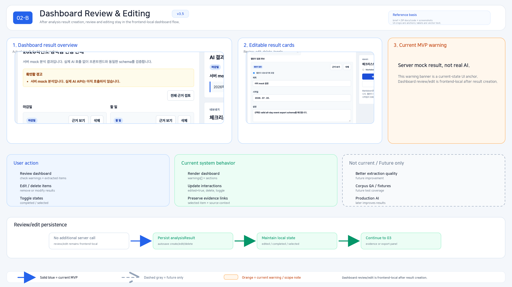
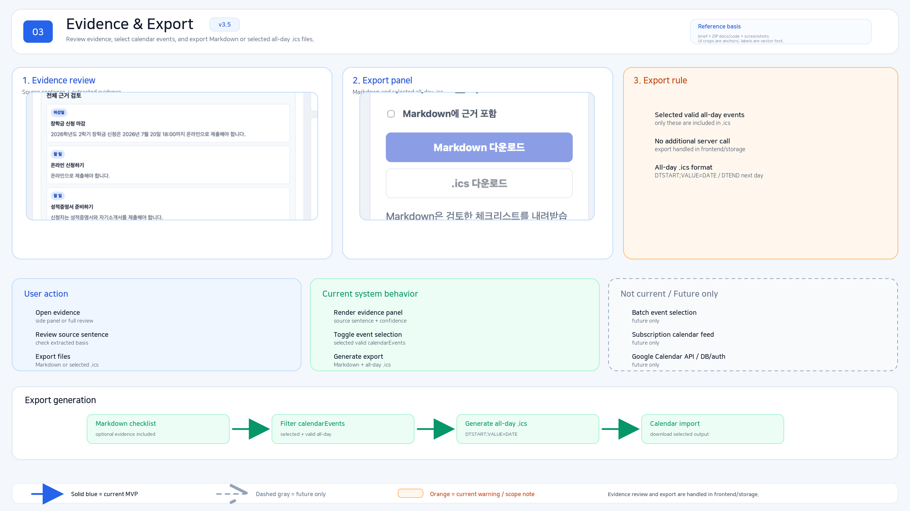
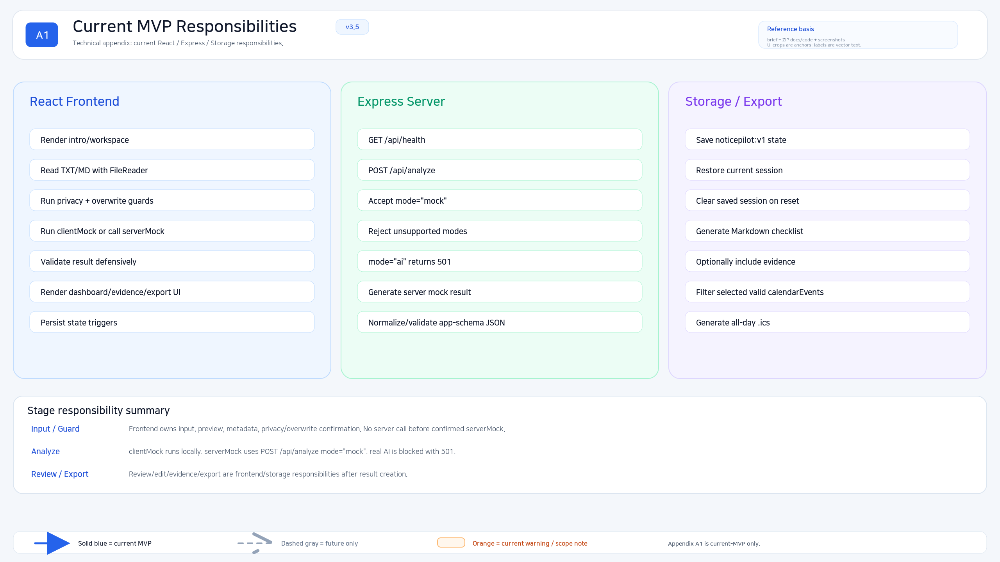
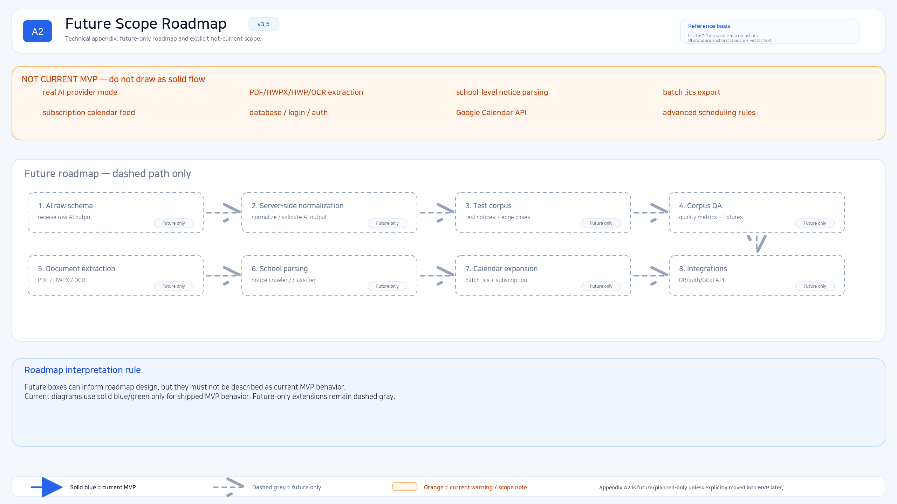

# NoticePilot Story Appendix v3.5

> Wiki version: 2026-07-08 story appendix  
> Implementation baseline: React + Vite frontend MVP, Express mock analyze API, frontend-server mock analyze wiring  
> Runtime scope: real AI API, PDF/HWP/HWPX/OCR extraction, batch calendar export, and subscription feed are not implemented yet.

이 페이지는 NoticePilot의 현재 MVP 흐름과 향후 범위를 시각적으로 설명하기 위한 story appendix다.

색상과 선 스타일은 다음 의미로 읽는다.

```text
- Solid blue/green: implemented current MVP behavior
- Dashed gray: future/planned only
- Orange: current warning, guard, or scope note
```

아래 이미지는 현재 구현과 future scope를 구분하기 위한 설명 자료이며, dashed gray 영역은 현재 구현 완료를 의미하지 않는다.

---

## 00. Overview Map

NoticePilot의 핵심 흐름은 긴 공지를 구조화된 분석 결과로 바꾸고, 사용자가 검토/수정한 뒤 체크리스트와 캘린더 후보로 export하는 것이다.



---

## 01. Input & Pre-analysis Guards

현재 MVP는 수동 텍스트 붙여넣기와 TXT/MD 파일 업로드를 지원한다. 분석 전에는 추출 텍스트 확인, 덮어쓰기 확인, privacy-like pattern warning 같은 사용자 확인 단계를 둔다.



---

## 02-A. Analyze Execution

분석 실행은 client-side mock 분석과 Express server mock 분석으로 나뉜다. 실제 AI API 호출은 아직 구현하지 않았고, `mode: "ai"`는 명시적으로 blocked 상태를 반환한다.



---

## 02-B. Dashboard Review & Editing

분석 결과는 사용자가 직접 검토하고 수정할 수 있는 dashboard로 표시된다. 항목 수정/삭제, 할 일 완료 체크, calendar event 선택 토글, evidence 확인은 현재 MVP 범위다.



---

## 03. Evidence & Export

현재 export 범위는 Markdown checklist와 선택한 all-day `.ics` calendar event 다운로드다. batch `.ics`, subscription feed, Google Calendar API 연동은 future scope다.



---

## A1. Current MVP Responsibilities

현재 MVP 책임 범위는 React client, Express mock analyze API, validation/normalization, localStorage persistence, Markdown export, selected all-day `.ics` export에 집중한다.



---

## A2. Future Scope Roadmap

향후 범위에는 real AI API integration, server-side file extraction, advanced date resolution, school-level parsing, batch calendar export, subscription feed 등이 포함된다. 이 항목들은 현재 구현 완료 상태가 아니다.


