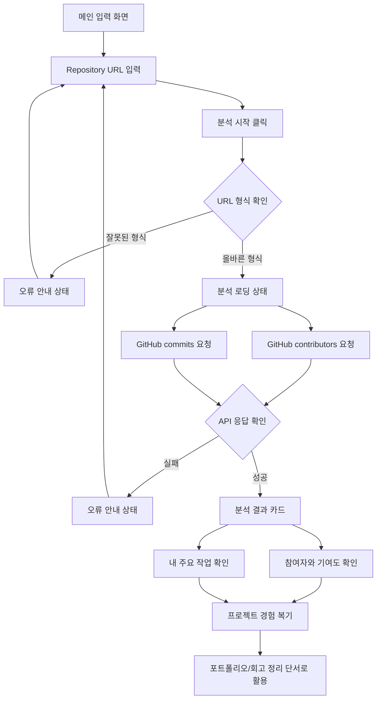

# PtoP(Project to Portfolio) 기획서

## 문제 정의

프로젝트 경험을 쌓는 대학생 개발자는 프로젝트가 끝난 뒤 시간이 지나면 자신이 맡은 역할, 기여도, 핵심 구현 내용, 문제 해결 과정을 정확히 기억하고 정리하기 어렵다.

## 서비스 목표

PtoP는 GitHub Repository를 기반으로 프로젝트 참여 정보와 작업 흔적을 빠르게 확인하고, 나중에 포트폴리오와 회고로 확장할 수 있는 프로젝트 정리 초안을 만드는 서비스다.

## 사용자 시나리오

1. 사용자는 프로젝트를 마친 뒤 포트폴리오에 정리할 내용이 필요하다고 느낀다.
2. 사용자는 PtoP 첫 화면에서 분석하고 싶은 GitHub Repository URL을 입력한다.
3. 사용자는 `분석 시작` 버튼을 누르고, 서비스 컬러 기반 spinner를 통해 분석이 진행 중임을 확인한다.
4. PtoP는 GitHub 공개 API로 Repository 참여자와 최근 commit 정보를 가져온다.
5. 사용자는 결과 화면에서 프로젝트 참여자, commit 수 기준 기여도, Repository owner의 주요 commit message를 확인한다.
6. 사용자는 결과를 보며 “내가 주로 어떤 작업을 했는지”를 빠르게 복기한다.
7. 사용자는 이 정보를 바탕으로 회고, 포트폴리오, 자기소개서에 쓸 내용을 직접 정리한다.

## 핵심 기능 2개

### 1. Repository 분석 기능

GitHub Repository URL을 입력하면 contributors API와 commits API를 사용해 프로젝트 참여자, commit 수, 기여도 퍼센트, 최근 commit message를 확인한다.

### 2. 작업 내용 정리 기능

Repository owner 기준 최근 commit message를 모아 사용자가 자신이 주로 어떤 작업을 했는지 빠르게 복기할 수 있는 단서를 제공한다.

## 화면 구조

| 화면/섹션 | 주요 UI | 사용자 동작 | 시스템 동작 |
| --- | --- | --- | --- |
| 메인 입력 화면 | PtoP 로고, URL 입력창, 분석 시작 버튼, 안내 문구 | Repository URL 입력 | URL 형식 확인 |
| 분석 로딩 상태 | 민트 컬러 spinner, 분석 중 메시지 | 분석 완료 대기 | GitHub API 요청 |
| 분석 결과 카드 | Repository 이름, GitHub 링크, 참여자/기여도, 주요 작업 목록 | 결과 확인 | API 결과 요약 |
| 오류 안내 상태 | 오류 메시지 | URL 수정 | 실패 이유 안내 |
| 서비스 소개 섹션 | 개요, 핵심 기능, 문서 링크 | 서비스 이해 | 정적 정보 제공 |

## 화면 흐름



## 와이어프레임

```text
[메인 입력 화면]
PtoP Logo
[ https://github.com/user/repository ][분석 시작]
분석하고 싶은 프로젝트의 Git Repository 주소를 입력해보세요.

[분석 결과 카드]
Repository 이름 / GitHub 링크
프로젝트 참여자 + 기여도
Repository owner의 주요 작업
```

## 프로토타입

- 메인 페이지: Repository URL 입력 후 로딩 상태와 결과 화면을 같은 페이지에서 확인
- [동작 프로토타입](../../prototype/index.html): React 메인 페이지와 동일한 UI 흐름을 HTML/CSS/Vanilla JS로 구현
- GitHub API 응답 실패 시 임의 결과를 만들지 않고 오류 안내

## 관련 문서

- [PtoP 기획서](../plans/plan.md)
- [1주차 작업 체크리스트](../plans/checklist.md)
- [Git Repository 분석 학습 노트](../research/repo-analysis-study.md)
- [PtoP 테스트 케이스](../testing/test-cases.md)
- [기획하기 with AI 가이드](../guides/planning-tip.md)
