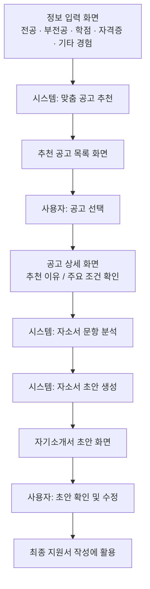
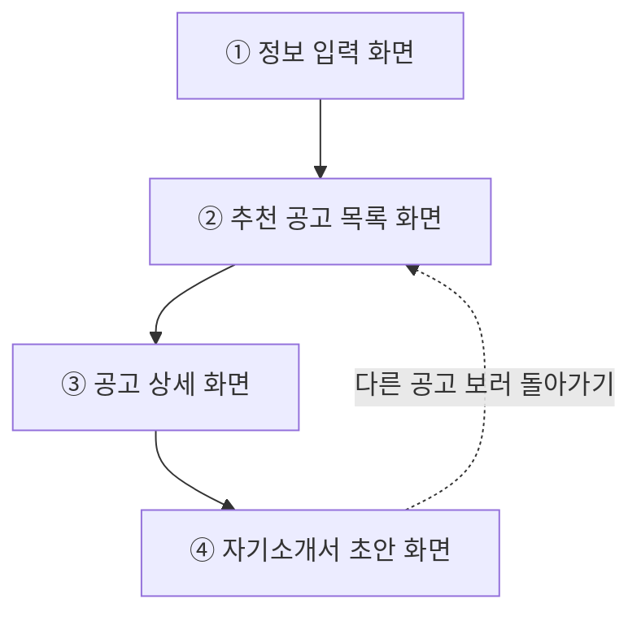
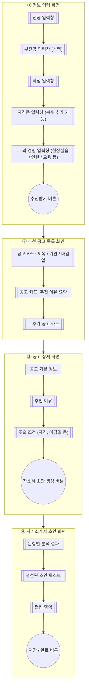

# 화면 흐름 / 화면 목록(IA) / 와이어프레임

> 기획서 원문: [plan.md](./plan.md)
> 브라우저에서 바로 그림으로 보려면: [wireframe.html](./wireframe.html) (인터넷 연결 필요)

## 1. User Flow (사용자 흐름)

`plan.md`의 사용자 시나리오 6단계를 흐름으로 표현.

## 2. IA (화면 목록, Information Architecture)

사용자 흐름을 4개의 화면 단위로 묶었다.

| 화면 | 주요 목적 |
|---|---|
| 정보 입력 화면 | 전공, 부전공, 학점, 자격증, 그 외 경험(현장실습, 인턴, 교육) 입력 |
| 추천 공고 목록 화면 | 추천된 공고 리스트 확인 |
| 공고 상세 화면 | 추천 이유, 주요 조건 확인 후 자소서 생성 요청 |
| 자기소개서 초안 화면 | 문항별 분석 결과와 생성된 초안 확인/수정 |

## 3. 와이어프레임 (화면별 주요 UI 요소)

각 화면을 박스로, 화면 안의 주요 UI 요소를 노드로 표현한 대략적인 레이아웃.

---
작성일: 2026-07-07
