# 나의 AI 워크플로우 (4주 완성판)

4주 동안 AI(Claude Code)와 어떤 순서로 일했는지, 어떤 Skill/Agent를 언제 왜
썼는지 정리한다. 캠프가 끝난 뒤에도 새 프로젝트에 그대로 가져다 쓸 수 있게
"레시피" 형태(입력 → 순서 → 확인 기준 → 결과물)로 적는다.

## 0. 문제가 생겼을 때 다시 볼 순서

1. 지금 하는 작업의 이슈/PR에 **완료 기준**이 명확히 적혀 있는지 먼저 확인한다
   — 없으면 "됐다"를 판단할 방법이 없다.
2. [기능 검증 Agent](agents/verification-agent.md)로 실제로 실행해서 **어느
   단계(화면/서버/DB)에서 끊기는지** 좁힌다.
3. 코드 쪽 문제 같으면 [코드 검증 Agent](agents/code-verification-agent.md)로
   최근 변경분(테스트 유무, 명백한 버그, 스타일)을 점검한다.
4. 그래도 안 풀리면 [docs/work-log.md](work-log.md)에 증상·시도한 것을 남기고
   다음 세션에 이어간다 — 같은 삽질을 반복하지 않기 위해서.

## 1. 재사용 가능한 작업 레시피

### 레시피 A — 주간 계획 수립
| 항목 | 내용 |
|---|---|
| 입력 | 이번 주 공식 미션 텍스트, 지난주 `backlog.md`의 "지난 주 요약" |
| 순서 | 목표 확인 → [계획 수립 Agent](agents/planning-agent.md) 실행 → 사람이 카테고리/요일 조정 → 우선순위(P0/P1/P2) 부여 → GitHub 이슈 등록 |
| 확인 기준 | 모든 Task에 완료 기준과 우선순위가 있는가 / 이슈 번호가 `backlog.md`에 링크됐는가 |
| 결과물 | `docs/backlog.md`, GitHub Issues |

### 레시피 B — 기능 하나 완성
| 항목 | 내용 |
|---|---|
| 입력 | 이슈 하나(설명 + 완료 기준) |
| 순서 | 화면→데이터→흐름 설계 → 이슈에 설계 기록 → (조건 분기/계산이 있는 순수 함수라면) [테스트코드 생성 Skill](../.claude/skills/tidenote-test-writer/SKILL.md)로 시나리오 표 → red → green → 구현 → 기능 검증 Agent로 실행 확인 → 코드 검증 Agent로 점검 |
| 확인 기준 | 완료 기준 전항목 pass, 관련 테스트가 있다면 `npm test` 통과 |
| 결과물 | 코드 커밋, 이슈 close, PR (세 가지 회고 포함) |

### 레시피 C — 배포·장애 대응
| 항목 | 내용 |
|---|---|
| 입력 | 빌드/실행 로그, 에러 메시지 |
| 순서 | 로그에서 **첫 번째** 에러부터 확인 → 원인 하나만 고침 → 재배포 → 재확인 → 안 되면 다음 에러로. 한 번에 여러 개 고치지 않는다 |
| 확인 기준 | `/api/health` 200, FE 페이지 200, 핵심 기능 1회 성공(화면→서버→DB) |
| 결과물 | 동작하는 배포 URL, `work-log.md`에 원인·해결 과정 기록 |

## 2. Agent 협업 구조도 (기획 → 설계 → 구현 → 검증 → 배포)

```mermaid
flowchart LR
    subgraph S1["① 기획·계획"]
        direction TB
        H1["사람: 이번 주 목표 확인,\n최종 우선순위 조정"]
        A1["계획 수립 Agent:\n작업 분해 초안"]
    end
    subgraph S2["② 설계"]
        direction TB
        H2["사람: 화면/데이터/흐름\n설계안 승인 or 반려"]
        A2["Agent: 설계안 초안 제시"]
    end
    subgraph S3["③ 구현"]
        direction TB
        H3["사람: 시나리오 표 검토,\n코드 리뷰"]
        A3["테스트코드 생성 Skill:\nred → green 테스트"]
        A3b["Agent: 기능 코드 작성"]
    end
    subgraph S4["④ 검증"]
        direction TB
        A4["기능 검증 Agent:\n직접 실행해서 pass/fail"]
        A4b["코드 검증 Agent:\n테스트·버그·스타일 점검"]
        H4["사람: 실제 배포 화면에서\n최종 확인"]
    end
    subgraph S5["⑤ 배포"]
        direction TB
        H5["사람: Vercel/Render 계정 연결,\n환경변수 값 직접 입력"]
        A5["Agent: 배포용 코드 수정\n(env var화, CORS 등)"]
    end

    S1 --> S2 --> S3 --> S4 --> S5
```

**읽는 법**: 각 단계 안에서 "사람"이라고 적힌 건 내가 직접 결정하거나 확인한
것, "Agent/Skill"이라고 적힌 건 Claude Code가 초안을 만들거나 대신 실행한
것이다. 비밀키 입력처럼 보안이 걸린 것과, 최종 승인은 항상 사람 쪽에 있다.

## 3. 4주 동안 만든 Agent / Skill

| 이름 | 만든 시점 | 역할 | 사람이 하는 것 | AI가 하는 것 |
|---|---|---|---|---|
| 계획 수립 Agent | 2주차 | 요구사항을 작업 단위로 나누고 우선순위·순서를 정함 | 결과 검토, 요일 배치, 스코프 최종 조정 | 카테고리 분류, 초안 작업 목록 생성 |
| 기능 검증 Agent | 2주차 | 완료 기준을 실제 실행해서 pass/fail 판정 | 최종 확인(브라우저 등) | curl/서버 조작으로 케이스 실행 |
| [tidenote-visual-language](../.claude/skills/tidenote-visual-language/SKILL.md) Skill | 2주차 | Figma 디자인 스펙(색·라운딩·시맨틱 블러)을 코드 토큰으로 고정 | Figma 스펙 스크린샷/코드 전달, 결과 검수 | 토큰·컴포넌트 코드 작성 |
| tidenote-test-writer Skill | 3주차 | 시나리오 표 → red → green → refactor 순서를 강제 | 시나리오 빠짐 검토 | 테스트 코드 작성 |
| 코드 검증 Agent | 3주차 | 최근 변경분의 테스트 존재 여부·버그·스타일 점검 | 지적사항 반영 여부 결정 | 코드 읽고 지적 목록 작성 |

## 4. 주차별 요약

- **2주차**: Tide Check(상태 체크인)를 화면-서버-DB로 처음 연결한 수직 슬라이스. 계획 수립/기능 검증 Agent, 비주얼 디자인 Skill 최초 제작.
- **3주차**: 에러 처리, 아키텍처 다이어그램, TDD(테스트 인프라 + `hasCheckedInToday`), 테스트 작성 Skill·코드 검증 Agent 제작.
- **4주차**: 핵심 흐름을 Tide Check에서 **실제 채팅**(Groq API)으로 확장, Recall Module 최소 버전(D_gen vs D_recall 비교로 잠김 판정) 구현, Vercel+Render 첫 배포, Episodes 사이드바를 실제 데이터로 연결(TDD).

## 5. 이번 4주에서 배운 것

- **Agent 결과를 그대로 밀어붙이지 않는 습관이 실제로 도움이 됐다.** 계획 수립 Agent가
  놓친 요일 배치, 스코프 확장(에러 처리 등)은 매번 사람이 채워야 했다.
- **공식 미션과 내 백로그가 어긋날 때, 임의로 판단하지 않고 매번 확인받고 진행했다.**
  어느 쪽을 우선할지는 코스 진행 상황을 아는 사람이 정해야 하는 문제였다.
- **"실행해서 확인"이 진짜로 버그를 잡는다.** GET 요청이 404를 줬을 때 이걸 그냥
  에러로 처리했다면, 첫 사용자가 처음 앱을 열자마자 에러 문구를 보게 됐을 것이다.
- **디자인 스펙은 한 번에 안 맞는다.** Figma 슬라이더 하나를 실제 스펙에 맞게
  구현하는 데 여러 차례 피드백을 주고받았다 — 스크린샷과 실제 export 코드를
  같이 받아야 정확하게 구현할 수 있었다.
- **배포는 "내 fork"와 "원본 저장소"를 헷갈리기 쉽다.** Vercel/Render가 기본으로
  원본(업스트림) 저장소에 연결될 수 있어서, 계정 전환을 직접 확인해야 했다.
- **비밀키는 어떤 방향으로도 채팅에 남기지 않는다.** 값을 받을 때도, 알려줄 때도
  파일로만 주고받았다 — 대화 기록은 나중에 그대로 노출될 수 있기 때문.

## 6. 남은 것 / 다음으로

- 잠김 판정이 아직 "메시지 그룹" 단위 근사치다 — 정교한 Episode Segmentation은
  범위 밖으로 남겨뒀다.
- MEQ 온보딩 기반 D_gen 계산(개인별 circadian trough 추정)은 아직 없고, 지금은
  "가장 최근 Tide Check 값"을 그대로 D_gen/D_recall로 쓰고 있다.
- 데모데이 이후로 남는 작업은 이 문서의 레시피를 그대로 다음 프로젝트에도
  적용해볼 계획이다.
